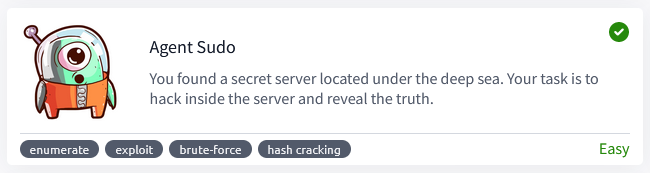
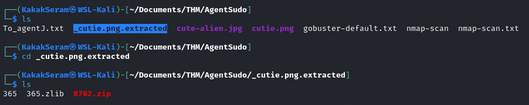

# Agent Sudo



[Agent Sudo](https://tryhackme.com/r/room/agentsudoctf) is listed as an easy room, and covers a lot of different tools and aspects of security, which makes it a great room to complete for beginners.
An overview of what we’ll be using is listed here:  

* Basic linux commands
* Nmap scan
* Gobuster
* Hydra
* Binwalk
* John
* Stegcracker
* Steghide

## Task 1 - Author note

Welcome to another THM exclusive CTF room. Your task is simple, capture the flags just like the other CTF room. Have Fun!

```
export IP=10.10.218.33
```


## Task 2 - Enumerate

Enumerate the machine and get all the important information

### Try to open IP from browser


### Scan open port with nmap

```
nmap -sV -sC -oN nmap-scan $IP
```

File scan resulted [here](./files/nmap-scan)


### Scan directory with gobuster

```
gobuster dir -w /usr/share/wordlists/dirb/common.txt -u $IP | tee gobuster-default.txt
```


### Change user-agnet

We get information from website, that we must change codename as user-agent to access the site. 

* Install User-Agent Switcher on Firefox browser

	

* Set User-Agent Codename

	

* Reopen website with user-agent

	

### Answer the questions

* How many open ports?

	`3`

* How you redirect yourself to a secret page?

	`user-agent`

* What is the agent name?

	`chris`

## Task 3 - Hash cracking and brute-force

Done enumerate the machine? Time to brute your way out.

### Brute Force FTP with hydra

```
hydra -l chris -P /usr/share/wordlists/seclists/Passwords/Common-Credentials/10k-most-common.txt ftp://$IP
```


### Login to ftp server

```
ftp chris@$IP
```


### Download file from ftp server


List of files:  
[To_agentJ.txt](./files/To_agentJ.txt)  
[cute-alien.jpg](./files/cute-alien.jpg)  
[cutie.png](./files/cutie.png)  


### Trying hidden zip file from image

```
binwalk -e cute-alien.jpg
binwalk -e cutie.png
```


### Extract zip file from image

```
binwalk -e cutie.png
```


Extraxted file [here](./files/_cutie.png.extracted)



### Crack password zip with John

```
zip2john 8702.zip > john-8702.zip
john john-8702.zip
```


### Zip extract


Read file


### Steg password Crack

```
stegcracker cute-alien.jpg /usr/share/wordlists/rockyou.txt
```


### Steg hidden message

```
steghide extract -sf cute-alien.jpg
```

File hidden message [here](./files/message.txt)


### Answer the questions

* FTP password

	`crystal`

* Zip file password

	`alien`

* steg password

	`Area51`

* Who is the other agent (in full name)?

	`James`

* SSH password

	`hackerrules!`

## Task 4 - Capture the user flag

### Login to target machine


### Get the user_flag


### Download image from target machine

```
scp james@10.10.8.171:/home/james/Alien_autospy.jpg .
```


File image [here](./files/Alien_autospy.jpg)

### Search image file from google


### Answer the questions

* What is the user flag?

	`b03d975e8c92a7c04146cfa7a5a313c7`

* What is the incident of the photo called?

	`Roswell Alien Autopsy`

## Task 5 -Privilege escalation

### Sudo -l

* Check sudo version 

	

* Check sudo version on Exploit DB

	

* Download Exploit Script

	Searchsploit

	

	Download exploit

	

### Transfer and Run Exploit

* Transfer exploit file to target machine

	Make a simple HTTP server from our machine

	

	Download file from target machine

	

* Run Exploit

	Set script file executable

	

	Run script

	

* Get Root Flag

	


### Answer the questions

* CVE number for the escalation

	`CVE-2019-14287`

* What is the root flag?

	`b53a02f55b57d4439e3341834d70c062`

* (Bonus) Who is Agent R?

	`DesKel`
