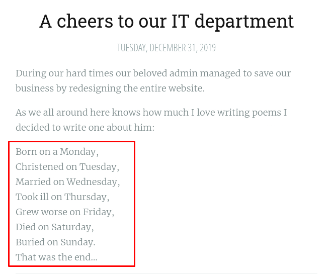

# [Anthem](https://tryhackme.com/r/room/anthem)


[Anthem](https://tryhackme.com/r/room/anthem) is listed as an medium room. Exploit a Windows machine in this beginner level challenge. An overview of what we’ll be using is listed here:

* Nmap
* Gobuster
* xfreerdp

## Task 1 - Website Analysis

This task involves you, paying attention to details and finding the 'keys to the castle'.

This room is designed for beginners, however, everyone is welcomed to try it out!

Enjoy the Anthem.

In this room, you don't need to brute force any login page. Just your preferred browser and Remote Desktop.

Please give the box up to 5 minutes to boot and configure.

### Answer the questions below

* Let's run nmap and check what ports are open.

	```
	nmap $IP -A -p- -oN nmap-scan -Pn
	```

	

* What port is for the web server?

	**Answer : 80**

* What port is for remote desktop service?

	**Answer : 3389**

* What is a possible password in one of the pages web crawlers check for?

	```
	gobuster dir -u $IP -w /usr/share/wordlists/dirb/common.txt -o gobuster-scan
	```

	

	

	Open **robots.txt**

	

	**Answer : UmbracoIsTheBest!**

* What CMS is the website using?

	
	
	**Answer : Umbraco**

* What is the domain of the website?

	

	**Answer :  Anthem.com**

* What's the name of the Administrator

	

	On article **A cheers to our IT department** we found a poem. Search it on google.

	

	And we got the username

	**Answer : Solomon Grundy**

* Can we find find the email address of the administrator?
	
	

	The author is Jane Doe and the email address is JD@anthem.com. Based on this pattern, we can guess Solomon Grundy’s email address. To check that we can try to log in on the CMS with that email address and password we found on the /robots.txt file.

	

	**Answer : SG@anthem.com**

## Task 2 - Spot the flags

Our beloved admin left some flags behind that we require to gather before we proceed to the next task..

### Answer the questions below

* What is flag 1?

	

	Inspect source page `We are hiring`

	**Answer : THM{L0L_WH0_US3S_M3T4}**

* What is flag 2?
	
	

	Inspect source page `Index`

	**Answer : THM{G!T_G00D}**

* What is flag 3?

	

	Author page

	**Answer : THM{L0L_WH0_D15}**

* What is flag 4?

	

	Inspect source page `A cheers to our IT department`

	**Answer : THM{AN0TH3R_M3TA}**

## Task 3 - Final stage

Let's get into the box using the intel we gathered.

### Answer the questions below

* Let's figure out the username and password to log in to the box.(The box is not on a domain)

	|Username|Password|
	|--------|--------|
	|SG|UmbracoIsTheBest!|

	

* Gain initial access to the machine, what is the contents of user.txt?

	Login to server via RDP

	```
	xfreerdp /v:$IP /u:sg /p:'UmbracoIsTheBest!'
	```

	

	

	**Answer : THM{N00T_NO0T}**

* Can we spot the admin password?

	Enable show hidden file and folder

	

	Open folder backup

	

	Edit security of file

	

	

	

	Open file `restore.txt`

	

	**Answer : ChangeMeBaby1MoreTime**

* Escalate your privileges to root, what is the contents of root.txt?

	Run RDP using user Administrator

	```
	xfreerdp /v:10.10.64.93 /u:Administrator /p:'ChangeMeBaby1MoreTime'
	```

	

	**Answer : THM{Y0U_4R3_1337}**

	