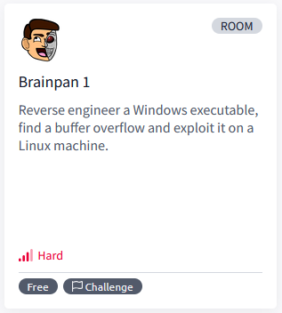

# [Brainpan 1](https://tryhackme.com/r/room/brainpan)

[Brainpan 1](https://tryhackme.com/r/room/brainpan) is listed as an hard room. Reverse engineer a Windows executable, find a buffer overflow and exploit it on a Linux machine. An overview of what we’ll be using is listed here: