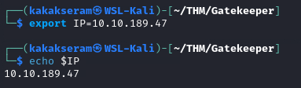

# [Gatekeeper](https://tryhackme.com/r/room/gatekeeper)


[Gatekeeper](https://tryhackme.com/r/room/gatekeeper) is listed as an medium room. Can you get past the gate and through the fire? An overview of what we’ll be using is listed here:

* Nmap

## Task 1 - Approach the Gates

Deploy the machine when you are ready to release the Gatekeeper.

**Writeups will not be accepted for this challenge**

### Answer the questions below

* No Answer Needed

	

### Enumeration

* Scan open port with **Nmap**
	
	```
	nmap $IP -A -p- -oN nmap-scan -Pn
	```
	
	

## Task 2 - Defeat the Gatekeeper and pass through the fire

Defeat the Gatekeeper to break the chains.  But beware, fire awaits on the other side.

### Answer the questions below

* Locate and find the User Flag.

* Locate and find the Root Flag