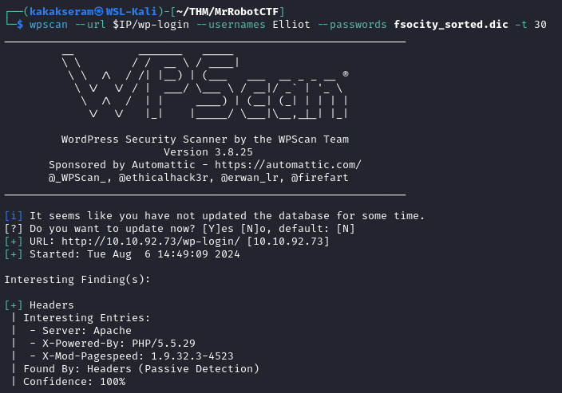
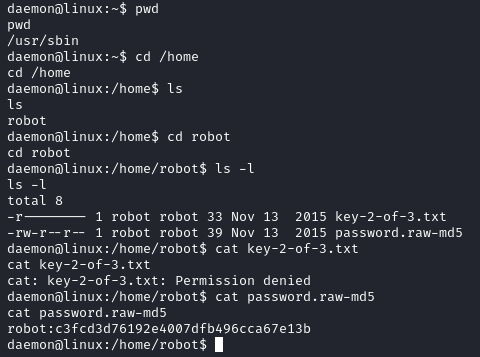

# [Mr Robot CTF](https://tryhackme.com/r/room/mrrobot)

 

[Mr Robot CTF](https://tryhackme.com/r/room/mrrobot) is listed as an medium room. Based on the Mr. Robot show, can you root this box? An overview of what we’ll be using is listed here:

* Nmap
* Gobuster
* Base64 decoding
* Python
* Hydra
* WPScan
* Privilege Escalation

## Task 1 - Connect to our network

To deploy the Mr. Robot virtual machine, you will first need to connect to our network.

### Answer the questions below

* Connect to our network using OpenVPN. Here is a mini walkthrough of connecting:

	Go to your [access](http://tryhackme.com/access) page and download your configuration file.
	
	

* Use an OpenVPN client to connect. In my example I am on Linux, on the access page we have a windows tutorial.

	 (change "ben.ovpn" to your config file)
	
	When you run this you see lots of text, at the end it will say Initialization Sequence Completed

	You can verify you are connected by looking on your access page. Refresh the page
	
	You should see a green tick next to Connected. It will also show you your internal IP address.
	
	

* You are now ready to use our machines on our network!

* Now when you deploy material, you will see an internal IP address of your Virtual Machine.

## Task 2 - Hack the machine


Can you root this Mr. Robot styled machine? This is a virtual machine meant for beginners/intermediate users. There are 3 hidden keys located on the machine, can you find them?

Credit to [Leon Johnson](https://twitter.com/@sho_luv) for creating this machine. **This machine is used here with the explicit permission of the creator <3** 

### Enumeration & Exploitation

* Scan open port with `nmap`

	```
	nmap $IP -A -p- -oN nmap-scan -Pn
	```

	

	We got open port on 80 (http) and 443 (htpps). All scan result [here.](./files/nmap-scan)

* Scan directory list with `Gobuster`

	```
	gobuster dir -u  $IP -w /usr/share/wordlists/dirbuster/dirb/common.txt -o gobuster-scan
	```

	

	

	All scan result [here.](./files/gobuster-scan)

### Answer the questions below

* What is key 1?

	On gobuster scanning We found **/robot** directory. Open **/robot** directory on browser
	
	

	We found **key1**

	
	
	**Answer : 073403c8a58a1f80d943455fb30724b9**

* What is key 2?

	#### Method 1

	On gobuster scanning We found **/license** directory. Open **/license** directory on browser

	

	We found suspicious string **ZWxsaW90OkVSMjgtMDY1Mgo=** and try to decode the string using bas64

	```
	echo ZWxsaW90OkVSMjgtMDY1Mgo= | base64 -d
	```

	

	We got **elliot:ER28-0652,** it seem like a credential. Now we try to login with this credential on **/wp-login**

	

	Great, now we can access WordPress dashboard

	

	#### Method 2
	
	On **/robot** directory we found fsocity.dic, access it and we got the file

	
	
	It seem like a possible list for username. Activated Web Developer Tools and go to Network tab. Open **/wp-login**and try to login using any credential to get response

	

	Brute force with Hydra to get username

	```
	hydra -L fsocity.dic -p TEST $IP http-post-form "/wp-login.php:log=^USER^&pwd=^PASS^:Invalid username"
	```

	

	Now we got username **Elliot.** Sort file **fsocity.dic** for password list

	

	Use **WPScan** to get password

	```
	wpscan --url $IP/wp-login --usernames Elliot --passwords fsocity_sorted.dic -t 30
	```

	

	

	Great, we got a valid credential and login to **/wp-login**

	

	#### Get Reverse Shell & Key

	On Appearance editor, edit **404.php** to our php reverse shell from [Pentestmonkey](https://github.com/pentestmonkey/php-reverse-shell)

	

	Setup listener our attacking machine

	

	Access **404.php** on browser to get our reverse shell

	

	

	Use python command to stabilize our shell

	```
	python -c "import pty; pty.spawn('/bin/bash')"
	```

	

	We found file **key-2-of-3.txt** and **password.raw-md5**

	

	Use CrackStation to crack **password.raw-md5**

	

	Now we got a credential **robot:abcdefghijklmnopqrstuvwxyz**. Switch user to **robot**

	

	Open file **key-2-of-3.txt**

	

	**Answer : 822c73956184f694993bede3eb39f959**

* What is key 3?

	#### Privilege Escalation
	
	Try to find sudo privilege

	

	We found nothing on sudo. Try to find SUID binaries

	```
	find / -type f -perm -4000 -ls 2>/dev/null
	```

	

	We found **nmap** set as SUID. From [GTFOBins](https://gtfobins.github.io/gtfobins/nmap/#suid) information, when nmap has the SUID bit set we can do to eleveted our privileges and read the file system

	```
	nmap --interactive
	!sh
	```

	

	We got root access. Open file **key-3-of-3.txt**

	

	**Answer : 04787ddef27c3dee1ee161b21670b4e4**


