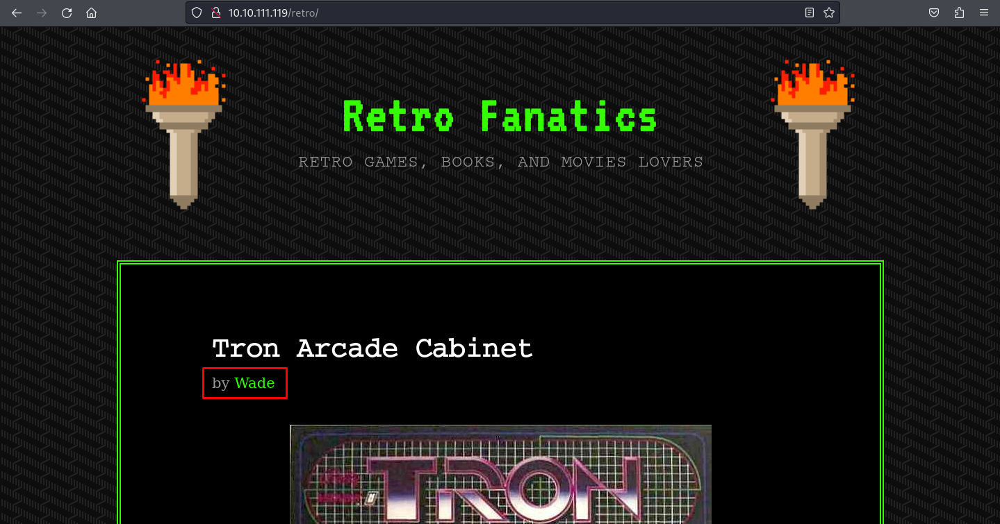

# [Retro](https://tryhackme.com/r/room/retro)


[Retro](https://tryhackme.com/r/room/retro) is listed as an medium room. New high score! An overview of what we’ll be using is listed here:

* Nmap
* Gobuster
* RDP

## Task 1 - Pwn


Can you time travel? If not, you might want to think about the next best thing.

Please note that this machine does not respond to ping (ICMP) and may take a few minutes to boot up.

-------------------------------------

_There are two distinct paths that can be taken on Retro. One requires significantly less trial and error, however, both will work. Please check writeups if you are curious regarding the two paths. An alternative version of this room is available in it's remixed version [Blaster](https://tryhackme.com/room/blaster)_.

### Enumeration & Exploitation

* Scan open port with `nmap`

	```
	nmap $IP -A -p- -oN nmap-scan -Pn
	```

	

	We found open port on 80 (HTTP) and 3389 (RDP)

* Scan directory list with `Gobuster`

	```
	gobuster dir -u  $IP -w /usr/share/wordlists/dirbuster/directory-list-2.3-medium.txt -t 50 -o gobuster-scan
	```

	

	We got directory **/retro**

* Browsing into **/retro** directory

	

	We found the author is **Wade**, open the link of author

	

	Exploring posts by **Wade**

	

	We found suspicious comment on post **Ready Player One**. Take a note for it.

* Scan sub directory on **/retro**

	```
	gobuster dir -u  $IP/retro -w /usr/share/wordlists/dirbuster/directory-list-2.3-medium.txt -t 50 -o gobuster-retro-scan
	```

	

* We know from nmap that host machine has set RDP port open. Connect to it using username Author and password from the comment.

	```
	xfreerdp /v:$IP /u:Wade /p:'parzival'
	```

	

	We got initial access

### Answer the questions below

* A web server is running on the target. What is the hidden directory which the website lives on?

	

	**Answer : /Retro**

* user.txt

	

	**Answer : 3b99fbdc6d430bfb51c72c651a261927**

* root.txt

