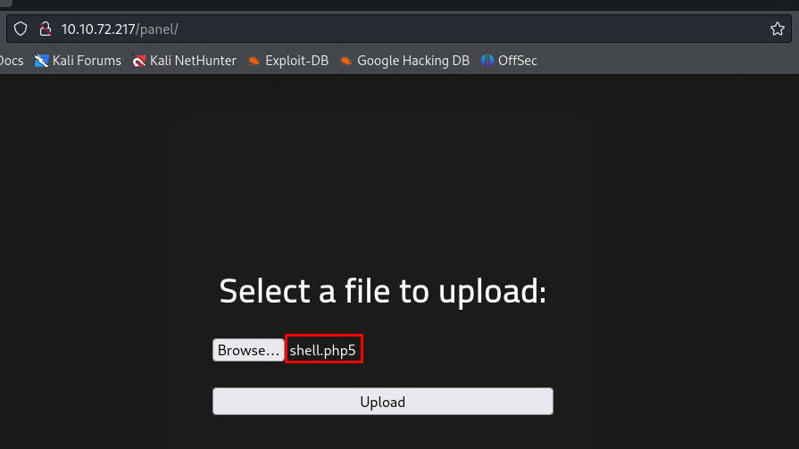

# RootMe

A CTF for beginners, can you root me?

## Task 1 - Deploy the machine

Set up environment IP as IP_Machine

## Task 2 - Reconnaissance

* Scan the machine, how many ports are open?
	
	

* What version of Apache is running?
	
	

* What service is running on port 22?
	
	

* Find directories on the web server using the GoBuster tool. What is the hidden directory?
	
	
	

## Task 3 - Getting a shell

* Find a form to upload and get a reverse shell, and find the flag `user.txt`
	
	* Upload reverse shell 
		
		

