# [Skynet](https://tryhackme.com/r/room/skynet)

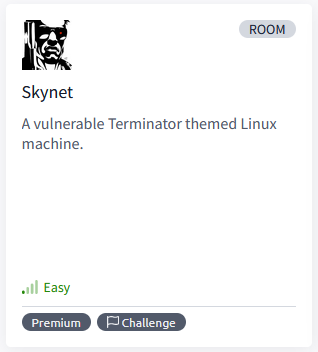

[Skynet](https://tryhackme.com/r/room/skynet) is listed as an easy room. A vulnerable Terminator themed Linux machine. An overview of what we’ll be using is listed here:

* Nmap
* Gobuster
* enum4linux
* Hydra
* Searchsploit

[IP](./images/IP.png)

## Task 1 - Deploy and compromise the vulnerable machine!


Are you able to compromise this Terminator themed machine?

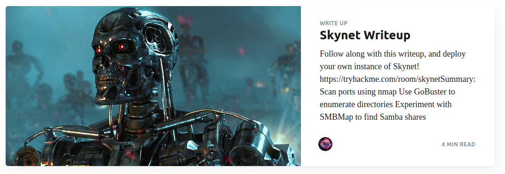

You can follow our official walkthrough for this challenge on [our blog](https://blog.tryhackme.com/skynet-writeup/).

## Enumeration

* Port scan with **Nmap**

	```
	nmap -sC -sV $IP -oN nmap-scan
	```

	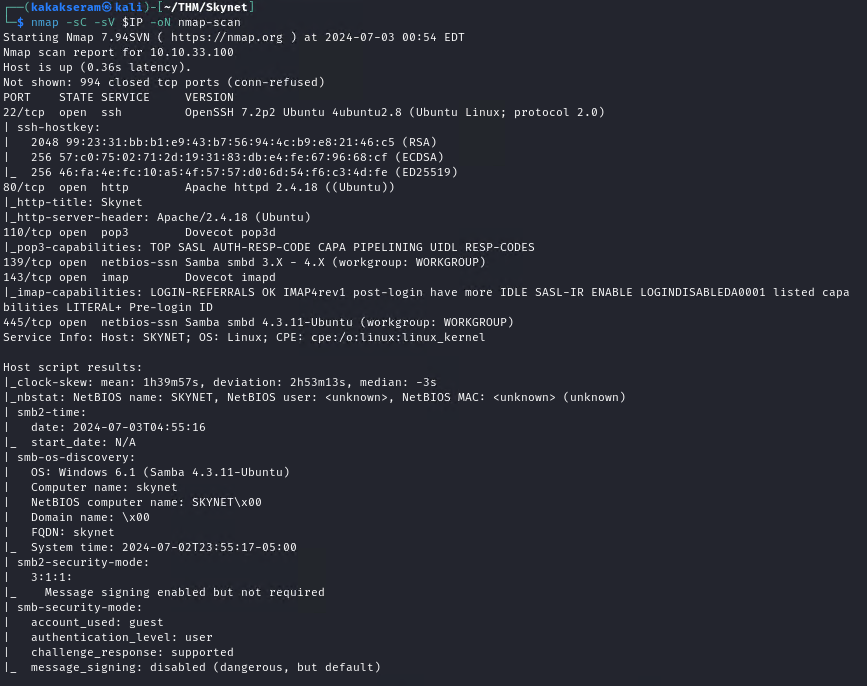

* Directory scan with **Gobuster**

	```
	gobuster dir -u $IP -w /usr/share/wordlists/dirb/big.txt -t50 | tee gobuster-default
	```

	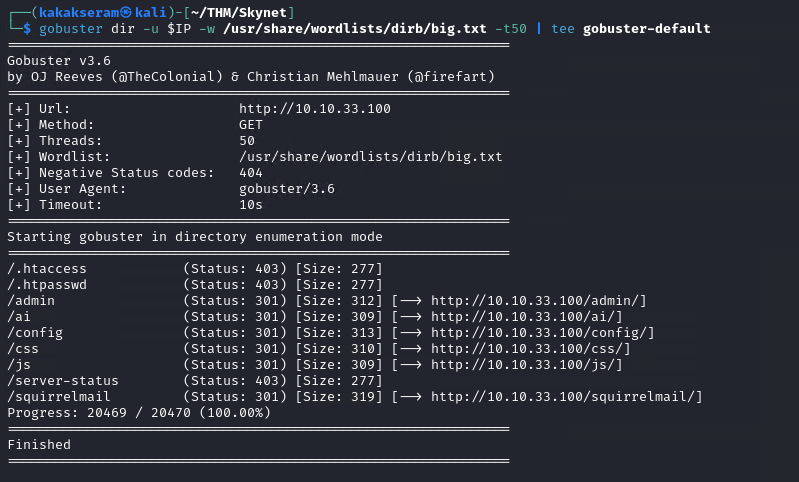

* Enumeration SMB with **enum4linux**
	
	```
	enum4linux $IP
	```

* Connect to smbclient

	```
	smbclient //$IP/anonymous
	ls
	```

	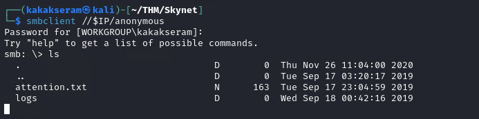

* Download and open `attention.txt` file

	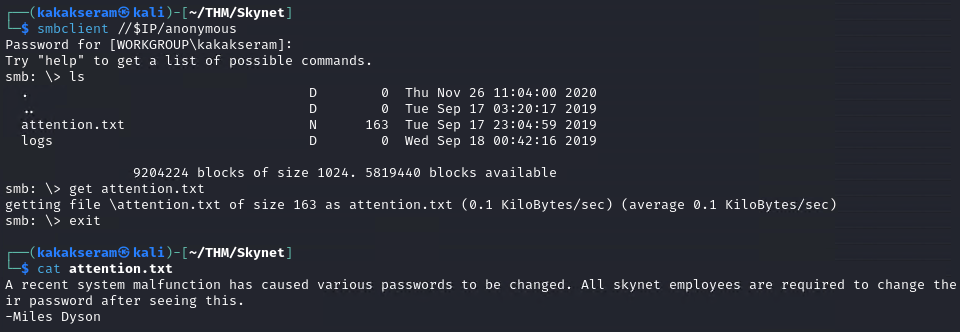

* Change to logs directory and download log file

	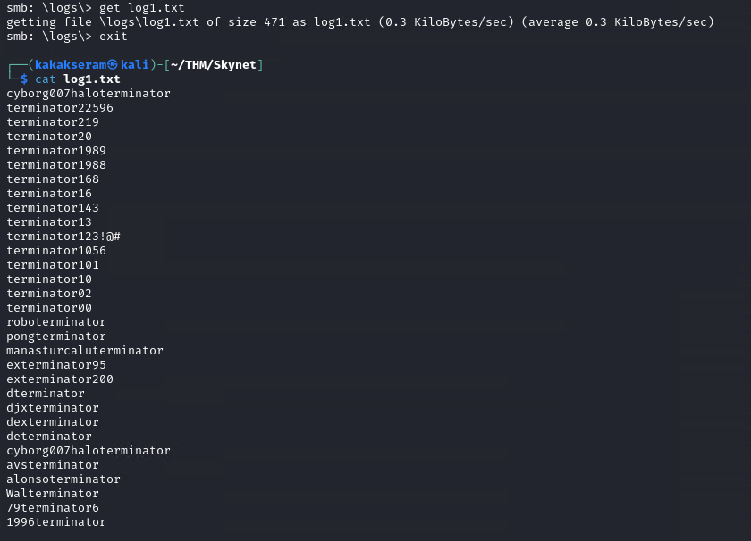

* Brute force login with hydra

	```
	hydra -l milesdyson -P log1.txt $IP http-post-form "/squirrelmail/src/redirect.php:login_username=^USER^&secretkey=^PASS^:incorrect"
	```

	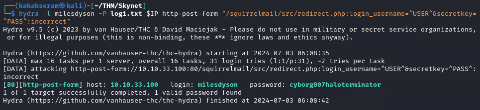

* Login to webmail with our credential

	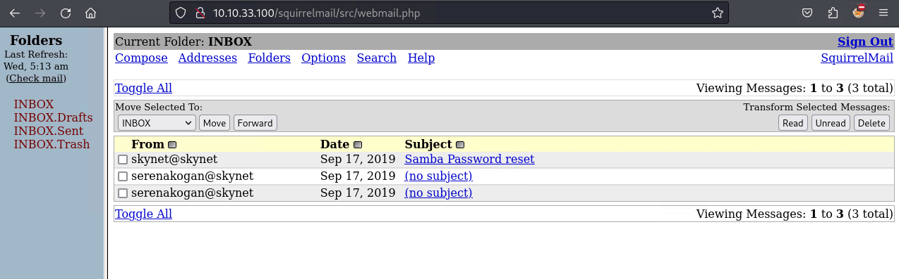

* Open email `Samba Reset Password` & get the password smb

	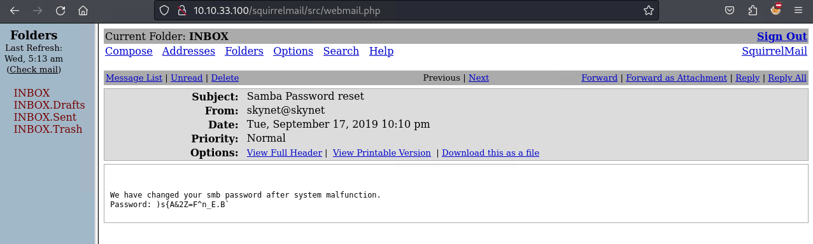

* Connect to smbclient with `milesdyson` credential

	```
	smbclient -U milesdyson //$IP/milesdyson
	```

	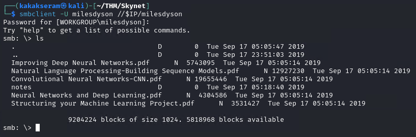

* Download `importart.txt` on noted folder and view the file

	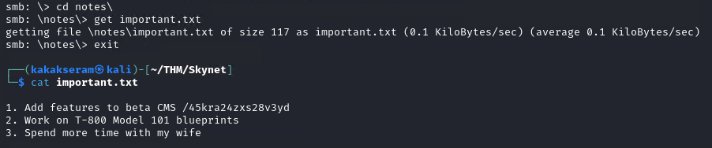

* Directory scan on a scret page with **Gobuster**

	```
	gobuster dir -u $IP/45kra24zxs28v3yd -w /usr/share/wordlists/dirb/common.txt -t50 | tee gobuster-secret
	```

	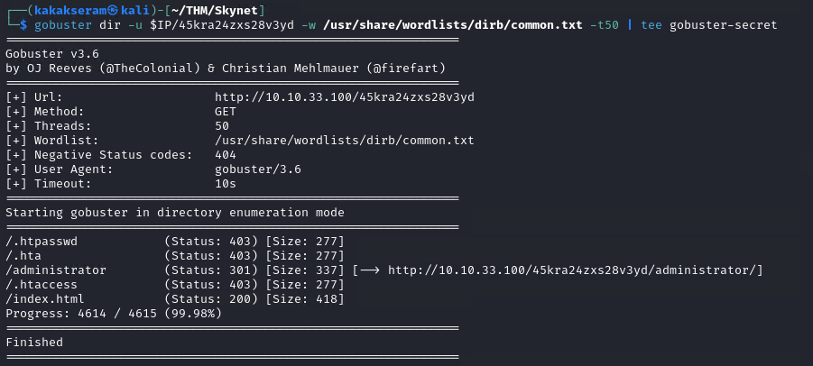

* Open the webpage `http://10.10.33.100/45kra24zxs28v3yd/administrator/`

	

* Searchsploit for `cuppa`

	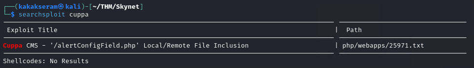

* Download `searchsploit` file

	```
	searchsploit -m 25971
	```

	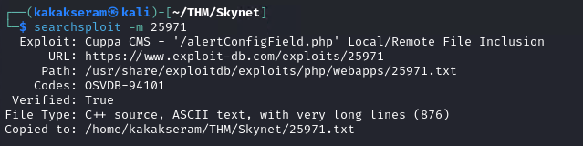

### Answer the questions below

* What is Miles password for his emails?

* What is the hidden directory?

* What is the vulnerability called when you can include a remote file for malicious purposes?

* What is the user flag?

* What is the root flag?


