# [c4ptur3-th3-fl4g](https://tryhackme.com/r/room/c4ptur3th3fl4g)

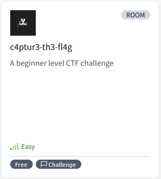

[c4ptur3-th3-fl4g](https://tryhackme.com/r/room/c4ptur3th3fl4g) is listed as an medium room. A beginner level CTF challenge. An overview of what we’ll be using is listed here:

* [cryptii](https://cryptii.com/)

## Task 1 - Translation & Shifting

Translate, shift and decode the following;

Answers are all case sensitive.

### Answer the questions below

* c4n y0u c4p7u23 7h3 f149?

	**Answer : can you capture the flag**

* 01101100 01100101 01110100 01110011 00100000 01110100 01110010 01111001 00100000 01110011 01101111 01101101 01100101 00100000 01100010 01101001 01101110 01100001 01110010 01111001 00100000 01101111 01110101 01110100 00100001

	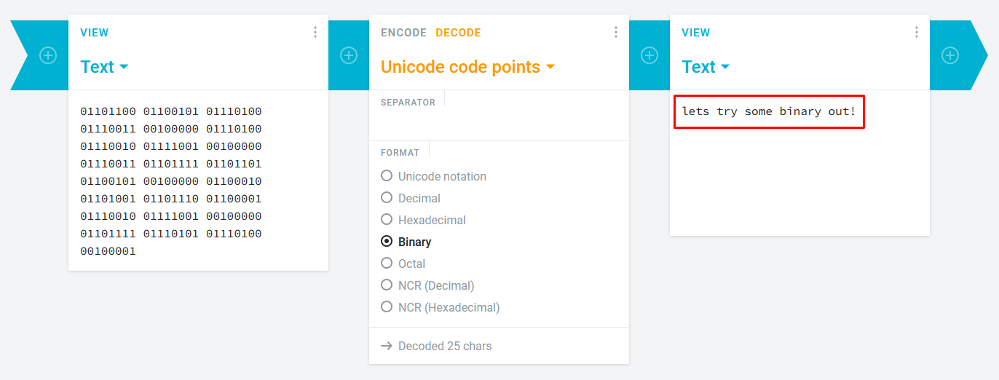

	Binaty to text

	**Answer : lets try some binary out!**

* MJQXGZJTGIQGS4ZAON2XAZLSEBRW63LNN5XCA2LOEBBVIRRHOM======

	```
	echo "MJQXGZJTGIQGS4ZAON2XAZLSEBRW63LNN5XCA2LOEBBVIRRHOM======" | base32 -d
	```

	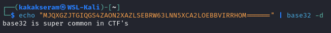

	Base32 to text

	**Answer : base32 is super common in CTF's**

* RWFjaCBCYXNlNjQgZGlnaXQgcmVwcmVzZW50cyBleGFjdGx5IDYgYml0cyBvZiBkYXRhLg==

	```
	echo "RWFjaCBCYXNlNjQgZGlnaXQgcmVwcmVzZW50cyBleGFjdGx5IDYgYml0cyBvZiBkYXRhLg==" | base64 -d
	```

	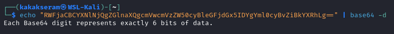

	Base64 to text

	**Answer : Each Base64 digit represents exactly 6 bits of data.**

* 68 65 78 61 64 65 63 69 6d 61 6c 20 6f 72 20 62 61 73 65 31 36 3f

	```
	echo "68 65 78 61 64 65 63 69 6d 61 6c 20 6f 72 20 62 61 73 65 31 36 3f" | xxd -r -p
	```

	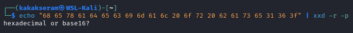

	Hexadecimal to text

	**Answer : hexadecimal or base16?**

* Ebgngr zr 13 cynprf!

	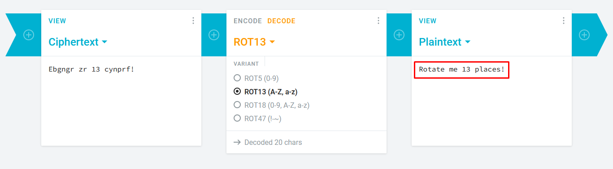

	Rotate 13 times

	**Answer : Rotate me 13 places!**

* \*@F DA:? >6 C:89E C@F?5 323J C:89E C@F?5 Wcf E:>6DX

	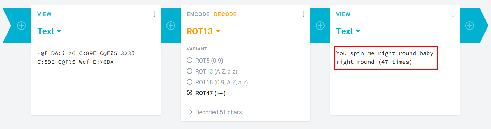

	Rotate 47 times

	**Answer : You spin me right round baby right round (47 times)**

* . .-.. . -.-. --- -- -- ..- -. .. -.-. .- - .. --- -.  
 . -. -.-. --- -.. .. -. --.
 
	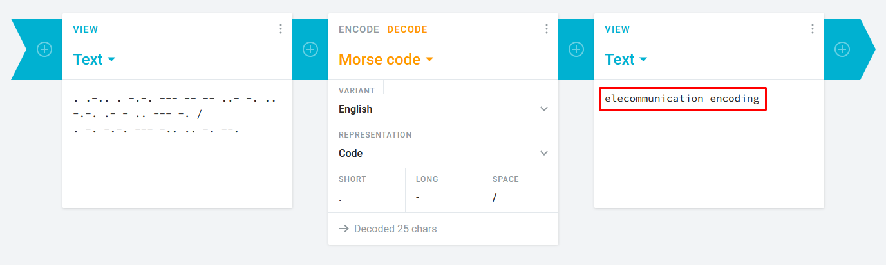

 	Morse to text

 	**Answer : elecommunication encoding**

* 85 110 112 97 99 107 32 116 104 105 115 32 66 67 68

	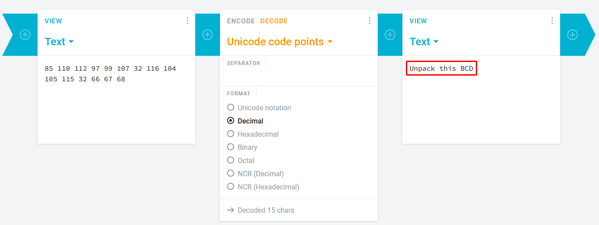

	Decimal to text

	**Answer : Unpack this BCD**

* ```LS0tLS0gLi0tLS0gLi0tLS0gLS0tLS0gLS0tLS0gLi0tLS0gLi0tLS0gLS0tLS0KLS0tLS0gLi0tLS0gLi0tLS0gLS0tLS0gLS0tLS0gLi0tLS0gLS0tLS0gLi0tLS0KLS0tLS0gLS0tLS0gLi0tLS0gLS0tLS0gLS0tLS0gLS0tLS0gLS0tLS0gLS0tLS0KLS0tLS0gLi0tLS0gLi0tLS0gLS0tLS0gLS0tLS0gLS0tLS0gLS0tLS0gLS0tLS0KLS0tLS0gLi0tLS0gLS0tLS0gLi0tLS0gLi0tLS0gLi0tLS0gLi0tLS0gLi0tLS0KLS0tLS0gLi0tLS0gLi0tLS0gLS0tLS0gLS0tLS0gLS0tLS0gLS0tLS0gLS0tLS0KLS0tLS0gLS0tLS0gLi0tLS0gLS0tLS0gLS0tLS0gLS0tLS0gLS0tLS0gLS0tLS0KLS0tLS0gLi0tLS0gLi0tLS0gLS0tLS0gLS0tLS0gLS0tLS0gLS0tLS0gLS0tLS0KLS0tLS0gLi0tLS0gLi0tLS0gLS0tLS0gLS0tLS0gLS0tLS0gLS0tLS0gLS0tLS0KLS0tLS0gLi0tLS0gLi0tLS0gLS0tLS0gLS0tLS0gLi0tLS0gLS0tLS0gLi0tLS0KLS0tLS0gLS0tLS0gLi0tLS0gLS0tLS0gLS0tLS0gLS0tLS0gLS0tLS0gLS0tLS0KLS0tLS0gLi0tLS0gLi0tLS0gLS0tLS0gLS0tLS0gLS0tLS0gLi0tLS0gLS0tLS0KLS0tLS0gLi0tLS0gLi0tLS0gLS0tLS0gLi0tLS0gLS0tLS0gLS0tLS0gLS0tLS0KLS0tLS0gLS0tLS0gLi0tLS0gLS0tLS0gLS0tLS0gLS0tLS0gLS0tLS0gLS0tLS0KLS0tLS0gLi0tLS0gLi0tLS0gLS0tLS0gLS0tLS0gLS0tLS0gLS0tLS0gLS0tLS0KLS0tLS0gLi0tLS0gLi0tLS0gLS0tLS0gLS0tLS0gLS0tLS0gLS0tLS0gLS0tLS0KLS0tLS0gLi0tLS0gLi0tLS0gLS0tLS0gLS0tLS0gLi0tLS0gLS0tLS0gLS0tLS0KLS0tLS0gLS0tLS0gLi0tLS0gLS0tLS0gLS0tLS0gLS0tLS0gLS0tLS0gLS0tLS0KLS0tLS0gLi0tLS0gLi0tLS0gLS0tLS0gLS0tLS0gLS0tLS0gLi0tLS0gLS0tLS0KLS0tLS0gLi0tLS0gLi0tLS0gLS0tLS0gLS0tLS0gLS0tLS0gLS0tLS0gLi0tLS0KLS0tLS0gLS0tLS0gLi0tLS0gLS0tLS0gLS0tLS0gLS0tLS0gLS0tLS0gLS0tLS0KLS0tLS0gLi0tLS0gLi0tLS0gLS0tLS0gLS0tLS0gLS0tLS0gLS0tLS0gLS0tLS0KLS0tLS0gLi0tLS0gLS0tLS0gLi0tLS0gLi0tLS0gLi0tLS0gLi0tLS0gLi0tLS0KLS0tLS0gLi0tLS0gLi0tLS0gLS0tLS0gLi0tLS0gLS0tLS0gLS0tLS0gLS0tLS0KLS0tLS0gLS0tLS0gLi0tLS0gLS0tLS0gLS0tLS0gLS0tLS0gLS0tLS0gLS0tLS0KLS0tLS0gLi0tLS0gLi0tLS0gLS0tLS0gLi0tLS0gLS0tLS0gLS0tLS0gLS0tLS0KLS0tLS0gLi0tLS0gLi0tLS0gLS0tLS0gLS0tLS0gLi0tLS0gLi0tLS0gLS0tLS0KLS0tLS0gLS0tLS0gLi0tLS0gLS0tLS0gLS0tLS0gLS0tLS0gLS0tLS0gLS0tLS0KLS0tLS0gLi0tLS0gLi0tLS0gLS0tLS0gLS0tLS0gLS0tLS0gLS0tLS0gLS0tLS0KLS0tLS0gLi0tLS0gLS0tLS0gLi0tLS0gLi0tLS0gLi0tLS0gLi0tLS0gLi0tLS0KLS0tLS0gLi0tLS0gLi0tLS0gLS0tLS0gLS0tLS0gLi0tLS0gLi0tLS0gLS0tLS0KLS0tLS0gLS0tLS0gLi0tLS0gLS0tLS0gLS0tLS0gLS0tLS0gLS0tLS0gLS0tLS0KLS0tLS0gLi0tLS0gLi0tLS0gLS0tLS0gLS0tLS0gLS0tLS0gLS0tLS0gLS0tLS0KLS0tLS0gLi0tLS0gLS0tLS0gLi0tLS0gLi0tLS0gLi0tLS0gLi0tLS0gLi0tLS0KLS0tLS0gLi0tLS0gLi0tLS0gLS0tLS0gLS0tLS0gLS0tLS0gLS0tLS0gLS0tLS0KLS0tLS0gLS0tLS0gLi0tLS0gLS0tLS0gLS0tLS0gLS0tLS0gLS0tLS0gLS0tLS0KLS0tLS0gLi0tLS0gLi0tLS0gLS0tLS0gLS0tLS0gLS0tLS0gLi0tLS0gLS0tLS0KLS0tLS0gLi0tLS0gLi0tLS0gLS0tLS0gLS0tLS0gLS0tLS0gLS0tLS0gLi0tLS0KLS0tLS0gLS0tLS0gLi0tLS0gLS0tLS0gLS0tLS0gLS0tLS0gLS0tLS0gLS0tLS0KLS0tLS0gLi0tLS0gLi0tLS0gLS0tLS0gLS0tLS0gLS0tLS0gLS0tLS0gLS0tLS0KLS0tLS0gLi0tLS0gLi0tLS0gLS0tLS0gLS0tLS0gLS0tLS0gLS0tLS0gLS0tLS0KLS0tLS0gLi0tLS0gLi0tLS0gLS0tLS0gLS0tLS0gLi0tLS0gLS0tLS0gLi0tLS0KLS0tLS0gLS0tLS0gLi0tLS0gLS0tLS0gLS0tLS0gLS0tLS0gLS0tLS0gLS0tLS0KLS0tLS0gLi0tLS0gLi0tLS0gLS0tLS0gLS0tLS0gLS0tLS0gLS0tLS0gLS0tLS0KLS0tLS0gLi0tLS0gLS0tLS0gLi0tLS0gLi0tLS0gLi0tLS0gLi0tLS0gLi0tLS0KLS0tLS0gLi0tLS0gLi0tLS0gLS0tLS0gLS0tLS0gLS0tLS0gLi0tLS0gLi0tLS0KLS0tLS0gLS0tLS0gLi0tLS0gLS0tLS0gLS0tLS0gLS0tLS0gLS0tLS0gLS0tLS0KLS0tLS0gLi0tLS0gLi0tLS0gLS0tLS0gLS0tLS0gLS0tLS0gLS0tLS0gLS0tLS0KLS0tLS0gLi0tLS0gLS0tLS0gLi0tLS0gLi0tLS0gLi0tLS0gLi0tLS0gLi0tLS0KLS0tLS0gLi0tLS0gLi0tLS0gLS0tLS0gLS0tLS0gLi0tLS0gLS0tLS0gLS0tLS0KLS0tLS0gLS0tLS0gLi0tLS0gLS0tLS0gLS0tLS0gLS0tLS0gLS0tLS0gLS0tLS0KLS0tLS0gLi0tLS0gLi0tLS0gLS0tLS0gLS0tLS0gLS0tLS0gLS0tLS0gLS0tLS0KLS0tLS0gLi0tLS0gLi0tLS0gLS0tLS0gLS0tLS0gLS0tLS0gLS0tLS0gLS0tLS0KLS0tLS0gLi0tLS0gLi0tLS0gLS0tLS0gLS0tLS0gLi0tLS0gLS0tLS0gLS0tLS0KLS0tLS0gLS0tLS0gLi0tLS0gLS0tLS0gLS0tLS0gLS0tLS0gLS0tLS0gLS0tLS0KLS0tLS0gLi0tLS0gLi0tLS0gLS0tLS0gLS0tLS0gLS0tLS0gLi0tLS0gLS0tLS0KLS0tLS0gLi0tLS0gLi0tLS0gLS0tLS0gLS0tLS0gLS0tLS0gLS0tLS0gLi0tLS0KLS0tLS0gLS0tLS0gLi0tLS0gLS0tLS0gLS0tLS0gLS0tLS0gLS0tLS0gLS0tLS0KLS0tLS0gLi0tLS0gLi0tLS0gLS0tLS0gLi0tLS0gLS0tLS0gLS0tLS0gLS0tLS0KLS0tLS0gLi0tLS0gLi0tLS0gLS0tLS0gLS0tLS0gLi0tLS0gLi0tLS0gLS0tLS0KLS0tLS0gLS0tLS0gLi0tLS0gLS0tLS0gLS0tLS0gLS0tLS0gLS0tLS0gLS0tLS0KLS0tLS0gLi0tLS0gLi0tLS0gLS0tLS0gLS0tLS0gLS0tLS0gLi0tLS0gLS0tLS0KLS0tLS0gLi0tLS0gLi0tLS0gLS0tLS0gLS0tLS0gLS0tLS0gLS0tLS0gLi0tLS0KLS0tLS0gLS0tLS0gLi0tLS0gLS0tLS0gLS0tLS0gLS0tLS0gLS0tLS0gLS0tLS0KLS0tLS0gLi0tLS0gLi0tLS0gLS0tLS0gLi0tLS0gLS0tLS0gLS0tLS0gLS0tLS0KLS0tLS0gLi0tLS0gLi0tLS0gLS0tLS0gLS0tLS0gLi0tLS0gLi0tLS0gLi0tLS0KLS0tLS0gLS0tLS0gLi0tLS0gLS0tLS0gLS0tLS0gLS0tLS0gLS0tLS0gLS0tLS0KLS0tLS0gLi0tLS0gLi0tLS0gLS0tLS0gLS0tLS0gLS0tLS0gLS0tLS0gLS0tLS0KLS0tLS0gLi0tLS0gLS0tLS0gLi0tLS0gLi0tLS0gLi0tLS0gLi0tLS0gLi0tLS0KLS0tLS0gLi0tLS0gLi0tLS0gLS0tLS0gLS0tLS0gLi0tLS0gLS0tLS0gLS0tLS0KLS0tLS0gLS0tLS0gLi0tLS0gLS0tLS0gLS0tLS0gLS0tLS0gLS0tLS0gLS0tLS0KLS0tLS0gLi0tLS0gLi0tLS0gLS0tLS0gLS0tLS0gLS0tLS0gLS0tLS0gLS0tLS0KLS0tLS0gLi0tLS0gLi0tLS0gLS0tLS0gLS0tLS0gLS0tLS0gLS0tLS0gLS0tLS0KLS0tLS0gLi0tLS0gLi0tLS0gLS0tLS0gLS0tLS0gLi0tLS0gLS0tLS0gLi0tLS0KLS0tLS0gLS0tLS0gLi0tLS0gLS0tLS0gLS0tLS0gLS0tLS0gLS0tLS0gLS0tLS0KLS0tLS0gLi0tLS0gLi0tLS0gLS0tLS0gLS0tLS0gLS0tLS0gLi0tLS0gLS0tLS0KLS0tLS0gLi0tLS0gLi0tLS0gLS0tLS0gLS0tLS0gLS0tLS0gLS0tLS0gLi0tLS0KLS0tLS0gLS0tLS0gLi0tLS0gLS0tLS0gLS0tLS0gLS0tLS0gLS0tLS0gLS0tLS0KLS0tLS0gLi0tLS0gLi0tLS0gLS0tLS0gLS0tLS0gLS0tLS0gLS0tLS0gLS0tLS0KLS0tLS0gLi0tLS0gLi0tLS0gLS0tLS0gLS0tLS0gLS0tLS0gLS0tLS0gLS0tLS0KLS0tLS0gLi0tLS0gLi0tLS0gLS0tLS0gLS0tLS0gLi0tLS0gLS0tLS0gLi0tLS0KLS0tLS0gLS0tLS0gLi0tLS0gLS0tLS0gLS0tLS0gLS0tLS0gLS0tLS0gLS0tLS0KLS0tLS0gLi0tLS0gLi0tLS0gLS0tLS0gLS0tLS0gLS0tLS0gLS0tLS0gLS0tLS0KLS0tLS0gLi0tLS0gLi0tLS0gLS0tLS0gLS0tLS0gLS0tLS0gLS0tLS0gLS0tLS0KLS0tLS0gLi0tLS0gLi0tLS0gLS0tLS0gLS0tLS0gLS0tLS0gLi0tLS0gLi0tLS0KLS0tLS0gLS0tLS0gLi0tLS0gLS0tLS0gLS0tLS0gLS0tLS0gLS0tLS0gLS0tLS0KLS0tLS0gLi0tLS0gLi0tLS0gLS0tLS0gLS0tLS0gLS0tLS0gLS0tLS0gLS0tLS0KLS0tLS0gLi0tLS0gLS0tLS0gLi0tLS0gLi0tLS0gLi0tLS0gLi0tLS0gLi0tLS0KLS0tLS0gLi0tLS0gLi0tLS0gLS0tLS0gLS0tLS0gLi0tLS0gLS0tLS0gLS0tLS0KLS0tLS0gLS0tLS0gLi0tLS0gLS0tLS0gLS0tLS0gLS0tLS0gLS0tLS0gLS0tLS0KLS0tLS0gLi0tLS0gLi0tLS0gLS0tLS0gLi0tLS0gLS0tLS0gLS0tLS0gLS0tLS0KLS0tLS0gLi0tLS0gLi0tLS0gLS0tLS0gLi0tLS0gLS0tLS0gLS0tLS0gLS0tLS0KLS0tLS0gLS0tLS0gLi0tLS0gLS0tLS0gLS0tLS0gLS0tLS0gLS0tLS0gLS0tLS0KLS0tLS0gLi0tLS0gLi0tLS0gLS0tLS0gLS0tLS0gLS0tLS0gLS0tLS0gLS0tLS0KLS0tLS0gLi0tLS0gLS0tLS0gLi0tLS0gLi0tLS0gLi0tLS0gLi0tLS0gLi0tLS0KLS0tLS0gLi0tLS0gLi0tLS0gLS0tLS0gLS0tLS0gLi0tLS0gLi0tLS0gLS0tLS0KLS0tLS0gLS0tLS0gLi0tLS0gLS0tLS0gLS0tLS0gLS0tLS0gLS0tLS0gLS0tLS0KLS0tLS0gLi0tLS0gLi0tLS0gLS0tLS0gLS0tLS0gLS0tLS0gLS0tLS0gLS0tLS0KLS0tLS0gLi0tLS0gLS0tLS0gLi0tLS0gLi0tLS0gLi0tLS0gLi0tLS0gLi0tLS0KLS0tLS0gLi0tLS0gLi0tLS0gLS0tLS0gLS0tLS0gLi0tLS0gLS0tLS0gLS0tLS0KLS0tLS0gLS0tLS0gLi0tLS0gLS0tLS0gLS0tLS0gLS0tLS0gLS0tLS0gLS0tLS0KLS0tLS0gLi0tLS0gLi0tLS0gLS0tLS0gLS0tLS0gLS0tLS0gLS0tLS0gLS0tLS0KLS0tLS0gLi0tLS0gLS0tLS0gLi0tLS0gLi0tLS0gLi0tLS0gLi0tLS0gLi0tLS0KLS0tLS0gLi0tLS0gLi0tLS0gLS0tLS0gLS0tLS0gLS0tLS0gLS0tLS0gLS0tLS0KLS0tLS0gLS0tLS0gLi0tLS0gLS0tLS0gLS0tLS0gLS0tLS0gLS0tLS0gLS0tLS0KLS0tLS0gLi0tLS0gLi0tLS0gLS0tLS0gLS0tLS0gLS0tLS0gLS0tLS0gLS0tLS0KLS0tLS0gLi0tLS0gLi0tLS0gLS0tLS0gLS0tLS0gLS0tLS0gLS0tLS0gLS0tLS0KLS0tLS0gLi0tLS0gLi0tLS0gLS0tLS0gLS0tLS0gLS0tLS0gLi0tLS0gLi0tLS0KLS0tLS0gLS0tLS0gLi0tLS0gLS0tLS0gLS0tLS0gLS0tLS0gLS0tLS0gLS0tLS0KLS0tLS0gLi0tLS0gLi0tLS0gLS0tLS0gLS0tLS0gLS0tLS0gLi0tLS0gLi0tLS0KLS0tLS0gLi0tLS0gLi0tLS0gLS0tLS0gLS0tLS0gLi0tLS0gLS0tLS0gLi0tLS0KLS0tLS0gLS0tLS0gLi0tLS0gLS0tLS0gLS0tLS0gLS0tLS0gLS0tLS0gLS0tLS0KLS0tLS0gLi0tLS0gLi0tLS0gLS0tLS0gLS0tLS0gLS0tLS0gLi0tLS0gLi0tLS0KLS0tLS0gLi0tLS0gLi0tLS0gLS0tLS0gLS0tLS0gLi0tLS0gLS0tLS0gLi0tLS0KLS0tLS0gLS0tLS0gLi0tLS0gLS0tLS0gLS0tLS0gLS0tLS0gLS0tLS0gLS0tLS0KLS0tLS0gLi0tLS0gLi0tLS0gLS0tLS0gLS0tLS0gLS0tLS0gLi0tLS0gLi0tLS0KLS0tLS0gLi0tLS0gLi0tLS0gLS0tLS0gLS0tLS0gLi0tLS0gLS0tLS0gLi0tLS0=
```


	1. level 1 : Base64
	
	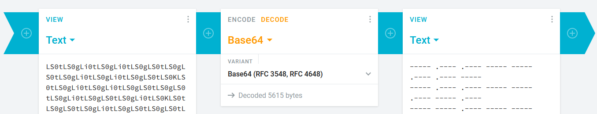
	
	2. level 2 : Morse code
	
	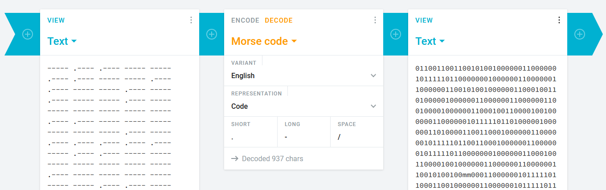
	
	3. level 3 : Binary
	
	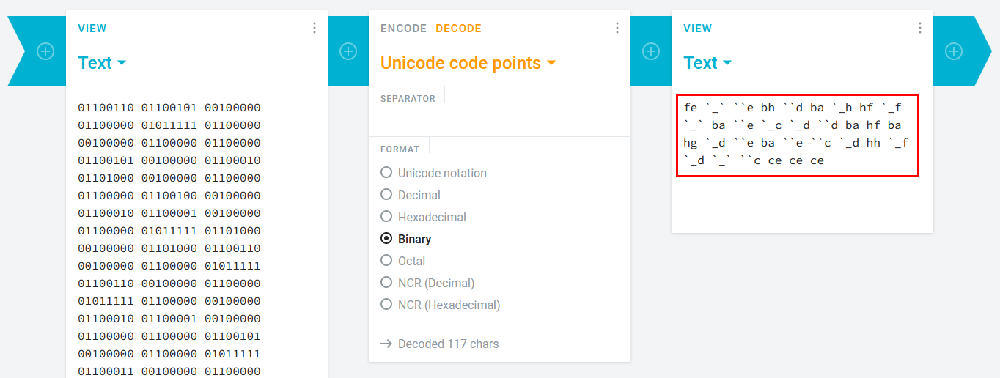
	
	4. level 4 : ROT47
	
	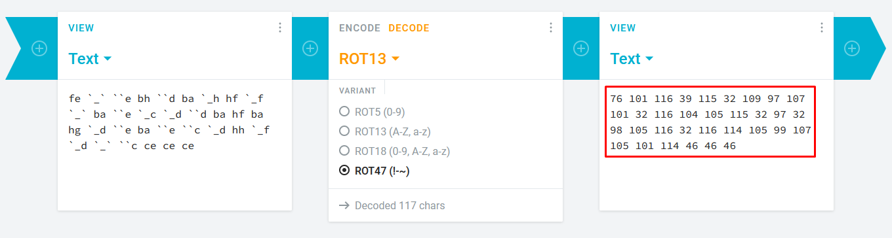
	
	5. level 5 : BCD(decimal)
	
	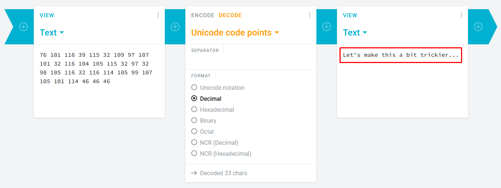

	**Answer : Let's make this a bit trickier...** 

## Task 2 - Spectrograms

A spectrogram is a visual representation of the spectrum of frequencies of a signal as it varies with time. When applied to an audio signal, spectrograms are sometimes called sonographs, voiceprints, or voicegrams. When the data is represented in a 3D plot they may be called waterfalls. 

### Answer the questions below

* Download the file

## Task 3 - Steganography

Steganography is the practice of concealing a file, message, image, or video within another file, message, image, or video.

### Answer the questions below

* Decode the image to reveal the answer

## Task 4 - Security through obscurity

Security through obscurity is the reliance in security engineering on the secrecy of the design or implementation as the main method of providing security for a system or component of a system.

### Answer the questions below

* Download and get 'inside' the file. What is the first filename & extension?

* Get inside the archive and inspect the file carefully. Find the hidden text.