# [Breaching Active Directory](https://tryhackme.com/r/room/breachingad)

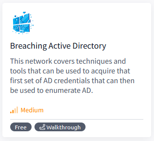


## Task 1 - Introduction to AD Breaches

Active Directory (AD) is used by approximately 90% of the Global Fortune 1000 companies. If an organisation's estate uses Microsoft Windows, you are almost guaranteed to find AD. Microsoft AD is the dominant suite used to manage Windows domain networks. However, since AD is used for Identity and Access Management of the entire estate, it holds the keys to the kingdom, making it a very likely target for attackers.

For a more in-depth understanding of AD and how it works, [please complete this room on AD basics first](https://tryhackme.com/jr/activedirectorybasics).

### Breaching Active Directory

Before we can exploit AD misconfigurations for privilege escalation, lateral movement, and goal execution, you need initial access first. You need to acquire an initial set of valid AD credentials. Due to the number of AD services and features, the attack surface for gaining an initial set of AD credentials is usually significant. In this room, we will discuss several avenues, but this is by no means an exhaustive list.

When looking for that first set of credentials, we don't focus on the permissions associated with the account; thus, even a low-privileged account would be sufficient. We are just looking for a way to authenticate to AD, allowing us to do further enumeration on AD itself.

### Learning Objectives

In this network, we will cover several methods that can be used to breach AD. This is by no means a complete list as new methods and techniques are discovered every day. However, we will  cover the following techniques to recover AD credentials in this network:

* NTLM Authenticated Services
* LDAP Bind Credentials
* Authentication Relays
* Microsoft Deployment Toolkit
* Configuration Files

We can use these techniques on a security assessment either by targeting systems of an organisation that are internet-facing or by implanting a rogue device on the organisation's network.

### Connecting to the Network

**AttackBox**

If you are using the Web-based AttackBox, you will be connected to the network automatically if you start the AttackBox from the room's page. You can verify this by running the ping command against the IP of the THMDC.za.tryhackme.com host. We do still need to configure DNS, however. Windows Networks use the Domain Name Service (DNS) to resolve hostnames to IPs. Throughout this network, DNS will be used for the tasks. You will have to configure DNS on the host on which you are running the VPN connection. In order to configure our DNS, run the following command:

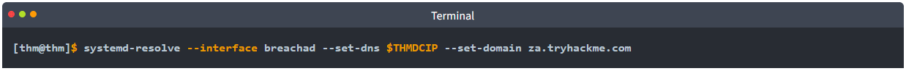

Remember to replace $THMDCIP with the IP of THMDC in your network diagram. You can test that DNS is working by running:

`nslookup thmdc.za.tryhackme.com`

This should resolve to the IP of your DC.

**Note: DNS may be reset on the AttackBox roughly every 3 hours. If this occurs, you will have to restart the systemd-resolved service. If your AttackBox terminates and you continue with the room at a later stage, you will have to redo all the DNS steps.**

You should also take the time to make note of your VPN IP. Using `ifconfig` or `ip a`, make note of the IP of the **breachad** network adapter. This is your IP and the associated interface that you should use when performing the attacks in the tasks.

**Other Hosts**

If you are going to use your own attack machine, an OpenVPN configuration file will have been generated for you once you join the room. Go to your [access](https://tryhackme.com/access) page. Select 'BreachingAD' from the VPN servers (under the network tab) and download your configuration file.

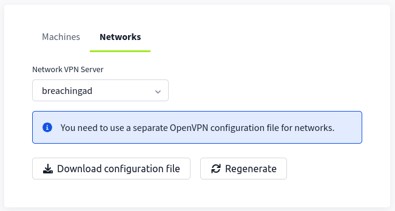

Use an OpenVPN client to connect. This example is shown on a Linux machine; similar guides to connect using Windows or macOS can be found at your [access](https://tryhackme.com/access) page.

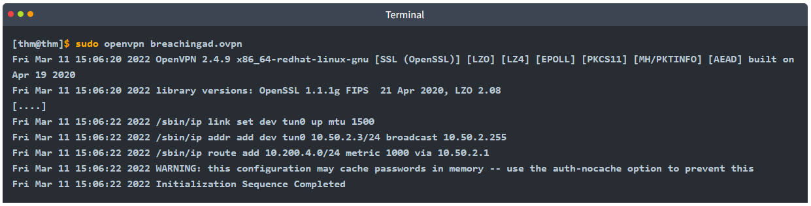

The message "Initialization Sequence Completed" tells you that you are now connected to the network. Return to your access page. You can verify you are connected by looking on your access page. Refresh the page, and you should see a green tick next to Connected. It will also show you your internal IP address.

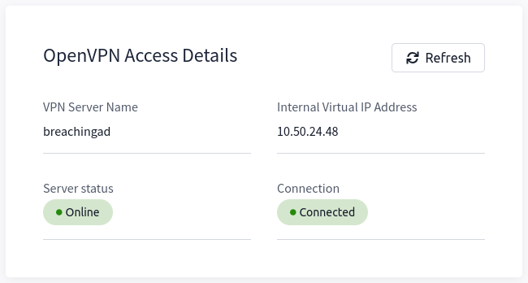

**Note**: You still have to configure DNS similar to what was shown above. It is important to note that although not used, the DC does log DNS requests. If you are using your own machine, these logs may include the hostname of your device. For example, if you run the VPN on your kali machine with the hostname of kali, this will be logged.

**Kali**

If you are using a Kali VM, Network Manager is most likely used as DNS manager. You can use GUI Menu to configure DNS:

* Network Manager -> Advanced Network Configuration -> Your Connection -> IPv4 Settings
* Set your DNS IP here to the IP for THMDC in the network diagram above
* Add another DNS such as 1.1.1.1 or similar to ensure you still have internet access
* Run sudo systemctl restart NetworkManager and test your DNS similar to the steps above.

### Debugging DNS

DNS will be a part of Active Directory testing whether you like it or not. This is because one of the two major AD authentication protocols, Kerberos, relies on DNS to create tickets. Tickets cannot be associated with IPs, so DNS is a must. If you are going to test AD networks on a security assessment, you will have to equip yourself with the skills required to solve DNS issues. Therefore, you usually have two options:

* You can hardcode DNS entries into your `/etc/hosts` file. While this may work well, it is infeasible when you will be testing networks that have more than 10000 hosts.
* You can spend the time required to debug the DNS issue to get it working. While this may be harder, in the long run, it will yield you better results.

Whenever one of the tasks within this room is not working for you, your first thought should be: _Is my DNS working?_  From experience, I, the creator of this network, can tell you that I've wasted countless hours on assessments wondering why my tooling is not working, only to realise that my DNS has changed.

Whenever you think that your DNS configuration might not be working as it should, follow these steps to do some debugging:

1. Follow the steps provided above. Make sure to follow the steps for your specific machine type.- If you use a completely different OS, you will have to do some googling to find your equivalent configuration.
2. Run `ping <THM DC IP>` - This will verify that the network is active. If you do not get a response from the ping, it means that the network is not currently active. If your network says that it is running after you have refreshed the room page and you still get no ping response, contact THM support but simply waiting for the network timer to run out before starting the network again will fix the issue.
3. Run `nslookup tryhackme.com <THM DC IP>` - This will verify that the DNS server within the network is active, as the domain controller has this functional role. If the ping command worked but this does not, time to contact support since there is something wrong. It is also suggested to hit the network reset button.
4. Finally, run `nslookup tryhackme.com` - If you now get a different response than the one in step three, it means there is something wrong with your DNS configuration. Go back to the configuration steps at the start of the task and follow them again. A common issue seen on Kali is that the DNS entry is placed as the second one in your `/etc/resolv.conf` file. By making it the first entry, it will resolve the issue.

These AD networks are rated medium, which means if you just joined THM, this is probably not where you should start your learning journey. AD is massive and you will need to apply the mindset of _figuring stuff out_ if you want to make a _success_ of testing it. However, if all of the above still fails, please be as descriptive as possible on what you are trying to do when you contact support, to allow them to help you as efficiently as possible.

### Answer the questions below

* I have completed the AD basics room and am ready to learn about AD breaching techniques.

* I have connected to the network and configured DNS.

## Task 2 - OSINT and Phishing

Two popular methods for gaining access to that first set of AD credentials is Open Source Intelligence (OSINT) and Phishing. We will only briefly mention the two methods here, as they are already covered more in-depth in other rooms.

### OSINT


OSINT is used to discover information that has been publicly disclosed. In terms of AD credentials, this can happen for several reasons, such as:

* Users who ask questions on public forums such as [Stack Overflow](https://stackoverflow.com/) but disclose sensitive information such as their credentials in the question.
* Developers that upload scripts to services such as [Github](https://github.com/) with credentials hardcoded.
* Credentials being disclosed in past breaches since employees used their work accounts to sign up for other external websites. Websites such as [HaveIBeenPwned](https://haveibeenpwned.com/) and [DeHashed](https://www.dehashed.com/) provide excellent platforms to determine if someone's information, such as work email, was ever involved in a publicly known data breach.

By using OSINT techniques, it may be possible to recover publicly disclosed credentials. If we are lucky enough to find credentials, we will still need to find a way to test whether they are valid or not since OSINT information can be outdated. In Task 3, we will talk about NTLM Authenticated Services, which may provide an excellent avenue to test credentials to see if they are still valid.

A detailed room on Red Team OSINT can be found [here](https://tryhackme.com/jr/redteamrecon).

### Phishing


Phishing is another excellent method to breach AD. Phishing usually entices users to either provide their credentials on a malicious web page or ask them to run a specific application that would install a Remote Access Trojan (RAT) in the background. This is a prevalent method since the RAT would execute in the user's context, immediately allowing you to impersonate that user's AD account. This is why phishing is such a big topic for both Red and Blue teams.

A detailed room on phishing can be found [here](https://tryhackme.com/module/phishing).

### Answer the questions below

* I understand OSINT and how it can be used to breach AD

* I understand Phishing and how it can be used to breach AD

* What popular website can be used to verify if your email address or password has ever been exposed in a publicly disclosed data breach?

    `HaveIBeenPwned `

## Task 3 - NTLM Authenticated Services

### NTLM and NetNTLM

New Technology LAN Manager (NTLM) is the suite of security protocols used to authenticate users' identities in AD. NTLM can be used for authentication by using a challenge-response-based scheme called NetNTLM. This authentication mechanism is heavily used by the services on a network. However, services that use NetNTLM can also be exposed to the internet. The following are some of the popular examples:

* Internally-hosted Exchange (Mail) servers that expose an Outlook Web App (OWA) login portal.
* Remote Desktop Protocol (RDP) service of a server being exposed to the internet.
* Exposed VPN endpoints that were integrated with AD.
* Web applications that are internet-facing and make use of NetNTLM.

NetNTLM, also often referred to as Windows Authentication or just NTLM Authentication, allows the application to play the role of a middle man between the client and AD. All authentication material is forwarded to a Domain Controller in the form of a challenge, and if completed successfully, the application will authenticate the user.

This means that the application is authenticating on behalf of the user and not authenticating the user directly on the application itself. This prevents the application from storing AD credentials, which should only be stored on a Domain Controller. This process is shown in the diagram below:


### Brute-force Login Attacks

As mentioned in Task 2, these exposed services provide an excellent location to test credentials discovered using other means. However, these services can also be used directly in an attempt to recover an initial set of valid AD credentials. We could perhaps try to use these for brute force attacks if we recovered information such as valid email addresses during our initial red team recon.

Since most AD environments have account lockout configured, we won't be able to run a full brute-force attack. Instead, we need to perform a password spraying attack. Instead of trying multiple different passwords, which may trigger the account lockout mechanism, we choose and use one password and attempt to authenticate with all the usernames we have acquired. However, it should be noted that these types of attacks can be detected due to the amount of failed authentication attempts they will generate.

You have been provided with a list of usernames discovered during a red team OSINT exercise. The OSINT exercise also indicated the organisation's initial onboarding password, which seems to be "Changeme123". Although users should always change their initial password, we know that users often forget. We will be using a custom-developed script to stage a password spraying against the web application hosted at this URL: http://ntlmauth.za.tryhackme.com.

Navigating to the URL, we can see that it prompts us for Windows Authentication credentials:

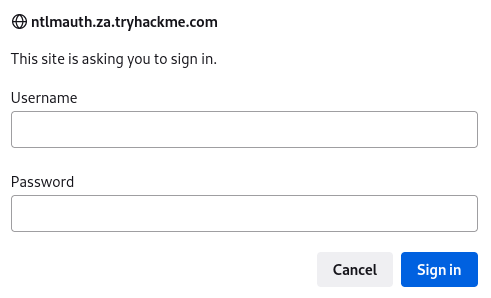

**Note**: Firefox's Windows Authentication plugin is incredibly prone to failure. If you want to test credentials manually, Chrome is recommended.

We could use tools such as [Hydra](https://github.com/vanhauser-thc/thc-hydra) to assist with the password spraying attack. However, it is often better to script up these types of attacks yourself, which allows you more control over the process. A base python script has been provided in the task files that can be used for the password spraying attack. The following function is the main component of the script:

```
def password_spray(self, password, url):
    print ("[*] Starting passwords spray attack using the following password: " + password)
    #Reset valid credential counter
    count = 0
    #Iterate through all of the possible usernames
    for user in self.users:
        #Make a request to the website and attempt Windows Authentication
        response = requests.get(url, auth=HttpNtlmAuth(self.fqdn + "\\" + user, password))
        #Read status code of response to determine if authentication was successful
        if (response.status_code == self.HTTP_AUTH_SUCCEED_CODE):
            print ("[+] Valid credential pair found! Username: " + user + " Password: " + password)
            count += 1
            continue
        if (self.verbose):
            if (response.status_code == self.HTTP_AUTH_FAILED_CODE):
                print ("[-] Failed login with Username: " + user)
    print ("[*] Password spray attack completed, " + str(count) + " valid credential pairs found")
```

This function takes our suggested password and the URL that we are targeting as input and attempts to authenticate to the URL with each username in the textfile. By monitoring the differences in HTTP response codes from the application, we can determine if the credential pair is valid or not. If the credential pair is valid, the application would respond with a 200 HTTP (OK) code. If the pair is invalid, the application will return a 401 HTTP (Unauthorised) code.

### Password Spraying

If you are using the AttackBox, the password spraying script and usernames textfile is provided under the `/root/Rooms/BreachingAD/task3/` directory. We can run the script using the following command:

```
python ntlm_passwordspray.py -u <userfile> -f <fqdn> -p <password> -a <attackurl>
```

We provide the following values for each of the parameters:

* **<userfile>** - Textfile containing our usernames - _"usernames.txt"_
* **<fqdn>** - Fully qualified domain name associated with the organisation that we are attacking - _"za.tryhackme.com"_
* **<password>** - The password we want to use for our spraying attack - _"Changeme123"_
* **<attackurl>** - The URL of the application that supports Windows Authentication - _"http://ntlmauth.za.tryhackme.com"_

Using these parameters, we should get a few valid credentials pairs from our password spraying attack.

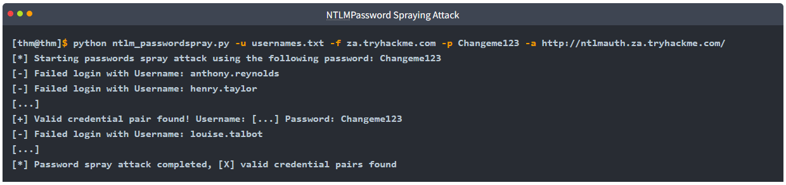

Using a combination of OSINT and NetNTLM password spraying, we now have our first valid credentials pairs that could be used to enumerate AD further!

### Answer the questions below

* What is the name of the challenge-response authentication mechanism that uses NTLM?

    `NetNTLM`

* What is the username of the third valid credential pair found by the password spraying script?

    `gordon.stevens`

    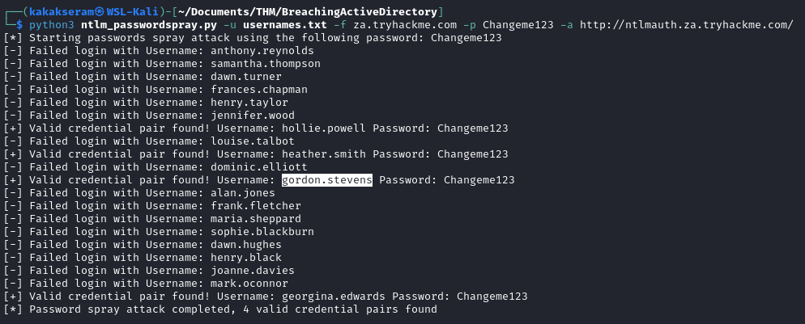

* How many valid credentials pairs were found by the password spraying script?
    
    `4`

* What is the message displayed by the web application when authenticating with a valid credential pair?

    `Hello World`

    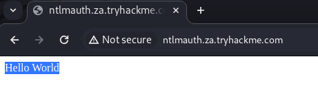

## Task 4 - LDAP Bind Credentials

### LDAP

Another method of AD authentication that applications can use is Lightweight Directory Access Protocol (LDAP) authentication. LDAP authentication is similar to NTLM authentication. However, with LDAP authentication, the application directly verifies the user's credentials. The application has a pair of AD credentials that it can use first to query LDAP and then verify the AD user's credentials.

LDAP authentication is a popular mechanism with third-party (non-Microsoft) applications that integrate with AD. These include applications and systems such as:

* Gitlab
* Jenkins
* Custom-developed web applications
* Printers
* VPNs

If any of these applications or services are exposed on the internet, the same type of attacks as those leveraged against NTLM authenticated systems can be used. However, since a service using LDAP authentication requires a set of AD credentials, it opens up additional attack avenues. In essence, we can attempt to recover the AD credentials used by the service to gain authenticated access to AD. The process of authentication through LDAP is shown below:


If you could gain a foothold on the correct host, such as a Gitlab server, it might be as simple as reading the configuration files to recover these AD credentials. These credentials are often stored in plain text in configuration files since the security model relies on keeping the location and storage configuration file secure rather than its contents. Configuration files are covered in more depth in Task 7.

### LDAP Pass-back Attacks

However, one other very interesting attack can be performed against LDAP authentication mechanisms, called an LDAP Pass-back attack. This is a common attack against network devices, such as printers, when you have gained initial access to the internal network, such as plugging in a rogue device in a boardroom.

LDAP Pass-back attacks can be performed when we gain access to a device's configuration where the LDAP parameters are specified. This can be, for example, the web interface of a network printer. Usually, the credentials for these interfaces are kept to the default ones, such as `admin:admin` or `admin:password`. Here, we won't be able to directly extract the LDAP credentials since the password is usually hidden. However, we can alter the LDAP configuration, such as the IP or hostname of the LDAP server. In an LDAP Pass-back attack, we can modify this IP to our IP and then test the LDAP configuration, which will force the device to attempt LDAP authentication to our rogue device. We can intercept this authentication attempt to recover the LDAP credentials.

### Performing an LDAP Pass-back

There is a network printer in this network where the administration website does not even require credentials. Navigate to http://printer.za.tryhackme.com/settings.aspx to find the settings page of the printer:

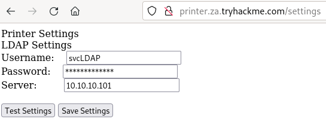

Using browser inspection, we can also verify that the printer website was at least secure enough to not just send the LDAP password back to the browser:

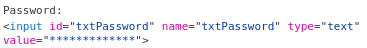

So we have the username, but not the password. However, when we press test settings, we can see that an authentication request is made to the domain controller to test the LDAP credentials. Let's try to exploit this to get the printer to connect to us instead, which would disclose the credentials. To do this, let's use a simple Netcat listener to test if we can get the printer to connect to us. Since the default port of LDAP is 389, we can use the following command:

```
nc -lvp 389
```

Note that if you use the AttackBox, the you should first disable slapd using `service slapd stop`. Then, we can alter the Server input box on the web application to point to our IP and press Test Settings.

**Your IP will be your VPN IP and will either be a 10.50.x.x IP or 10.51.x.x IP.  You can use `ip a` to list all interfaces. Please make sure to use this as your IP, otherwise you will not receive a connection back. Please also make note of the interface for this IP, since you will need it later in the task.**

You should see that we get a connection back, but there is a slight problem:

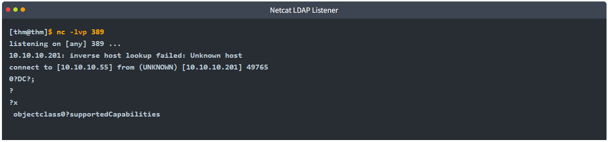

You may require more than one try to receive a connection back but it should respond within 5 seconds. The `supportedCapabilities` response tells us we have a problem. Essentially, before the printer sends over the credentials, it is trying to negotiate the LDAP authentication method details. It will use this negotiation to select the most secure authentication method that both the printer and the LDAP server support. If the authentication method is too secure, the credentials will not be transmitted in cleartext. With some authentication methods, the credentials will not be transmitted over the network at all! So we can't just use normal Netcat to harvest the credentials. We will need to create a rogue LDAP server and configure it insecurely to ensure the credentials are sent in plaintext.

### Hosting a Rogue LDAP Server

There are several ways to host a rogue LDAP server, but we will use OpenLDAP for this example. If you are using the AttackBox, OpenLDAP has already been installed for you. However, if you are using your own attack machine, you will need to install OpenLDAP using the following command:

```
sudo apt-get update && sudo apt-get -y install slapd ldap-utils && sudo systemctl enable slapd
```

You will however have to configure your own rogue LDAP server on the AttackBox as well. We will start by reconfiguring the LDAP server using the following command:

```
sudo dpkg-reconfigure -p low slapd
```

Make sure to press <No> when requested if you want to skip server configuration:

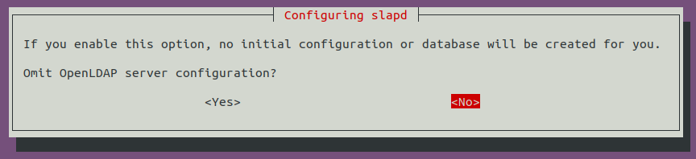

For the DNS domain name, you want to provide our target domain, which is `za.tryhackme.com`:

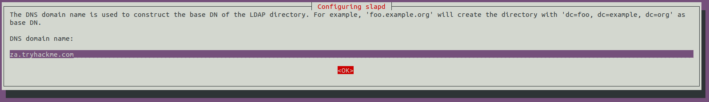

Use this same name for the Organisation name as well:

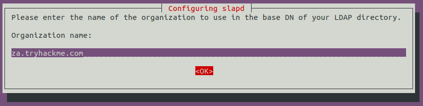

Provide any Administrator password:

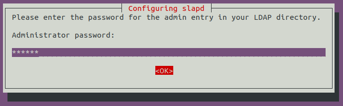

Select MDB as the LDAP database to use:


For the last two options, ensure the database is not removed when purged:

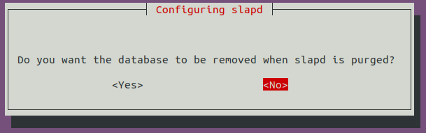

Move old database files before a new one is created:

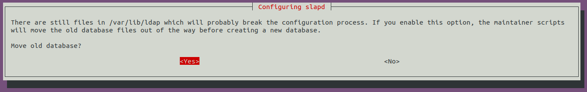

Before using the rogue LDAP server, we need to make it vulnerable by downgrading the supported authentication mechanisms. We want to ensure that our LDAP server only supports PLAIN and LOGIN authentication methods. To do this, we need to create a new ldif file, called with the following content:

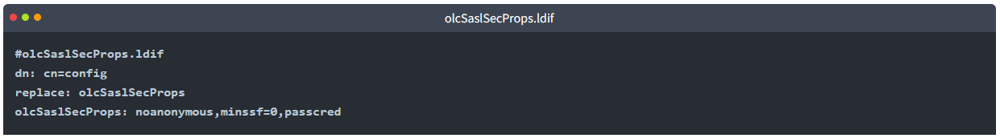

The file has the following properties:

* **olcSaslSecProps**: Specifies the SASL security properties
* **noanonymous**: Disables mechanisms that support anonymous login
* **minssf**: Specifies the minimum acceptable security strength with 0, meaning no protection.

Now we can use the ldif file to patch our LDAP server using the following:

```
sudo ldapmodify -Y EXTERNAL -H ldapi:// -f ./olcSaslSecProps.ldif && sudo service slapd restart
```

We can verify that our rogue LDAP server's configuration has been applied using the following command (**Note**: If you are using Kali, you may not receive any output, however the configuration should have worked and you can continue with the next steps):

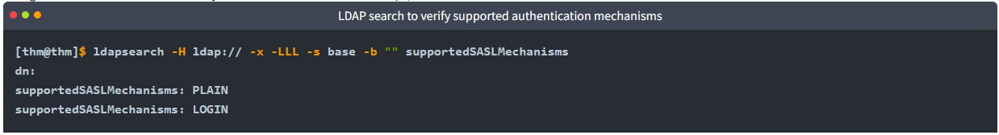

### Capturing LDAP Credentials

Our rogue LDAP server has now been configured. When we click the "Test Settings" at http://printer.za.tryhackme.com/settings.aspx, the authentication will occur in clear text. If you configured your rogue LDAP server correctly and it is downgrading the communication, you will receive the following error: "This distinguished name contains invalid syntax". If you receive this error, you can use a tcpdump to capture the credentials using the following command:

```
[thm@thm]$ sudo tcpdump -SX -i breachad tcp port 389
tcpdump: verbose output suppressed, use -v[v]... for full protocol decode
listening on eth1, link-type EN10MB (Ethernet), snapshot length 262144 bytes
10:41:52.979933 IP 10.10.10.201.49834 > 10.10.10.57.ldap: Flags [P.], seq 4245946075:4245946151, ack 1113052386, win 8212, length 76
	0x0000:  4500 0074 b08c 4000 8006 20e2 0a0a 0ac9  E..t..@.........
	0x0010:  0a0a 0a39 c2aa 0185 fd13 fedb 4257 d4e2  ...9........BW..
	0x0020:  5018 2014 1382 0000 3084 0000 0046 0201  P.......0....F..
	0x0030:  0263 8400 0000 3d04 000a 0100 0a01 0002  .c....=.........
	0x0040:  0100 0201 7801 0100 870b 6f62 6a65 6374  ....x.....object
	0x0050:  636c 6173 7330 8400 0000 1904 1773 7570  class0.......sup
	0x0060:  706f 7274 6564 5341 534c 4d65 6368 616e  portedSASLMechan
	0x0070:  6973 6d73                                isms
10:41:52.979938 IP 10.10.10.57.ldap > 10.10.10.201.49834: Flags [.], ack 4245946151, win 502, length 0
	0x0000:  4500 0028 247d 4000 4006 ed3d 0a0a 0a39  E..($}@.@..=...9
	0x0010:  0a0a 0ac9 0185 c2aa 4257 d4e2 fd13 ff27  ........BW.....'
	0x0020:  5010 01f6 2930 0000                      P...)0..
10:41:52.980162 IP 10.10.10.57.ldap > 10.10.10.201.49834: Flags [P.], seq 1113052386:1113052440, ack 4245946151, win 502, length 54
	0x0000:  4500 005e 247e 4000 4006 ed06 0a0a 0a39  E..^$~@.@......9
	0x0010:  0a0a 0ac9 0185 c2aa 4257 d4e2 fd13 ff27  ........BW.....'
	0x0020:  5018 01f6 2966 0000 3034 0201 0264 2f04  P...)f..04...d/.
	0x0030:  0030 2b30 2904 1773 7570 706f 7274 6564  .0+0)..supported
	0x0040:  5341 534c 4d65 6368 616e 6973 6d73 310e  SASLMechanisms1.
	0x0050:  0405 504c 4149 4e04 054c 4f47 494e       ..PLAIN..LOGIN
[....]
10:41:52.987145 IP 10.10.10.201.49835 > 10.10.10.57.ldap: Flags [.], ack 3088612909, win 8212, length 0
	0x0000:  4500 0028 b092 4000 8006 2128 0a0a 0ac9  E..(..@...!(....
	0x0010:  0a0a 0a39 c2ab 0185 8b05 d64a b818 7e2d  ...9.......J..~-
	0x0020:  5010 2014 0ae4 0000 0000 0000 0000       P.............
10:41:52.989165 IP 10.10.10.201.49835 > 10.10.10.57.ldap: Flags [P.], seq 2332415562:2332415627, ack 3088612909, win 8212, length 65
	0x0000:  4500 0069 b093 4000 8006 20e6 0a0a 0ac9  E..i..@.........
	0x0010:  0a0a 0a39 c2ab 0185 8b05 d64a b818 7e2d  ...9.......J..~-
	0x0020:  5018 2014 3afe 0000 3084 0000 003b 0201  P...:...0....;..
	0x0030:  0560 8400 0000 3202 0102 0418 7a61 2e74  .`....2.....za.t
	0x0040:  7279 6861 636b 6d65 2e63 6f6d 5c73 7663  ryhackme.com\svc
	0x0050:  4c44 4150 8013 7472 7968 6163 6b6d 656c  LDAP..password11
```

Also, note that `password11` is an example. The password for your service will be different. You may have to press the "Test Settings" button a couple of times before the TCPdump will return data since we are performing the attack over a VPN connection.

Now we have another set of valid AD credentials! By using an LDAP pass-back attack and downgrading the supported authentication mechanism, we could intercept the credentials in cleartext.

### Answer the questions below

* What type of attack can be performed against LDAP Authentication systems not commonly found against Windows Authentication systems?
    
    `LDAP Pass-back Attacks`

* What two authentication mechanisms do we allow on our rogue LDAP server to downgrade the authentication and make it clear text?

    `LOGIN,PLAIN`

* What is the password associated with the svcLDAP account?

    `tryhackmeldappass1@`

    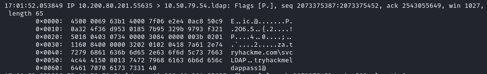

## Task 5 - Authentication Relays

Continuing with attacks that can be staged from our rogue device, we will now look at attacks against broader network authentication protocols. In Windows networks, there are a significant amount of services talking to each other, allowing users to make use of the services provided by the network.

These services have to use built-in authentication methods to verify the identity of incoming connections. In Task 2, we explored NTLM Authentication used on a web application. In this task, we will dive a bit deeper to look at how this authentication looks from the network's perspective. However, for this task, we will focus on NetNTLM authentication used by SMB.

### Server Message Block

The Server Message Block (SMB) protocol allows clients (like workstations) to communicate with a server (like a file share). In networks that use Microsoft AD, SMB governs everything from inter-network file-sharing to remote administration. Even the "out of paper" alert your computer receives when you try to print a document is the work of the SMB protocol.

However, the security of earlier versions of the SMB protocol was deemed insufficient. Several vulnerabilities and exploits were discovered that could be leveraged to recover credentials or even gain code execution on devices. Although some of these vulnerabilities were resolved in newer versions of the protocol, often organisations do not enforce the use of more recent versions since legacy systems do not support them. We will be looking at two different exploits for NetNTLM authentication with SMB:

* Since the NTLM Challenges can be intercepted, we can use offline cracking techniques to recover the password associated with the NTLM Challenge. However, this cracking process is significantly slower than cracking NTLM hashes directly.
* We can use our rogue device to stage a man in the middle attack, relaying the SMB authentication between the client and server, which will provide us with an active authenticated session and access to the target server. 

### LLMNR, NBT-NS, and WPAD

In this task, we will take a bit of a look at the authentication that occurs during the use of SMB. We will use Responder to attempt to intercept the NetNTLM challenge to crack it. There are usually a lot of these challenges flying around on the network. Some security solutions even perform a sweep of entire IP ranges to recover information from hosts. Sometimes due to stale DNS records, these authentication challenges can end up hitting your rogue device instead of the intended host.

Responder allows us to perform Man-in-the-Middle attacks by poisoning the responses during NetNTLM authentication, tricking the client into talking to you instead of the actual server they wanted to connect to. On a real LAN, Responder will attempt to poison any  Link-Local Multicast Name Resolution (LLMNR),  NetBIOS Name Service (NBT-NS), and Web Proxy Auto-Discovery (WPAD) requests that are detected. On large Windows networks, these protocols allow hosts to perform their own local DNS resolution for all hosts on the same local network. Rather than overburdening network resources such as the DNS servers, hosts can first attempt to determine if the host they are looking for is on the same local network by sending out LLMNR requests and seeing if any hosts respond. The NBT-NS is the precursor protocol to LLMNR, and WPAD requests are made to try and find a proxy for future HTTP(s) connections.

Since these protocols rely on requests broadcasted on the local network, our rogue device would also receive these requests. Usually, these requests would simply be dropped since they were not meant for our host. However, Responder will actively listen to the requests and send poisoned responses telling the requesting host that our IP is associated with the requested hostname. By poisoning these requests, Responder attempts to force the client to connect to our AttackBox. In the same line, it starts to host several servers such as SMB, HTTP, SQL, and others to capture these requests and force authentication.

### Intercepting NetNTLM Challenge

One thing to note is that Responder essentially tries to win the race condition by poisoning the connections to ensure that you intercept the connection. This means that Responder is usually limited to poisoning authentication challenges on the local network. Since we are connected via a VPN to the network, we will only be able to poison authentication challenges that occur on this VPN network. For this reason, we have simulated an authentication request that can be poisoned that runs every 30 minutes. This means that you may have to wait a bit before you can intercept the NetNTLM challenge and response.

Although Responder would be able to intercept and poison more authentication requests when executed from our rogue device connected to the LAN of an organisation, it is crucial to understand that this behaviour can be disruptive and thus detected. By poisoning authentication requests, normal network authentication attempts would fail, meaning users and services would not connect to the hosts and shares they intend to. Do keep this in mind when using Responder on a security assessment.

Responder has already been installed on the AttackBox. However, if you are not using the AttackBox, you can download and install it from this repo:  https://github.com/lgandx/Responder. We will set Responder to run on the interface connected to the VPN:

`sudo responder -I breachad`

If you are using the AttackBox not all of the Responder services will be able to start since other services are already using those ports. However, this will not impact this task. Responder will now listen for any LLMNR, NBT-NS, or WPAD requests that are coming in. We would leave Responder to run for a bit on a real LAN. However, in our case, we have to simulate this poisoning by having one of the servers attempt to authenticate to machines on the VPN. Leave Responder running for a bit (average 10 minutes, get some fresh air!), and you should receive an SMBv2 connection which Responder can use to entice and extract an NTLMv2-SSP response. It will look something like this:

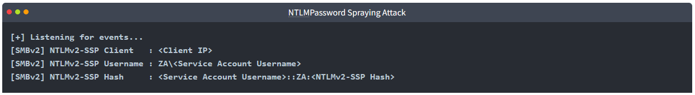

If we were using our rogue device, we would probably run Responder for quite some time, capturing several responses. Once we have a couple, we can start to perform some offline cracking of the responses in the hopes of recovering their associated NTLM passwords. If the accounts have weak passwords configured, we have a good chance of successfully cracking them. Copy the NTLMv2-SSP Hash to a textfile. We will then use the password list provided in the downloadable files for this task and Hashcat in an attempt to crack the hash using the following command:

`hashcat -m 5600 <hash file> <password file> --force`

The password file has been provided for you on the AttackBox in the `/root/Rooms/BreachingAD/task5/` directory or as a downloadable task file. We use hashtype 5600, which corresponds with NTLMv2-SSP for hashcat. If you use your own machine, you will have to install [Hashcat](https://hashcat.net/hashcat/) first.

Any hashes that we can crack will now provide us with AD credentials for our breach!

### Relaying the Challenge

In some instances, however, we can take this a step further by trying to relay the challenge instead of just capturing it directly. This is a little bit more difficult to do without prior knowledge of the accounts since this attack depends on the permissions of the associated account. We need a couple of things to play in our favour:

* SMB Signing should either be disabled or enabled but not enforced. When we perform a relay, we make minor changes to the request to pass it along. If SMB signing is enabled, we won't be able to forge the message signature, meaning the server would reject it.
* The associated account needs the relevant permissions on the server to access the requested resources. Ideally, we are looking to relay the challenge and response of an account with administrative privileges over the server, as this would allow us to gain a foothold on the host.
* Since we technically don't yet have an AD foothold, some guesswork is involved into what accounts will have permissions on which hosts. If we had already breached AD, we could perform some initial enumeration first, which is usually the case.

This is why blind relays are not usually popular. Ideally, you would first breach AD using another method and then perform enumeration to determine the privileges associated with the account you have compromised. From here, you can usually perform lateral movement for privilege escalation across the domain. However, it is still good to fundamentally under how a relay attack works, as shown in the diagram below:


If you want to try this type of attack in action, head over to the [Holo Network](https://tryhackme.com/jr/hololive). We will also come back to this one in future AD Rooms.

### Answer the questions below

* What is the name of the tool we can use to poison and capture authentication requests on the network?

    `Responder`

* What is the username associated with the challenge that was captured?

    `svcFileCopy`

    ```
    sudo responder -I breachad
    ```

    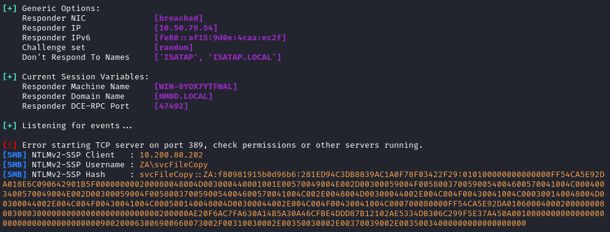

* What is the value of the cracked password associated with the challenge that was captured?

    `FPassword1!`

    ```
    hashcat -m 5600 hashfile /root/Rooms/BreachingAD/task5/passwordlist.txt --force
    ```

    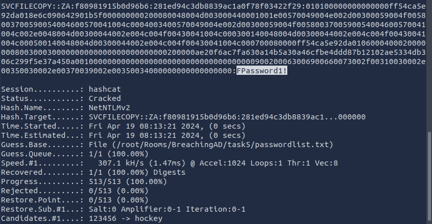

## Task 6 - Microsoft Deployment Toolkit

Large organisations need tools to deploy and manage the infrastructure of the estate. In massive organisations, you can't have your IT personnel using DVDs or even USB Flash drives running around installing software on every single machine. Luckily, Microsoft already provides the tools required to manage the estate. However, we can exploit misconfigurations in these tools to also breach AD.

### MDT and SCCM

Microsoft Deployment Toolkit (MDT) is a Microsoft service that assists with automating the deployment of Microsoft Operating Systems (OS). Large organisations use services such as MDT to help deploy new images in their estate more efficiently since the base images can be maintained and updated in a central location.

Usually, MDT is integrated with Microsoft's System Center Configuration Manager (SCCM), which manages all updates for all Microsoft applications, services, and operating systems. MDT is used for new deployments. Essentially it allows the IT team to preconfigure and manage boot images. Hence, if they need to configure a new machine, they just need to plug in a network cable, and everything happens automatically. They can make various changes to the boot image, such as already installing default software like Office365 and the organisation's anti-virus of choice. It can also ensure that the new build is updated the first time the installation runs.

SCCM can be seen as almost an expansion and the big brother to MDT. What happens to the software after it is installed? Well, SCCM does this type of patch management. It allows the IT team to review available updates to all software installed across the estate. The team can also test these patches in a sandbox environment to ensure they are stable before centrally deploying them to all domain-joined machines. It makes the life of the IT team significantly easier.

However, anything that provides central management of infrastructure such as MDT and SCCM can also be targetted by attackers in an attempt to take over large portions of critical functions in the estate. Although MDT can be configured in various ways, for this task, we will focus exclusively on a configuration called Preboot Execution Environment (PXE) boot.

### PXE Boot

Large organisations use PXE boot to allow new devices that are connected to the network to load and install the OS directly over a network connection. MDT can be used to create, manage, and host PXE boot images. PXE boot is usually integrated with DHCP, which means that if DHCP assigns an IP lease, the host is allowed to request the PXE boot image and start the network OS installation process. The communication flow is shown in the diagram below:


Once the process is performed, the client will use a TFTP connection to download the PXE boot image. We can exploit the PXE boot image for two different purposes:

* Inject a privilege escalation vector, such as a Local Administrator account, to gain Administrative access to the OS once the PXE boot has been completed.
* Perform password scraping attacks to recover AD credentials used during the install.

In this task, we will focus on the latter. We will attempt to recover the deployment service account associated with the MDT service during installation for this password scraping attack. Furthermore, there is also the possibility of retrieving other AD accounts used for the unattended installation of applications and services.

### PXE Boot Image Retrieval

Since DHCP is a bit finicky, we will bypass the initial steps of this attack. We will skip the part where we attempt to request an IP and the PXE boot preconfigure details from DHCP. We will perform the rest of the attack from this step in the process manually.

The first piece of information regarding the PXE Boot preconfigure you would have received via DHCP is the IP of the MDT server. In our case, you can recover that information from the TryHackMe network diagram.

The second piece of information you would have received was the names of the BCD files. These files store the information relevant to PXE Boots for the different types of architecture. To retrieve this information, you will need to connect to this website: http://pxeboot.za.tryhackme.com. It will list various BCD files:

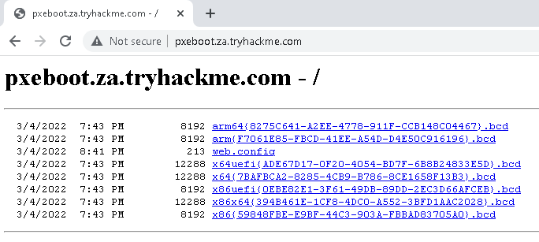

Usually, you would use TFTP to request each of these BCD files and enumerate the configuration for all of them. However, in the interest of time, we will focus on the BCD file of the **x64** architecture. Copy and store the full name of this file. For the rest of this exercise, we will be using this name placeholder `x64{7B...B3}.bcd` since the files and their names are regenerated by MDT every day. Each time you see this placeholder, remember to replace it with your specific BCD filename. **Note as well that if the network has just started, these file names will only update after 10 mintes of the network being active.**

With this initial information now recovered from DHCP (wink wink), we can enumerate and retrieve the PXE Boot image. We will be using our SSH connection on THMJMP1 for the next couple of steps, so please authenticate to this SSH session using the following:

`ssh thm@THMJMP1.za.tryhackme.com`

and the password of `Password1@`.

To ensure that all users of the network can use SSH, start by creating a folder with your username and copying the powerpxe repo into this folder:


The first step we need to perform is using TFTP and downloading our BCD file to read the configuration of the MDT server. TFTP is a bit trickier than FTP since we can't list files. Instead, we send a file request, and the server will connect back to us via UDP to transfer the file. Hence, we need to be accurate when specifying files and file paths. The BCD files are always located in the /Tmp/ directory on the MDT server. We can initiate the TFTP transfer using the following command in our SSH session:

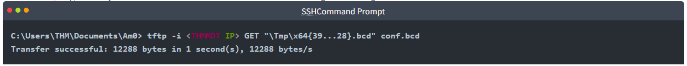

You will have to lookup THMMDT IP with `nslookup thmmdt.za.tryhackme.com`. With the BCD file now recovered, we will be using [powerpxe](https://github.com/wavestone-cdt/powerpxe) to read its contents. Powerpxe is a PowerShell script that automatically performs this type of attack but usually with varying results, so it is better to perform a manual approach. We will use the Get-WimFile function of powerpxe to recover the locations of the PXE Boot images from the BCD file:

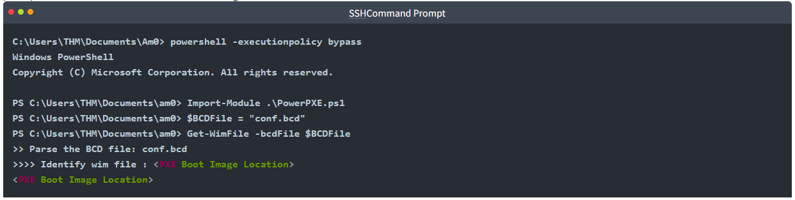

WIM files are bootable images in the Windows Imaging Format (WIM). Now that we have the location of the PXE Boot image, we can again use TFTP to download this image:

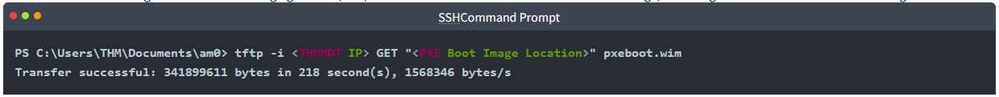

This download will take a while since you are downloading a fully bootable and configured Windows image. Maybe stretch your legs and grab a glass of water while you wait.

### Recovering Credentials from a PXE Boot Image

Now that we have recovered the PXE Boot image, we can exfiltrate stored credentials. It should be noted that there are various attacks that we could stage. We could inject a local administrator user, so we have admin access as soon as the image boots, we could install the image to have a domain-joined machine. If you are interested in learning more about these attacks, you can read this [article](https://www.riskinsight-wavestone.com/en/2020/01/taking-over-windows-workstations-pxe-laps/). This exercise will focus on a simple attack of just attempting to exfiltrate credentials.

Again we will use powerpxe to recover the credentials, but you could also do this step manually by extracting the image and looking for the bootstrap.ini file, where these types of credentials are often stored. To use powerpxe to recover the credentials from the bootstrap file, run the following command:
SSH Command Prompt

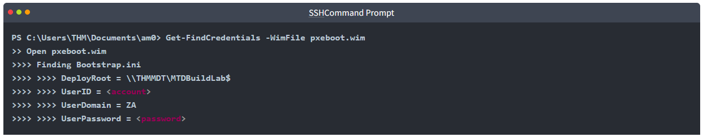

As you can see, powerpxe was able to recover the AD credentials. We now have another set of AD credentials that we can use!

### Answer the questions below

* What Microsoft tool is used to create and host PXE Boot images in organisations?

    `Microsoft Deployment Toolkit`

* What network protocol is used for recovery of files from the MDT server?

    `tftp`

* What is the username associated with the account that was stored in the PXE Boot image?

    `svcMDT`

    * Download BCD file and run powershell

        ```
        tftp -i 10.200.80.202 GET "\Tmp\x64{DB84A6D2-E6DF-499B-A4C7-6FFE2CC8E1BF}.bcd" conf.bcd
        powershell -executionpolicy bypass
        ```
        
        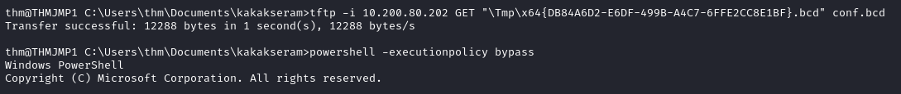

    * Read the BCD file using Power PXE

        ```
        Import-Module .\PowerPXE.ps1
        $BCDFile = "conf.bcd"
        Get-WimFile -bcdFile $BCDFile
        ```

        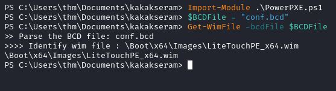

    * Download WIM File

        ```
        tftp -i 10.200.80.202 GET "\Boot\x64\Images\LiteTouchPE_x64.wim" pxeboot.wim
        ```

        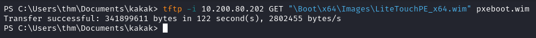

    * Get the Credential

        ```
        Get-FindCredentials -WimFile pxeboot.wim
        ```

        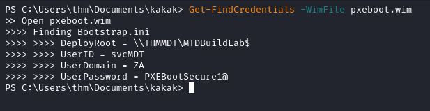

* What is the password associated with the account that was stored in the PXE Boot image?

    `PXEBootSecure1@`

* While you should make sure to cleanup you user directory that you created at the start of the task, if you try you will notice that you get an access denied error. Don't worry, a script will help with the cleanup process but remember when you are doing assessments to always perform cleanup.

## Task 7 - Configuration Files

The last enumeration avenue we will explore in this network is configuration files. Suppose you were lucky enough to cause a breach that gave you access to a host on the organisation's network. In that case, configuration files are an excellent avenue to explore in an attempt to recover AD credentials. Depending on the host that was breached, various configuration files may be of value for enumeration: 

* Web application config files
* Service configuration files
* Registry keys
* Centrally deployed applications

Several enumeration scripts, such as [Seatbelt](https://github.com/GhostPack/Seatbelt), can be used to automate this process.

### Configuration File Credentials

However, we will focus on recovering credentials from a centrally deployed application in this task. Usually, these applications need a method to authenticate to the domain during both the installation and execution phases. An example of such as application is McAfee Enterprise Endpoint Security, which organisations can use as the endpoint detection and response tool for security.

McAfee embeds the credentials used during installation to connect back to the orchestrator in a file called ma.db. This database file can be retrieved and read with local access to the host to recover the associated AD service account. We will be using the SSH access on THMJMP1 again for this exercise.

The ma.db file is stored in a fixed location:

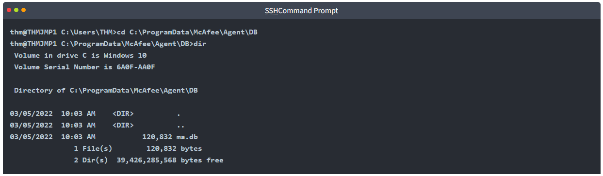

We can use SCP to copy the ma.db to our AttackBox:

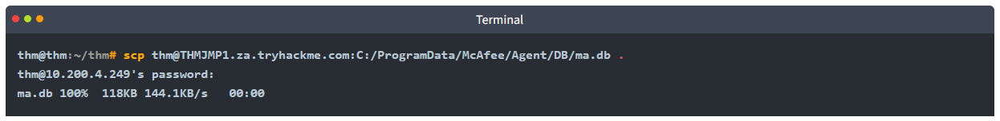

To read the database file, we will use a tool called sqlitebrowser. We can open the database using the following command:

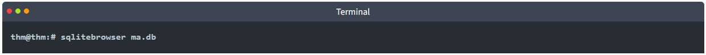

Using sqlitebrowser, we will select the Browse Data option and focus on the AGENT_REPOSITORIES table:

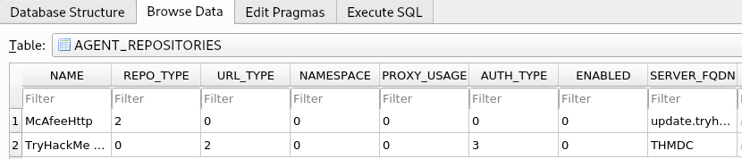

We are particularly interested in the second entry focusing on the DOMAIN, AUTH_USER, and AUTH_PASSWD field entries. Make a note of the values stored in these entries. However, the AUTH_PASSWD field is encrypted. Luckily, McAfee encrypts this field with a known key. Therefore, we will use the following old python2 script to decrypt the password. The script has been provided as a downloadable task file or on the AttackBox, it can be found in the `/root/Rooms/BreachingAD/task7/` directory.

**Note: The tool we will use here is quite old. It uses Python v2 and relies on an old crypto library. If you cannot get the script to work on your own VM, please make use of the AttackBox. However, there has been a recent update to the application to ensure that it works on Python3 as well, you can download the latest version here: https://github.com/funoverip/mcafee-sitelist-pwd-decryption**

You will have to unzip the mcafee-sitelist-pwd-decryption.zip file:

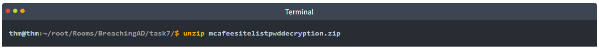

By providing the script with our base64 encoded and encrypted password, the script will provide the decrypted password:

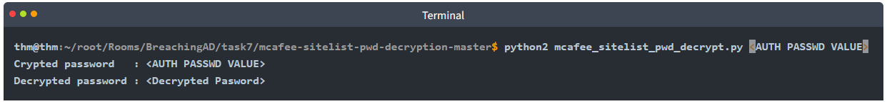

We now once again have a set of AD credentials that we can use for further enumeration! This is just one example of recovering credentials from configuration files. If you are ever able to gain a foothold on a host, make sure to follow a detailed and refined methodology to ensure that you recover all loot from the host, including credentials and other sensitive information that can be stored in configuration files.

### Answer the questions below

* What type of files often contain stored credentials on hosts?

    `Configuration File`

* What is the name of the McAfee database that stores configuration including credentials used to connect to the orchestrator?

    `ma.db`

* What table in this database stores the credentials of the orchestrator?

    `AGENT_REPOSITORIES`

* What is the username of the AD account associated with the McAfee service?

    `svcAV`

* What is the password of the AD account associated with the McAfee service?

    `MyStrongPassword!`

    * Download file "ma.db"
        
        

    * Read the database

        ```
        sqlitebrowser ma.db
        ```

        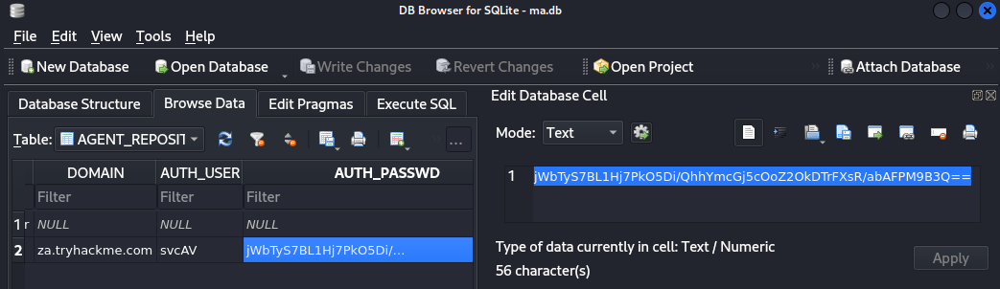

    * Decrypt the AUTH_PASSWD

        ```
        ./mcafee_sitelist_pwd_decrypt.py jWbTyS7BL1Hj7PkO5Di/QhhYmcGj5cOoZ2OkDTrFXsR/abAFPM9B3Q==
        ```

        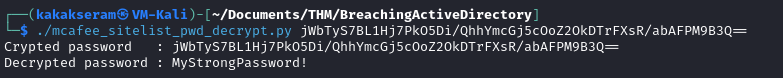

## Task 8 - Conclusion

A significant amount of attack avenues can be followed to breach AD. We covered some of those commonly seen being used during a red team exercise in this network. Due to the sheer size of the attack surface, new avenues to recover that first set of AD credentials are constantly being discovered. Building a proper enumeration methodology and continuously updating it will be required to find that initial pair of credentials.

### Mitigations

In terms of mitigations, there are some steps that organisations can take:

* User awareness and training - The weakest link in the cybersecurity chain is almost always users. Training users and making them aware that they should be careful about disclosing sensitive information such as credentials and not trust suspicious emails reduces this attack surface.
* Limit the exposure of AD services and applications online - Not all applications must be accessible from the internet, especially those that support NTLM and LDAP authentication. Instead, these applications should be placed in an intranet that can be accessed through a VPN. The VPN can then support multi-factor authentication for added security.
* Enforce Network Access Control (NAC) - NAC can prevent attackers from connecting rogue devices on the network. However, it will require quite a bit of effort since legitimate devices will have to be allowlisted.
* Enforce SMB Signing - By enforcing SMB signing, SMB relay attacks are not possible.
* Follow the principle of least privileges - In most cases, an attacker will be able to recover a set of AD credentials. By following the principle of least privilege, especially for credentials used for services, the risk associated with these credentials being compromised can be significantly reduced.

Now that we have breached AD, the next step is to perform enumeration of AD to gain a better understanding of the domain structure and identify potential misconfigurations that can be exploited. This will be covered in the next room. Remember to clear the DNS configuration!

### Answer the questions below

* I understand how configuration changes can help prevent AD breaches.