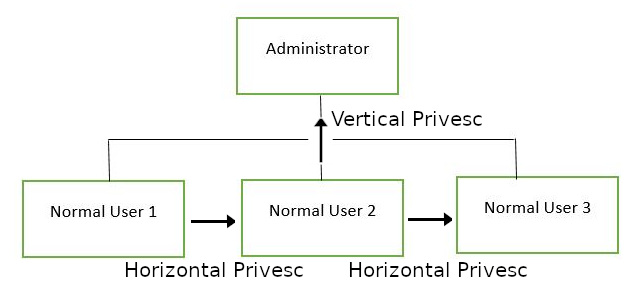

# [Common Linux Privesc](https://tryhackme.com/room/commonlinuxprivesc)

## Task 1 - Get Connected

This room will explore common Linux Privilege Escalation vulnerabilities and techniques, but in order to do that, we'll need to do a few things first!

1. Deploy the machine
2. Connect to the TryHackMe OpenVPN Server (See https://tryhackme.com/access for help!) or deploy the AttackBox

### Answer the questions below

Deploy the machine 

## Task 2 - Understanding Privesc

**What does "privilege escalation" mean?**

At it's core, Privilege Escalation usually involves going from a lower permission to a higher permission. More technically, it's the exploitation of a vulnerability, design flaw or configuration oversight in an operating system or application to gain unauthorized access to resources that are usually restricted from the users.

**Why is it important?**

Rarely when doing a CTF or real-world penetration test, will you be able to gain a foothold (initial access) that affords you administrator access. Privilege escalation is crucial, because it lets you gain system administrator levels of access. This allow you to do many things, including:

* Reset passwords
* Bypass access controls to compromise protected data
* Edit software configurations
* Enable persistence, so you can access the machine again later.
* Change privilege of users
* Get that cheeky root flag ;)

As well as any other administrator or super user commands that you desire.

### Answer the questions below

Read the information about privilege escalation

## Task 3 - Direction of Privilege Escalation

Privilege Tree:

There are two main privilege escalation variants:

Horizontal privilege escalation: This is where you expand your reach over the compromised system by taking over a different user who is on the same privilege level as you. For instance, a normal user hijacking another normal user (rather than elevating to super user). This allows you to inherit whatever files and access that user has. This can be used, for example, to gain access to another normal privilege user, that happens to have an SUID file attached to their home directory (more on these later) which can then be used to get super user access. [Travel sideways on the tree]

Vertical privilege escalation (privilege elevation): This is where you attempt to gain higher privileges or access, with an existing account that you have already compromised. For local privilege escalation attacks this might mean hijacking an account with administrator privileges or root privileges. [Travel up on the tree]

### Answer the questions below

Understand the difference between Horizontal and Vertical privilege escalation.

## Task 4 - Enumeration

## Task 5 - Abusing SUID/GUID Files

## Task 6 - Exploiting Writeable /etc/passwd

## Task 7 - Escaping Vi Editor

## Task 8 - Exploiting Crontab

## Task 9 - Exploiting PATH Variable

## Task 10 - Expanding Your Knowledge 

**Further Learning**

There is never a "magic" answer in the huge area that is Linux Privilege Escalation. This is simply a few examples of basic things to watch out for when trying to escalate privileges.The only way to get better at it, is to practice and build up experience. Checklists are a good way to make sure you haven't missed anything during your enumeration stage, and also to provide you with a resource to check how to do things if you forget exactly what commands to use.

Below is a list of good checklists to apply to CTF or penetration test use cases.Although I encourage you to make your own using CherryTree or whatever notes application you prefer.

* https://github.com/netbiosX/Checklists/blob/master/Linux-Privilege-Escalation.md
* https://github.com/swisskyrepo/PayloadsAllTheThings/blob/master/Methodology%20and%20Resources/Linux%20-%20Privilege%20Escalation.md
* https://sushant747.gitbooks.io/total-oscp-guide/privilege_escalation_-_linux.html
* https://payatu.com/guide-linux-privilege-escalation

Thank you

Thanks for taking the time to work through this room, I wish you the best of luck in future.

~ Polo

### Answer the questions below

Well done, you did it!