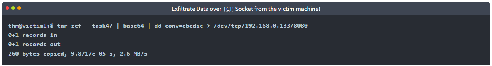
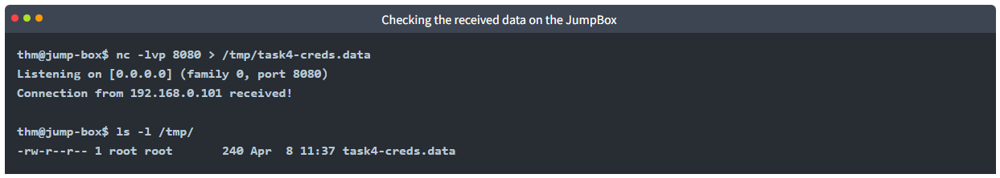

# [Data Exfiltration](https://tryhackme.com/r/room/dataxexfilt)

[DataExfiltration](./images/DataExfiltration.png)

An introduction to Data Exfiltration and Tunneling techniques over various protocols.

## Task 1 - Introduction

### Welcome to Data Exfiltration

Cybercriminals use various internet attacks against companies for different purposes. In most cases, many of these attacks end in data breaches, where threat actors steal sensitive data to sell it on the dark web or publish it online.

Someone may ask: how does a threat actor transfer stolen data from a company's network to the outside, also known as a data breach, without being detected? The answer varies. There are many techniques that a threat actor can perform, including data exfiltration. 

Data exfiltration is a non-traditional approach for copying and transferring data from a compromised to an attacker's machine. The data exfiltration technique is used to emulate the normal network activities, and It relies on network protocols such as DNS, HTTP, SSH, etc. Data Exfiltration over common protocols is challenging to detect and distinguish between legitimate and malicious traffic.

Some protocols are not designed to carry data over them. However, threat actors find ways to abuse these protocols to bypass network-based security products such as a firewall. Using these techniques as a red teamer is essential to avoid being detected.

### Learning Objectives

This room introduces the data exfiltration types and showcases the techniques used to transfer data over various protocols.

* What is Data exfiltration?
* Understand data exfiltration types and how they can be used.
* Practice data exfiltration over protocols: Sockets, SSH, ICMP, HTTP(s), and DNS.
* Practice C2 communications over various protocols.
* Practice establishing Tunneling over DNS and HTTP.

### Room Prerequisites

* [Introductory Networking](https://tryhackme.com/room/introtonetworking)
* [Protocols and Servers](https://tryhackme.com/room/protocolsandservers)
* [DNS in Detail](https://tryhackme.com/room/dnsindetail)
* Using tmux or similar tools! (for multiple sessions on single SSH login)

### Answer the questions below

* Read the task above!

## Task 2 - Network Infrastructure

### Network Infrastructure

For this room, we have built a network to simulate practical scenarios where we can perform data exfiltration and tunneling using various network protocols. The provided VM contains two separated networks with multiple clients. We also have a "**JumpBox**" machine that accesses **both networks**. The following diagram shows more information about the network environment used in this room.

Use the network diagram for your reference during the coming tasks for various protocols. We also set up a domain name, `thm.com`, to make it easier to communicate and connect within the network environment. Check the following table for more information about the domain names and network access used in this room.

|Domain Name|IP Address|Network Access|
|-----------|----------|--------------|
|jump.thm.com|192.168.0.133|Net 1 and Net 2|
|uploader.thm.com|172.20.0.100|Net 1|
|flag.thm.com|***.**.*.***|Net 1|
|victim2.thm.com|172.20.0.101|Net 1|
|web.thm.com|192.168.0.100|Net 2|
|icmp.thm.com|192.168.0.121|Net 2|
|victim1.thm.com|192.168.0.101|Net 2|

### Deploy the VM!

Deploy the provided VM and connect to it via an SSH client by deploying the AttackBox or connecting to the VPN. Use the following credentials to connect to the Jumpbox machine with access to the internal networks.

|Machine IP: MACHINE_IP|Username: thm|Password: tryhackme|

Once you are connected to the **Jumpbox** machine, you have access to both networks. Check the network infrastructure for more information.

### Lab Recommendation

* We recommend using the **JumpBox** and the network environment for most tasks (TCP, SSH, ICMP, DNS) to avoid technical issues with DNS and networking. However, If you prefer to use the AttackBox for the DNS Tunneling task (task 10), you must change the DNS settings of the AttackBox to MACHINE_IP. For more information about changing the DNS for AttackBox, check the DNS configuration (Task 8).
* In most cases, we need to use two machines to establish communication. Thus, we need two or more Linux terminals available to complete the task. Therefore, we recommend using the tmux tool for creating multiple sessions over a single SSH login.

### Answer the questions below

* Once you've deployed the VM, please wait a few minutes for the VM and the networks to start, then progress to the next task!

## Task 3 - Data Exfiltration

### What is Data Exfiltration

Data Exfiltration is the process of taking an unauthorized copy of sensitive data and moving it from the inside of an organization's network to the outside. It is important to note that Data Exfiltration is a post-compromised process where a threat actor has already gained access to a network and performed various activities to get hands on sensitive data. Data Exfiltration often happens at the last stage of the Cyber Kill Chain model, Actions on Objectives.

Data exfiltration is also used to hide an adversary's malicious activities and bypass security products. For example, the DNS exfiltration technique can evade security products, such as a firewall.

Sensitive data can be in various types and forms, and it may contain the following:

* Usernames and passwords or any authentication information.
* Bank accounts details
* Business strategic decisions.
* Cryptographic keys.
* Employee and personnel information.
* Project code data.

### How to use Data Exfiltration

There are three primary use case scenarios of data exfiltration, including:

1. Exfiltrate data
2. Command and control communications.
3. Tunneling

#### Traditional Data Exfiltration

The traditional Data Exfiltration scenario is moving sensitive data out of the organization's network. An attacker can make one or more network requests to transfer the data, depending on the data size and the protocol used. Note that a threat actor does not care about the reply or response to his request. Thus, all traffic will be in one direction, from inside the network to outside. Once the data is stored on the attacker's server, he logs into it and grabs the data.

#### C2 Communications

Many C2 frameworks provide options to establish a communication channel, including standard and non-traditional protocols to send commands and receive responses from a victim machine. In C2 communications a limited number of requests where an attacker sends a request to execute a command in the victim's machine. Then, the agent's client executes the command and sends a reply with the result over a non-traditional protocol. The communications will go in two directions: into and out of the network.

### Tunneling

In the Tunneling scenario, an attacker uses this data exfiltration technique to establish a communication channel between a victim and an attacker's machine. The communication channel acts as a bridge to let the attacker machine access the entire internal network. There will be continuous traffic sent and received while establishing the connection.

In the coming tasks, we will discuss the following techniques and use cases:

* Exfiltrate using TCP socket and Base64
* Exfiltrate using SSH
* Exfiltrate using HTTPS (POST request)
* ICMP
* DNS

### Answer the questions below

* In which case scenario will sending and receiving traffic continue during the connection?

* In which case scenario will sending and receiving traffic be in one direction?

* In the next task, we will be discussing how data exfiltration over the TCP socket works!

## Task 4 - Exfiltration using TCP socket

This task shows how to exfiltrate data over TCP using data encoding. Using the TCP socket is one of the data exfiltration techniques that an attacker may use in a non-secured environment where they know there are no network-based security products. If we are in a well-secured environment, then this kind of exfiltration is not recommended. This exfiltration type is easy to detect because we rely on non-standard protocols.

Besides the TCP socket, we will also use various other techniques, including data encoding and archiving. One of the benefits of this technique is that it encodes the data during transmission and makes it harder to examine.

The following diagram explains how traditional communications over TCP work. If two machines want to communicate, then one of them has to listen and wait for the incoming traffic. It is similar to how two people talk and communicate, where one of them is listening, and the other person is speaking. 

The diagram shows that two hosts communicate over TCP on port 1337 in the following steps:

1. The first machine is listening over TCP on port **1337**
2. The other machine connects to the port specified in step 1. For example, **nc 1.2.3.4 1337**
3. The first machine establishes the connection
4. Finally, the sending and receiving data starts. For example, the attacker sends commands and receives results.

Communication over TCP requires two machines, one victim and one attacker machine, to transfer data. Let's use our network environment to practice sending data over TCP. To establish communication over TCP, we require two machines: the `victim1.thm.com` machine is the victim and the JumpBox, `jump.thm.com`, is the attacker's machine.

First, we need to prepare a listener on the **JumpBox** on a port you specify. In our case, we choose port `8080`.

From the previous command, we used the `nc` command to receive data on port `8080`. Then, once we receive the data, we store it in the `/tmp/` directory and call it `task4-creds.data` as a filename.

Now let's connect to our victim machine that contains the data that needs to be transmitted using the following credential: `thm:tryhackme`. Note that to connect to the `victim1` from the JumpBox, we can use the internal domain name as follows,

We can also connect directly from the AttackBox using port `2022` as follows,

We have the required data ready to be transmitted on the victim machine. In this case, we have a sample file with a couple of credentials.

Now that we have the credential text file, we will use the TCP socket to exfiltrate it. **Make sure the listener is running on the JumpBox.**

Let's break down the previous command and explain it:

1. We used the `tar` command to create an archive file with the `zcf` arguments of the content of the secret directory.
2. The `z` is for using gzip to compress the selected folder, the `c` is for creating a new archive, and the `f` is for using an archive file.
3. We then passed the created tar file to the base64 command for converting it to base64 representation.
4. Then, we passed the result of the base64 command to create and copy a backup file with the `dd` command using EBCDIC encoding data.
5. Finally, we redirect the `dd` command's output to transfer it using the TCP socket on the specified IP and port, which in this case, port `8080`.

Note that we used the Base64 and EBCDIC encoding to protect the data during the exfiltration. If someone inspects the traffic, it would be in a non-human readable format and wouldn't reveal the transmitted file type.

Once we hit enter, we should receive the encoded data in the `/tmp/` directory.

On the JumpBox, we need to convert the received data back to its original status. We will be using the `dd` tool to convert it back. 

The following is the explanation of the previous command:

1. We used the `dd` command to convert the received file to `ASCII`  representation. We used the `task4-creds.data` as input to the `dd` command. 
2. The output of the `dd` command will be passed to the base64 to decode it using the `-d` argument.
3. Finally, we save the output in the `task4-creds.tar`  file.

Next, we need to use the `tar` command to unarchive the `task4-creds.tar` file and check the content as follows,

Let's break down the previous command and explain it:

1. We used the `tar` command to unarchive the file with the `xvf` arguments.
2. The `x` is for extracting the tar file, the `v` for verbosely listing files, and the `f` is for using an archive file.

Now let's confirm that we have the same data from the victim machine.

Success! We exfiltrated data from a victim machine to an attacker machine using the TCP socket in this task.

### Answer the questions below

* Exfiltration using TCP sockets relies on ____________ protocols! 

* Now apply what we discussed to exfiltrate data over the TCP socket! Once you exfiltrate data successfully, hit **Completed** to move on to the next task!

## Task 5 - Exfiltration using SSH

## Task 6 - Exfiltrate using HTTP(S)

## Task 7 - Exfiltration using ICMP

## Task 8 - DNS Configurations

## Task 9 - Exfiltration over DNS

## Task 10 - DNS Tunneling

## Task 11 - Conclusion