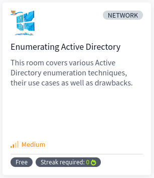

# [Enumerating Active Directory](https://tryhackme.com/r/room/adenumeration)

## Task 1 - Why AD Enumeration

## Task 2 - Credential Injection

## Task 3 - Enumeration through Microsoft Management Console

## Task 4 - Enumeration through Command Prompt

## Task 5 - Enumeration through PowerShell

## Task 6 - Enumeration through Bloodhound

## Task 7 - Conclusion
