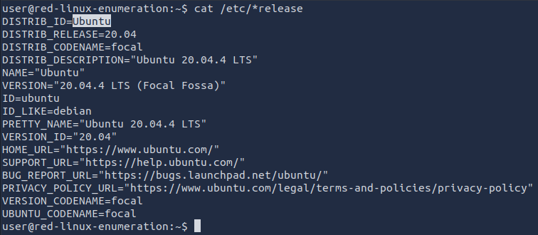
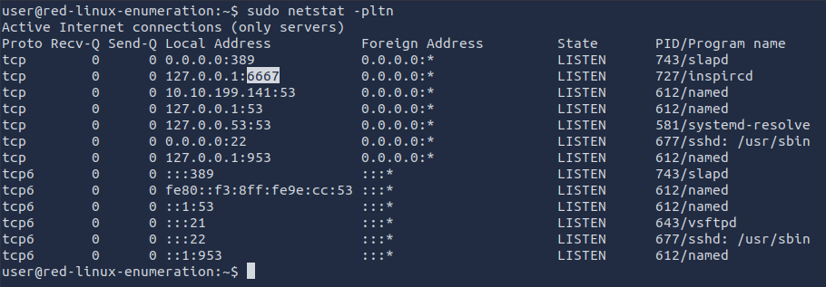
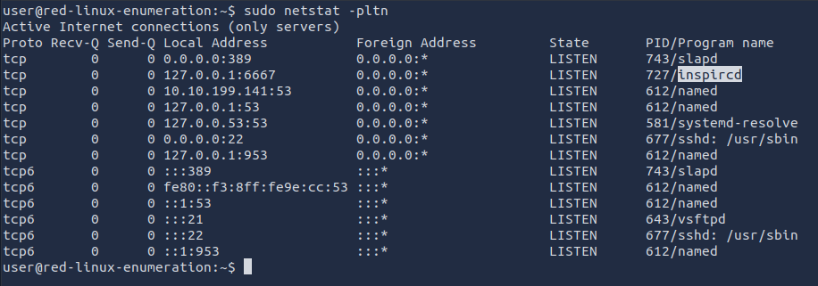

# Enumeration

This room is an introduction to enumeration when approaching an unknown corporate environment.


## Task 1 - Introduction

This room focuses on post-exploitation enumeration. In other words, we assume that we have successfully gained some form of access to a system. Moreover, we may have carried out privilege escalation; in other words, we might have administrator or root privileges on the target system. Some of the techniques and tools discussed in this room would still provide helpful output even with an unprivileged account, i.e., not root or administrator.

If you are interested in privilege escalation, you can check the [Windows Privilege Escalation](https://tryhackme.com/room/windowsprivesc20) room and the [Linux PrivEsc](https://tryhackme.com/room/linprivesc) room. Moreover, there are two handy scripts, [WinPEAS](https://github.com/carlospolop/PEASS-ng/tree/master/winPEAS) and [LinPEAS](https://grimbins.github.io/grimbins/linpeas/) for MS Windows and Linux privilege escalation respectively.

Our purpose is to collect more information that will aid us in gaining more access to the target network. For example, we might find the login credentials to grant access to another system. We focus on tools commonly available on standard systems to collect more information about the target. Being part of the system, such tools look innocuous and cause the least amount of "noise".

We assume you have access to a command-line interface on the target, such as `bash` on a Linux system or `cmd.exe` on an MS Windows system. Starting with one type of shell on a Linux system, it is usually easy to switch to another one. Similarly, starting from `cmd.exe`, you can switch to PowerShell if available. We just issued the command `powershell.exe` to start the PowerShell interactive command line in the terminal below.


This room is organized as follows:

* Purpose of enumeration
* Linux enumeration with commonly-installed tools: System, users, networking, and running services
* MS Windows enumeration with built-in tools: System, users, networking, and running services
* Examples of additional tools: Seatbelt

Although it is not strictly necessary, we advise completing [The Lay of the Land](https://tryhackme.com/room/thelayoftheland) room before going through this one.

### Answer the questions below

* What command would you use to start the PowerShell interactive command line?

	**Answer : powershell.exe**

## Task 2 - Purpose


When you gain a “shell” on the target system, you usually have very basic knowledge of the system. If it is a server, you already know which service you have exploited; however, you don’t necessarily know other details, such as usernames or network shares. Consequently, the shell will look like a “dark room” where you have an incomplete and vague knowledge of what’s around you. In this sense, enumeration helps you build a more complete and accurate picture.

The purpose behind post-exploitation enumeration is to gather as much information about the system and its network. The exploited system might be a company desktop/laptop or a server. We aim to collect the information that would allow us to pivot to other systems on the network or to loot the current system. Some of the information we are interested in gathering include:

* Users and groups
* Hostnames
* Routing tables
* Network shares
* Network services
* Applications and banners
* Firewall configurations
* Service settings and audit configurations
* SNMP and DNS details
* Hunting for credentials (saved on web browsers or client applications)

There is no way to list everything we might stumble upon. For instance, we might find SSH keys that might grant us access to other systems. In SSH key-based authentication, we generate an SSH key pair (public and private keys); the public key is installed on a server. Consequently, the server would trust any system that can prove knowledge of the related private key.

Furthermore, we might stumble upon sensitive data saved among the user’s documents or desktop directories. Think that someone might keep a `passwords.txt` or `passwords.xlsx` instead of a proper password manager. Source code might also contain keys and passwords left lurking around, especially if the source code is not intended to be made public.

### Answer the questions below

* In SSH key-based authentication, which key does the client need?

	**Answer : private key**

## Task 3 - Linux Enumeration


This task focuses on enumerating a Linux machine after accessing a shell, such as `bash`. Although some commands provide information on more than one area, we tried to group the commands into four categories depending on the information we expect to acquire.

* System
* Users
* Networking
* Running Services

We recommend that you click "**Start AttackBox**" and "**Start Machine**" so that you can experiment and answer the questions at the end of this task.

### System

On a Linux system, we can get more information about the Linux distribution and release version by searching for files or links that end with `-release` in `/etc/`. Running ls `/etc/*-release` helps us find such files. Let’s see what things look like on a CentOS Linux.


Let’s try on a Fedora system.


We can find the system’s name using the command `hostname`.


Various files on a system can provide plenty of useful information. In particular, consider the following `/etc/passwd`, `/etc/group`, and `/etc/shadow`. Any user can read the files `passwd` and `group`. However, the `shadow` password file requires root privileges as it contains the hashed passwords. If you manage to break the hashes, you will know the user’s original password.


Similarly, various directories can reveal information about users and might contain sensitive files; one is the mail directories found at `/var/mail/`.


To find the installed applications you can consider listing the files in `/usr/bin/` and `/sbin/`:

* ls -lh /usr/bin/
* ls -lh /sbin/

On an RPM-based Linux system, you can get a list of all installed packages using `rpm -qa`. The `-qa` indicates that we want to query all packages.

On a Debian-based Linux system, you can get the list of installed packages using `dpkg -l`. The output below is obtained from an Ubuntu server.


### Users

Files such as `/etc/passwd` reveal the usernames; however, various commands can provide more information and insights about other users on the system and their whereabouts.

You can show who is logged in using `who`.


We can see that the user `root` is logged in to the system directly, while the users `jane` and `peter` are connected over the network, and we can see their IP addresses.

Note that `who` should not be confused with `whoami` which prints **your** effective user id.


To take things to the next level, you can use `w`, which shows who is logged in and what they are doing. Based on the terminal output below, `peter` is editing `notes.txt` and `jane` is the one running `w` in this example.


To print the real and effective user and group IDS, you can issue the command `id` (for ID).


Do you want to know who has been using the system recently? `last` displays a listing of the last logged-in users; moreover, we can see who logged out and how much they stayed connected. In the output below, the user `randa` remained logged in for almost 17 hours, while the user `michael` logged out after four minutes.


Finally, it is worth mentioning that `sudo -l` lists the allowed command for the invoking user on the current system.

### Networking

The IP addresses can be shown using `ip address show` (which can be shortened to `ip a s`) or with the older command `ifconfig -a` (its package is no longer maintained.) The terminal output below shows the network interface `ens33` with the IP address `10.20.30.129` and subnet mask `255.255.255.0` as it is `24`.


The DNS servers can be found in the `/etc/resolv.conf`. Consider the following terminal output for a system that uses DHCP for its network configurations. The DNS, i.e. nameserver, is set to `10.20.30.2`.


`netstat` is a useful command for learning about network connections, routing tables, and interface statistics. We explain some of its many options in the table below.

|Option|Description|
|------|-----------|
|`-a`|show both listening and non-listening sockets|
|`-l`|show only listening sockets|
|`-n`|show numeric output instead of resolving the IP address and port number|
|`-t`|TCP|
|`-u`|UDP|
|`-x`|UNIX|
|`-p`|Show the PID and name of the program to which the socket belongs|

You can use any combination that suits your needs. For instance, `netstat -plt` will return Programs Listening on TCP sockets. As we can see in the terminal output below, `sshd` is listening on the SSH port, while `master` is listening on the SMTP port on both IPv4 and IPv6 addresses. Note that to get all PID (process ID) and program names, you need to run `netstat` as root or use `sudo netstat`.


`netstat -atupn` will show All TCP and UDP listening and established connections and the program names with addresses and ports in numeric format.


One might think that using `nmap` before gaining access to the target machine would have provided a comparable result. However, this is not entirely true. Nmap needs to generate a relatively large number of packets to check for open ports, which can trigger intrusion detection and prevention systems. Furthermore, firewalls across the route can drop certain packets and hinder the scan, resulting in incomplete Nmap results.

`lsof` stands for List Open Files. If we want to display only Internet and network connections, we can use `lsof -i`. The terminal output below shows IPv4 and IPv6 listening services and ongoing connections. The user `peter` is connected to the server `rpm-red-enum.thm` on the `ssh` port. Note that to get the complete list of matching programs, you need to run `lsof` as root or use `sudo lsof`.


Because the list can get quite lengthy, you can further filter the output by specifying the ports you are interested in, such as SMTP port 25. By running `lsof -i :25`, we limit the output to those related to port 25, as shown in the terminal output below. The server is listening on port 25 on both IPv4 and IPv6 addresses.


### Running Services

Getting a snapshot of the running processes can provide many insights. `ps` lets you discover the running processes and plenty of information about them.

You can list every process on the system using `ps -e`, where `-e` selects all processes. For more information about the process, you can add `-f` for full-format and `-l` for long format. Experiment with `ps -e`, `ps -ef`, and `ps -el`.

You can get comparable output and see all the processes using BSD syntax: `ps ax` or `ps aux`. Note that `a` and `x` are necessary when using BSD syntax as they lift the “only yourself” and “must have a tty” restrictions; in other words, it becomes possible to display all processes. The `u` is for details about the user that has the process.

|Option|Description|
|------|-----------|
|`-e`|all processes|
|`-f`|full-format listing|
|`-j`|jobs format|
|`-l`|long format|
|`-u`|user-oriented format|

For more “visual” output, you can issue `ps axjf` to print a process tree. The `f` stands for “forest”, and it creates an ASCII art process hierarchy as shown in the terminal output below.


To summarize, remember to use `ps -ef` or `ps aux` to get a list of all the running processes. Consider piping the output via `grep` to display output lines with certain words. The terminal output below shows the lines with `peter` in them.


Start the attached Linux machine if you have not done so already, as you need it to answer the questions below. You can log in to it using SSH: `ssh user@MACHINE_IP`, where the login credentials are:

* Username: `user`
* Password: `THM6877`

### Answer the questions below

* What is the name of the Linux distribution used in the VM?
	
	```
	cat /etc/*release
	```

	

	**Answer : Ubuntu**

* What is its version number?

	

	**Answer : 20.04.4**

* What is the name of the user who last logged in to the system?

	```
	last
	```

	

	**Answer : randa**

* What is the highest listening TCP port number?

	```
	sudo netstat -pltn
	```

	

	**Answer : 6667**

* What is the program name of the service listening on it?

	

	**Answer : inspircd**

* There is a script running in the background. Its name starts with `THM`. What is the name of the script?

	```
	ps axjf | grep THM
	```

	

	**Answer : THM-24765.sh**

## Task 4 - Windows Enumeration


In this task, we assume you have access to `cmd` on a Microsoft Windows host. You might have gained this access by exploiting a vulnerability and getting a shell or a reverse shell. You may also have installed a backdoor or set up an SSH server on a system you exploited. In all cases, the commands below require `cmd` to run.

In this task, we focus on enumerating an MS Windows host. For enumerating MS Active directory, you are encouraged to check the [Enumerating Active Directory](https://tryhackme.com/room/adenumeration) room. If you are interested in a privilege escalation on an MS Windows host, we recommend the [Windows Privesc 2.0](https://tryhackme.com/room/windowsprivesc20) room.

We recommend that you click "**Start AttackBox**" and "**Start Machine**" so that you can experiment and answer the questions at the end of this task.

### System

One command that can give us detailed information about the system, such as its build number and installed patches, would be `systeminfo`. In the example below, we can see which hotfixes have been installed.


You can check installed updates using `wmic qfe get Caption,Description`. This information will give you an idea of how quickly systems are being patched and updated.


You can check the installed and started Windows services using `net start`. Expect to get a long list; the output below has been snipped.


If you are only interested in installed apps, you can issue `wmic product get name,version,vendor`. If you run this command on the attached virtual machine, you will get something similar to the following output.


### Users

To know who you are, you can run `whoami`; moreover, to know what you are capable of, i.e., your privileges, you can use `whoami /priv`. An example is shown in the terminal output below.


Moreover, you can use `whoami /groups` to know which groups you belong to. The terminal output below shows that this user belongs to the `NT AUTHORITY\Local account and member of Administrators group` among other groups.


You can view users by running `net user`.


You can discover the available groups using `net group` if the system is a Windows Domain Controller or `net localgroup` otherwise, as shown in the terminal below.


You can list the users that belong to the local administrators’ group using the command `net localgroup administrators`.


Use `net accounts` to see the local settings on a machine; moreover, you can use `net accounts /domain` if the machine belongs to a domain. This command helps learn about password policy, such as minimum password length, maximum password age, and lockout duration.

### Networking

You can use the `ipconfig` command to learn about your system network configuration. If you want to know all network-related settings, you can use `ipconfig /all`. The terminal output below shows the output when using `ipconfig`. For instance, we could have used `ipconfig /all` if we wanted to learn the DNS servers.


On MS Windows, we can use `netstat` to get various information, such as which ports the system is listening on, which connections are active, and who is using them. In this example, we use the options `-a` to display all listening ports and active connections. The `-b` lets us find the binary involved in the connection, while `-n` is used to avoid resolving IP addresses and port numbers. Finally, `-o` display the process ID (PID).

In the partial output shown below, we can see that `netstat -abno` showed that the server is listening on TCP ports 22, 135, 445 and 3389. The processes `sshd.exe`, `RpcSs`, and `TermService` are on ports `22`, `135`, and `3389`, respectively. Moreover, we can see two established connections to the SSH server as indicated by the state `ESTABLISHED`.


You might think that you can get an identical result by port scanning the target system; however, this is inaccurate for two reasons. A firewall might be blocking the scanning host from reaching specific network ports. Moreover, port scanning a system generates a considerable amount of traffic, unlike `netstat`, which makes zero noise.

Finally, it is worth mentioning that using `arp -a` helps you discover other systems on the same LAN that recently communicated with your system. ARP stands for Address Resolution Protocol; `arp -a` shows the current ARP entries, i.e., the physical addresses of the systems on the same LAN that communicated with your system. An example output is shown below. This indicates that these IP addresses have communicated somehow with our system; the communication can be an attempt to connect or even a simple ping. Note that `10.10.255.255` does not represent a system as it is the subnet broadcast address.


Start the attached MS Windows Server if you have not done so already, as you need it to answer the questions below. You can connect to the MS Windows VM via SSH from the AttackBox, for example, using `ssh user@MACHINE_IP` where the login credentials are:

* Username: `user`
* Password: `THM33$$88`

### Answer the questions below

* What is the full OS Name?

* What is the OS Version?

* How many hotfixes are installed on this MS Windows Server?

* What is the lowest TCP port number listening on the system?

* What is the name of the program listening on that port?

## Task 5 - DNS, SMB, and SNMP

As we cover enumeration, it is a good idea to touch on DNS, SMB, and SNMP.

### DNS

We are all familiar with Domain Name System (DNS) queries where we can look up A, AAAA, CName, and TXT records, among others. If you want to brush up on your DNS knowledge, we suggest you visit the [DNS in Detail](https://tryhackme.com/room/dnsindetail) room. If we can get a “copy” of all the records that a DNS server is responsible for answering, we might discover hosts we didn’t know existed.

One easy way to try DNS zone transfer is via the `dig` command. If you want to learn more about `dig` and similar commands, we suggest checking the [Passive Reconnaissance](https://tryhackme.com/room/passiverecon) room. Depending on the DNS server configuration, DNS zone transfer might be restricted. If it is not restricted, it should be achievable using `dig -t AXFR DOMAIN_NAME @DNS_SERVER`. The `-t AXFR` indicates that we are requesting a zone transfer, while `@` precedes the `DNS_SERVER` that we want to query regarding the records related to the specified `DOMAIN_NAME`.

### SMB

Server Message Block (SMB) is a communication protocol that provides shared access to files and printers. We can check shared folders using `net share`. Here is an example of the output. We can see that `C:\Internal Files` is shared under the name Internal.


### SNMP

Simple Network Management Protocol (SNMP) was designed to help collect information about different devices on the network. It lets you know about various network events, from a server with a faulty disk to a printer out of ink. Consequently, SNMP can hold a trove of information for the attacker. One simple tool to query servers related to SNMP is `snmpcheck`. You can find it on the AttackBox at the `/opt/snmpcheck/` directory; the syntax is quite simple: `/opt/snmpcheck/snmpcheck.rb MACHINE_IP -c COMMUNITY_STRING`.

If you would like to install `snmpcheck` on your local Linux box, consider the following commands.


Ensure that you are running the MS Windows Server machine from Task 4 and answer the following questions.

### Answer the questions below

* Knowing that the domain name on the MS Windows Server of `IP MACHINE_IP` is `redteam.thm`, use `dig` to carry out a domain transfer. What is the flag that you get in the records?

* What is the name of the share available over SMB protocol and starts with `THM`?

* Knowing that the community string used by the SNMP service is `public`, use `snmpcheck` to collect information about the MS Windows Server of IP `MACHINE_IP`. What is the location specified?

## Task 6 - More Tools for Windows

In this room, our focus has been on command-line built-in tools readily available on any modern MS Windows system. We didn’t cover Graphical User Interface (GUI) tools; moreover, we didn’t cover any programs requiring additional downloading and installation steps.

This task mentions three options that are not built-in command-line tools:

* Sysinternals Suite
* Process Hacker
* GhostPack Seatbelt
 
### Sysinternals Suite

The [Sysinternals Suite](https://docs.microsoft.com/en-us/sysinternals/downloads/) is a group of command-line and GUI utilities and tools that provides information about various aspects related to the Windows system. To give you an idea, we listed a few examples in the table below.

|Utility Name|Description|
|------------|-----------|
|Process Explorer|Shows the processes along with the open files and registry keys|
|Process Monitor|Monitor the file system, processes, and Registry|
|PsList|Provides information about processes|
|PsLoggedOn|Shows the logged-in users|

Check [Sysinternals Utilities Index](https://docs.microsoft.com/en-us/sysinternals/downloads/) for a complete list of the utilities. If you want to learn more and experiment with these different utilities, we suggest the [Sysinternals](https://tryhackme.com/room/btsysinternalssg) room.

### Process Hacker

Another efficient and reliable MS Windows GUI tool that lets you gather information about running processes is [Process Hacker](https://processhacker.sourceforge.io/). Process Hacker gives you detailed information regarding running processes and related active network connections; moreover, it gives you deep insight into system resource utilization from CPU and memory to disk and network.

### GhostPack Seatbelt

[Seatbelt](https://github.com/GhostPack/Seatbelt), part of the GhostPack collection, is a tool written in C#. It is not officially released in binary form; therefore, you are expected to compile it yourself using MS Visual Studio.

### Answer the questions below

* What utility from Sysinternals Suite shows the logged-in users?

## Task 7 - Conclusion

The focus of this room was on built-in command-line tools in both Linux and MS Windows systems. Many commands exist in both systems, although the command arguments and resulting output are different. The following tables show the primary Linux and MS Windows commands that we relied on to get more information about the system.

|Linux Command|Description|
|-------------|-----------|
|`hostname`|shows the system’s hostname|
|`who`|shows who is logged in|
|`whoami`|shows the effective username|
|`w`|shows who is logged in and what they are doing|
|`last`|shows a listing of the last logged-in users|
|`ip address show`|shows the network interfaces and addresses|
|`arp`|shows the ARP cache|
|`netstat`|prints network connections|
|ps|shows a snapshot of the current processes|

|Windows Command|Description|
|---------------|-----------|
|`systeminfo`|shows OS configuration information, including service pack levels|
|`whoami`|shows the user name and group information along with the respective security identifiers|
|`netstat`|shows protocol statistics and current TCP/IP network connections|
|`net user`|shows the user accounts on the computer|
|`net localgroup`|shows the local groups on the computer|
|`arp`|shows the IP-to-Physical address translation tables|

This room focused on post-exploitation enumeration of a Linux or MS Windows machine. For enumeration related to Active Directory, we recommend that you join the [Enumerating AD](https://tryhackme.com/room/adenumeration) room.

### Answer the questions below

* Congratulations on finishing this room. It is time to continue your journey with the next room in this module.