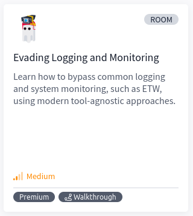
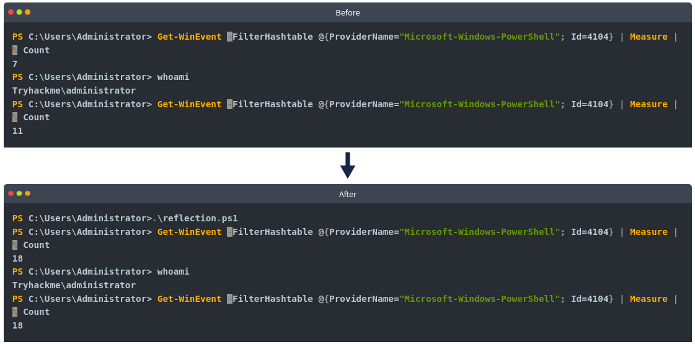
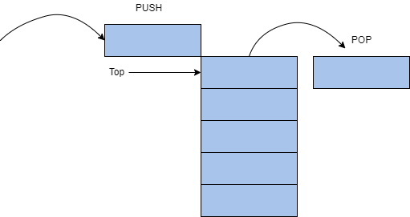
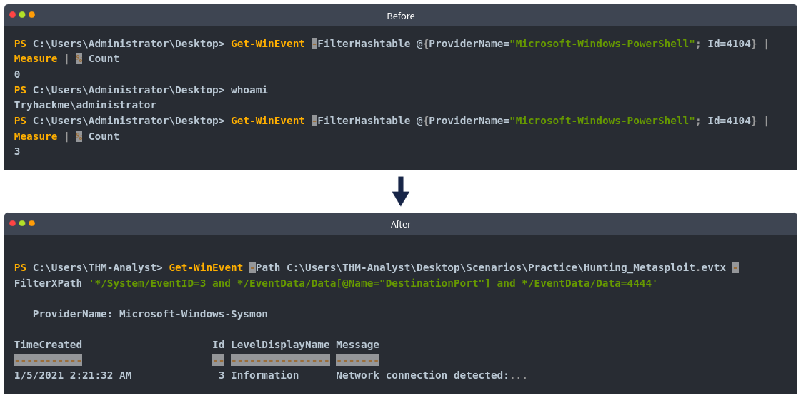

# [Evading Logging and Monitoring](https://tryhackme.com/r/room/monitoringevasion)



Learn how to bypass common logging and system monitoring, such as ETW, using modern tool-agnostic approaches.

## Task 1 - Introduction

One of the largest obstacles in an attacker’s path is logging and monitoring. Unlike anti-virus and **EDR** (Endpoint Detection and Response) solutions, logging creates a physical record of activity that can be analyzed for malicious activity.

How a device is monitored will depend on the environment and preferences of the corporation. Teams may decide not to monitor some devices at all. Generally, a monitoring solution will begin at the host device, collecting application or event logs. Once logs are created, they can be kept on the device or sent to an event collector/forwarder. Once they are off the device, the defense team decides how to aggregate them; this is generally accomplished using an indexer and a **SIEM** (Security Information and Event Manager).


An attacker may not have much control once logs are taken off a device, but can control what is on the device and how it is ingested. The primary target for an attacker is the event logs, managed and controlled by **ETW** (Event Tracing for Windows).

This room will address event tracing and its weaknesses to allow an attacker to evade or disable ETW-based solutions.

### Learning Objectives

1. Understand the technology and implementation of event tracing.
2. Understand how techniques are created to evade ETW.
3. Learn how to apply theoretical evasion concepts to code.

Before beginning this room, familiarize yourself with basic Windows usage and functionality; we recommend completing the [Windows Internals room](https://tryhackme.com/room/windowsinternals). Basic programming knowledge in C and PowerShell is also recommended but not required.

We have provided a base Windows machine with the files needed to complete this room. You can access the machine in-browser or through RDP using the credentials below.

|Machine IP: MACHINE_IP|Username: Administrator|Password: Tryhackme!|

This is going to be a lot of information. Please buckle your seatbelts and locate your nearest fire extinguisher.

### Answer the questions below

* Read the above and continue to the next task.

## Task 2 - Event Tracing

As previously mentioned, almost all event logging capability within Windows is handled from ETW at both the application and kernel level. While there are other services in place like Event Logging and Trace Logging, these are either extensions of ETW or less prevalent to attackers.

|Component|Purpose|
|---------|-------|
|Controllers|Build and configure sessions|
|Providers|Generate events|
|Consumers|Interpret events|

We will cover each component and how it is instrumented in more depth in the next task.

While less important to an attacker than components, event IDs are a core feature of Windows logging. Events are sent and transferred in XML(Extensible Markup Language) format which is the standard for how events are defined and implemented by providers. Below is an example of event ID 4624: _An account was successfully_ logged on.

```
Event ID:4624
Source:Security
Category:Logon/Logoff
Message:An account was successfully logged on.

Subject:
Security ID: NT AUTHORITY\\SYSTEM
Account Name: WORKSTATION123$
...
[ snip ]
...
Logon Type: 7

New Logon:
Security ID: CORPDOMAIN\\john.doe
Account Name: john.doe
...
[ snip ]
...
Process Information:
Process ID: 0x314
```

For more information about event logging, check out the [Windows Event Logs room](https://tryhackme.com/room/windowseventlogs).


At this point, we understand why logging can disrupt an attacker, but how exactly is ETW relevant to an attacker? ETW has visibility over a majority of the operating system, whereas logging generally has limited visibility or detail.

Due to the visibility of ETW, an attacker should always be mindful of the events that could be generated when carrying out their operation. The best approach to taking down ETW is to limit its insight as much as possible into specifically what you are doing while maintaining environment integrity.

In the upcoming tasks, we will cover ETW instrumentation, ETW evasion, and other ETW-based solutions.

### Answer the questions below

* What ETW component will build and configure sessions?

* What event ID logs when a user account was deleted?

## Task 3 - Approaches to Log Evasion

Before diving deep into the more modern and technical evasion techniques, let’s look at the various approaches available and their impacts on attackers and defenders.

When first thinking about and assessing log evasion, you may think that simply destroying or tampering with the logs may be viable.

Following security best practices, it is typical for a modern environment to employ log forwarding. Log forwarding means that the SOC will move or “forward” logs from the host machine to a central server or indexer. Even if an attacker can delete logs from the host machine, they could already be off of the device and secured.

Assuming an attacker did destroy all of the logs before they were forwarded, or if they were not forwarded, how would this raise an alert? An attacker must first consider environment integrity; if no logs originate from a device, that can present serious suspicion and lead to an investigation. Even if an attacker did control what logs were removed and forwarded, defenders could still track the tampering.

|Event ID|Purpose|
|--------|-------|
|1102|Logs when the Windows Security audit log was cleared|
|104|Logs when the log file was cleared|
|1100|Logs when the Windows Event Log service was shut down|

The above event IDs can monitor the process of destroying logs or “log smashing.” This poses a clear risk to attackers attempting to tamper with or destroy logs. Although it is possible to bypass these mitigations further or tamper with the logs, an attacker must assess the risk. When approaching an environment, you are generally unaware of security practices and take an **OPSEC** (Operational Security) risk by attempting this approach.

If the previous approach is too aggressive, how can we strategically approach the problem?

An attacker must focus on what logs a malicious technique may result in to keep an environment's integrity intact. Knowing what may be instrumented against them, they can utilize or modify published methods.

Most published techniques will target ETW components since that will allow an attacker the most control over the tracing process.

This room will break down some of the most common published techniques and a more modern technique that allows for a wide range of control.

### Answer the questions below

* How many total events can be used to track event tampering? 

* What event ID logs when the log file was cleared?

## Task 4 - Tracing Instrumentation

ETW is broken up into three separate components, working together to manage and correlate data. Event logs in Windows are no different from generic XML data, making it easy to process and interpret.

Event Controllers are used to build and configure sessions. To expand on this definition, we can think of the controller as the application that determines how and where data will flow. From the [Microsoft docs](https://docs.microsoft.com/en-us/windows/win32/etw/about-event-tracing#controllers), “Controllers are applications that define the size and location of the log file, start and stop event tracing sessions, enable providers so they can log events to the session, manage the size of the buffer pool, and obtain execution statistics for sessions.”

Event Providers are used to generate events. To expand on this definition, the controller will tell the provider how to operate, then collect logs from its designated source. From the [Microsoft docs](https://docs.microsoft.com/en-us/windows/win32/etw/about-event-tracing#providers), “Providers are applications that contain event tracing instrumentation. After a provider registers itself, a controller can then enable or disable event tracing in the provider. The provider defines its interpretation of being enabled or disabled. Generally, an enabled provider generates events, while a disabled provider does not.”

There are also four different types of providers with support for various functions and legacy systems.

|Provider|Purpose|
|--------|-------|
|MOF (Managed Object Format)|Defines events from MOF classes. Enabled by one trace session at a time.|
|WPP (Windows Software Trace Preprocessor)|Associated with [TMF(Trace Message Format)](https://docs.microsoft.com/en-us/windows-hardware/drivers/devtest/trace-message-format-file) files to decode information. Enabled by one trace session at a time.|
|Manifest-Based|Defines events from a manifest. Enabled by up to eight trace sessions at a time.|
|TraceLogging|Self-describing events containing all required information. Enabled by up to eight trace sessions at a time.|

Event Consumers are used to interpret events. To expand on this definition, the consumer will select sessions and parse events from that session or multiple at the same time. This is most commonly seen in the “Event Viewer”. From the [Microsoft docs](https://docs.microsoft.com/en-us/windows/win32/etw/about-event-tracing#consumers), “Consumers are applications that select one or more event tracing sessions as a source of events. A consumer can request events from multiple event tracing sessions simultaneously; the system delivers the events in chronological order. Consumers can receive events stored in log files, or from sessions that deliver events in real time.”

Each of these components can be brought together to fully understand and depict the data/session flow within ETW.


From start to finish, events originate from the providers. Controllers will determine where the data is sent and how it is processed through sessions. Consumers will save or deliver logs to be interpreted or analyzed.

Now that we understand how ETW is instrumented, how does this apply to attackers? We previously mentioned the goal of limiting visibility while maintaining integrity. We can limit a specific aspect of insight by targeting components while maintaining most of the data flow. Below is a brief list of specific techniques that target each ETW component.

|Component|Techniques|
|---------|----------|
|Provider|PSEtwLogProvider Modification, Group Policy Takeover, Log Pipeline Abuse, Type Creation|
|Controller|Patching EtwEventWrite, Runtime Tracing Tampering| 
|Consumers|Log Smashing, Log Tampering|

We will cover each of these techniques in-depth in the upcoming tasks to provide a large toolbox of possibilities.

### Answer the questions below

* Read the above and continue to the next task.

## Task 5 - Reflection for Fun and Silence

Within PowerShell, ETW providers are loaded into the session from a **.NET assembly**: `PSEtwLogProvider`. From the [Microsoft docs](https://docs.microsoft.com/en-us/dotnet/standard/assembly/), "Assemblies form the fundamental units of deployment, version control, reuse, activation scoping, and security permissions for .NET-based applications." .NET assemblies may seem foreign; however, we can make them more familiar by knowing they take shape in familiar formats such as an exe (executable) or a dll (dynamic-link library).

In a PowerShell session, most .NET assemblies are loaded in the same security context as the user at startup. Since the session has the same privilege level as the loaded assemblies, we can modify the assembly fields and values through PowerShell reflection. From [O'Reilly](https://www.oreilly.com/library/view/professional-windows-powershell/9780471946939/9780471946939_using_.net_reflection.html), "Reflection allows you to look inside an assembly and find out its characteristics. Inside a .NET assembly, information is stored that describes what the assembly contains. This is called metadata. A .NET assembly is, in a sense, self-describing, at least if interrogated correctly."

In the context of **ETW** (Event Tracing for Windows), an attacker can reflect the ETW event provider assembly and set the field `m_enabled` to `$null`.

At a high level, PowerShell reflection can be broken up into four steps:

1. Obtain .NET assembly for `PSEtwLogProvider`.
2. Store a null value for `etwProvider` field.
3. Set the field for `m_enabled` to previously stored value.

At step one, we need to obtain the type for the `PSEtwLogProvider` assembly. The assembly is stored in order to access its internal fields in the next step.

```
$logProvider = [Ref].Assembly.GetType('System.Management.Automation.Tracing.PSEtwLogProvider')
```

At step two, we are storing a value ($null) from the previous assembly to be used.

```
$etwProvider = $logProvider.GetField('etwProvider','NonPublic,Static').GetValue($null)
```

At step three, we compile our steps together to overwrite the m_enabled field with the value stored in the previous line.

```
[System.Diagnostics.Eventing.EventProvider].GetField('m_enabled','NonPublic,Instance').SetValue($etwProvider,0);
```

We can compile these steps together and append them to a malicious PowerShell script. Use the PowerShell script provided and experiment with this technique.

To prove the efficacy of the script, we can execute it and measure the number of returned events from a given command.



In the first terminal, we see four events generated when the `whoami` command is run. After the script is executed in the second terminal, we see no events generated from running a command. From this comparison, we can also see that the PowerShell script creates seven events; this should be considered when evaluating an approach. 

### Answer the questions below

*  What reflection assembly is used?

* What field is overwritten to disable ETW?

## Task 6 - Patching Tracing Functions

ETW is loaded from the runtime of every new process, commonly originating from the **CLR** (Common Language Runtime). Within a new process, ETW events are sent from the userland and issued directly from the current process. An attacker can write pre-defined opcodes to an in-memory function of ETW to patch and disable functionality. Before diving into the specific details of this technique, let’s observe what patching may look like at a high level. At its most basic definition, we are trying to force an application to quit or return before reaching the function we want to patch.

To better understand this concept, we created a basic pseudo function that will perform math operations and then return an integer. If a return is inserted before the original return then the program will not complete the subsequent lines.

```
int x = 1
int y = 3
return x + y

// output: 4  
int x = 1
return  x
int y = 3
return x + y

// output: 1 
```



Adapting this high-level concept to our objective, if we can identify how the return is called in memory we can write it to the function and expect it to run before any other lines. We are expecting that the return is placed at the top because the stack uses a **LIFO** (Last In First Out) structure. To the right is a brief diagram of how the LIFO structure works. We will expand on how the LIFO structure operates as we dive deeper into this task.

Now that we understand a little more about the return statements and the LIFO structure, let’s return to how this applies to event tracing. Before writing any code or identifying steps to patch a function, we need to identify a malicious function and possible points that we can return from. Thanks to previous research, we know that from the CLR, ETW is written from the function `EtwEventWrite`. To identify “patch points” or returns, we can view the disassembly of the function.

```
779f2459 33cc		       xor	ecx, esp
779f245b e8501a0100	   call	ntdll!_security_check_cookie
779f2460 8be5		       mov	esp, ebp
779f2462 5d		         pop	ebp
779f2463 c21400		     ret	14h 
```

When observing the function, we are looking for an opcode that will return the function or stop the execution of the function. Through research or familiarity with assembly instructions, we can determine that ret 14h will end the function and return to the previous application.

From [IA-32 documentation](https://docs.oracle.com/cd/E19455-01/806-3773/instructionset-67/index.html), “the ret instruction transfers control to the return address located on the stack.”

In more technical terms, ret will pop the last value placed on the stack. The parameter of ret (`14h`) will specify the number of bytes or words released once the stack is popped.

To neuter the function, an attacker can write the opcode bytes of `ret14h`, `c21400` to memory to patch the function.

To better understand what we are attempting to achieve on the stack we can apply the opcode to our previous LIFO diagram.


Now that we have a basic understanding of the core fundamentals behind the technique let's look at how it’s technically applied.

At a high level, ETW patching can be broken up into five steps:

1. Obtain a handle for EtwEventWrite
2. Modify memory permissions of the function
3. Write opcode bytes to memory
4. Reset memory permissions of the function (optional)
5. Flush the instruction cache (optional)
 
At step one, we need to obtain a handle for the address of `EtwEventWrite`. This function is stored within `ntdll`. We will first load the library using `LoadLibrary` then obtain the handle using `GetProcAddress`.

```
var ntdll = Win32.LoadLibrary("ntdll.dll");
var etwFunction = Win32.GetProcAddress(ntdll, "EtwEventWrite");
```

At step two, we need to modify the memory permissions of the function to allow us to write to the function. The permission of the function is defined by the `flNewProtect` parameter; `0x40` enables X, R, or RW access ([memory protection constraints](https://docs.microsoft.com/en-us/windows/win32/memory/memory-protection-constants)).

```
uint oldProtect;
Win32.VirtualProtect(
	etwFunction, 
	(UIntPtr)patch.Length, 
	0x40, 
	out oldProtect
);
```

At step three, the function has the permissions we need to write to it, and we have the pre-defined opcode to patch it. Because we are writing to a function and not a process, we can use the infamous `Marshal.Copy` to write our opcode.

```
patch(new byte[] { 0xc2, 0x14, 0x00 });
Marshal.Copy(
	patch, 
	0, 
	etwEventSend, 
	patch.Length
);
```

At step four, we can begin cleaning our steps to restore memory permissions as they were.

```
VirtualProtect(etwFunction, 4, oldProtect, &oldOldProtect);
```

At step five, we can ensure the patched function will be executed from the instruction cache.

```
Win32.FlushInstructionCache(
	etwFunction,
	NULL
);
```

We can compile these steps together and append them to a malicious script or session. Use the C# script provided and experiment with this technique.

After the opcode is written to memory, we can view the disassembled function again to observe the patch.

```
779f23c0 c21400		    ret	14h
779f23c3 00ec		      add	ah, ch
779f23c5 83e4f8		    and	esp, 0FFFFFFF8h
779f23c8 81ece0000000	sub	esp, 0E0h
In the above disassembly, we see exactly what we depicted in our LIFO diagram (figure 2).
```

Once the function is patched in memory, it will always return when `EtwEventWrite` is called.

Although this is a beautifully crafted technique, it might not be the best approach depending on your environment since it may restrict more logs than you want for integrity.

### Answer the questions below

* What is the base address for the ETW security check before it is patched?

* What is the non-delimited opcode used to patch ETW for x64 architecture?

## Task 7 - Providers via Policy

ETW has a lot of coverage out of the box, but it will disable some features unless specified because of the amount of logs they can create. These features can be enabled by modifying the **GPO** (Group Policy Object) settings of their parent policy. Two of the most popular GPO providers provide coverage over PowerShell, including **script block logging** and **module logging**.

Script block logging will log any script blocks executed within a PowerShell session. Introduced in PowerShell v4 and improved in PowerShell v5, the ETW provider has two event IDs it will report.

|Event ID|Purpose|
|--------|-------|
|4103|Logs command invocation|
|4104|Logs script block execution|

Event ID 4104 is most prevalent to attackers and can expose their scripts if not properly obfuscated or hidden. Below is a shortened example of what a 4104 log may look like.

```
Event ID:4104
Source:Microsoft-Windows-PowerShell
Category:Execute a Remote Command
Log:Microsoft-Windows-PowerShell/Operational
Message:Creating Scriptblock text (1 of 1):
Write-Host PowerShellV5ScriptBlockLogging

ScriptBlock ID: 6d90e0bb-e381-4834-8fe2-5e076ad267b3
Path:
```

Module logging is a very verbose provider that will log any modules and data sent from it. Introduced in PowerShell v3, each module within a PowerShell session acts as a provider and logs its own module. Similar to the previous provider, the modules will write events to event ID 4103. Below is an example of what a 4103 log may look like.

```
Event ID:4103
Source:Microsoft-Windows-PowerShell
Category:Executing Pipeline
Log:Microsoft-Windows-PowerShell/Operational

Message:CommandInvocation(Write-Host): "Write-Host"
ParameterBinding(Write-Host): name="Object"; 
value="TestPowerShellV5"

Context:
Severity = Informational
Host Name = ConsoleHost
...
[snip]
...
User = DOMAIN\\username
Connected User =
Shell ID = Microsoft.PowerShell
```

Event ID 4103 is less prevalent to attackers because of the amount of logs created. This can often result in it being treated with less severity or being disabled completely.

Although attackers have ETW patches available, they may not always be practical or the best approach to evade logging. As an alternative, attackers can target these providers to slowly limit visibility while not being as obvious or noisy as other techniques.

The general goal of disabling these providers is to limit the visibility of components you require while still making the environment seem untampered.

### Answer the questions below

* How many total events are enabled through script block and module providers?

* What event ID will log script block execution?

## Task 8 - Group Policy Takeover

The module logging and script block logging providers are both enabled from a group policy, specifically `Administrative Templates -> Windows Components -> Windows PowerShell`. As mentioned in task 4, Within a PowerShell session, system assemblies are loaded in the same security context as users. This means an attacker has the same privilege level as the assemblies that cache GPO settings. Using reflection, an attacker can obtain the utility dictionary and modify the group policy for either PowerShell provider.

At a high-level a group policy takeover can be broken up into three steps:

1. Obtain group policy settings from the utility cache.
2. Modify generic provider to `0`.
3. Modify the invocation or module definition.

We will break down an example PowerShell script to identify each step and explain each in depth below.

At step one, we must use reflection to obtain the type of `System.Management.Automation.Utils` and identify the GPO cache field: `cachedGroupPolicySettings`.

```
$GroupPolicySettingsField = [ref].Assembly.GetType('System.Management.Automation.Utils').GetField('cachedGroupPolicySettings', 'NonPublic,Static')
$GroupPolicySettings = $GroupPolicySettingsField.GetValue($null)
```

At step two, we can leverage the GPO variable to modify either event provider setting to `0`. `EnableScriptBlockLogging` will control **4104** events, limiting the visibility of script execution. Modification can be accomplished by writing to the object or registry directly.

```
$GroupPolicySettings['ScriptBlockLogging']['EnableScriptBlockLogging'] = 0
```

At step three, we can repeat the previous step with any other provider settings we want to `EnableScriptBlockInvocationLogging` will control **4103** events, limiting the visibility of cmdlet and pipeline execution.

```
$GroupPolicySettings['ScriptBlockLogging']['EnableScriptBlockInvocationLogging'] = 0
```

We can compile these steps together and append them to a malicious PowerShell script. Use the PowerShell script provided and experiment with this technique.

Note: The core functionality of the script is identical to the above code but slightly modified to comply with PowerShell v.5.1 updates.

To prove the efficacy of the script, we can execute it and measure the number of returned events from a given command.



In the first terminal, we see there are three events generated when the PowerShell script is run. In the second terminal, after the script is executed we see that there are no events generated from running a command.

### Answer the questions below

* What event IDs can be disabled using this technique? (lowest to highest separated by a comma)

* What provider setting controls 4104 events?

## Task 9 - Abusing Log Pipeline

Within PowerShell, each module or snap-in has a setting that anyone can use to modify its logging functionality. From the [Microsoft docs](https://docs.microsoft.com/en-us/powershell/module/microsoft.powershell.core/about/about_eventlogs?view=powershell-5.1#logging-module-events), “When the _LogPipelineExecutionDetails_ property value is TRUE (`$true`), Windows PowerShell writes cmdlet and function execution events in the session to the Windows PowerShell log in Event Viewer.” An attacker can change this value to `$false` in any PowerShell session to disable a module logging for that specific session. The Microsoft docs even note the ability to disable logging from a user session, “To disable logging, use the same command sequence to set the property value to FALSE (`$false`).”

At a high-level the log pipeline technique can be broken up into four steps:

1. Obtain the target module.
2. Set module execution details to `$false`.
3. Obtain the module snap-in.
4. Set snap-in execution details to `$false`.

```
$module = Get-Module Microsoft.PowerShell.Utility # Get target module
$module.LogPipelineExecutionDetails = $false # Set module execution details to false
$snap = Get-PSSnapin Microsoft.PowerShell.Core # Get target ps-snapin
$snap.LogPipelineExecutionDetails = $false # Set ps-snapin execution details to false
```

The script block above can be appended to any PowerShell script or run in a session to disable module logging of currently imported modules.

### Answer the questions below

* What type of logging will this method prevent?

* What target module will disable logging for all Microsoft utility modules?

## Task 10 - Real World Scenario


In this scenario, you are a red team operator assigned to build an evasive script to disable ETW and execute a compiled binary. In this scenario, environment integrity is crucial, and the blue team is actively monitoring the environment. Your team has informed you that they are primarily concerned with monitoring web traffic; if halted, they will potentially alert your connection. The blue team is also assumed to be searching for suspicious logs; however, they are not forwarding logs. Using the knowledge gained in this room, create a script to execute a binary or command without interference.

### Solution Walkthrough

To begin this scenario we need to consider the environment that we are in. We are given the information that they are monitoring web traffic, but how are they accomplishing that? Do they have PowerShell logging enabled? Do they have Sysmon installed? Most of these questions can be answered through manual enumeration or looking for the settings to enable features as discussed in this room.

With some enumeration, we can identify that PowerShell script block and module logging are enabled. Our best approach to this problem is to disable both GPO settings from the cache for our PowerShell session. This can be accomplished by using the GPO bypass located on the desktop as discussed in Task 8.

Great! From now on our session is silent, but what about those pesky logs that are generated when the script ran? From the information provided we know that logs are not being forwarded so we can delete any 4104 or 4103 logs that were generated. Because the internet connection is not originating from PowerShell we don't need to worry about it being disturbed in our silent session. To remove the logs, we can use the Event Viewer GUI or Remove-EventLog in PowerShell. PowerShell script block logs are located in _Microsoft/Windows/PowerShell/Operational_ or _Microsoft-Windows-PowerShell_. You can then select Clear Log under actions in the GUI or run the PowerShell cmdlet to remove the necessary logs. 

At this point, we should have all the parameters met:

* Disable logging where needed
* Maintain environment integrity
* Clean our tracks

Now we can test our methodology by running the binary "agent.exe". If properly implemented a flag will be returned to the desktop.  If not properly implemented, "_Binary leaked, you got caught_" will appear, meaning that the binary appeared in the logs at some point, and you failed the scenario.

### Answer the questions below

* Enter the flag obtained from the desktop after executing the binary.

## Task 11 - Conclusion

As mentioned throughout this room, the main goal of evading event detections is to keep the environment as clean and intact as possible while preventing the logging of your session or code.

We have covered a few notable techniques, most of which are aggressive in their approach. To obtain a proper level of “normal” logs, you will need to modify or combine several of these scripts to manipulate other normal functionality.

### Answer the questions below

* Read the above and continue learning!