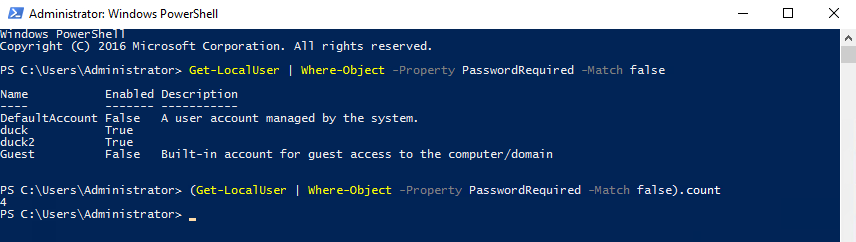
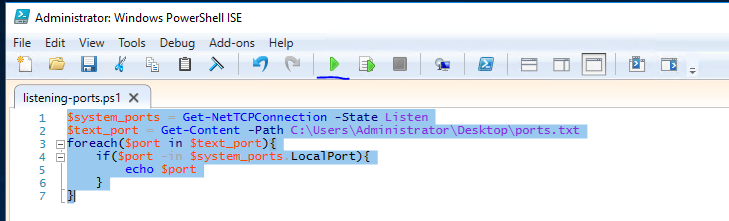

# [Hacking with PowerShell](https://tryhackme.com/r/room/powershell)


## Task 1 - Objectives

Before completing this room, you should be aware of some fundamentals. For example, the differences between CMD, PS and some syntax. This room will cover the following:

* What is Powershell
* Basic Powershell commands
* Windows enumeration skills
* Powershell scripting

You can control the machine in your browser or RDP into the instance with the following credentials:


### Answer the questions below

* Read the above and deploy the machine!

    ```
    xfreerdp /dynamic-resolution +clipboard /cert:ignore /v:$IP /u:Administrator /p:'BHN2UVw0Q'
    ```

    

## Task 2 - What is Powershell?

Powershell is the Windows Scripting Language and shell environment built using the .NET framework.

This also allows Powershell to execute .NET functions directly from its shell. Most Powershell commands, called _cmdlets_, are written in .NET. Unlike other scripting languages and shell environments, the output of these _cmdlets_ are objects - making Powershell somewhat object-oriented.

This also means that running _cmdlets_ allows you to perform actions on the output object (which makes it convenient to pass output from one cmdlet to another). The normal format of a _cmdlet_ is represented using **Verb-Noun**; for example, the _cmdlet_ to list commands is called `Get-Command`

Common verbs to use include:

* Get
* Start
* Stop 
* Read
* Write
* New
* Out

To get the complete list of approved verbs, visit [this](https://docs.microsoft.com/en-us/powershell/scripting/developer/cmdlet/approved-verbs-for-windows-powershell-commands?view=powershell-7) link.

### Answer the questions below

* What is the command to **get** a **new** object?

## Task 3 - Basic Powershell Commands

Now that we've understood how cmdlets work - let's explore how to use them! The main thing to remember here is that `Get-Command` and `Get-Help` are your best friends! 

### Using Get-Help

`Get-Help` displays information about a cmdlet. To get help with a particular command, run the following:

`Get-Help Command-Name`

You can also understand how exactly to use the command by passing in the `-examples` flag. This would return output like the following: 

Running the Get-Help cmdlet to explain a command

```
PS C:\Users\Administrator> Get-Help Get-Command -Examples

NAME
    Get-Command

SYNOPSIS
Gets all commands.

Example 1: Get cmdlets, functions, and aliases

PS C:\>Get-Command
```        

### Using Get-Command

`Get-Command` gets all the cmdlets installed on the current Computer. The great thing about this cmdlet is that it allows for pattern matching like the following

`Get-Command Verb-*` or `Get-Command *-Noun`

Running `Get-Command New-*` to view all the cmdlets for the verb new displays the following: 

Using the Get-Command to list all cmdlets installed

```
PS C:\Users\Administrator> Get-Command New-*

CommandType     Name                                               Version    Source
-----------     ----                                               -------    ------
Alias           New-AWSCredentials                                 3.3.563.1  AWSPowerShell
Alias           New-EC2FlowLogs                                    3.3.563.1  AWSPowerShell
Alias           New-EC2Hosts                                       3.3.563.1  AWSPowerShell
Alias           New-RSTags                                         3.3.563.1  AWSPowerShell
Alias           New-SGTapes                                        3.3.563.1  AWSPowerShell
Function        New-AutologgerConfig                               1.0.0.0    EventTracingManagement
Function        New-DAEntryPointTableItem                          1.0.0.0    DirectAccessClientComponents
Function        New-DscChecksum                                    1.1        PSDesiredStateConfiguration
Function        New-EapConfiguration                               2.0.0.0    VpnClient
Function        New-EtwTraceSession                                1.0.0.0    EventTracingManagement
Function        New-FileShare                                      2.0.0.0    Storage
Function        New-Fixture                                        3.4.0      Pester
Function        New-Guid                                           3.1.0.0    Microsoft.PowerShell.Utility
--cropped for brevity--
```

### Object Manipulation

In the previous task, we saw how the output of every _cmdlet_ is an object. If we want to manipulate the output, we need to figure out a few things:

* passing the output to other _cmdlets_
* using specific object _cmdlets_ to extract information

The Pipeline(`|`) is used to pass output from one _cmdlet_ to another. A major difference compared to other shells is that Powershell passes an object to the next _cmdlet_ instead of passing text or string to the command after the pipe. Like every object in object-oriented frameworks, an object will contain methods and properties.

You can think of methods as functions that can be applied to output from the _cmdlet_, and you can think of properties as variables in the output from a _cmdlet_. To view these details, pass the output of a _cmdlet_ to the `Get-Member` _cmdlet_:

`Verb-Noun | Get-Member` 

An example of running this to view the members for `Get-Command` is:

`Get-Command | Get-Member -MemberType Method`

Using pipe (|) to pass output from one cmdlet to another

```
PS C:\Users\Administrator> Get-Command | Get-Member -MemberType Method


   TypeName: System.Management.Automation.AliasInfo

Name             MemberType Definition
----             ---------- ----------
Equals           Method     bool Equals(System.Object obj)
GetHashCode      Method     int GetHashCode()
GetType          Method     type GetType()
ResolveParameter Method     System.Management.Automation.ParameterMetadata ResolveParameter(string name)
ToString         Method     string ToString()


   TypeName: System.Management.Automation.FunctionInfo

Name             MemberType Definition
----             ---------- ----------
Equals           Method     bool Equals(System.Object obj)
GetHashCode      Method     int GetHashCode()
GetType          Method     type GetType()
ResolveParameter Method     System.Management.Automation.ParameterMetadata ResolveParameter(string name)
ToString         Method     string ToString()


   TypeName: System.Management.Automation.CmdletInfo

Name             MemberType Definition
----             ---------- ----------
Equals           Method     bool Equals(System.Object obj)
GetHashCode      Method     int GetHashCode()
GetType          Method     type GetType()
ResolveParameter Method     System.Management.Automation.ParameterMetadata ResolveParameter(string name)
ToString         Method     string ToString()


PS C:\Users\Administrator>
```

From the above flag in the command, you can see that you can also select between methods and properties.

### Creating Objects From Previous _cmdlets_

One way of manipulating objects is pulling out the properties from the output of a _cmdlet_ and creating a new object. This is done using the `Select-Object` _cmdlet_. 

Here's an example of listing the directories and just selecting the mode and the name:

Listing the directories and filtering via mode and name

```           
PS C:\Users\Administrator> Get-ChildItem | Select-Object -Property Mode, Name
Mode   Name
----   ----
d-r--- Contacts
d-r--- Desktop
d-r--- Documents
d-r--- Downloads
d-r--- Favorites
d-r--- Links
d-r--- Music
d-r--- Pictures
d-r--- Saved Games
d-r--- Searches
d-r--- Videos

PS C:\Users\Administrator>
```        

You can also use the following flags to select particular information:

* first - gets the first x object
* last - gets the last x object
* unique - shows the unique objects
* skip - skips x objects

### Filtering Objects

When retrieving output objects, you may want to select objects that match a very specific value. You can do this using the `Where-Object` to filter based on the value of properties. 

The general format for using this _cmdlet_ is 

`Verb-Noun | Where-Object -Property PropertyName -operator Value`

`Verb-Noun | Where-Object {$_.PropertyName -operator Value}`

The second version uses the `$_` operator to iterate through every object passed to the `Where-Object` cmdlet.

**Powershell is quite sensitive, so don't put quotes around the command!**

Where `-operator` is a list of the following operators:

* `-Contains`: if any item in the property value is an exact match for the specified value
* `-EQ`: if the property value is the same as the specified value
* `-GT`: if the property value is greater than the specified value

For a full list of operators, use [this](https://docs.microsoft.com/en-us/powershell/module/microsoft.powershell.core/where-object?view=powershell-6) link.

Here's an example of checking the stopped processes:

Demonstrating the use of operators only to show stopped services

```           
PS C:\Users\Administrator> Get-Service | Where-Object -Property Status -eq Stopped

Status   Name               DisplayName
------   ----               -----------
Stopped  AJRouter           AllJoyn Router Service
Stopped  ALG                Application Layer Gateway Service
Stopped  AppIDSvc           Application Identity
Stopped  AppMgmt            Application Management
Stopped  AppReadiness       App Readiness
Stopped  AppVClient         Microsoft App-V Client
Stopped  AppXSvc            AppX Deployment Service (AppXSVC)
Stopped  AudioEndpointBu... Windows Audio Endpoint Builder
Stopped  Audiosrv           Windows Audio
Stopped  AxInstSV           ActiveX Installer (AxInstSV)
Stopped  BITS               Background Intelligent Transfer Ser...
Stopped  Browser            Computer Browser
Stopped  bthserv            Bluetooth Support Service
-- cropped for brevity--
```
        
### Sort-Object

When a _cmdlet_ outputs a lot of information, you may need to sort it to extract the information more efficiently. You do this by pipe-lining the output of a _cmdlet_ to the `Sort-Object` _cmdlet_.

The format of the command would be:

`Verb-Noun | Sort-Object`

Here's an example of sorting the list of directories:

Using the Sort-Object cmdlet to sort piped information

```
PS C:\Users\Administrator> Get-ChildItem | Sort-Object
    Directory: C:\Users\Administrator
Mode                LastWriteTime         Length Name
----                -------------         ------ ----
d-r---        10/3/2019   5:11 PM                Contacts
d-r---        10/5/2019   2:38 PM                Desktop
d-r---        10/3/2019  10:55 PM                Documents
d-r---        10/3/2019  11:51 PM                Downloads
d-r---        10/3/2019   5:11 PM                Favorites
d-r---        10/3/2019   5:11 PM                Links
d-r---        10/3/2019   5:11 PM                Music
d-r---        10/3/2019   5:11 PM                Pictures
d-r---        10/3/2019   5:11 PM                Saved Games
d-r---        10/3/2019   5:11 PM                Searches
d-r---        10/3/2019   5:11 PM                Videos
PS C:\Users\Administrator>
```        

Now that you've understood how Powershell works let's try some commands to apply this knowledge!

### Answer the questions below

* What is the location of the file "interesting-file.txt"

    `C:\Program Files`

    ```
    Get-ChildItem “*interesting-file*” -Path C:\ -Recurse -ErrorAction SilentlyContinue
    ```

    
 
* Specify the contents of this file

    `notsointerestingcontent`

    ```
    Get-ChildItem “*interesting-file*” -Path C:\ -Recurse -ErrorAction SilentlyContinue | Get-Content
    ```

    

* How many cmdlets are installed on the system(only cmdlets, not functions and aliases)?

    `6638`

    ```
    (Get-Command | Where-Object {$_.CommandType -eq “Cmdlet”}).Count
    
    or
    
    Get-Command | Where-Object -Property CommandType -eq Cmdlet | measure
    ```

    

* Get the MD5 hash of interesting-file.txt

    `49A586A2A9456226F8A1B4CEC6FAB329`

    ```
    Get-ChildItem “*interesting-file*” -Path C:\ -Recurse -ErrorAction SilentlyContinue | Get-FileHash -Algorithm MD5
    ```

    

* What is the command to get the current working directory?
    
    `Get-Location`

* Does the path "C:\Users\Administrator\Documents\Passwords" Exist (Y/N)?

    `N`

    

* What command would you use to make a request to a web server?
    
    `Invoke-WebRequest`

* Base64 decode the file b64.txt on Windows. 

    `ihopeyoudidthisonwindows`

    ```
    certutil -decode "C:\Users\Administrator\Desktop\b64.txt" decode.txt
    Get-Content .\decode.txt
    ```

    

## Task 4 - Enumeration

The first step when you have gained initial access to any machine would be to enumerate. We'll be enumerating the following:

* users
* basic networking information
* file permissions
* registry permissions
* scheduled and running tasks
* insecure files

Your task will be to answer the following questions to enumerate the machine using Powershell commands! 

### Answer the questions below

* How many users are there on the machine?
    
    `5`

    ```
    Get-LocalUser

    or

    (Get-LocalUser).Name.Count
    ```

    

* Which local user does this SID(S-1-5-21-1394777289-3961777894-1791813945-501) belong to?

    `Guest`

    ```
    Get-LocalUser -SID "S-1-5-21-1394777289-3961777894-1791813945-501"
    ```

    

* How many users have their password required values set to False?

    `4`

    ```
    Get-LocalUser | Where-Object -Property PasswordRequired -Match false

    or 

    (Get-LocalUser | Where-Object -Property PasswordRequired -Match false).count
    ```

    

* How many local groups exist?

    `24`

    ```
    Get-LocalGroup

    or 

    Get-LocalGroup | measure
    ```

    

* What command did you use to get the IP address info?
    
    `Get-NetIPAddress`

* How many ports are listed as listening?

    `20`

    ```
    GEt-NetTCPConnection | Where-Object -Property State -Match Listen | measure
    ```

    

* What is the remote address of the local port listening on port 445?

    `::`

    ```
    GEt-NetTCPConnection | Where-Object -Property LocalPort -eq 445

    or 

    Get-NetTCPConnection | Where-Object {($_.State -eq “Listen”) -and ($_.LocalPort -eq “445”)}
    ```

    

* How many patches have been applied?

    `20`

    ```
    Get-Hotfix | measure
    ```

    

* When was the patch with ID KB4023834 installed?

    `6/15/2017 12:00:00 AM`

    ```
    Get-Hotfix -Id KB4023834

    or

    Get-HotFix | Where-Object {$_.HotFixID -eq “KB4023834”} | Select-Object * | Select-Object InstalledOn
    ```

    

* Find the contents of a backup file.

    `backpassflag`

    ```
    Get-ChildItem “*.bak*” -Path C:\ -Recurse -ErrorAction SilentlyContinue | Get-Content
    ```

    

* Search for all files containing API_KEY

    `fakekey123`

    ```
    Get-ChildItem -Path C:\Users -Recurse -ErrorAction SilentlyContinue | Select-String “API_KEY”
    ```

    

* What command do you do to list all the running processes?
    
    `Get-Process`

* What is the path of the scheduled task called new-sched-task?

    `/`

    ```
    Get-ScheduledTask -TaskName new-sched-task

    or 

    (Get-ScheduledTask | Where-Object {$_.TaskName -eq “new-sched-task”}).TaskPath
    ```

    

* Who is the owner of the C:\

    `NT SERVICE\TrustedInstaller`

    ```
    Get-Acl c:/

    or 

    (Get-Acl -Path “C:\”).Owner
    ```

    

## Task 5 - Basic Scripting Challenge

Now that we have run Powershell commands, let's try to write and run a script to do more complex and powerful actions. 

For this ask, we'll use Powershell ISE (the Powershell Text Editor). Let's use a particular scenario to show an example of this script. Given a list of port numbers, we want to use this list to see if the local port is listening. Open the listening-ports.ps1 script on the Desktop using Powershell ISE. Powershell scripts usually have the _.ps1_ file extension. 

```
$system_ports = Get-NetTCPConnection -State Listen

$text_port = Get-Content -Path C:\Users\Administrator\Desktop\ports.txt

foreach($port in $text_port){

    if($port -in $system_ports.LocalPort){
        echo $port
     }

}
```

On the first line, we want to get a list of all the ports on the system that are listening. We do this using the `Get-NetTCPConnection` _cmdlet_. We are then saving the output of this _cmdlet_ into a variable. The convention to create variables is used as:

```
$variable_name = value
```

In the following line, we want to read a list of ports from the file. We do this using the `Get-Content` _cmdlet_. Again, we store this output in the variables. The simplest next step is to iterate through all the ports in the file to see if the ports are listening. To iterate through the ports in the file, we use the following:

```
foreach($new_var in $existing_var){}
```

This particular code block is used to loop through a set of objects. Once we have each individual port, we want to check if this port occurs in the listening local ports. Instead of doing another _for_ loop, we just use an _if_ statement with the `-in` operator to check if the port exists in the `LocalPort` property of any object. A full list of if statement comparison operators can be found [here](https://docs.microsoft.com/en-us/powershell/module/microsoft.powershell.core/about/about_comparison_operators?view=powershell-6). To run the script, call the script path using Powershell or click the green button on Powershell ISE:



Now that we've seen what a basic script looks like - it's time to write one of your own. The emails folder on the Desktop contains copies of the emails John, Martha, and Mary have been sending to each other(and themselves). Answer the following questions with regard to these emails (try not to open the files and use a script to answer the questions). 

Scripting may be a bit difficult, but [here](https://learnxinyminutes.com/docs/powershell/) is a good resource to use: 

### Answer the questions below

* Create script file as "Run.ps1" and execute the file

    ```
    $path = 'C:\Users\Administrator\Desktop\emails\*'
    $word = 'password'
    $exec = Get-ChildItem $path -recurse | Select-String -pattern $word
    echo $exec
    ```


* What file contains the password?

    `Doc3M`

* What is the password?

    `johnisalegend99`

* What files contains an HTTPS link?

    `Doc2Mary`

    Edit script on "Run.ps1" and execute the file

    ```
    $word = 'https'
    ```

    

## Task 6 - Intermediate Scripting

Now that you've learnt a little bit about how scripting works - let's try something a bit more interesting. Sometimes we may not have utilities like Nmap and Python available, and we are forced to write scripts to do very rudimentary tasks.

Why don't you try writing a simple port scanner using Powershell? Here's the general approach to use: 

* Determine IP ranges to scan(in this case it will be localhost) and you can provide the input in any way you want
* Determine the port ranges to scan
* Determine the type of scan to run(in this case it will be a simple TCP Connect Scan)

### Answer the questions below

* How many open ports did you find between 130 and 140(inclusive of those two)?

    `11`

    Create script file as "Run.ps1" and execute the script

    ```
    # Determine IP ranges to scan(in this case it will be localhost) and you can provide the input in any way you want
    $Target = "localhost"

    # Determine the port ranges to scan
    $LowEnd = 130
    $HighEnd = 140

    # Determine the type of scan to run(in this case it will be a simple TCP Connect Scan)
    for($X=$LowEnd; $X -le $HighEnd; $X++){
    (Test-NetConnection -ErrorAction SilentlyContinue $Target -Port $X).RemotePort | Out-File .\Ports.txt -Append
    }

    Get-Content .\Ports.txt | Measure
    ```

    
