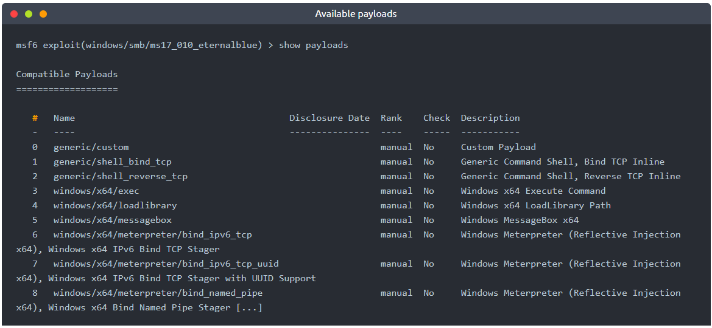
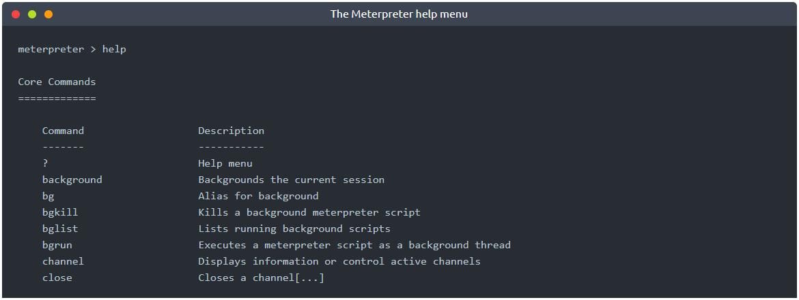
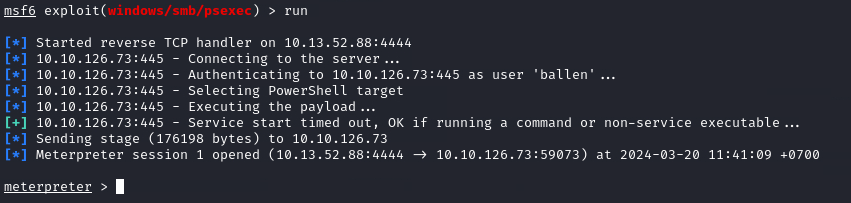
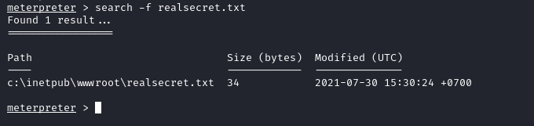

# [Metasploit: Meterpreter](https://tryhackme.com/room/meterpreter)

Take a deep dive into Meterpreter, and see how in-memory payloads can be used for post-exploitation.

## Task 1 - Introduction to Meterpreter

Meterpreter is a Metasploit payload that supports the penetration testing process with many valuable components. Meterpreter will run on the target system and act as an agent within a command and control architecture. You will interact with the target operating system and files and use Meterpreter's specialized commands.

Meterpreter has many versions which will provide different functionalities based on the target system.

**How does Meterpreter work?**

Meterpreter runs on the target system but is not installed on it. It runs in memory and does not write itself to the disk on the target. This feature aims to avoid being detected during antivirus scans. By default, most antivirus software will scan new files on the disk (e.g. when you download a file from the internet) Meterpreter runs in memory (RAM - Random Access Memory) to avoid having a file that has to be written to the disk on the target system (e.g. meterpreter.exe). This way, Meterpreter will be seen as a process and not have a file on the target system.

Meterpreter also aims to avoid being detected by network-based IPS (Intrusion Prevention System) and IDS (Intrusion Detection System) solutions by using encrypted communication with the server where Metasploit runs (typically your attacking machine). If the target organization does not decrypt and inspect encrypted traffic (e.g. HTTPS) coming to and going out of the local network, IPS and IDS solutions will not be able to detect its activities.

While Meterpreter is recognized by major antivirus software, this feature provides some degree of stealth.

The example below shows a target Windows machine exploited using the MS17-010 vulnerability. You will see Meterpreter is running with a process ID (PID) of 1304; this PID will be different in your case. We have used the `getpid` command, which returns the process ID with which Meterpreter is running. The process ID (or process identifier) is used by operating systems to identify running processes. All processes running in Linux or Windows will have a unique ID number; this number is used to interact with the process when the need arises (e.g. if it needs to be stopped). 

If we list processes running on the target system using the `ps` command, we see PID 1304 is spoolsv.exe and not Meterpreter.exe, as one might expect.

Even if we were to go a step further and look at DLLs (Dynamic-Link Libraries) used by the Meterpreter process (PID 1304 in this case), we still would not find anything jumping at us (e.g. no meterpreter.dll)

Techniques and tools that can be used to detect Meterpreter are beyond the scope of this room. This section aimed to show you how stealthy Meterpreter is running; remember, most antivirus software will detect it.

It is also worth noting that Meterpreter will establish an encrypted (TLS) communication channel with the attacker's system.

## Task 2 - Meterpreter Flavors

As discussed in the previous Metasploit rooms, linked below, Metasploit payloads can be initially divided into two categories; inline (also called single) and staged.

Introduction to Metasploit: https://www.tryhackme.com/jr/metasploitintro

Scanning and Exploitation with Metasploit: https://www.tryhackme.com/jr/metasploitexploitation

As you will remember, staged payloads are sent to the target in two steps. An initial part is installed (the stager) and requests the rest of the payload. This allows for a smaller initial payload size. The inline payloads are sent in a single step. Meterpreter payloads are also divided into stagged and inline versions. However, Meterpreter has a wide range of different versions you can choose from based on your target system. 

The easiest way to have an idea about available Meterpreter versions could be to list them using msfvenom, as seen below. 

We have used the `msfvenom --list payloads` command and grepped "meterpreter" payloads (adding `| grep meterpreter` to the command line), so the output only shows these. You can try this command on the AttackBox. 

The list will show Meterpreter versions available for the following platforms;

* Android
* Apple iOS
* Java
* Linux
* OSX
* PHP
* Python
* Windows

Your decision on which version of Meterpreter to use will be mostly based on three factors;

* The target operating system (Is the target operating system Linux or Windows? Is it a Mac device? Is it an Android phone? etc.)
* Components available on the target system (Is Python installed? Is this a PHP website? etc.)
* Network connection types you can have with the target system (Do they allow raw TCP connections? Can you only have an HTTPS reverse connection? Are IPv6 addresses not as closely monitored as IPv4 addresses? etc.) 

If you are not using Meterpreter as a standalone payload generated by Msfvenom, your choice may also be limited by the exploit. You will notice some exploits will have a default Meterpreter payload, as you can see in the example below with the `ms17_010_eternalblue` exploit. 

You can also list other available payloads using the `show payloads` command with any module. 

## Task 3 - Meterpreter Commands

Typing `help` on any Meterpreter session (shown by `meterpreter>` at the prompt) will list all available commands.

Every version of Meterpreter will have different command options, so running the `help` command is always a good idea. Commands are built-in tools available on Meterpreter. They will run on the target system without loading any additional script or executable files.

Meterpreter will provide you with three primary categories of tools;  
* Built-in commands
* Meterpreter tools
* Meterpreter scripting

If you run the `help` command, you will see Meterpreter commands are listed under different categories.  
* Core commands
* File system commands
* Networking commands
* System commands
* User interface commands
* Webcam commands
* Audio output commands
* Elevate commands
* Password database commands
* Timestomp commands

Please note that the list above was taken from the output of the `help` command on the Windows version of Meterpreter (windows/x64/meterpreter/reverse_tcp). These will be different for other Meterpreter versions.

**Meterpreter commands**

Core commands will be helpful to navigate and interact with the target system. Below are some of the most commonly used. Remember to check all available commands running the help command once a Meterpreter session has started.

Core commands  
* `background`: Backgrounds the current session
* `exit`: Terminate the Meterpreter session
* `guid`: Get the session GUID (Globally Unique Identifier)
* `help`: Displays the help menu
* `info`: Displays information about a Post module
* `irb`: Opens an interactive Ruby shell on the current session
* `load`: Loads one or more Meterpreter extensions
* `migrate`: Allows you to migrate Meterpreter to another process
* `run`: Executes a Meterpreter script or Post module
* `sessions`: Quickly switch to another session

File system commands  
* `cd`: Will change directory
* `ls`: Will list files in the current directory (dir will also work)
* `pwd`: Prints the current working directory
* `edit`: will allow you to edit a file
* `cat`: Will show the contents of a file to the screen
* `rm`: Will delete the specified file
* `search`: Will search for files
* `upload`: Will upload a file or directory
* `download`: Will download a file or directory

Networking commands  
* `arp`: Displays the host ARP (Address Resolution Protocol) cache
* `ifconfig`: Displays network interfaces available on the target system
* `netstat`: Displays the network connections
* `portfwd`: Forwards a local port to a remote service
* `route`: Allows you to view and modify the routing table

System commands  
* `clearev`: Clears the event logs
* `execute`: Executes a command
* `getpid`: Shows the current process identifier
* `getuid`: Shows the user that Meterpreter is running as
* `kill`: Terminates a process
* `pkill`: Terminates processes by name
* `ps`: Lists running processes
* `reboot`: Reboots the remote computer
* `shell`: Drops into a system command shell
* `shutdown`: Shuts down the remote computer
* `sysinfo`: Gets information about the remote system, such as OS

Others Commands (these will be listed under different menu categories in the help menu)  
* `idletime`: Returns the number of seconds the remote user has been idle
* `keyscan_dump`: Dumps the keystroke buffer
* `keyscan_start`: Starts capturing keystrokes
* `keyscan_stop`: Stops capturing keystrokes
* `screenshare`: Allows you to watch the remote user's desktop in real time
* `screenshot`: Grabs a screenshot of the interactive desktop
* `record_mic`: Records audio from the default microphone for X seconds
* `webcam_chat`: Starts a video chat
* `webcam_list`: Lists webcams
* `webcam_snap`: Takes a snapshot from the specified webcam
* `webcam_stream`: Plays a video stream from the specified webcam
* `getsystem`: Attempts to elevate your privilege to that of local system
* `hashdump`: Dumps the contents of the SAM database

Although all these commands may seem available under the help menu, they may not all work. For example, the target system might not have a webcam, or it can be running on a virtual machine without a proper desktop environment. 

## Task 4 - Post-Exploitation with Meterpreter

Meterpreter provides you with many useful commands that facilitate the post-exploitation phase. Below are a few examples you will often use.

**Help**

This command will give you a list of all available commands in Meterpreter. As we have seen earlier, Meterpreter has many versions, and each version may have different options available. Typing help once you have a Meterpreter session will help you quickly browse through available commands.

**Meterpreter commands**

The `getuid` command will display the user with which Meterpreter is currently running. This will give you an idea of your possible privilege level on the target system (e.g. Are you an admin level user like NT AUTHORITY\SYSTEM or a regular user?)

The `ps` command will list running processes. The PID column will also give you the PID information you will need to migrate Meterpreter to another process.

**Migrate**

Migrating to another process will help Meterpreter interact with it. For example, if you see a word processor running on the target (e.g. word.exe, notepad.exe, etc.), you can migrate to it and start capturing keystrokes sent by the user to this process. Some Meterpreter versions will offer you the `keyscan_start`, `keyscan_stop`, and `keyscan_dump` command options to make Meterpreter act like a keylogger. Migrating to another process may also help you to have a more stable Meterpreter session.

To migrate to any process, you need to type the migrate command followed by the PID of the desired target process. The example below shows Meterpreter migrating to process ID 716. 

Be careful; you may lose your user privileges if you migrate from a higher privileged (e.g. SYSTEM) user to a process started by a lower privileged user (e.g. webserver). You may not be able to gain them back.

**Hashdump**

The hashdump command will list the content of the SAM database. The SAM (Security Account Manager) database stores user's passwords on Windows systems. These passwords are stored in the NTLM (New Technology LAN Manager) format.

While it is not mathematically possible to "crack" these hashes, you may still discover the cleartext password using online NTLM databases or a rainbow table attack. These hashes can also be used in Pass-the-Hash attacks to authenticate to other systems that these users can access the same network.

**Search**

The search command is useful to locate files with potentially juicy information. In a CTF context, this can be used to quickly find a flag or proof file, while in actual penetration testing engagements, you may need to search for user-generated files or configuration files that may contain password or account information. 

**Shell**

The shell command will launch a regular command-line shell on the target system. Pressing CTRL+Z will help you go back to the Meterpreter shell.

## Task 5 - Post-Exploitation Challenge

Meterpreter provides several important post-exploitation tools.

Commands mentioned previously, such as `getsystem` and `hashdump` will provide important leverage and information for privilege escalation and lateral movement. Meterpreter is also a good base you can use to run post-exploitation modules available on the Metasploit framework. Finally, you can also use the load command to leverage additional tools such as Kiwi or even the whole Python language.
Loading Python

The post-exploitation phase will have several goals; Meterpreter has functions that can assist all of them.  
* Gathering further information about the target system.
* Looking for interesting files, user credentials, additional network interfaces, and generally interesting information on the target system.
* Privilege escalation.
* Lateral movement.

Once any additional tool is loaded using the `load` command, you will see new options on the `help` menu. The example below shows commands added for the Kiwi module (using the `load kiwi` command). 

These will change according to the loaded menu, so running the `help` command after loading a module is always a good idea.

The questions below will help you have a better understanding of how Meterpreter can be used in post-exploitation.

You can use the credentials below to simulate an initial compromise over SMB (Server Message Block) (using exploit/windows/smb/psexec)

Username: ballen

Password: Password1

### Answer the questions below

* Run nmap scan

	

* Setup msfconsole module

	

* Get access via Meterpreter

	

* What is the computer name?
	
	`ACME-TEST`

	

* What is the target domain?

	`FLASH`

	

* What is the name of the share likely created by the user?

	`speedster`

	

* What is the NTLM hash of the jchambers user?

	`69596c7aa1e8daee17f8e78870e25a5c`

	PS list

	

	Migrate to "lsass.exe"

	

* What is the cleartext password of the jchambers user?

	`Trustno1`

	

* Where is the "secrets.txt"  file located? (Full path of the file)

	`c:\Program Files (x86)\Windows Multimedia Platform\secrets.txt`

	

* What is the Twitter password revealed in the "secrets.txt" file?

	`KDSvbsw3849!`

	

* Where is the "realsecret.txt" file located? (Full path of the file)

	`c:\inetpub\wwwroot\realsecret.txt`

	

* What is the real secret? 

	`The Flash is the fastest man alive`

	