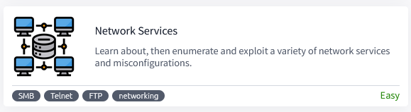

# [Network Services](https://tryhackme.com/room/networkservices)

## Task 1 - Get Connected

## Task 2 - Understanding SMB

## Task 3 - Enumerating SMB

## Task 4 - Exploiting SMB

## Task 5 - Understanding Telnet

## Task 6 - Enumerating Telnet

## Task 7 - Exploiting Telnet

## Task 8 - Understanding FTP

## Task 9 - Enumerating FTP

## Task 10 - Exploiting FTP

## Task 11 - Expanding Your Knowledge
