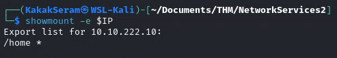
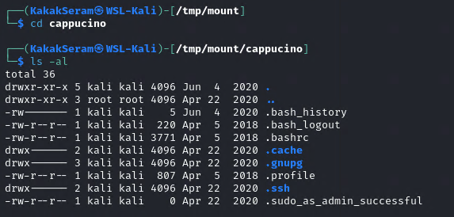
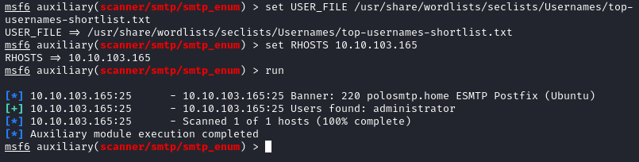

# [Network Services 2](https://tryhackme.com/room/networkservices2)

## Task 1 - Get Connected

Hello and welcome!

This room is a sequel to the first network services room. Similarly, it will explore a few more common Network Service vulnerabilities and misconfigurations that you're likely to find in CTFs, and some penetration test scenarios.

I would encourage you to complete the first network services room (https://tryhackme.com/room/networkservices) before attempting this one.

As with the previous room, it is definitely worth having a basic knowledge of Linux before attempting this room. If you think you'll need some help with this, try completing the 'Linux Fundamentals' module (https://tryhackme.com/module/linux-fundamentals)

Before we get started:

1. Connect to the TryHackMe OpenVPN Server (See https://tryhackme.com/access for help!)
2. Make sure you're sitting comfortably, and have a cup of Tea, Coffee or Water close!

Lets get started!

**N.B.** This is not a room on WiFi access hacking or hijacking, rather how to gain unauthorized access to a machine by exploiting network services. If you are interested in WiFi hacking, I suggest checking out WiFi Hacking 101 by NinjaJc01 (https://tryhackme.com/room/wifihacking101)

Ready? Let's get going!

## Task 2 - Understanding NFS

**What is NFS?**

NFS stands for "Network File System" and allows a system to share directories and files with others over a network. By using NFS, users and programs can access files on remote systems almost as if they were local files. It does this by mounting all, or a portion of a file system on a server. The portion of the file system that is mounted can be accessed by clients with whatever privileges are assigned to each file.

**How does NFS work?**

We don't need to understand the technical exchange in too much detail to be able to exploit NFS effectively- however if this is something that interests you, I would recommend this resource: https://docs.oracle.com/cd/E19683-01/816-4882/6mb2ipq7l/index.html

First, the client will request to mount a directory from a remote host on a local directory just the same way it can mount a physical device. The mount service will then act to connect to the relevant mount daemon using RPC.

The server checks if the user has permission to mount whatever directory has been requested. It will then return a file handle which uniquely identifies each file and directory that is on the server.

If someone wants to access a file using NFS, an RPC call is placed to NFSD (the NFS daemon) on the server. This call takes parameters such as:

* The file handle
* The name of the file to be accessed
* The user's, user ID
* The user's group ID

These are used in determining access rights to the specified file. This is what controls user permissions, I.E read and write of files.

**What runs NFS?**

Using the NFS protocol, you can transfer files between computers running Windows and other non-Windows operating systems, such as Linux, MacOS or UNIX.

A computer running Windows Server can act as an NFS file server for other non-Windows client computers. Likewise, NFS allows a Windows-based computer running Windows Server to access files stored on a non-Windows NFS server.

**More Information:**

Here are some resources that explain the technical implementation, and working of, NFS in more detail than I have covered here.

https://www.datto.com/library/what-is-nfs-file-share

http://nfs.sourceforge.net/

https://wiki.archlinux.org/index.php/NFS

### Answer the questions

* What does NFS stand for?

	`Network File System`

* What process allows an NFS client to interact with a remote directory as though it was a physical device?

	`Mounting`

* What does NFS use to represent files and directories on the server?

	`File Handle`

* What protocol does NFS use to communicate between the server and client?

	`RPC`

*  What two pieces of user data does the NFS server take as parameters for controlling user permissions? Format: parameter 1 / parameter 2

	`user ID / group ID`

* Can a Windows NFS server share files with a Linux client? (Y/N)

	`Y`

* Can a Linux NFS server share files with a MacOS client? (Y/N)

	`Y`

* What is the latest version of NFS? `[released in 2016, but is still up to date as of 2020]` This will require external research.

	`4.2`

## Task 3 - Enumerating NFS

**Let's Get Started**

Before we begin, make sure to deploy the room and give it some time to boot. Please be aware - this can take up to five minutes so be patient!

**What is Enumeration?**

Enumeration is defined as "a process which establishes an active connection to the target hosts to discover potential attack vectors in the system, and the same can be used for further exploitation of the system." - [Infosec Institute](https://resources.infosecinstitute.com/what-is-enumeration/). It is a critical phase when considering how to enumerate and exploit a remote machine - as the information you will use to inform your attacks will come from this stage

**Requirements**

In order to do a more advanced enumeration of the NFS server, and shares- we're going to need a few tools. The first of which is key to interacting with any NFS share from your local machine: **nfs-common**.

**NFS-Common**

It is important to have this package installed on any machine that uses NFS, either as client or server. It includes programs such as: **lockd**, **statd**, **showmount**, **nfsstat**, **gssd**, **idmapd** and **mount.nfs**. Primarily, we are concerned with "showmount" and "mount.nfs" as these are going to be most useful to us when it comes to extracting information from the NFS share. If you'd like more information about this package, feel free to read: https://packages.ubuntu.com/jammy/nfs-common.

You can install **nfs-common** using "sudo apt install nfs-common", it is part of the default repositories for most Linux distributions such as the Kali Remote Machine or AttackBox that is provided to TryHackMe.

**Port Scanning**

Port scanning has been covered many times before, so I'll only cover the basics that you need for this room here. If you'd like to learn more about **nmap** in more detail please have a look at the [nmap](https://tryhackme.com/room/furthernmap) room.

The first step of enumeration is to conduct a port scan, to find out as much information as you can about the services, open ports and operating system of the target machine. You can go as in-depth as you like on this, however, I suggest using **nmap** with the -**A** and -**p**- tags.

**Mounting NFS shares**

Your client’s system needs a directory where all the content shared by the host server in the export folder can be accessed. You can create
this folder anywhere on your system. Once you've created this mount point, you can use the "mount" command to connect the NFS share to the mount point on your machine like so:

**sudo mount -t nfs IP:share /tmp/mount/ -nolock**

Let's break this down

|Tag|Function|
|---|--------|
|sudo|Run as root|
|mount|Execute the mount command|
|-t nfs|Type of device to mount, then specifying that it's NFS|
|IP:share|The IP Address of the NFS server, and the name of the share we wish to mount|
|-nolock|Specifies not to use NLM locking|

Now we understand our tools, let's get started!

### Answer the questions

* Conduct a thorough port scan scan of your choosing, how many ports are open?

	`7`

	Resulted scan [here](./files/task3-nmap)

* Which port contains the service we're looking to enumerate?

	`2049`

* Now, use /usr/sbin/showmount -e [IP] to list the NFS shares, what is the name of the visible share?

	`/home`

	

Time to mount the share to our local machine!

First, use "mkdir /tmp/mount" to create a directory on your machine to mount the share to. This is in the /tmp directory- so be aware that it will be removed on restart.

* Then, use the mount command we broke down earlier to mount the NFS share to your local machine. Change directory to where you mounted the share- what is the name of the folder inside?

	`cappucino`

	

Have a look inside this directory, look at the files. Looks like  we're inside a user's home directory...

* Interesting! Let's do a bit of research now, have a look through the folders. Which of these folders could contain keys that would give us remote access to the server?

	`.ssh`

	

* Which of these keys is most useful to us?

	`id_rsa`

	

Copy this file to a different location your local machine, and change the permissions to "600" using "chmod 600 [file]".

Assuming we were right about what type of directory this is, we can pretty easily work out the name of the user this key corresponds to.

* Can we log into the machine using `ssh -i <key-file> <username>@<ip>` ? (Y/N)

	`Y`

	

## Task 4 - Exploiting NFS

**We're done, right?**

Not quite, if you have a low privilege shell on any machine and you found that a machine has an NFS share you might be able to use that to escalate privileges, depending on how it is configured.

**What is root_squash?**

By default, on NFS shares- Root Squashing is enabled, and prevents anyone connecting to the NFS share from having root access to the NFS volume. Remote root users are assigned a user “nfsnobody” when connected, which has the least local privileges. Not what we want. However, if this is turned off, it can allow the creation of SUID bit files, allowing a remote user root access to the connected system.

**SUID**

So, what are files with the SUID bit set? Essentially, this means that the file or files can be run with the permissions of the file(s) owner/group. In this case, as the super-user. We can leverage this to get a shell with these privileges!

**Method**

This sounds complicated, but really- provided you're familiar with how SUID files work, it's fairly easy to understand. We're able to upload files to the NFS share, and control the permissions of these files. We can set the permissions of whatever we upload, in this case a bash shell executable. We can then log in through SSH, as we did in the previous task- and execute this executable to gain a root shell!

**The Executable**

Due to compatibility reasons, we'll use a standard Ubuntu Server 18.04 bash executable, the same as the server's- as we know from our nmap scan. You can download it [here](https://github.com/TheRealPoloMints/Blog/blob/master/Security%20Challenge%20Walkthroughs/Networks%202/bash). If you want to download it via the command line, be careful not to download the github page instead of the raw script. You can use `wget https://github.com/polo-sec/writing/raw/master/Security%20Challenge%20Walkthroughs/Networks%202/bash`.

**Mapped Out Pathway:**

If this is still hard to follow, here's a step by step of the actions we're taking, and how they all tie together to allow us to gain a root shell:

    NFS Access ->

        Gain Low Privilege Shell ->

            Upload Bash Executable to the NFS share ->

                Set SUID Permissions Through NFS Due To Misconfigured Root Squash ->

                    Login through SSH ->

                        Execute SUID Bit Bash Executable ->

                            ROOT ACCESS

Lets do this!

### Answer the questions

First, change directory to the mount point on your machine, where the NFS share should still be mounted, and then into the user's home directory.

Download the bash executable to your Downloads directory. Then use `cp ~/Downloads/bash .` to copy the bash executable to the NFS share. The copied bash shell must be owned by a root user, you can set this using "sudo chown root bash"

* Now, we're going to add the SUID bit permission to the bash executable we just copied to the share using `sudo chmod +[permission] bash`. What letter do we use to set the SUID bit set using chmod?

	`s`

	

* Let's do a sanity check, let's check the permissions of the `bash` executable using `ls -la bash`. What does the permission set look like? Make sure that it ends with -sr-x.

	`-rwsr-sr-x`

	

Now, SSH into the machine as the user. List the directory to make sure the bash executable is there. Now, the moment of truth. Lets run it with `./bash -p`. The -p persists the permissions, so that it can run as root with SUID- as otherwise bash will sometimes drop the permissions.

* Great! If all's gone well you should have a shell as root! What's the root flag?

	`THM{nfs_got_pwned}`

	

## Task 5 - Understanding SMTP

**What is SMTP?**

SMTP stands for "Simple Mail Transfer Protocol". It is utilised to handle the sending of emails. In order to support email services, a protocol pair is required, comprising of SMTP and POP/IMAP. Together they allow the user to send outgoing mail and retrieve incoming mail, respectively.

The SMTP server performs three basic functions:

* It verifies who is sending emails through the SMTP server.
* It sends the outgoing mail
* If the outgoing mail can't be delivered it sends the message back to the sender

Most people will have encountered SMTP when configuring a new email address on some third-party email clients, such as Thunderbird; as when you configure a new email client, you will need to configure the SMTP server configuration in order to send outgoing emails.

**POP and IMAP**

POP, or "Post Office Protocol" and IMAP, "Internet Message Access Protocol" are both email protocols who are responsible for the transfer of email between a client and a mail server. The main differences is in POP's more simplistic approach of downloading the inbox from the mail server, to the client. Where IMAP will synchronise the current inbox, with new mail on the server, downloading anything new. This means that changes to the inbox made on one computer, over IMAP, will persist if you then synchronise the inbox from another computer. The POP/IMAP server is responsible for fulfiling this process.

**How does SMTP work?**

Email delivery functions much the same as the physical mail delivery system. The user will supply the email (a letter) and a service (the postal delivery service), and through a series of steps- will deliver it to the recipients inbox (postbox). The role of the SMTP server in this service, is to act as the sorting office, the email (letter) is picked up and sent to this server, which then directs it to the recipient.

We can map the journey of an email from your computer to the recipient’s like this:

1. The mail user agent, which is either your email client or an external program. connects to the SMTP server of your domain, e.g. smtp.google.com. This initiates the SMTP handshake. This connection works over the SMTP port- which is usually 25. Once these connections have been made and validated, the SMTP session starts.

2. The process of sending mail can now begin. The client first submits the sender, and recipient's email address- the body of the email and any attachments, to the server.

3. The SMTP server then checks whether the domain name of the recipient and the sender is the same.

4. The SMTP server of the sender will make a connection to the recipient's SMTP server before relaying the email. If the recipient's server can't be accessed, or is not available- the Email gets put into an SMTP queue.

5. Then, the recipient's SMTP server will verify the incoming email. It does this by checking if the domain and user name have been recognised. The server will then forward the email to the POP or IMAP server, as shown in the diagram above.

6. The E-Mail will then show up in the recipient's inbox.

This is a very simplified version of the process, and there are a lot of sub-protocols, communications and details that haven't been included. If you're looking to learn more about this topic, this is a really friendly to read breakdown of the finer technical details- I actually used it to write this breakdown:

https://computer.howstuffworks.com/e-mail-messaging/email3.htm

**What runs SMTP?**

SMTP Server software is readily available on Windows server platforms, with many other variants of SMTP being available to run on Linux.

**More Information:**

Here is a resource that explain the technical implementation, and working of, SMTP in more detail than I have covered here.

https://www.afternerd.com/blog/smtp/

### Answer the questions

* What does SMTP stand for?

	`Simple Mail Transfer Protocol`

* What does SMTP handle the sending of? (answer in plural)

	`emails`

* What is the first step in the SMTP process?

	`SMTP handshake`

* What is the default SMTP port?

	`25`

* Where does the SMTP server send the email if the recipient's server is not available?

	`smtp queue`

* On what server does the Email ultimately end up on?

	`POP/IMAP`

* Can a Linux machine run an SMTP server? (Y/N)

	`Y`

* Can a Windows machine run an SMTP server? (Y/N)

	`Y`

## Task 6 - Enumerating SMTP

**Lets Get Started**

Before we begin, make sure to deploy the room and give it some time to boot. Please be aware, this can take up to five minutes so be patient!

**Enumerating Server Details**

Poorly configured or vulnerable mail servers can often provide an initial foothold into a network, but prior to launching an attack, we want to fingerprint the server to make our targeting as precise as possible. We're going to use the "smtp_version" module in MetaSploit to do this. As its name implies, it will scan a range of IP addresses and determine the version of any mail servers it encounters.

**Enumerating Users from SMTP**

The SMTP service has two internal commands that allow the enumeration of users: VRFY (confirming the names of valid users) and EXPN which reveals the actual address of user’s aliases and lists of e-mail (mailing lists). Using these SMTP commands, we can reveal a list of valid users

We can do this manually, over a telnet connection- however Metasploit comes to the rescue again, providing a handy module appropriately called "smtp_enum" that will do the legwork for us! Using the module is a simple matter of feeding it a host or range of hosts to scan and a wordlist containing usernames to enumerate.

**Requirements**

As we're going to be using Metasploit for this, it's important that you have Metasploit installed. It is by default on both Kali Linux and Parrot OS; however, it's always worth doing a quick update to make sure that you're on the latest version before launching any attacks. You can do this with a simple "sudo apt update", and accompanying upgrade- if any are required.

**Alternatives**

It's worth noting that this enumeration technique will work for the majority of SMTP configurations; however there are other, non-metasploit tools such as smtp-user-enum that work even better for enumerating OS-level user accounts on Solaris via the SMTP service. Enumeration is performed by inspecting the responses to VRFY, EXPN, and RCPT TO commands.

This technique could be adapted in future to work against other vulnerable SMTP daemons, but this hasn’t been done as of the time of writing. It's an alternative that's worth keeping in mind if you're trying to distance yourself from using Metasploit e.g. in preparation for OSCP.

Now we've covered the theory. Let's get going!

### Answer the questions

* First, lets run a port scan against the target machine, same as last time. What port is SMTP running on?

	`25`

	

Okay, now we know what port we should be targeting, let's start up Metasploit. What command do we use to do this?

* If you would like some more help or practice using Metasploit, TryHackMe has a module on Metasploit that you can check out here: https://tryhackme.com/module/metasploit

	`msfconsole`

* Let's search for the module "smtp_version", what's it's full module name?

	`auxiliary/scanner/smtp/smtp_version`

	

* Great, now- select the module and list the options. How do we do this?

	`options`

	

* Have a look through the options, does everything seem correct? What is the option we need to set?
	
	`RHOSTS`

* Set that to the correct value for your target machine. Then run the exploit. What's the system mail name?

	`polosmtp.home`

	

* What Mail Transfer Agent (MTA) is running the SMTP server? This will require some external research.

	`Postfix`

* Good! We've now got a good amount of information on the target system to move onto the next stage. Let's search for the module "smtp_enum", what's it's full module name?

	`auxiliary/scanner/smtp/smtp_enum`

	

We're going to be using the "top-usernames-shortlist.txt" wordlist from the Usernames subsection of seclists (/usr/share/wordlists/SecLists/Usernames if you have it installed).

Seclists is an amazing collection of wordlists. If you're running Kali or Parrot you can install seclists with: "sudo apt install seclists" Alternatively, you can download the repository from [here](https://github.com/danielmiessler/SecLists).

* What option do we need to set to the wordlist's path?

	`USER_FILE`

	

* Once we've set this option, what is the other essential paramater we need to set?

	`RHOSTS`

Now, run the exploit, this may take a few minutes, so grab a cup of tea, coffee, water. Keep yourself hydrated!

* Okay! Now that's finished, what username is returned?

	`administrator`

	

## Task 7 - Exploiting SMTP

**What do we know?**

Okay, at the end of our Enumeration section we have a few vital pieces of information:

1. A user account name

2. The type of SMTP server and Operating System running.

We know from our port scan, that the only other open port on this machine is an SSH login. We're going to use this information to try and bruteforce the password of the SSH login for our user using Hydra.

**Preparation**

It's advisable that you exit Metasploit to continue the exploitation of this section of the room. Secondly, it's useful to keep a note of the information you gathered during the enumeration stage, to aid in the exploitation.

**Hydra**

There is a wide array of customisability when it comes to using Hydra, and it allows for adaptive password attacks against of many different services, including SSH. Hydra comes by default on both Parrot and Kali, however if you need it, you can find the GitHub here.

Hydra uses dictionary attacks primarily, both Kali Linux and Parrot OS have many different wordlists in the "/usr/share/wordlists" directory- if you'd like to browse and find a different wordlists to the widely used "rockyou.txt". Likewise I recommend checking out SecLists for a wider array of other wordlists that are extremely useful for all sorts of purposes, other than just password cracking. E.g. subdomain enumeration

The syntax for the command we're going to use to find the passwords is this:

**"hydra -t 16 -l USERNAME -P /usr/share/wordlists/rockyou.txt -vV MACHINE_IP ssh"**

Let's break it down:

|SECTION|FUNCTION|
|-------|--------|
|hydra|Runs the hydra tool|
|-t 16|Number of parallel connections per target|
|-l \[user\]|Points to the user who's account you're trying to compromise|
|-P \[path to dictionary\]|Points to the file containing the list of possible passwords|
|-vV|Sets verbose mode to very verbose, shows the login+pass combination for each attempt|
|\[machine IP\]|The IP address of the target machine|
|ssh / protocol|Sets the protocol|

Looks like we're ready to rock n roll!

### Answer the questions below

* What is the password of the user we found during our enumeration stage?

	`alejandro`

	

* Great! Now, let's SSH into the server as the user, what is contents of smtp.txt

	`THM{who_knew_email_servers_were_c00l?}`

	Login SSH

	

	smtp.txt

	

## Task 8 - Understanding MySQL

**What is MySQL?**

In its simplest definition, MySQL is a relational database management system (RDBMS) based on Structured Query Language (SQL). Too many acronyms? Let's break it down:

**Database:**

A database is simply a persistent, organised collection of structured data

**RDBMS:**

A software or service used to create and manage databases based on a relational model. The word "relational" just means that the data stored in the dataset is organised as tables. Every table relates in some way to each other's "primary key" or other "key" factors.

**SQL:**

MYSQL is just a brand name for one of the most popular RDBMS software implementations. As we know, it uses a client-server model. But how do the client and server communicate? They use a language, specifically the Structured Query Language (SQL).

Many other products, such as PostgreSQL and Microsoft SQL server, have the word SQL in them. This similarly signifies that this is a product utilising the Structured Query Language syntax.

**How does MySQL work?**

MySQL, as an RDBMS, is made up of the server and utility programs that help in the administration of MySQL databases.

The server handles all database instructions like creating, editing, and accessing data. It takes and manages these requests and communicates using the MySQL protocol. This whole process can be broken down into these stages:

1. MySQL creates a database for storing and manipulating data, defining the relationship of each table.
2. Clients make requests by making specific statements in SQL.
3. The server will respond to the client with whatever information has been requested.

**What runs MySQL?**

MySQL can run on various platforms, whether it's Linux or windows. It is commonly used as a back end database for many prominent websites and forms an essential component of the LAMP stack, which includes: Linux, Apache, MySQL, and PHP.

**More Information:**

Here are some resources that explain the technical implementation, and working of, MySQL in more detail than I have covered here:

https://dev.mysql.com/doc/dev/mysql-server/latest/PAGE_SQL_EXECUTION.html 

https://www.w3schools.com/php/php_mysql_intro.asp

### Answer the questions

* What type of software is MySQL?

	`relational database management system`

* What language is MySQL based on?

	`SQL`

* What communication model does MySQL use?

	`client-server`

* What is a common application of MySQL?

	`back end databases`

* What major social network uses MySQL as their back-end database? This will require further research.

	`Facebook`

## Task 9 - Enumerating MySQL

**Let's Get Started**

Before we begin, make sure to deploy the room and give it some time to boot. Please be aware, as this can take up to five minutes, so be patient!

**When you would begin attacking MySQL**

MySQL is likely not going to be the first point of call when getting initial information about the server. You can, as we have in previous tasks, attempt to brute-force default account passwords if you really don't have any other information; however, in most CTF scenarios, this is unlikely to be the avenue you're meant to pursue.

**The Scenario**

Typically, you will have gained some initial credentials from enumerating other services that you can then use to enumerate and exploit the MySQL service. As this room focuses on exploiting and enumerating the network service, for the sake of the scenario, we're going to assume that you found the **credentials: "root:password"** while enumerating subdomains of a web server. After trying the login against SSH unsuccessfully, you decide to try it against MySQL.

**Requirements**

You will want to have MySQL installed on your system to connect to the remote MySQL server. In case this isn't already installed, you can install it using sudo apt install default-mysql-client. Don't worry- this won't install the server package on your system- just the client.

Again, we're going to be using Metasploit for this; it's important that you have Metasploit installed, as it is by default on both Kali Linux and Parrot OS.

**Alternatives**

As with the previous task, it's worth noting that everything we will be doing using Metasploit can also be done either manually or with a set of non-Metasploit tools such as nmap's mysql-enum script: https://nmap.org/nsedoc/scripts/mysql-enum.html or https://www.exploit-db.com/exploits/23081. I recommend that after you complete this room, you go back and attempt it manually to make sure you understand the process that is being used to display the information you acquire.

Okay, enough talk. Let's get going!

### Answer the questions below

* As always, let's start out with a port scan, so we know what port the service we're trying to attack is running on. What port is MySQL using?

	`3306`

	

* Good, now- we think we have a set of credentials. Let's double check that by manually connecting to the MySQL server. We can do this using the command `"mysql -h [IP] -u [username] -p"`

	

* Okay, we know that our login credentials work. Lets quit out of this session with "exit" and launch up Metasploit.

	

* We're going to be using the "mysql_sql" module.

	

* Search for, select and list the options it needs. What three options do we need to set? (in descending order).

	`PASSWORD/RHOSTS/USERNAME`

	

* Run the exploit. By default it will test with the "select version()" command, what result does this give you?

	`5.7.29-0ubuntu0.18.04.1`

	

* Great! We know that our exploit is landing as planned. Let's try to gain some more ambitious information. Change the "sql" option to "show databases". how many databases are returned?

	`4`

	

## Task 10 - Exploiting MySQL

**What do we know?**

Let's take a sanity check before moving on to try and exploit the database fully, and gain more sensitive information than just database names. We know:

1. MySQL server credentials
2. The version of MySQL running
3. The number of Databases, and their names.

**Key Terminology**

In order to understand the exploits we're going to use next- we need to understand a few key terms.

**Schema:**

In MySQL, physically, a schema is synonymous with a database. You can substitute the keyword "SCHEMA" instead of DATABASE in MySQL SQL syntax, for example using CREATE SCHEMA instead of CREATE DATABASE. It's important to understand this relationship because some other database products draw a distinction. For example, in the Oracle Database product, a schema represents only a part of a database: the tables and other objects owned by a single user. 

**Hashes:**

Hashes are, very simply, the product of a cryptographic algorithm to turn a variable length input into a fixed length output.

In MySQL hashes can be used in different ways, for instance to index data into a hash table. Each hash has a unique ID that serves as a pointer to the original data. This creates an index that is significantly smaller than the original data, allowing the values to be searched and accessed more efficiently

However, the data we're going to be extracting are password hashes which are simply a way of storing passwords not in plaintext format.

Lets get cracking.

### Answer the questions below

* First, let's search for and select the "mysql_schemadump" module. What's the module's full name?

	`auxiliary/scanner/mysql/mysql_schemadump`

	

* Great! Now, you've done this a few times by now so I'll let you take it from here. Set the relevant options, run the exploit. What's the name of the last table that gets dumped?

	`x$waits_global_by_latency`

	

* Awesome, you have now dumped the tables, and column names of the whole database. But we can do one better... search for and select the "mysql_hashdump" module. What's the module's full name?

	`auxiliary/scanner/mysql/mysql_hashdump`

	

* Again, I'll let you take it from here. Set the relevant options, run the exploit. What non-default user stands out to you?

	`carl`

	

Another user! And we have their password hash. This could be very interesting. Copy the hash string in full, like: bob:\*HASH to a text file on your local machine called "hash.txt".

* What is the user/hash combination string?

	`carl:*EA031893AA21444B170FC2162A56978B8CEECE18`

	

* Now, we need to crack the password! Let's try John the Ripper against it using: "john hash.txt" what is the password of the user we found?

	`doggie`

	

Awesome. Password reuse is not only extremely dangerous, but extremely common. What are the chances that this user has reused their password for a different service?

* What's the contents of MySQL.txt

	`THM{congratulations_you_got_the_mySQL_flag}`

	Login via SSH

	

	MySQL.txt

	

## Task 11 - Further Learning

**Reading**

Here's some things that might be useful to read after completing this room, if it interests you:

* https://access.redhat.com/documentation/en-us/red_hat_enterprise_linux/4/html/security_guide/ch-exploits
* https://www.nextgov.com/cybersecurity/2019/10/nsa-warns-vulnerabilities-multiple-vpn-services/160456/

**Thank you**

Thanks for taking the time to work through this room, I wish you the best of luck in future.

~ Polo

Congratulations! You did it!