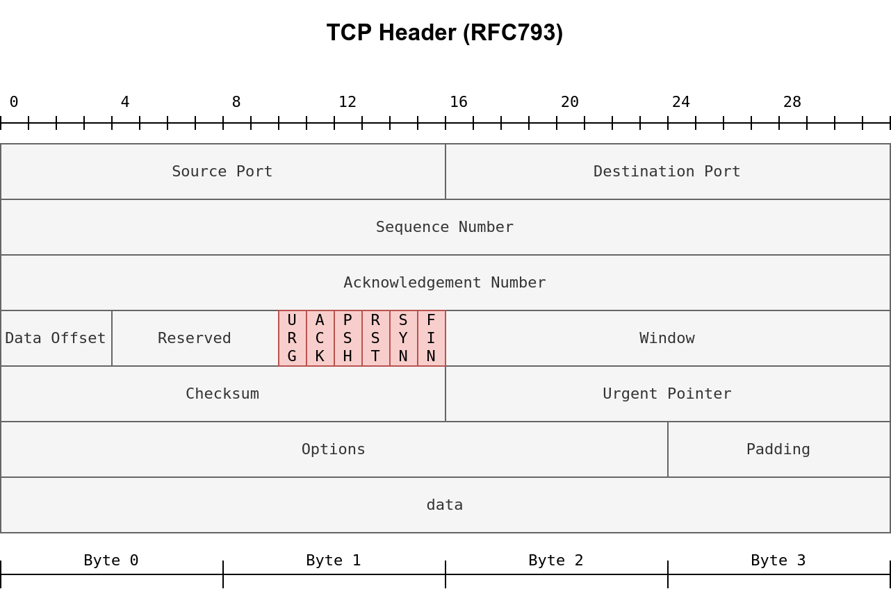
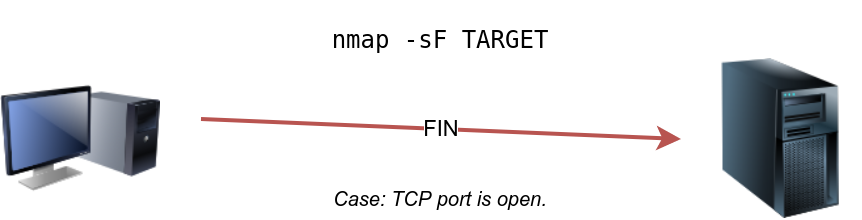
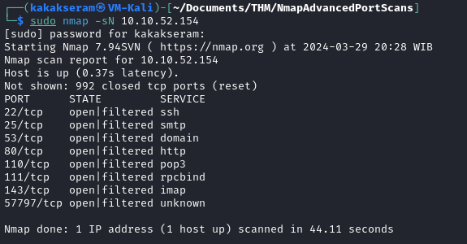
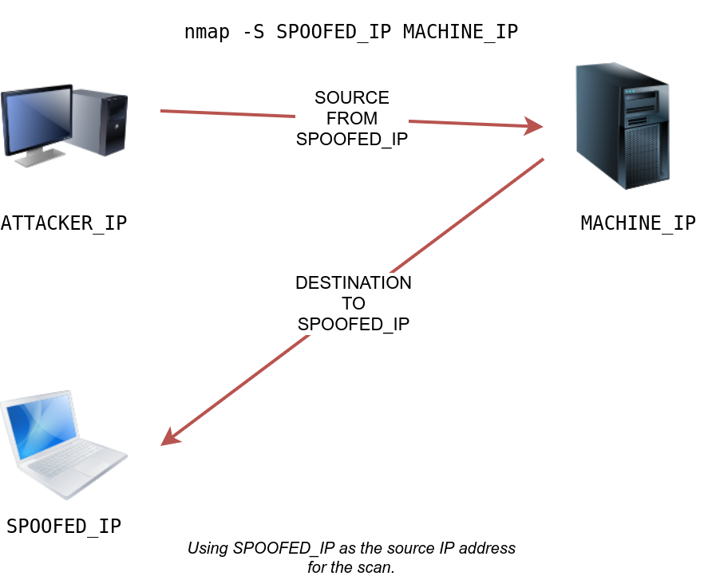
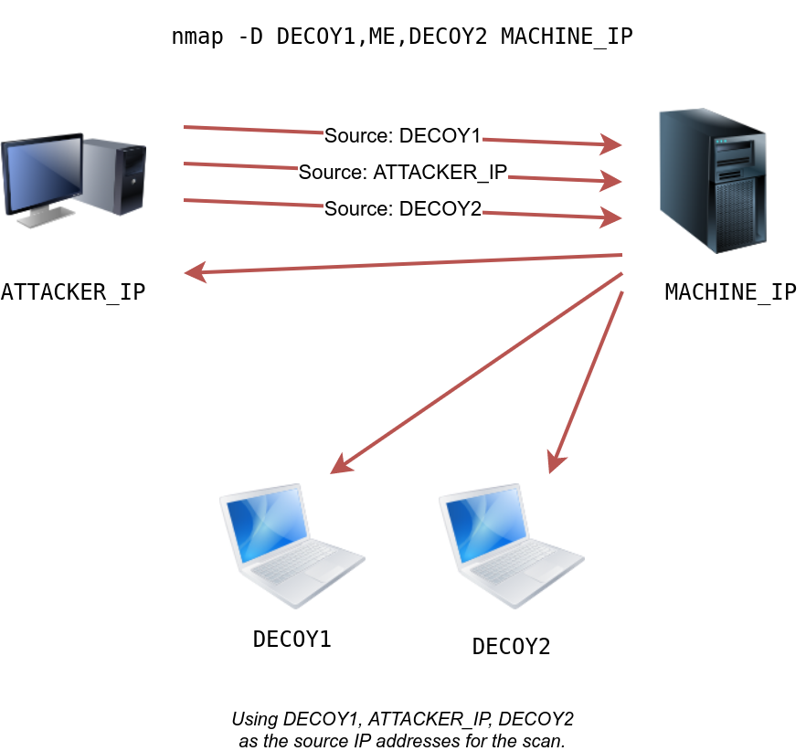

# [Nmap Advanced Port Scans](https://tryhackme.com/r/room/nmap03)

## Task 1 - Introduction

This room is the third in the Nmap series (part of the Introduction to Network Security module). In the first two rooms, we learned about live host discovery and basic port scans.

* [Nmap Live Host Discovery](https://tryhackme.com/room/nmap01)
* [Nmap Basic Port Scans](https://tryhackme.com/room/nmap02)
* [Nmap Advanced Port Scans](https://tryhackme.com/room/nmap03)
* [Nmap Post Port Scans](https://tryhackme.com/room/nmap04)

In Nmap Basic Port Scans, we covered TCP flags and reviewed the TCP 3-way handshake. To initiate a connection, TCP requires the first packet to have the SYN flag set. Consequently, we can tell if a TCP port is open based on the response we receive.

Security researchers and hackers contemplated the TCP flags, shown in the figure below and explained in the previous room, and started to experiment. They wanted to know what would happen if we send a TCP packet, which is not part of any ongoing TCP connection, with one or more flags set.

For instance, an ACK flag is set when you want to acknowledge received data. An ACK scan is like trying to acknowledge data that was neither sent nor received in the first place. Consider this simple analogy, someone coming to you out of nowhere to tell you, “yes, I hear you, please continue.” when you haven’t said anything.

This room explains advanced types of scans and scan options. Some of these scan types can be useful against specific systems, while others are useful in particular network setups. We will cover the following types of port scans:

* Null Scan
* FIN Scan
* Xmas Scan
* Maimon Scan
* ACK Scan
* Window Scan
* Custom Scan

Moreover, we will cover the following:

* Spoofing IP
* Spoofing MAC
* Decoy Scan
* Fragmented Packets
* Idle/Zombie Scan

We will discuss options and techniques to evade firewalls and IDS systems. We also cover options to get more verbose details from Nmap.

### Answer the questions below

* Launch the AttackBox by using the Start AttackBox button and get ready to experiment with different types of Nmap scans against different virtual machines.

## Task 2 - TCP Null Scan, FIN Scan, and Xmas Scan

Let’s start with the following three types of scans:

* Null Scan
* FIN Scan
* Xmas Scan

### Null Scan

The null scan does not set any flag; all six flag bits are set to zero. You can choose this scan using the `-sN` option. A TCP packet with no flags set will not trigger any response when it reaches an open port, as shown in the figure below. Therefore, from Nmap’s perspective, a lack of reply in a null scan indicates that either the port is open or a firewall is blocking the packet.

However, we expect the target server to respond with an RST packet if the port is closed. Consequently, we can use the lack of RST response to figure out the ports that are not closed: open or filtered.

Below is an example of a null scan against a Linux server. The null scan we carried out has successfully identified the six open ports on the target system. Because the null scan relies on the lack of a response to infer that the port is not closed, it cannot indicate with certainty that these ports are open; there is a possibility that the ports are not responding due to a firewall rule.
Pentester Terminal

Note that many Nmap options require root privileges. Unless you are running Nmap as root, you need to use `sudo` as in the example above using the `-sN` option.

### FIN Scan

The FIN scan sends a TCP packet with the FIN flag set. You can choose this scan type using the `-sF` option. Similarly, no response will be sent if the TCP port is open. Again, Nmap cannot be sure if the port is open or if a firewall is blocking the traffic related to this TCP port.

However, the target system should respond with an RST if the port is closed. Consequently, we will be able to know which ports are closed and use this knowledge to infer the ports that are open or filtered. It's worth noting some firewalls will 'silently' drop the traffic without sending an RST.

Below is an example of a FIN scan against a Linux server. The result is quite similar to the result we obtained earlier using a null scan.

### Xmas Scan

The Xmas scan gets its name after Christmas tree lights. An Xmas scan sets the FIN, PSH, and URG flags simultaneously. You can select Xmas scan with the option `-sX`.

Like the Null scan and FIN scan, if an RST packet is received, it means that the port is closed. Otherwise, it will be reported as open|filtered.

The following two figures show the case when the TCP port is open and the case when the TCP port is closed.

The console output below shows an example of a Xmas scan against a Linux server. The obtained results are pretty similar to that of the null scan and the FIN scan.

 

One scenario where these three scan types can be efficient is when scanning a target behind a stateless (non-stateful) firewall. A stateless firewall will check if the incoming packet has the SYN flag set to detect a connection attempt. Using a flag combination that does not match the SYN packet makes it possible to deceive the firewall and reach the system behind it. However, a stateful firewall will practically block all such crafted packets and render this kind of scan useless.

### Answer the questions below

* In a null scan, how many flags are set to 1?

	`0`

* In a FIN scan, how many flags are set to 1?

	`1`

* In a Xmas scan, how many flags are set to 1?

	`3`

* Start the VM and load the AttackBox. Once both are ready, open the terminal on the AttackBox and use nmap to launch a FIN scan against the target VM. How many ports appear as open|filtered?

	`7`

	

* Repeat your scan launching a null scan against the target VM. How many ports appear as open|filtered?

	`7`

	

## Task 3 - TCP Maimon Scan

Uriel Maimon first described this scan in 1996. In this scan, the FIN and ACK bits are set. The target should send an RST packet as a response. However, certain BSD-derived systems drop the packet if it is an open port exposing the open ports. This scan won’t work on most targets encountered in modern networks; however, we include it in this room to better understand the port scanning mechanism and the hacking mindset. To select this scan type, use the `-sM` option.

Most target systems respond with an RST packet regardless of whether the TCP port is open. In such a case, we won’t be able to discover the open ports. The figure below shows the expected behaviour in the cases of both open and closed TCP ports.

The console output below is an example of a TCP Maimon scan against a Linux server. As mentioned, because open ports and closed ports are behaving the same way, the Maimon scan could not discover any open ports on the target system.
Pentester Terminal

This type of scan is not the first scan one would pick to discover a system; however, it is important to know about it as you don’t know when it could come in handy.

### Answer the questions below

* In the Maimon scan, how many flags are set?

	`2`

## Task 4 - TCP ACK, Window, and Custom Scan

This task will cover how to perform a TCP ACK scan, a TCP window scan, and how to create your custom flag scan.

### TCP ACK Scan

Let’s start with the TCP ACK scan. As the name implies, an ACK scan will send a TCP packet with the ACK flag set. Use the `-sA` option to choose this scan. As we show in the figure below, the target would respond to the ACK with RST regardless of the state of the port. This behaviour happens because a TCP packet with the ACK flag set should be sent only in response to a received TCP packet to acknowledge the receipt of some data, unlike our case. Hence, this scan won’t tell us whether the target port is open in a simple setup.

In the following example, we scanned the target VM before installing a firewall on it. As expected, we couldn’t learn which ports were open.
Pentester Terminal

This kind of scan would be helpful if there is a firewall in front of the target. Consequently, based on which ACK packets resulted in responses, you will learn which ports were not blocked by the firewall. In other words, this type of scan is more suitable to discover firewall rule sets and configuration.

After setting up the target VM `MACHINE_IP` with a firewall, we repeated the ACK scan. This time, we received some interesting results. As seen in the console output below, we have three ports that aren't being blocked by the firewall. This result indicates that the firewall is blocking all other ports except for these three ports.
Pentester Terminal

### Window Scan

Another similar scan is the TCP window scan. The TCP window scan is almost the same as the ACK scan; however, it examines the TCP Window field of the RST packets returned. On specific systems, this can reveal that the port is open. You can select this scan type with the option `-sW`. As shown in the figure below, we expect to get an RST packet in reply to our “uninvited” ACK packets, regardless of whether the port is open or closed.

Similarly, launching a TCP window scan against a Linux system with no firewall will not provide much information. As we can see in the console output below, the results of the window scan against a Linux server with no firewall didn’t give any extra information compared to the ACK scan executed earlier.

However, as you would expect, if we repeat our TCP window scan against a server behind a firewall, we expect to get more satisfying results. In the console output shown below, the TCP window scan pointed that three ports are detected as closed. (This is in contrast with the ACK scan that labelled the same three ports as unfiltered.) Although we know that these three ports are not closed, we realize they responded differently, indicating that the firewall does not block them.

### Custom Scan

If you want to experiment with a new TCP flag combination beyond the built-in TCP scan types, you can do so using `--scanflags`. For instance, if you want to set SYN, RST, and FIN simultaneously, you can do so using `--scanflags RSTSYNFIN`. As shown in the figure below, if you develop your custom scan, you need to know how the different ports will behave to interpret the results in different scenarios correctly.

Finally, it is essential to note that the ACK scan and the window scan were very efficient at helping us map out the firewall rules. However, it is vital to remember that just because a firewall is not blocking a specific port, it does not necessarily mean that a service is listening on that port. For example, there is a possibility that the firewall rules need to be updated to reflect recent service changes. Hence, ACK and window scans are exposing the firewall rules, not the services.

### Answer the questions below

* In TCP Window scan, how many flags are set?

	`1`

* You decided to experiment with a custom TCP scan that has the reset flag set. What would you add after `--scanflags`? 

	`RST`

* The VM received an update to its firewall ruleset. A new port is now allowed by the firewall. After you make sure that you have terminated the VM from Task 2, start the VM for this task. Launch the AttackBox if you haven't done that already. Once both are ready, open the terminal on the AttackBox and use Nmap to launch an ACK scan against the target VM. How many ports appear unfiltered?

	`4`

	

* What is the new port number that appeared?

	`443`

* Is there any service behind the newly discovered port number? (Y/N)

	`N`

## Task 5 - Spoofing and Decoys

In some network setups, you will be able to scan a target system using a spoofed IP address and even a spoofed MAC address. Such a scan is only beneficial in a situation where you can guarantee to capture the response. If you try to scan a target from some random network using a spoofed IP address, chances are you won’t have any response routed to you, and the scan results could be unreliable.

The following figure shows the attacker launching the command `nmap -S SPOOFED_IP MACHINE_IP`. Consequently, Nmap will craft all the packets using the provided source IP address `SPOOFED_IP`. The target machine will respond to the incoming packets sending the replies to the destination IP address `SPOOFED_IP`. For this scan to work and give accurate results, the attacker needs to monitor the network traffic to analyze the replies.

In brief, scanning with a spoofed IP address is three steps:

1. Attacker sends a packet with a spoofed source IP address to the target machine.
2. Target machine replies to the spoofed IP address as the destination.
3. Attacker captures the replies to figure out open ports.

In general, you expect to specify the network interface using `-e` and to explicitly disable ping scan `-Pn`. Therefore, instead of `nmap -S SPOOFED_IP MACHINE_IP`, you will need to issue `nmap -e NET_INTERFACE -Pn -S SPOOFED_IP MACHINE_IP` to tell Nmap explicitly which network interface to use and not to expect to receive a ping reply. It is worth repeating that this scan will be useless if the attacker system cannot monitor the network for responses.

When you are on the same subnet as the target machine, you would be able to spoof your MAC address as well. You can specify the source MAC address using `--spoof-mac SPOOFED_MAC`. This address spoofing is only possible if the attacker and the target machine are on the same Ethernet (802.3) network or same WiFi (802.11).

Spoofing only works in a minimal number of cases where certain conditions are met. Therefore, the attacker might resort to using decoys to make it more challenging to be pinpointed. The concept is simple, make the scan appear to be coming from many IP addresses so that the attacker’s IP address would be lost among them. As we see in the figure below, the scan of the target machine will appear to be coming from 3 different sources, and consequently, the replies will go the decoys as well.

You can launch a decoy scan by specifying a specific or random IP address after `-D`. For example, `nmap -D 10.10.0.1,10.10.0.2,ME MACHINE_IP` will make the scan of MACHINE_IP appear as coming from the IP addresses 10.10.0.1, 10.10.0.2, and then `ME` to indicate that your IP address should appear in the third order. Another example command would be `nmap -D 10.10.0.1,10.10.0.2,RND,RND,ME MACHINE_IP`, where the third and fourth source IP addresses are assigned randomly, while the fifth source is going to be the attacker’s IP address. In other words, each time you execute the latter command, you would expect two new random IP addresses to be the third and fourth decoy sources.

### Answer the questions below

* What do you need to add to the command `sudo nmap MACHINE_IP` to make the scan appear as if coming from the source IP address `10.10.10.11` instead of your IP address?

	`-S 10.10.10.11`

* What do you need to add to the command `sudo nmap MACHINE_IP` to make the scan appear as if coming from the source IP addresses `10.10.20.21` and `10.10.20.28` in addition to your IP address?

	`-D 10.10.20.21,10.10.20.28,ME`

## Task 6 - Fragmented Packets

### Firewall

A firewall is a piece of software or hardware that permits packets to pass through or blocks them. It functions based on firewall rules, summarized as blocking all traffic with exceptions or allowing all traffic with exceptions. For instance, you might block all traffic to your server except those coming to your web server. A traditional firewall inspects, at least, the IP header and the transport layer header. A more sophisticated firewall would also try to examine the data carried by the transport layer.

### IDS

An intrusion detection system (IDS) inspects network packets for select behavioural patterns or specific content signatures. It raises an alert whenever a malicious rule is met. In addition to the IP header and transport layer header, an IDS would inspect the data contents in the transport layer and check if it matches any malicious patterns. How can you make it less likely for a traditional firewall/IDS to detect your Nmap activity? It is not easy to answer this; however, depending on the type of firewall/IDS, you might benefit from dividing the packet into smaller packets.

### Fragmented Packets

Nmap provides the option `-f` to fragment packets. Once chosen, the IP data will be divided into 8 bytes or less. Adding another `-f` (`-f -f` or `-ff`) will split the data into 16 byte-fragments instead of 8. You can change the default value by using the `--mtu`; however, you should always choose a multiple of 8.

To properly understand fragmentation, we need to look at the IP header in the figure below. It might look complicated at first, but we notice that we know most of its fields. In particular, notice the source address taking 32 bits (4 bytes) on the fourth row, while the destination address is taking another 4 bytes on the fifth row. The data that we will fragment across multiple packets is highlighted in red. To aid in the reassembly on the recipient side, IP uses the identification (ID) and fragment offset, shown on the second row of the figure below.

Let’s compare running `sudo nmap -sS -p80 10.20.30.144` and `sudo nmap -sS -p80 -f 10.20.30.144`. As you know by now, this will use stealth TCP SYN scan on port 80; however, in the second command, we are requesting Nmap to fragment the IP packets.

In the first two lines, we can see an ARP query and response. Nmap issued an ARP query because the target is on the same Ethernet. The second two lines show a TCP SYN ping and a reply. The fifth line is the beginning of the port scan; Nmap sends a TCP SYN packet to port 80. In this case, the IP header is 20 bytes, and the TCP header is 24 bytes. Note that the minimum size of the TCP header is 20 bytes.

With fragmentation requested via `-f`, the 24 bytes of the TCP header will be divided into multiples of 8 bytes, with the last fragment containing 8 bytes or less of the TCP header. Since 24 is divisible by 8, we got 3 IP fragments; each has 20 bytes of IP header and 8 bytes of TCP header. We can see the three fragments between the fifth and the seventh lines.

Note that if you added `-ff` (or `-f -f`), the fragmentation of the data will be multiples of 16. In other words, the 24 bytes of the TCP header, in this case, would be divided over two IP fragments, the first containing 16 bytes and the second containing 8 bytes of the TCP header.

On the other hand, if you prefer to increase the size of your packets to make them look innocuous, you can use the option `--data-length NUM`, where num specifies the number of bytes you want to append to your packets.

### Answer the questions below

* If the TCP segment has a size of 64, and `-ff` option is being used, how many IP fragments will you get?

	`4`

## Task 7 - Idle/Zombie Scan

Spoofing the source IP address can be a great approach to scanning stealthily. However, spoofing will only work in specific network setups. It requires you to be in a position where you can monitor the traffic. Considering these limitations, spoofing your IP address can have little use; however, we can give it an upgrade with the idle scan.

The idle scan, or zombie scan, requires an idle system connected to the network that you can communicate with. Practically, Nmap will make each probe appear as if coming from the idle (zombie) host, then it will check for indicators whether the idle (zombie) host received any response to the spoofed probe. This is accomplished by checking the IP identification (IP ID) value in the IP header. You can run an idle scan using `nmap -sI ZOMBIE_IP MACHINE_IP`, where `ZOMBIE_IP` is the IP address of the idle host (zombie).

The idle (zombie) scan requires the following three steps to discover whether a port is open:

1. Trigger the idle host to respond so that you can record the current IP ID on the idle host.
2. Send a SYN packet to a TCP port on the target. The packet should be spoofed to appear as if it was coming from the idle host (zombie) IP address.
3. Trigger the idle machine again to respond so that you can compare the new IP ID with the one received earlier.

Let’s explain with figures. In the figure below, we have the attacker system probing an idle machine, a multi-function printer. By sending a SYN/ACK, it responds with an RST packet containing its newly incremented IP ID.

The attacker will send a SYN packet to the TCP port they want to check on the target machine in the next step. However, this packet will use the idle host (zombie) IP address as the source. Three scenarios would arise. In the first scenario, shown in the figure below, the TCP port is closed; therefore, the target machine responds to the idle host with an RST packet. The idle host does not respond; hence its IP ID is not incremented.

In the second scenario, as shown below, the TCP port is open, so the target machine responds with a SYN/ACK to the idle host (zombie). The idle host responds to this unexpected packet with an RST packet, thus incrementing its IP ID.

In the third scenario, the target machine does not respond at all due to firewall rules. This lack of response will lead to the same result as with the closed port; the idle host won’t increase the IP ID.

For the final step, the attacker sends another SYN/ACK to the idle host. The idle host responds with an RST packet, incrementing the IP ID by one again. The attacker needs to compare the IP ID of the RST packet received in the first step with the IP ID of the RST packet received in this third step. If the difference is 1, it means the port on the target machine was closed or filtered. However, if the difference is 2, it means that the port on the target was open.

It is worth repeating that this scan is called an idle scan because choosing an idle host is indispensable for the accuracy of the scan. If the “idle host” is busy, all the returned IP IDs would be useless.

### Answer the questions below

* You discovered a rarely-used network printer with the IP address `10.10.5.5`, and you decide to use it as a zombie in your idle scan. What argument should you add to your Nmap command?

	`-sI 10.10.5.5`

## Task 8 - Getting More Details

You might consider adding `--reason` if you want Nmap to provide more details regarding its reasoning and conclusions. Consider the two scans below to the system; however, the latter adds `--reason`.

Providing the `--reason` flag gives us the explicit reason why Nmap concluded that the system is up or a particular port is open. In this console output above, we can see that this system is considered online because Nmap “received arp-response.” On the other hand, we know that the SSH port is deemed to be open because Nmap received a “syn-ack” packet back.

For more detailed output, you can consider using `-v` for verbose output or `-vv` for even more verbosity.
Pentester Terminal

If `-vv` does not satisfy your curiosity, you can use `-d` for debugging details or `-dd` for even more details. You can guarantee that using `-d` will create an output that extends beyond a single screen.

### Answer the questions below

* Launch the AttackBox if you haven't done so already. After you make sure that you have terminated the VM from Task 4, start the VM for this task. Wait for it to load completely, then open the terminal on the AttackBox and use Nmap with `nmap -sS -F --reason MACHINE_IP` to scan the VM. What is the reason provided for the stated port(s) being open?

	`syn-ack`

	

## Task 9 - Summary

This room covered the following types of scans.

|Port Scan Type|Example Command|
|--------------|---------------|
|TCP Null Scan|`sudo nmap -sN MACHINE_IP`|
|TCP FIN Scan|`sudo nmap -sF MACHINE_IP`|
|TCP Xmas Scan|`sudo nmap -sX MACHINE_IP`|
|TCP Maimon Scan|`sudo nmap -sM MACHINE_IP`|
|TCP ACK Scan|`sudo nmap -sA MACHINE_IP`|
|TCP Window Scan|`sudo nmap -sW MACHINE_IP`|
|Custom TCP Scan|`sudo nmap --scanflags URGACKPSHRSTSYNFIN MACHINE_IP`|
|Spoofed Source IP|`sudo nmap -S SPOOFED_IP MACHINE_IP`|
|Spoofed MAC Address|`--spoof-mac SPOOFED_MAC`|
|Decoy Scan|`nmap -D DECOY_IP,ME MACHINE_IP`|
|Idle (Zombie) Scan|`sudo nmap -sI ZOMBIE_IP MACHINE_IP`|
|Fragment IP data into 8 bytes|`-f`|
|Fragment IP data into 16 bytes|`-ff`|

|Option|Purpose|
|------|-------|
|`--source-port PORT_NUM`|specify source port number|
|`--data-length NUM`|append random data to reach given length|

These scan types rely on setting TCP flags in unexpected ways to prompt ports for a reply. Null, FIN, and Xmas scan provoke a response from closed ports, while Maimon, ACK, and Window scans provoke a response from open and closed ports.

|Option|Purpose|
|------|-------|
|`--reason`|explains how Nmap made its conclusion|
|`-v`|verbose|
|`-vv`|very verbose|
|`-d`|debugging|
|`-dd`|more details for debugging|

### Answer the questions below

* Ensure you have taken note of all the Nmap options explained in this room. Please join the [Nmap Post Port Scans](https://tryhackme.com/room/nmap04) room, the last room in this Nmap series.