# [Protocols and Servers](https://tryhackme.com/r/room/protocolsandservers)

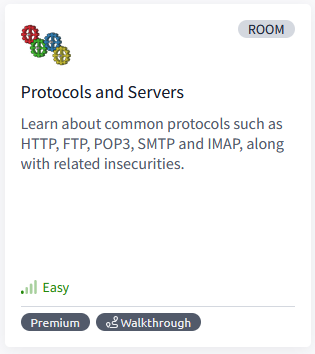

Learn about common protocols such as HTTP, FTP, POP3, SMTP and IMAP, along with related insecurities.

## Task 1 - Introduction

This room introduces the user to a few protocols commonly used, such as:

* HTTP
* FTP
* POP3
* SMTP
* IMAP

Each task about each protocol will be designed to help us understand what happens on the low level and is usually hidden by an elegant GUI (Graphical User Interface). We will “talk” using the above protocols using a simple Telnet client to fully understand what your GUI client is doing under the hood. Our purpose is not to memorize the protocol commands but rather to get a closer look at the protocol while it is working.

We also discuss some of the insecurities. In particular, we focus on passwords sent in cleartext.

### Answer the questions below

* We suggest that you start the AttackBox and the virtual machine as you proceed to tackle the following tasks. You can connect to the different services over Telnet for better practice and learning experience.

## Task 2 - Telnet

The Telnet protocol is an application layer protocol used to connect to a virtual terminal of another computer. Using Telnet, a user can log into another computer and access its terminal (console) to run programs, start batch processes, and perform system administration tasks remotely.

Telnet protocol is relatively simple. When a user connects, they will be asked for a username and password. Upon correct authentication, the user will access the remote system’s terminal. Unfortunately, all this communication between the Telnet client and the Telnet server is not encrypted, making it an easy target for attackers.

A Telnet server uses the Telnet protocol to listen for incoming connections on port 23. (Please note that the Telnet port is not open on the target VM.) Let’s consider the example shown below. A user is connecting to the `telnetd`, a Telnet server. The steps are as follows:

1. First, he is asked to provide his login name (username). We can see the user entering `frank`.
2. Then, he is asked for the password, `D2xc9CgD`. The password is not shown on the screen; however, we display it below for demonstration purposes.
3. Once the system checks his login credentials, he is greeted with a welcome message.
4. And the remote server grants him a command prompt, `frank@bento:~$`. The `$` indicates that this is not a root terminal.

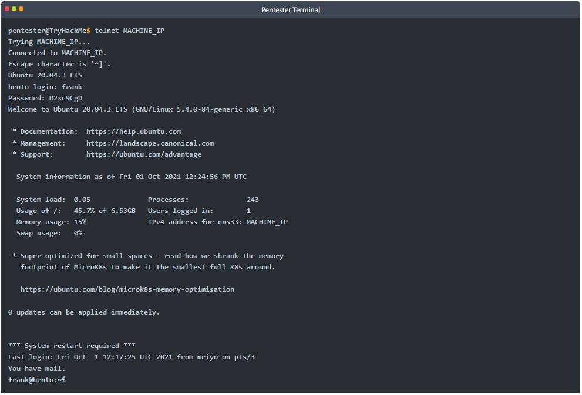

Although Telnet gave us access to the remote system’s terminal in no time, it is not a reliable protocol for remote administration as all the data are sent in cleartext. In the figure below, we captured the traffic generated by Telnet, and it was so easy to find the password. The figure below shows the ASCII data exchanged between our computer and the remote system. The text in red is the text that we are sending to the remote system, while the text in blue is the text that the remote system is sending. Notice how the user name was sent back (echoed at us to display them in our terminal); however, the password was not. In other words, if someone is watching us type, they won’t be able to see the password characters on the screen.

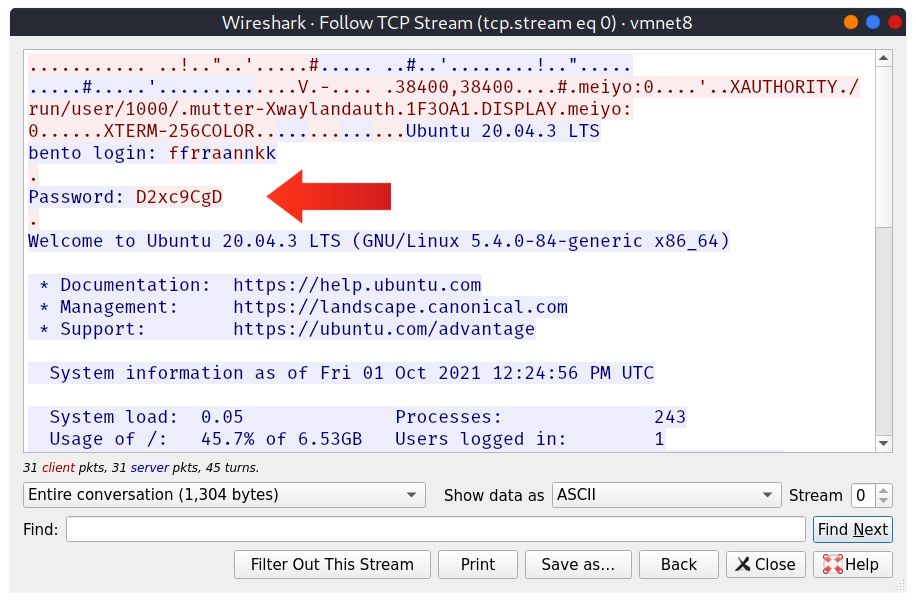

Telnet is no longer considered a secure option, especially that anyone capturing your network traffic will be able to discover your usernames and passwords, which would grant them access to the remote system. The secure alternative is SSH, which we present in the next room.

### Answer the questions below

* To which port will the `telnet` command with the default parameters try to connect?

	`23`

## Task 3 - Hypertext Transfer Protocol (HTTP)

Hypertext Transfer Protocol (HTTP) is the protocol used to transfer web pages. Your web browser connects to the webserver and uses HTTP to request HTML pages and images among other files and submit forms and upload various files. Anytime you browse the World Wide Web (WWW), you are certainly using the HTTP protocol.

The image below shows a client requesting the HTML page `index.html`, which the webserver provides. Then the client requests an image, `logo.jpg`, and the web server sends it.

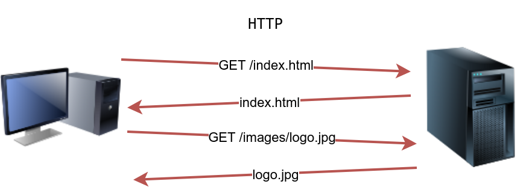

HTTP sends and receives data as cleartext (not encrypted); therefore, you can use a simple tool, such as Telnet (or Netcat), to communicate with a web server and act as a “web browser”. The key difference is that you need to input the HTTP-related commands instead of the web browser doing that for you.

In the following example, we will see how we can request a page from a web server; moreover, we will discover the webserver version. To accomplish this, we will use the Telnet client. We chose it because Telnet is a simple protocol; furthermore, it uses cleartext for communication. We will use `telnet` instead of a web browser to request a file from the webserver. The steps will be as follows:

1. First, we connect to port 80 using `telnet MACHINE_IP 80`.
2. Next, we need to type `GET /index.html HTTP/1.1` to retrieve the page `index.html` or `GET / HTTP/1.1` to retrieve the default page.
3. Finally, you need to provide some value for the host like `host: telnet` and hit the Enter/Return key twice.

In the console output below, we could recover the requested page along with a trove of information not usually displayed by the web browser. If the page we requested is not found, we get error 404.

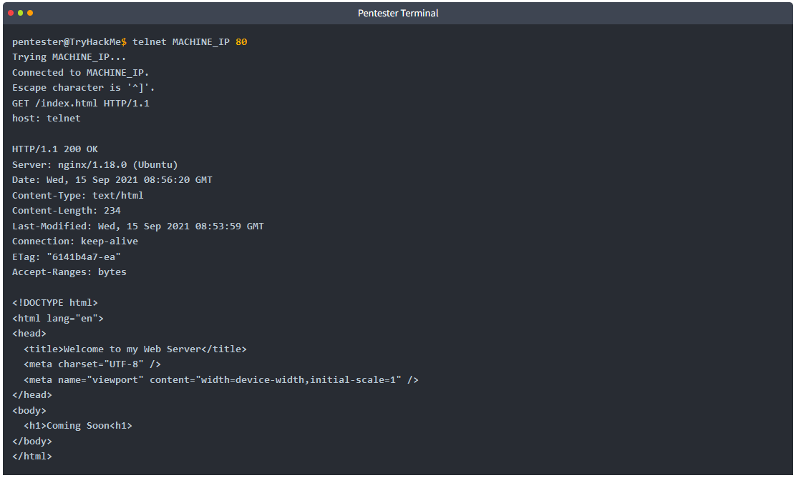

Of particular interest in the output above is that the user needs only to type a couple of commands to get the page they need: `GET /index.html HTTP/1.1` followed by `host: telnet`.

We need an HTTP server (webserver) and an HTTP client (web browser) to use the HTTP protocol. The web server will “serve” a specific set of files to the requesting web browser.

Three popular choices for HTTP servers are:

* [Apache](https://www.apache.org/)
* [Internet Information Services (IIS)](https://www.iis.net/)
* [nginx](https://nginx.org/)

Apache and Nginx are free and open-source software. However, IIS is closed source software and requires paying for a license.

There are many web browsers available. At the time of writing, the most popular web browsers are:

* Chrome by Google
* Edge by Microsoft
* Firefox by Mozilla
* Safari by Apple.

Web browsers are generally free to install and use; furthermore, tech giants battle for a higher market share for their browsers.

### Answer the questions below

* Launch the attached VM. From the AttackBox terminal, connect using Telnet to `MACHINE_IP 80` and retrieve the file `flag.thm`. What does it contain?
  
	`THM{e3eb0a1df437f3f97a64aca5952c8ea0}`

	```
	GET /flag.thm HTTP/1.1
	host: telnet
	```

	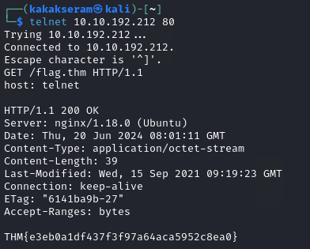

## Task 4 - File Transfer Protocol (FTP)

File Transfer Protocol (FTP) was developed to make the transfer of files between different computers with different systems efficient.

FTP also sends and receives data as cleartext; therefore, we can use Telnet (or Netcat) to communicate with an FTP server and act as an FTP client. In the example below, we carried out the following steps:

1. We connected to an FTP server using a Telnet client. Since FTP servers listen on port 21 by default, we had to specify to our Telnet client to attempt connection to port 21 instead of the default Telnet port.
2. We needed to provide the username with the command `USER frank`.
3. Then, we provided the password with the command `PASS D2xc9CgD`.
4. Because we supplied the correct username and password, we got logged in.

A command like `STAT` can provide some added information. The `SYST` command shows the System Type of the target (UNIX in this case). `PASV` switches the mode to passive. It is worth noting that there are two modes for FTP:

* Active: In the active mode, the data is sent over a separate channel originating from the FTP server’s port 20.
* Passive: In the passive mode, the data is sent over a separate channel originating from an FTP client’s port above port number 1023.

The command `TYPE A` switches the file transfer mode to ASCII, while `TYPE I` switches the file transfer mode to binary. However, we cannot transfer a file using a simple client such as Telnet because FTP creates a separate connection for file transfer.

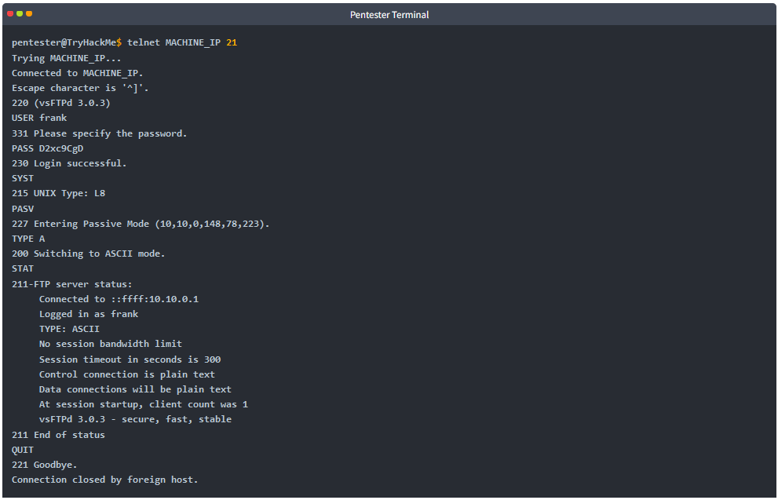

The image below shows how an actual file transfer would be conducted using FTP. To keep things simple in this figure, let’s only focus on the fact that the FTP client will initiate a connection to an FTP server, which listens on port 21 by default. All commands will be sent over the control channel. Once the client requests a file, another TCP connection will be established between them. (The details of establishing the data connection/channel is beyond the scope of this room.)

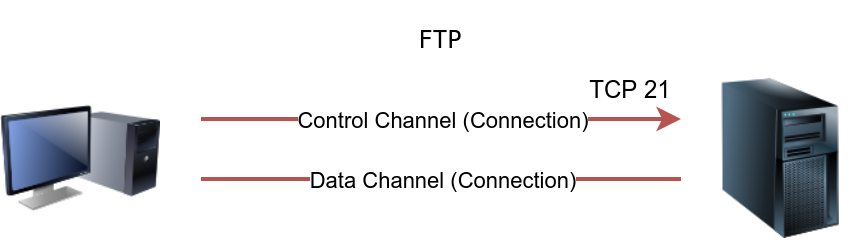

Considering the sophistication of the data transfer over FTP, let’s use an actual FTP client to download a text file. We only needed a small number of commands to retrieve the file. After logging in successfully, we get the FTP prompt, ftp>, to execute various FTP commands. We used ls to list the files and learn the file name; then, we switched to ascii since it is a text file (not binary). Finally, get FILENAME made the client and server establish another channel for file transfer.

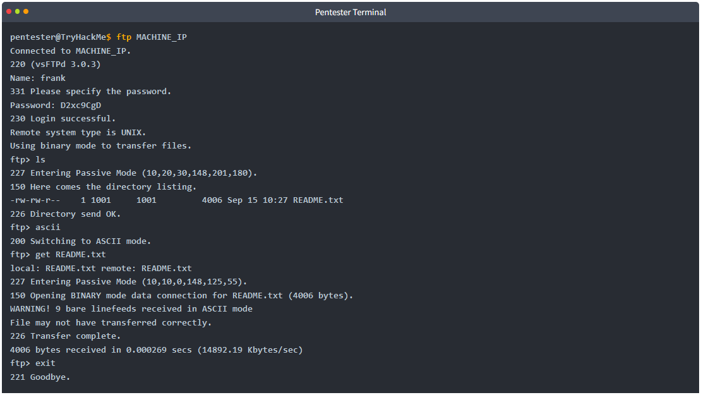

FTP servers and FTP clients use the FTP protocol. There are various FTP server software that you can select from if you want to host your FTP file server. Examples of FTP server software include:

* [vsftpd](https://security.appspot.com/vsftpd.html)
* [ProFTPD](http://www.proftpd.org/)
* [uFTP](https://www.uftpserver.com/)

For FTP clients, in addition to the console FTP client commonly found on Linux systems, you can use an FTP client with GUI such as [FileZilla](https://filezilla-project.org/). Some web browsers also support FTP protocol.

Because FTP sends the login credentials along with the commands and files in cleartext, FTP traffic can be an easy target for attackers.

### Answer the questions below

* Using an FTP client, connect to the VM and try to recover the flag file. What is the flag?
	
	```
	* Username: frank
	* Password: D2xc9CgD
	```

	```
	# Login FTP
	ftp 10.10.192.212
		
	# Show list file
	ls

	# Download file
	get ftp_flag.thm

	# Show file flag
	cat ftp_flag.thm
	```
		
	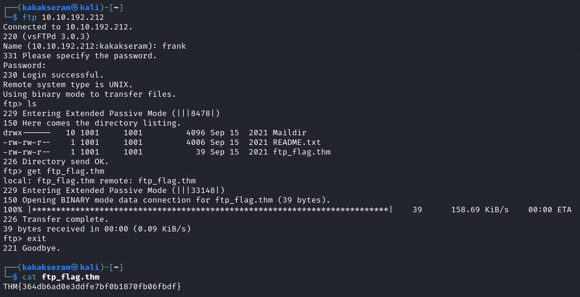

## Task 5 - Simple Mail Transfer Protocol (SMTP)

Email is one of the most used services on the Internet. There are various configurations for email servers; for instance, you may set up an email system to allow local users to exchange emails with each other with no access to the Internet. However, we will consider the more general setup where different email servers connect over the Internet.

Email delivery over the Internet requires the following components:

1. Mail Submission Agent (MSA)
2. Mail Transfer Agent (MTA)
3. Mail Delivery Agent (MDA)
4. Mail User Agent (MUA)

The above four terms may look cryptic, but they are more straightforward than they appear. We will explain these terms using the figure below.

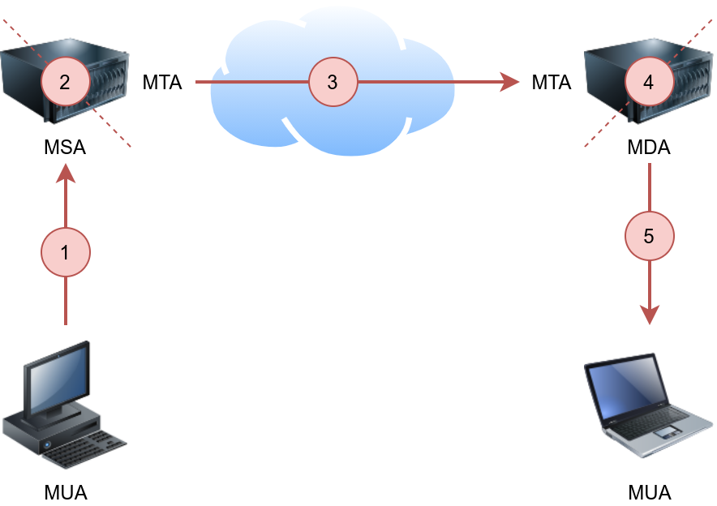

The figure shows the following five steps that an email needs to go through to reach the recipient’s inbox:

1. A Mail User Agent (MUA), or simply an email client, has an email message to be sent. The MUA connects to a Mail Submission Agent (MSA) to send its message.
2. The MSA receives the message, checks for any errors before transferring it to the Mail Transfer Agent (MTA) server, commonly hosted on the same server.
3. The MTA will send the email message to the MTA of the recipient. The MTA can also function as a Mail Submission Agent (MSA).
4. A typical setup would have the MTA server also functioning as a Mail Delivery Agent (MDA).
5. The recipient will collect its email from the MDA using their email client.

If the above steps sound confusing, consider the following analogy:

1. You (MUA) want to send postal mail.
2. The post office employee (MSA) checks the postal mail for any issues before your local post office (MTA) accepts it.
3. The local post office checks the mail destination and sends it to the post office (MTA) in the correct country.
4. The post office (MTA) delivers the mail to the recipient mailbox (MDA).
5. The recipient (MUA) regularly checks the mailbox for new mail. They notice the new mail, and they take it.

In the same way, we need to follow a protocol to communicate with an HTTP server, and we need to rely on email protocols to talk with an MTA and an MDA. The protocols are:

1. Simple Mail Transfer Protocol (SMTP)
2. Post Office Protocol version 3 (POP3) or Internet Message Access Protocol (IMAP)

We explain SMTP in this task and elaborate on POP3 and IMAP in the following two tasks.

Simple Mail Transfer Protocol (SMTP) is used to communicate with an MTA server. Because SMTP uses cleartext, where all commands are sent without encryption, we can use a basic Telnet client to connect to an SMTP server and act as an email client (MUA) sending a message.

SMTP server listens on port 25 by default. To see basic communication with an SMTP server, we used Telnet to connect to it. Once connected, we issue `helo hostname` and then start typing our email.

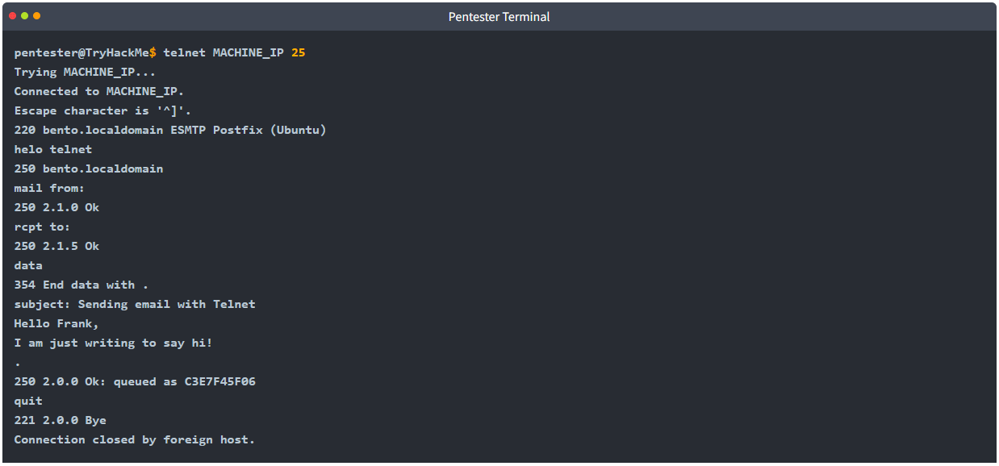

After `helo`, we issue `mail from`:, `rcpt to`: to indicate the sender and the recipient. When we send our email message, we issue the command `data` and type our message. We issue `<CR><LF>.<CR><LF>` (or `Enter . Enter` to put it in simpler terms). The SMTP server now queues the message.

Generally speaking, we don’t need to memorize SMTP commands. The console output above aims to help better explain what a typical mail client does when it uses SMTP.

### Answer the questions below

* Using the AttackBox terminal, connect to the SMTP port of the target VM. What is the flag that you can get?

	`THM{5b31ddfc0c11d81eba776e983c35e9b5}`

	```
	telnet 10.10.192.212 25
	```

	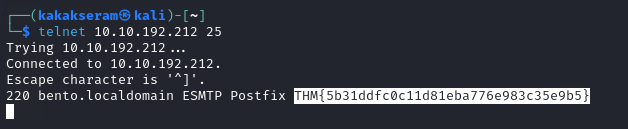

## Task 6 - Post Office Protocol 3 (POP3)

Post Office Protocol version 3 (POP3) is a protocol used to download the email messages from a Mail Delivery Agent (MDA) server, as shown in the figure below. The mail client connects to the POP3 server, authenticates, downloads the new email messages before (optionally) deleting them.

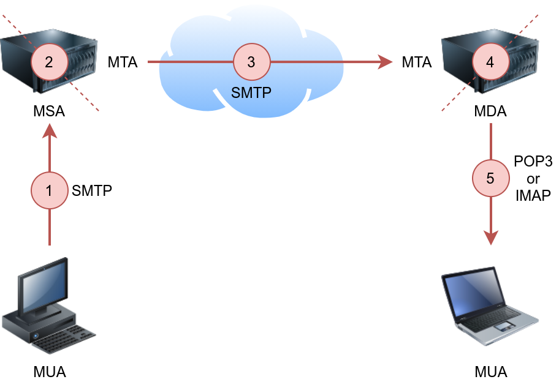

The example below shows what a POP3 session would look like if conducted via a Telnet client. First, the user connects to the POP3 server at the POP3 default port 110. Authentication is required to access the email messages; the user authenticates by providing his username `USER frank` and password `PASS D2xc9CgD`. Using the command `STAT`, we get the reply `+OK 1 179`; based on [RFC 1939](https://datatracker.ietf.org/doc/html/rfc1939), a positive response to `STAT` has the format `+OK nn mm`, where nn is the number of email messages in the inbox, and mm is the size of the inbox in octets (byte). The command `LIST` provided a list of new messages on the server, and `RETR 1` retrieved the first message in the list. We don’t need to concern ourselves with memorizing these commands; however, it is helpful to strengthen our understanding of such protocol.

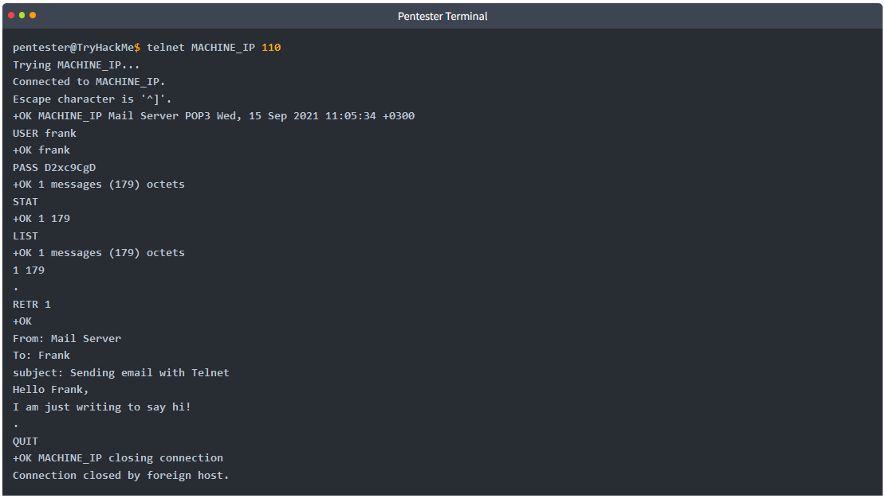

The example above shows that the commands are sent in cleartext. Using Telnet was enough to authenticate and retrieve an email message. As the username and password are sent in cleartext, any third party watching the network traffic can steal the login credentials.

In general, your mail client (MUA) will connect to the POP3 server (MDA), authenticate, and download the messages. Although the communication using the POP3 protocol will be hidden behind a sleek interface, similar commands will be issued, as shown in the Telnet session above.

Based on the default settings, the mail client deletes the mail message after it downloads it. The default behaviour can be changed from the mail client settings if you wish to download the emails again from another mail client. Accessing the same mail account via multiple clients using POP3 is usually not very convenient as one would lose track of read and unread messages. To keep all mailboxes synchronized, we need to consider other protocols, such as IMAP.

### Answer the questions below

* Connect to the VM (`MACHINE_IP`) at the POP3 port. Authenticate using the username `frank` and password `D2xc9CgD`. What is the response you get to `STAT`?

	`+OK 0 0`

	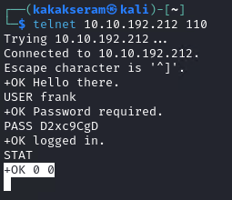

* How many email messages are available to download via POP3 on `MACHINE_IP`?

	`0`

## Task 7 - Internet Message Access Protocol (IMAP)

Internet Message Access Protocol (IMAP) is more sophisticated than POP3. IMAP makes it possible to keep your email synchronized across multiple devices (and mail clients). In other words, if you mark an email message as read when checking your email on your smartphone, the change will be saved on the IMAP server (MDA) and replicated on your laptop when you synchronize your inbox.

Let’s take a look at sample IMAP commands. In the console output below, we use Telnet to connect to the IMAP server’s default port, and then we authenticate using `LOGIN username password`. IMAP requires each command to be preceded by a random string to be able to track the reply. So we added `c1`, then `c2`, and so on. Then we listed our mail folders using `LIST "" "*"`, before checking if we have any new messages in the inbox using `EXAMINE INBOX`. We don’t need to memorize these commands; however, we are simply providing the example below to give a vivid image of what happens when the mail client communicates with an IMAP server.

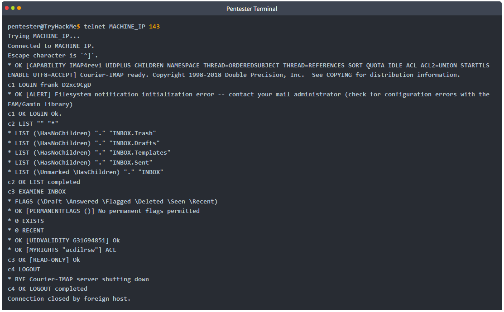

It is clear that IMAP sends the login credentials in cleartext, as we can see in the command `LOGIN frank D2xc9CgD`. Anyone watching the network traffic would be able to know Frank’s username and password.

### Answer the questions below

* What is the default port used by IMAP?

	`143`

## Task 8 - Summary

This room covered various protocols, their usage, and how they work under the hood. Many other standard protocols are of interest to attackers. For instance, Server Message Block (SMB) provides shared access to files and printers between networks, and it can be an exciting target. However, this room intends only to give you a good knowledge of a few common protocols and how they work under the hood. One room or even a complete module can’t cover all the network protocols.

It is good to remember the default port number for common protocols. Below is a summary of the protocols we covered, sorted in alphabetical order, along with their default port numbers.

|Protocol|TCP Port|Application(s)|Data Security|
|--------|--------|--------------|-------------|
|FTP|21|File Transfer|Cleartext|
|HTTP|80|Worldwide Web|Cleartext|
|IMAP|143|Email (MDA)|Cleartext|
|POP3|110|Email (MDA)|Cleartext|
|SMTP|25|Email (MTA)|Cleartext|
|Telnet|23|Remote Access|Cleartext|

In the next room of this module, we learn about various attacks against these protocols and servers along with mitigation steps.

### Answer the questions below

* By this, you have completed the seventh room of the Network Security module. Please proceed to the Protocols and Servers 2 room to learn about related attacks and mitigations.